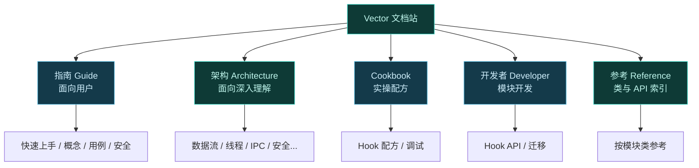
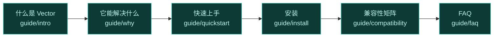
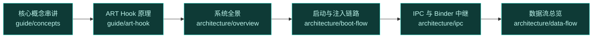
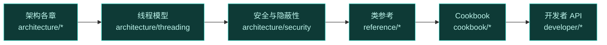

# 📖 关于文档

这一页讲清楚 Vector 文档站的组织方式、如何贡献文档，以及针对不同背景读者的阅读路线。无论你是刚接触 Hook 框架的新手，还是想深入源码的贡献者，都能找到适合自己的起点。

## 文档组织



| 板块 | 受众 | 内容 |
| :--- | :--- | :--- |
| 指南 Guide | 终端用户 | 安装、概念、用例、安全、FAQ、故障排查 |
| 架构 Architecture | 深入理解者 | 各子系统原理与协同 |
| Cookbook | 实操者 | 具体 Hook 配方与调试技巧 |
| 开发者 Developer | 模块开发者 | Hook API、迁移指南 |
| 参考 Reference | 查阅者 | 按模块/类组织的 API 索引 |

## 阅读路线

### 初级：只想用起来

适合刚接触 root/Hook 框架、目标是装好并跑通模块的用户。



读完后你能独立安装 Vector、装模块、勾作用域、排错。

### 中级：想理解原理

适合想搞清楚 Hook 怎么生效、为什么这样设计的用户。



读完后你能解释从用户点"启用模块"到 Hook 生效的全链路。

### 高级：想贡献代码或深度定制

适合准备提交 PR、做模块开发或安全研究的读者。



读完后你具备阅读源码、定位类、贡献修复的能力。

## 文档风格约定

本站文档遵循统一风格，便于阅读与维护：

| 维度 | 约定 |
| :--- | :--- |
| 语言 | 简体中文（代码、命令、标识符、报错原文保持原样） |
| 标题 | emoji 前缀 |
| 图示 | mermaid，配色统一（青绿=Vector机制、琥珀=问题、灰蓝=普通、绿=成功、蓝=UI） |
| 表格 | 左对齐 `| :--- | :--- |` |
| 篇幅 | 每篇约 120-200 行 |
| 链接 | 文末附相关链接 |

## 如何贡献文档

文档与代码同仓库，欢迎通过 Pull Request 改进。

| 步骤 | 说明 |
| :--- | :--- |
| 1. 定位 | 在 `website/docs/` 下找到对应板块与文件 |
| 2. 改写 | 遵循上述风格约定，保持简体中文与 mermaid 配色 |
| 3. 链接 | 补全相关链接，确保交叉引用有效 |
| 4. 验证 | 本地跑 VitePress 构建确认无断链 |
| 5. 提交 | PR 描述改动意图，附上验证结果 |

::: tip 内容要求
- 基于源码与 README 的真实信息，不编造特性。
- 版本号相关的支持范围以 [兼容性矩阵](./guide/compatibility) 为准。
- 安全相关内容须与 [安全与责任](./guide/safety) 一致，不为滥用背书。
:::

::: caution Issue 语言
本项目**仅接受英文 Issue**。文档相关讨论如走 Issue，也请用英文（中文用户可用 [DeepL](https://www.deepl.com/zh/translator) 等工具辅助）。
:::

## 本地预览文档

文档站基于 VitePress。本地预览：

```bash
cd website
npm install
npm run dev      # 开发预览
npm run build    # 生产构建
```

## 反馈

发现文档错误、过时或缺失，欢迎：

- 直接提 PR 修正。
- 在 GitHub Discussions 提出改进建议。
- 若是 Issue 走标准流程（英文）。

## 相关链接

- [什么是 Vector](./guide/intro) — 项目简介
- [它能解决什么](./guide/why) — 设计目标
- [系统全景](./architecture/overview) — 架构起点
- [快速上手](./guide/quickstart) — 新手起点
