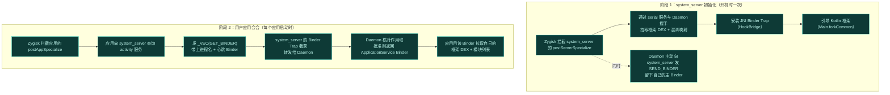
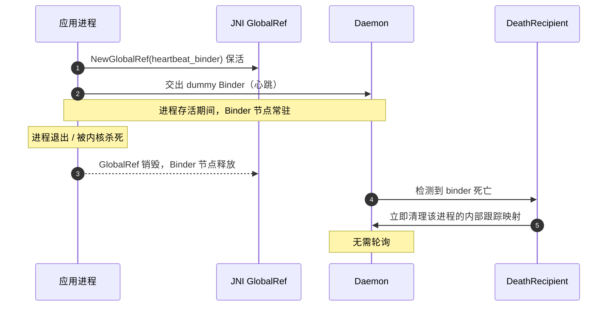

# 启动与注入链路

这一页把设备从开机到模块生效的完整时序拆开。理解了这条链路，就理解了 Vector "如何把自己塞进每一个进程"。

## 两阶段注入

Vector 的注入分两个阶段，都发生在 Zygote fork 出新进程的瞬间：



## 关键细节

### 为什么分两阶段

`system_server` 是所有应用的"母进程"中介——它持有 `activity` 等核心服务。Vector 把 `system_server` 当成**代理路由器**：Daemon 的主 Binder 只交给 `system_server` 一次（阶段 1），之后每个应用都通过 `system_server` 中转到 Daemon（阶段 2）。

这样 Daemon 不必直接和每个应用握手，应用也无需知道 Daemon 在哪——它们只跟系统里的 `activity` 服务通信，而通信被 Trap 截获了。

### 从内存引导，不落盘

Vector **不向 /data 分区写任何框架代码**。

1. Daemon 通过 `SharedMemory` 文件描述符传递框架 DEX（`kDexTransactionCode`）。
2. C++ 层把 FD 包成 `DirectByteBuffer`，初始化 `InMemoryDexClassLoader`。
3. 框架代码全程只在内存里。

### 混淆映射同步

Daemon 每次开机都**随机化**框架类名。native 层通过 `kObfuscationMapTransactionCode` 拉取一份序列化字典，`SetupEntryClass` 用它定位被随机化的入口类（`org.matrix.vector.core.Main`）和 `BridgeService`。

```mermaid
graph LR
    subgraph 开机时["开机时：Daemon 生成随机类名映射"]
        O1["org.matrix.vector.core.Main"] -.随机化.-> O2["a1b2c3d4.Main（随机）"]
    end
    subgraph 注入时["注入时：native 拉取同一份映射"]
        N1["按映射名找到入口类"] --> N2["框架每次启动后"长得都不一样"<br/>对抗静态特征检测"]
    end
    O2 -.同步.-> N1
    style O2 fill:#0e3a36,stroke:#3dd8c8,color:#bff5ec
    style N2 fill:#0e3a36,stroke:#3dd8c8,color:#bff5ec
```

### 心跳机制：进程死了怎么知道

Vector 用一个**假 Binder 对象**（`heartbeat_binder`）管理进程生命周期：

- 应用/`system_server` 初始化时生成一个 dummy Binder，通过 JNI GlobalRef 保活，并交给 Daemon。
- 进程正常退出或被内核杀死时，GlobalRef 销毁，Binder 节点释放。
- Daemon 的 `DeathRecipient` 触发，**立即清理**该进程的内部跟踪映射。

无需轮询，进程死亡即触发清理。



## 注入完成之后

应用拿到 `ApplicationService` Binder 后，就能：

- 拉取自己的模块列表
- 拉取框架 DEX 与混淆映射
- 注册偏好、请求作用域

此后框架在应用进程内就绪，模块开始执行 Hook 注册。具体的 Binder 通信细节见 [IPC 与 Binder 中继](./ipc)。
