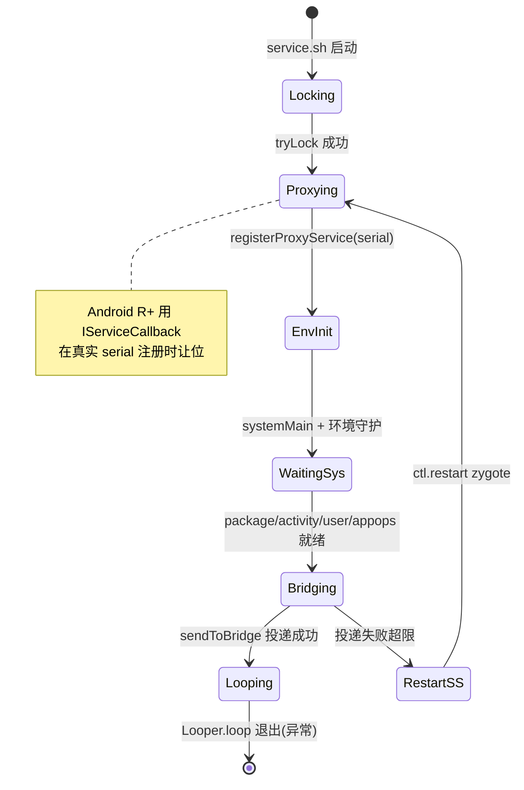
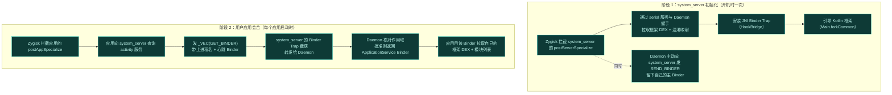
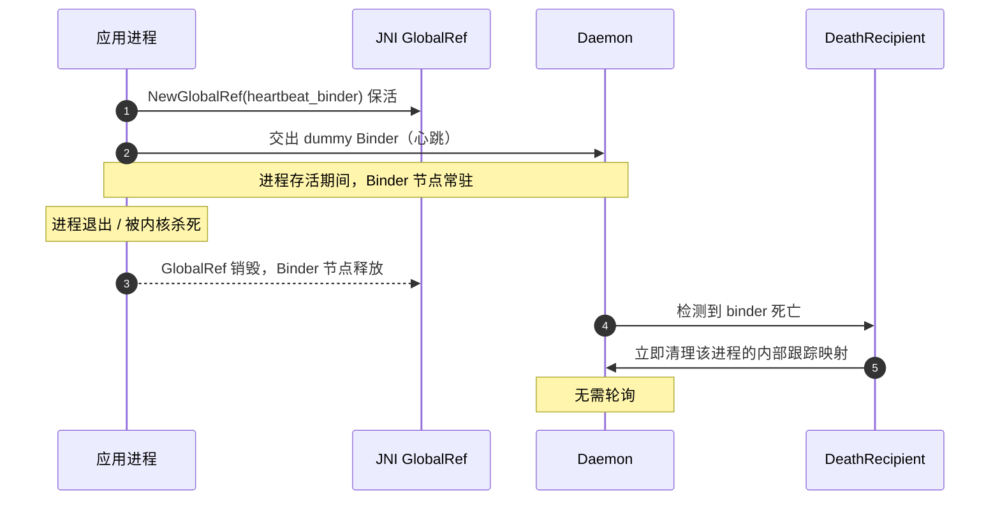

# 启动与注入链路

这一页把设备从开机到模块生效的完整时序拆开。理解了这条链路，就理解了 Vector "如何把自己塞进每一个进程"。

## 全链路 ASCII 总览

从开机到模块 Hook 生效，所有角色与跨进程通道一图概括：

```text
                       ┌─────────────────────────────────────────────┐
   开机 boot           │  Magisk/KernelSU + Zygisk (NeoZygisk)        │
                       │  加载 zygisk_vector 模块 .so 到 Zygote 进程   │
                       └──────────────────────┬──────────────────────┘
                                              │  service.sh
                                              ▼
                       ┌─────────────────────────────────────────────┐
                       │  Daemon (root, unshare --propagation slave)  │
                       │  VectorDaemon.main():                        │
                       │   1. FileSystem.tryLock() 单实例锁           │
                       │   2. registerProxyService("serial")          │
                       │      ├─ Android R+: IServiceCallback 抢点    │
                       │      └─ 占住 serial 服务名 = 早期 IPC 通道    │
                       │   3. LogcatMonitor / Dex2OatServer / CliSocket │
                       │   4. ActivityThread.systemMain() 初始化框架  │
                       │   5. waitForSystemService(package/activity/..)│
                       │   6. sendToBridge(VectorService Binder)      │
                       │      └─ seteuid(0) → transact(_VEC,SEND_BINDER)│
                       └──────────────────────┬──────────────────────┘
                                              │  Binder _VEC(SEND_BINDER)
                       ┌──────────────────────▼──────────────────────┐
   Zygote fork ──────► │  system_server (UID 1000)                   │
                       │  postServerSpecialize:                       │
                       │   • RequestSystemServerBinder("serial")      │
                       │     (轮询 ≤10s 等 daemon addService)         │
                       │   • RequestManagerBinderFromSystemServer     │
                       │   • FetchFrameworkDex + FetchObfuscationMap  │
                       │   • LoadDex → InitArtHooker → HookBridge     │
                       │     └─ SetTableOverride 安装 JNI Trap        │
                       │   • FindAndCall("forkCommon", isSystem=true) │
                       │   Daemon 主 Binder 落地 system_server 内存    │
                       └──────────────────────┬──────────────────────┘
                                              │  Binder 中继 (activity 服务)
   Zygote fork ──────► ┌──────────────────────▼──────────────────────┐
                       │  用户应用进程                                │
                       │  postAppSpecialize:                          │
                       │   • UID 过滤 (isolated/child zygote 跳过)    │
                       │   • RequestAppBinder(nice_name, heartbeat)   │
                       │     └─ transact(_VEC, GET_BINDER) 到 activity│
                       │        被 system_server 的 JNI Trap 截获     │
                       │   • system_server → Daemon 核对作用域         │
                       │   • 返回 ILSPApplicationService Binder       │
                       │   • 拉取框架 DEX + 模块列表 (SharedMemory)    │
                       │   • Main.forkCommon → Startup.bootstrapXposed│
                       └──────────────────────┬──────────────────────┘
                                              │  模块注册 Hook
                       ┌──────────────────────▼──────────────────────┐
                       │  Hook 生效                                   │
                       │  HookBridge.hookMethod → lsplant::Hook       │
                       │  改写 ART ArtMethod entry_point              │
                       │  后续每次调用被 Hook 方法 → VectorNativeHooker│
                       └─────────────────────────────────────────────┘
```

## Daemon 启动

注入链路的"另一头"是 root Daemon。它在 [service.sh](https://github.com/android-security-engineer/Vector-skills/blob/master/zygisk/module/service.sh) 中以 `unshare --propagation slave -m` 在私有挂载命名空间后台启动，入口是 [VectorDaemon.kt](https://github.com/android-security-engineer/Vector-skills/blob/master/daemon/src/main/kotlin/org/matrix/vector/daemon/VectorDaemon.kt) 的 `main`：

1. `FileSystem.tryLock()` 抢单实例文件锁，失败立即 `exitProcess(0)`（防多开）。
2. 解析参数 `--system-server-max-retry=N` 与 `--late-inject`（后者把会合服务名从 `serial` 改成 `serial_vector`）。
3. **抢占会合点名**：`SystemServerService.registerProxyService(proxyServiceName)` 在 Android R+ 用 `IServiceCallback` 注册通知，再 `ServiceManager.addService` 把自己挂上去——这给 `system_server` specialize 阶段的 Zygisk 模块提供了早期 IPC 通道。当真正的 `serial` 系统服务后来注册时，回调 `onRegistration` 捕获它并停止代理转发。
4. 启动环境守护：`LogcatMonitor`（日志聚合）、`Dex2OatServer`（Q+，监听 dex2oat 套接字）、`CliSocketServer`（命令行管理）。
5. `ActivityThread.systemMain()` 在 daemon 进程内初始化 Android 框架，`DdmHandleAppName` 改名 `org.matrix.vector.daemon`。
6. `waitForSystemService` 轮询等待 `package` / `activity` / `user` / `appops` 四个核心系统服务就绪。
7. `sendToBridge` 把 `VectorService` 主 Binder 经 `_VEC(ACTION_SEND_BINDER)` 投递进 `system_server`。



## 两阶段注入

Vector 的注入分两个阶段，都发生在 Zygote fork 出新进程的瞬间：



## 关键细节

### 为什么分两阶段

`system_server` 是所有应用的"母进程"中介——它持有 `activity` 等核心服务。Vector 把 `system_server` 当成**代理路由器**：Daemon 的主 Binder 只交给 `system_server` 一次（阶段 1），之后每个应用都通过 `system_server` 中转到 Daemon（阶段 2）。

这样 Daemon 不必直接和每个应用握手，应用也无需知道 Daemon 在哪——它们只跟系统里的 `activity` 服务通信，而通信被 Trap 截获了。

### system_server 重启：链路自愈

`system_server` 是注入链路的单点。它若崩溃，Daemon 必须在它重启后**重新占领会合点并重投 Binder**，否则重启后的 `system_server` 里没有 Trap、也没有 Daemon 主 Binder。Daemon 在 [VectorDaemon.kt](https://github.com/android-security-engineer/Vector-skills/blob/master/daemon/src/main/kotlin/org/matrix/vector/daemon/VectorDaemon.kt) 的 `sendToBridge` 中为 `activity` 服务挂了 `DeathRecipient`：

- 触发后立即 `clearSystemCaches()`：反射清空 `ServiceManager.sServiceManager` / `sCache`、`ActivityManager.IActivityManager_singleton` 单例，强制后续调用重新向 servicemanager 查询。
- `SystemServerService.binderDied()` 清理旧的 `originService` 引用。
- 重新 `ServiceManager.addService(proxyServiceName, SystemServerService)` 抢占会合点名，确保新 `system_server` specialize 时 Zygisk 模块能立刻找到代理。
- 回到 `sendToBridge(isRestart=true, retry-1)` 等待新 `activity` 就绪后重投 Binder。
- 若 `--system-server-max-retry` 耗尽仍失败，`restartSystemServer()` 通过 `ctl.restart zygote`（根据 ABI 选 `zygote` 或 `zygote_secondary`）强重启整个 zygote/system_server 链。

### SELinux 与系统属性

注入链路要穿过 SELinux，模块在 [sepolicy.rule](https://github.com/android-security-engineer/Vector-skills/blob/master/zygisk/module/sepolicy.rule) 里声明了自定义类型：

- `xposed_file` / `xposed_data` 标 `mlstrustedobject`，允许 `shell`/`installd`/`isolated_app`/`dex2oat` 读写模块资产。
- 允许 `dex2oat` 对 `dex2oat_exec`、`system_linker_exec` `execute_no_trans`，并允许 `zygote` 与 `dex2oat` 之间的 unix_stream_socket 通信。

[system.prop](https://github.com/android-security-engineer/Vector-skills/blob/master/zygisk/module/system.prop) 设置 `dalvik.vm.dex2oat-flags=--inline-max-code-units=0`，全局压低内联上限，与 dex2oat 劫持共同确保被 Hook 方法不会被 AOT 内联绕过。

### 从内存引导，不落盘

Vector **不向 /data 分区写任何框架代码**。

1. Daemon 通过 `SharedMemory` 文件描述符传递框架 DEX（`kDexTransactionCode`）。
2. C++ 层把 FD 包成 `DirectByteBuffer`，初始化 `InMemoryDexClassLoader`。
3. 框架代码全程只在内存里。

### 混淆映射同步

Daemon 每次开机都**随机化**框架类名。native 层通过 `kObfuscationMapTransactionCode` 拉取一份序列化字典，`SetupEntryClass` 用它定位被随机化的入口类（`org.matrix.vector.core.Main`）和 `BridgeService`。

```mermaid
graph LR
    subgraph 开机时["开机时：Daemon 生成随机类名映射"]
        O1["org.matrix.vector.core.Main"] -.随机化.-> O2["a1b2c3d4.Main（随机）"]
    end
    subgraph 注入时["注入时：native 拉取同一份映射"]
        N1["按映射名找到入口类"] --> N2["框架每次启动后"长得都不一样"<br/>对抗静态特征检测"]
    end
    O2 -.同步.-> N1
    style O2 fill:#0e3a36,stroke:#3dd8c8,color:#bff5ec
    style N2 fill:#0e3a36,stroke:#3dd8c8,color:#bff5ec
```

### 心跳机制：进程死了怎么知道

Vector 用一个**假 Binder 对象**（`heartbeat_binder`）管理进程生命周期：

- 应用/`system_server` 初始化时生成一个 dummy Binder，通过 JNI GlobalRef 保活，并交给 Daemon。
- 进程正常退出或被内核杀死时，GlobalRef 销毁，Binder 节点释放。
- Daemon 的 `DeathRecipient` 触发，**立即清理**该进程的内部跟踪映射。

无需轮询，进程死亡即触发清理。



## 注入完成之后

应用拿到 `ApplicationService` Binder 后，就能：

- 拉取自己的模块列表
- 拉取框架 DEX 与混淆映射
- 注册偏好、请求作用域

此后框架在应用进程内就绪，模块开始执行 Hook 注册。具体的 Binder 通信细节见 [IPC 与 Binder 中继](./ipc)。
