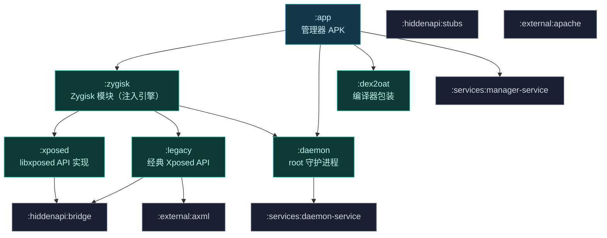
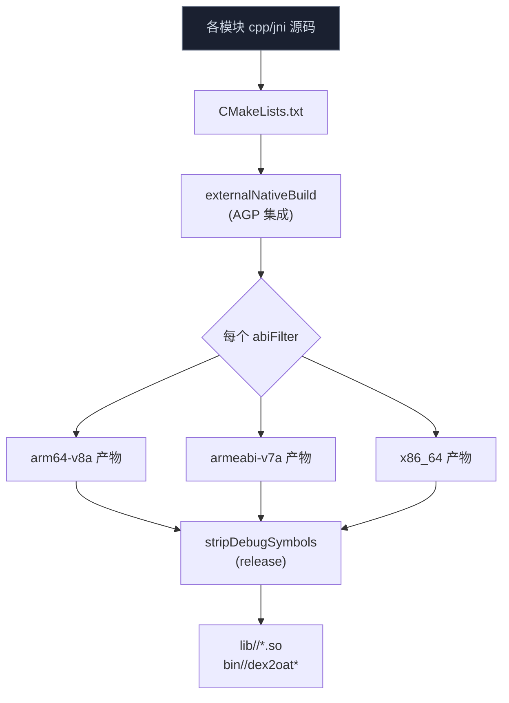
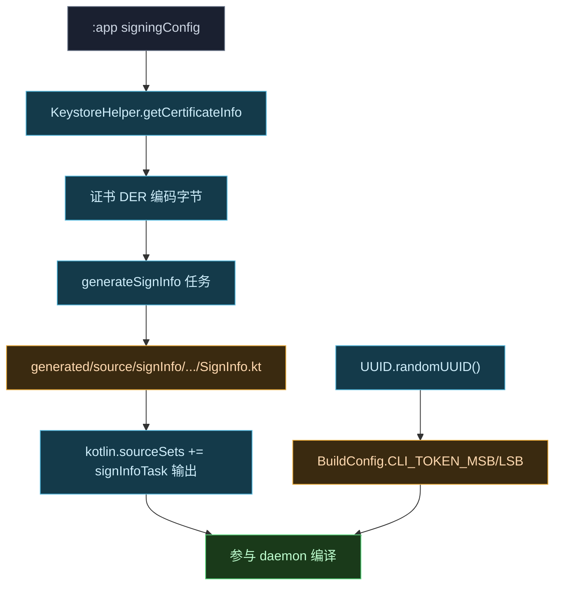
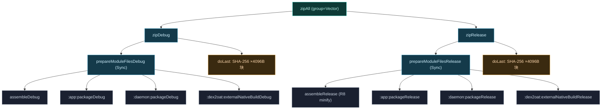

# 🔧 构建系统

Vector 是一个多模块、多语言（Kotlin + C++）的 Android 工程，依赖若干 git 子模块。这一页讲清楚 Gradle 模块拓扑、native CMake 构建、子模块关系、产物形态，以及 debug 与 release 构建的差异。

## 模块拓扑



## Gradle 模块清单

| 模块 | 语言 | 角色 |
| :--- | :--- | :--- |
| `:app` | Kotlin | 管理器 APK（寄生式管理器主体） |
| `:zygisk` | C++ + Kotlin | 注入引擎：Zygisk hook、Binder Trap、寄生管理器编排 |
| `:daemon` | Kotlin + C++ | root 守护进程：状态、IPC、native logcat、dex2oat 挂载 |
| `:dex2oat` | C++ | dex2oat 包装器与 `liboat_hook.so` |
| `:xposed` | Kotlin | 现代 libxposed API 实现 |
| `:legacy` | Kotlin | 经典 `de.robv.android.xposed` API 兼容层 |
| `:hiddenapi:stubs` | Java | 非公开 API 的编译期 stub |
| `:hiddenapi:bridge` | Kotlin | 运行时访问非公开 API 的桥 |
| `:services:manager-service` / `:services:daemon-service` | Kotlin | AIDL 服务定义 |
| `:external:axml` / `:external:apache` | Java | 二进制 XML 编辑、Apache 工具 |

## 子模块依赖

Vector 通过 git submodule 引入关键外部依赖：

| 子模块 | 用途 |
| :--- | :--- |
| `external/lsplant` | 核心 ART Hook 引擎（LSPlant） |
| `external/dobby` | inline hook 实现 |
| `external/fmt` | native 日志格式化 |
| `external/xz-embedded` | `.gnu_debugdata` 解压 |
| `external/lsplt` | PLT hook 库（dex2oat 元数据清洗用） |
| `xposed/libxposed` | 模块侧 libxposed API |
| `services/libxposed` | 服务侧 libxposed API |
| `external/axml/manifest-editor` | APK 清单编辑 |
| `external/apache/commons-lang` | Apache 工具类 |

::: tip 首次构建
克隆后必须执行 `git submodule update --init --recursive`，否则子模块为空，构建失败。
:::

## native CMake 构建

带 C++ 的模块各自有 `CMakeLists.txt`，经 Gradle `externalNativeBuild` 集成：

| 模块 | CMake 路径 | 产物 |
| :--- | :--- | :--- |
| `:zygisk` | `src/main/cpp/CMakeLists.txt` | Zygisk native 库 |
| `:daemon` | `src/main/jni/CMakeLists.txt` | Daemon JNI 库（dex2oat 包装、logcat 解析） |
| `:dex2oat` | `src/main/cpp/CMakeLists.txt` | dex2oat 包装器 + `liboat_hook.so` |
| `:native`（被 zygisk 集成） | — | 静态库 `libnative.a`，静态链接依赖 |

native 库按架构（arm64-v8a / armeabi-v7a / x86_64）分别构建，dex2oat 包装器对 32/64 位分别处理。详见 [Native 原生库](./native) 与 [dex2oat 编译劫持](./dex2oat)。



dex2oat 二进制本身是**可执行文件**（不是 .so），经 CMake 构建到 `intermediates/cmake/<variant>/obj`，`prepareModuleFiles` 从这里取 `dex2oat` 与 `liboat_hook.so` 两个产物。release 构建额外传 `-DDEBUG_SYMBOLS_PATH` 把调试符号分离到 `build/symbols/`，主二进制更小。

## 工具链与版本推导

根 [build.gradle.kts](https://github.com/android-security-engineer/Vector-skills/blob/master/build.gradle.kts) 集中配置所有子模块的构建参数（经 `subprojects` + `AndroidBasePlugin` 钩子统一注入）：

| 配置项 | 值 | 说明 |
| :--- | :--- | :--- |
| `compileSdk` / `targetSdk` | 36 | Android 16 |
| `minSdk` | 27 | Android 8.1（最低支持） |
| `buildToolsVersion` | 36.0.0 | — |
| `ndkVersion` | 29.0.13113456 | — |
| `abiFilters` | arm64-v8a, armeabi-v7a, x86, x86_64 | 全架构 |
| `sourceCompatibility` / `targetCompatibility` | Java 21 | — |
| CMake 版本 | 3.29.8+ | — |
| 16KB 页对齐 | `-Wl,-z,max-page-size=16384` | Android 15+ 兼容 |

版本号由两个 `ValueSource` 推导（延迟执行 + Gradle 缓存）：

- `GitCommitCountValueSource`：`git rev-list --count refs/remotes/origin/master` → `versionCode`。失败回退 `"1"`。
- `GitLatestTagValueSource`：`git tag --list --sort=-v:refname` 取首行去 `v` 前缀 → `versionName`。失败回退 `"1.0"`。

因此构建前需有完整 git 历史与 `origin/master` 远程引用。CMake 侧把 `VERSION_CODE` / `VERSION_NAME` 作为宏传给 native（`cFlags` / `cppFlags`），daemon 的 `getLogs` 也会在 zip 注释里写 `Vector ${BUILD_TYPE} ${VERSION_NAME} (${VERSION_CODE})`。

根 [build.gradle.kts](https://github.com/android-security-engineer/Vector-skills/blob/master/build.gradle.kts) 还定义了三个全局 extra 属性供子模块消费：`injectedPackageName = "com.android.shell"`、`injectedPackageUid = 2000`（寄生管理器注入到的宿主进程 shell）、`defaultManagerPackageName = "org.lsposed.manager"`。这些值经 zygisk 的 `BuildConfig.HostPackageUid`/`InjectedPackageName`/`ManagerPackageName` 和 native 的 `-DINJECTED_PACKAGE_NAME`/`-DINJECTED_PACKAGE_UID`/`-DMANAGER_PACKAGE_NAME` 宏两侧共享。

### Daemon 构建期的签名与令牌注入

[daemon/build.gradle.kts](https://github.com/android-security-engineer/Vector-skills/blob/master/daemon/build.gradle.kts) 在每个 variant 上注册了两个编译期代码生成任务，把运行期敏感值固化为 Kotlin 源码：

| 任务 | 产物 | 内容 |
| :--- | :--- | :--- |
| `generate<Variant>SignInfo` | `org/matrix/vector/daemon/utils/SignInfo.kt` | `object SignInfo { val CERTIFICATE = byteArrayOf(...) }`，从 `:app` 的 signingConfig 经 `KeystoreHelper.getCertificateInfo` 提取证书 DER 编码字节 |
| `BuildConfig` 字段 | `BuildConfig.java` | `CLI_TOKEN_MSB`/`CLI_TOKEN_LSB`（构建期 `UUID.randomUUID()` 的两个 long）、`VERSION_NAME`/`VERSION_CODE`、`MANAGER_INJECTED_UID`、`FRAMEWORK_NAME` |

`SignInfo.kt` 供运行期 [`InstallerVerifier`](https://github.com/android-security-engineer/Vector-skills/blob/master/daemon/src/main/kotlin/org/matrix/vector/daemon/utils/InstallerVerifier.kt) 校验管理器 APK 签名——Daemon 在 `requestInjectedManagerBinder` 投递管理器 APK FD 前会 `verifyInstallerSignature`，比对 `SignInfo.CERTIFICATE` 与 APK 实际证书，防止伪造管理器骗取 root 资源。`CLI_TOKEN` 则是 CLI socket 认证令牌，每次构建随机生成，写进 Daemon 和 CLI 客户端两侧的 `BuildConfig`。



## 从源码到 Magisk zip：完整产物链

[zygisk/build.gradle.kts](https://github.com/android-security-engineer/Vector-skills/blob/master/zygisk/build.gradle.kts) 的 `zipAll` 聚合任务编排整个产物链。`prepareModuleFiles<Variant>` 用 `Sync` 把各模块产物汇聚到 `build/module/<variant>/`，再 `Zip` 打包，每个文件同时写 `.sha256` 校验和。

```
                         Gradle :zygisk:zipAll
                                  │
          ┌───────────┬───────────┼───────────┬────────────┬─────────────┐
          ▼           ▼           ▼           ▼            ▼             ▼
     :app:package  :daemon:    :zygisk:     :dex2oat:    zygisk/        zygisk/
       Debug       package      assemble    external     module/        module/
                   Debug        Debug       NativeBuild  *.sh *.prop    daemon
          │           │           │           │            │             │
          ▼           ▼           ▼           ▼            ▼             ▼
     manager.apk  daemon.apk  libzygisk.so  dex2oat32    action.sh      daemon
                              (stripped)    liboat_hook  module.prop    (过滤DEBUG)
                                            .so          service.sh     │
          │           │        lib/<abi>/   bin/<abi>/   sepolicy.rule  │
          │           │           │           │            │             ▼
          │           │           │           │            │     ReplaceTokens
          │           │           │           │            │     (@DEBUG@→true/false)
          │           │           │           │            │             │
          └─────┬─────┴─────┬─────┘           │            │             │
                ▼           ▼                 │            │             │
            rename→     rename→               │            │             │
          manager.apk daemon.apk              │            │             │
                │           │                 │            │             │
                ▼           ▼                 ▼            ▼             ▼
              ┌─────────────────────────────────────────────────────────────┐
              │  build/module/<variant>/  (Sync 暂存)                        │
              │  + 每个文件 <file>.sha256 (MessageDigest SHA-256)            │
              └──────────────────────────┬──────────────────────────────────┘
                                         ▼
                          framework/lspd.dex  (R8 或 mergeDex 产物改名)
                                         │
                                         ▼
                  release/Vector-v<version>-<count>-<Variant>.zip
                                         │
                  ┌──────────────┬───────┴────────┬──────────────┐
                  ▼              ▼                ▼              ▼
              installMagisk   installKsu       installApatch   (仅打包)
              --install-      ksud module      /data/adb/apd
              module          install          module install
                              + adb reboot
```

`prepareModuleFiles` 的依赖链确保顺序：先 `assemble`/`package` 各模块产物，再 `Sync` 汇聚。`action.sh` 经 `ReplaceTokens` 注入 `MANAGER_PACKAGE_NAME` / `INJECTED_PACKAGE_NAME`，`daemon` 启动脚本经 `ReplaceTokens` 把 `@DEBUG@` 替换为 debug 构建的 `true` 或 release 的 `false`——这就是 [daemon 启动脚本](https://github.com/android-security-engineer/Vector-skills/blob/master/zygisk/module/daemon) 里 `debug="@DEBUG@"` 占位符的来源，决定是否启用 JDWP 调试。

### zipAll 任务依赖图

[zygisk/build.gradle.kts](https://github.com/android-security-engineer/Vector-skills/blob/master/zygisk/build.gradle.kts) 用 `androidComponents.onVariants` 对每个 variant（debug/release）注册一整套任务。`zipAll` 是聚合入口，依赖各 variant 的 `zip` 任务：



每个 `zip<Variant>` 任务还会派生三个安装任务（`createInstallTasks`），按 root 实现区分：

| 任务 | 命令 |
| :--- | :--- |
| `installMagisk<Variant>` | `adb shell su -c "magisk --install-module /data/local/tmp/<zip>"` |
| `installKsu<Variant>` | `adb shell su -c "ksud module install /data/local/tmp/<zip>"` |
| `installApatch<Variant>` | `adb shell su -c "/data/adb/apd module install /data/local/tmp/<zip>"` |

前置 `push<Provider>Module<Variant>` 用 `adb push` 把 zip 推到 `/data/local/tmp`，对应的 `install<Provider>AndReboot<Variant>` 装完直接 `adb reboot`。

### SHA-256 校验和

每个产物文件在 `doLast` 阶段用 `MessageDigest.getInstance("SHA-256")` 按 4096 字节块计算哈希，写 `<file>.sha256`。这与 [customize.sh](https://github.com/android-security-engineer/Vector-skills/blob/master/zygisk/module/customize.sh) 的 `extract` 函数配套——安装时 `unzip` 出 `.sha256` 文件，`sha256sum -c -s -` 校验，失败则 `abort_verify`，防止传输或下载损坏的 zip 静默安装。

## Daemon 启动脚本与 app_process

Daemon 不是独立可执行文件，而是 Java 程序经 `app_process` 启动。[service.sh](https://github.com/android-security-engineer/Vector-skills/blob/master/zygisk/module/service.sh) 在独立挂载命名空间里启动它：

```bash
unshare --propagation slave -m "$MODDIR/daemon" --system-server-max-retry=3 "$@" &
```

`unshare -m` 创建新挂载命名空间，`--propagation slave` 让挂载事件只向下游传播不回灌主命名空间，避免 dex2oat 的 bind mount 泄漏到全局。[daemon 启动脚本](https://github.com/android-security-engineer/Vector-skills/blob/master/zygisk/module/daemon) 等待 `/dev/socket/zygote` 就绪（最多 10 秒轮询），再 `exec app_process` 以 `--nice-name=lspd` 启动 `org.matrix.vector.daemon.VectorDaemon`：

```bash
exec /system/bin/app_process $java_options /system/bin --nice-name=lspd \
  org.matrix.vector.daemon.VectorDaemon "$@"
```

debug 构建下 `@DEBUG@` 被替换为 `true`，脚本探测 `/data/local/tmp/daemon.apk` 是否存在并优先用作 classpath，按 SDK 版本注入 JDWP 调试选项（API 27 用 `-Xrunjdwp`，API 28+ 用 `-XjdwpProvider:adbconnection`），方便 attach 调试器排查启动早期问题。

## debug 与 release

| 维度 | debug | release |
| :--- | :--- | :--- |
| `isMinifyEnabled` | false | true（代码收缩） |
| R8 / 混淆 | 关闭（`mergeDex` 产物） | 开启（`minifyReleaseWithR8` 产物） |
| 框架 DEX 来源 | `intermediates/dex/debug/mergeDexDebug` | `intermediates/dex/release/minifyReleaseWithR8` |
| `@DEBUG@` 占位 | `true`（启用 JDWP） | `false` |
| 日志详尽度 | 更详尽（`isDexObfuscateEnabled = false`） | 受限（混淆开启） |
| native 调试符号 | 内联 | `-DDEBUG_SYMBOLS_PATH` 分离到 `build/symbols/` |
| 适用场景 | 排错、Bug 报告 | 日常发布 |

::: warning debug 构建用于排错
Bug 报告只接受基于**最新 debug 构建**的问题。debug 与 release 兼容性范围一致，但 debug 提供更详尽日志。详见 [兼容性矩阵](../guide/compatibility)。
:::

release 构建开启 `minifyEnabled` 与混淆，APK 体积更小、特征更少；debug 构建关闭混淆便于调试与详尽日志输出。两个细节值得注意：

- zygisk 模块设 `multiDexEnabled = false`——框架 DEX 最终只有一个 `classes.dex`，改名 `lspd.dex` 后经 SharedMemory 整块投递，多 dex 会破坏 `InMemoryDexClassLoader` 的单次加载路径。
- daemon 的所有 buildType 都传 `-DANDROID_ALLOW_UNDEFINED_SYMBOLS=true`，允许 native 链接期暂留未定义符号（运行期经 `dlopen`/`dlsym` 从 liblog、libart 等系统库解析），避免静态链接整份 NDK stub。

## CI 构建

GitHub Actions 工作流：

| 工作流 | 用途 |
| :--- | :--- |
| `core.yml` | 核心构建，产出 master/PR 制品 |
| `crowdin.yml` | 本地化同步 |
| `deploy-docs.yml` | 文档站部署 |

::: caution 下载 CI 制品
GitHub 要求登录后才能下载 Actions 产物。建议只用 `master` 分支构建，PR 构建往往不稳定且可能不安全。
:::

## 最终产物

最终产物是一个 Magisk/KernelSU 模块 zip，包含：

- Zygisk native 库（注入引擎）
- Daemon 可执行程序与 native 库
- dex2oat 包装器与 `liboat_hook.so`
- 框架 DEX（运行时由 Daemon 经 SharedMemory 交付，不落盘到 `/data`）
- 管理器 APK（寄生宿主时由 Daemon 经 FD 提供）

## 相关链接

- [Native 原生库](./native) — CMake 静态库设计
- [dex2oat 编译劫持](./dex2oat) — 包装器构建
- [Daemon 守护进程](./daemon) — Daemon 目录结构
- [兼容性矩阵](../guide/compatibility) — debug 构建与下载渠道
