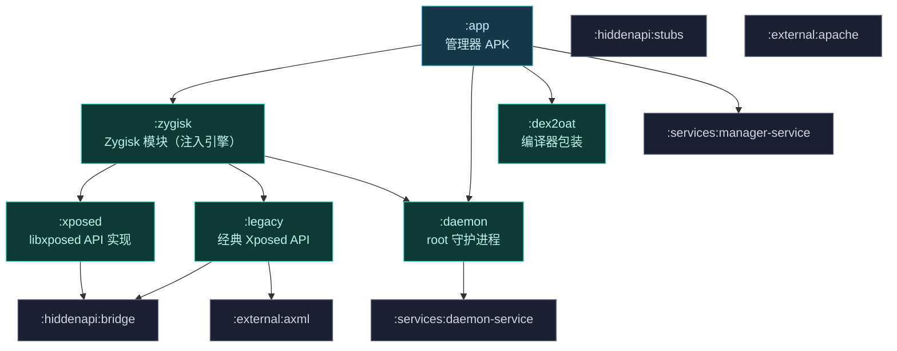

# 🔧 构建系统

Vector 是一个多模块、多语言（Kotlin + C++）的 Android 工程，依赖若干 git 子模块。这一页讲清楚 Gradle 模块拓扑、native CMake 构建、子模块关系、产物形态，以及 debug 与 release 构建的差异。

## 模块拓扑

## Gradle 模块清单

| 模块 | 语言 | 角色 |
| :--- | :--- | :--- |
| `:app` | Kotlin | 管理器 APK（寄生式管理器主体） |
| `:zygisk` | C++ + Kotlin | 注入引擎：Zygisk hook、Binder Trap、寄生管理器编排 |
| `:daemon` | Kotlin + C++ | root 守护进程：状态、IPC、native logcat、dex2oat 挂载 |
| `:dex2oat` | C++ | dex2oat 包装器与 `liboat_hook.so` |
| `:xposed` | Kotlin | 现代 libxposed API 实现 |
| `:legacy` | Kotlin | 经典 `de.robv.android.xposed` API 兼容层 |
| `:hiddenapi:stubs` | Java | 非公开 API 的编译期 stub |
| `:hiddenapi:bridge` | Kotlin | 运行时访问非公开 API 的桥 |
| `:services:manager-service` / `:services:daemon-service` | Kotlin | AIDL 服务定义 |
| `:external:axml` / `:external:apache` | Java | 二进制 XML 编辑、Apache 工具 |

## 子模块依赖

Vector 通过 git submodule 引入关键外部依赖：

| 子模块 | 用途 |
| :--- | :--- |
| `external/lsplant` | 核心 ART Hook 引擎（LSPlant） |
| `external/dobby` | inline hook 实现 |
| `external/fmt` | native 日志格式化 |
| `external/xz-embedded` | `.gnu_debugdata` 解压 |
| `external/lsplt` | PLT hook 库（dex2oat 元数据清洗用） |
| `xposed/libxposed` | 模块侧 libxposed API |
| `services/libxposed` | 服务侧 libxposed API |
| `external/axml/manifest-editor` | APK 清单编辑 |
| `external/apache/commons-lang` | Apache 工具类 |

::: tip 首次构建
克隆后必须执行 `git submodule update --init --recursive`，否则子模块为空，构建失败。
:::

## native CMake 构建

带 C++ 的模块各自有 `CMakeLists.txt`，经 Gradle `externalNativeBuild` 集成：

| 模块 | CMake 路径 | 产物 |
| :--- | :--- | :--- |
| `:zygisk` | `src/main/cpp/CMakeLists.txt` | Zygisk native 库 |
| `:daemon` | `src/main/jni/CMakeLists.txt` | Daemon JNI 库（dex2oat 包装、logcat 解析） |
| `:dex2oat` | `src/main/cpp/CMakeLists.txt` | dex2oat 包装器 + `liboat_hook.so` |
| `:native`（被 zygisk 集成） | — | 静态库 `libnative.a`，静态链接依赖 |

native 库按架构（arm64-v8a / armeabi-v7a / x86_64）分别构建，dex2oat 包装器对 32/64 位分别处理。详见 [Native 原生库](./native) 与 [dex2oat 编译劫持](./dex2oat)。

## 版本号

根 `build.gradle.kts` 用 `ValueSource` 执行 git 命令推导版本：

- `git rev-list --count refs/remotes/origin/master` → 提交计数（版本号后缀）。
- `git tag --list --sort=-v:refname` → 最新 tag（版本名）。

因此构建前需有完整 git 历史与远程引用，否则回退到默认值。

## debug 与 release

| 维度 | debug | release |
| :--- | :--- | :--- |
| `isMinifyEnabled` | false | true（代码收缩） |
| dex 混淆 | 关闭 | 开启 |
| 日志详尽度 | 更详尽 | 受限 |
| 适用场景 | 排错、Bug 报告 | 日常发布 |

::: warning debug 构建用于排错
Bug 报告只接受基于**最新 debug 构建**的问题。debug 与 release 兼容性范围一致，但 debug 提供更详尽日志。详见 [兼容性矩阵](../guide/compatibility)。
:::

release 构建开启 `minifyEnabled` 与混淆，APK 体积更小、特征更少；debug 构建关闭混淆便于调试与详尽日志输出。

## CI 构建

GitHub Actions 工作流：

| 工作流 | 用途 |
| :--- | :--- |
| `core.yml` | 核心构建，产出 master/PR 制品 |
| `crowdin.yml` | 本地化同步 |
| `deploy-docs.yml` | 文档站部署 |

::: caution 下载 CI 制品
GitHub 要求登录后才能下载 Actions 产物。建议只用 `master` 分支构建，PR 构建往往不稳定且可能不安全。
:::

## 产物

最终产物是一个 Magisk/KernelSU 模块 zip，包含：

- Zygisk native 库（注入引擎）
- Daemon 可执行程序与 native 库
- dex2oat 包装器与 `liboat_hook.so`
- 框架 DEX（运行时由 Daemon 经 SharedMemory 交付，不落盘到 `/data`）
- 管理器 APK（寄生宿主时由 Daemon 经 FD 提供）

## 相关链接

- [Native 原生库](./native) — CMake 静态库设计
- [dex2oat 编译劫持](./dex2oat) — 包装器构建
- [Daemon 守护进程](./daemon) — Daemon 目录结构
- [兼容性矩阵](../guide/compatibility) — debug 构建与下载渠道
