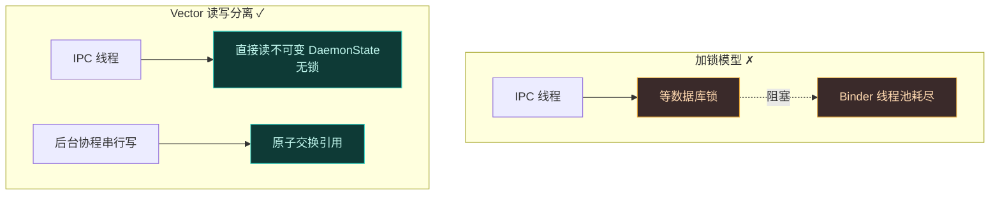
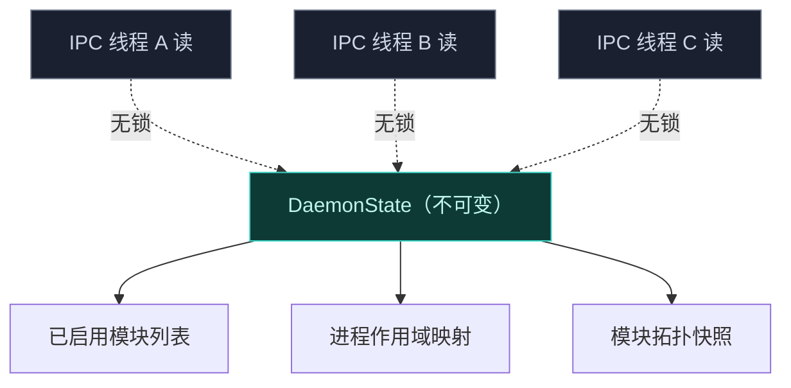
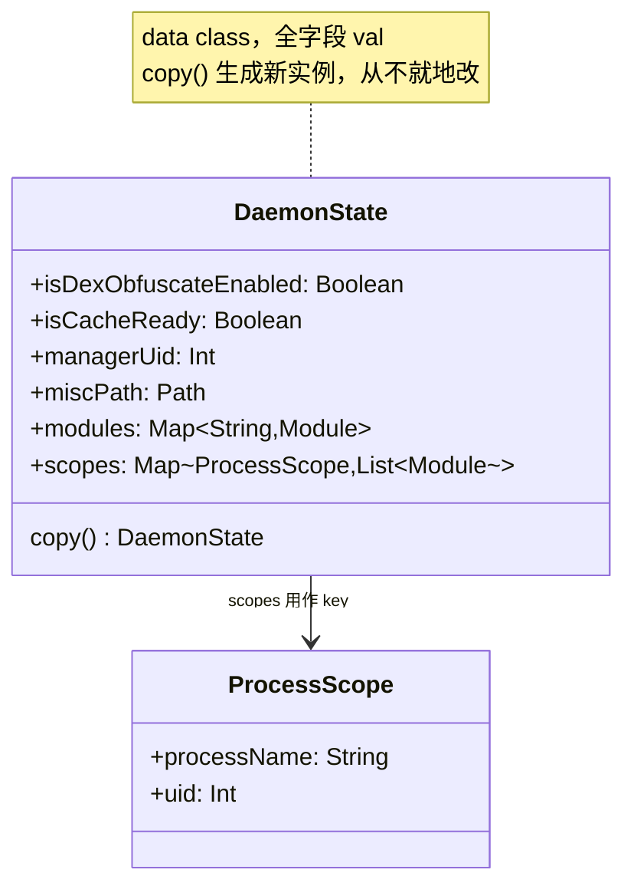
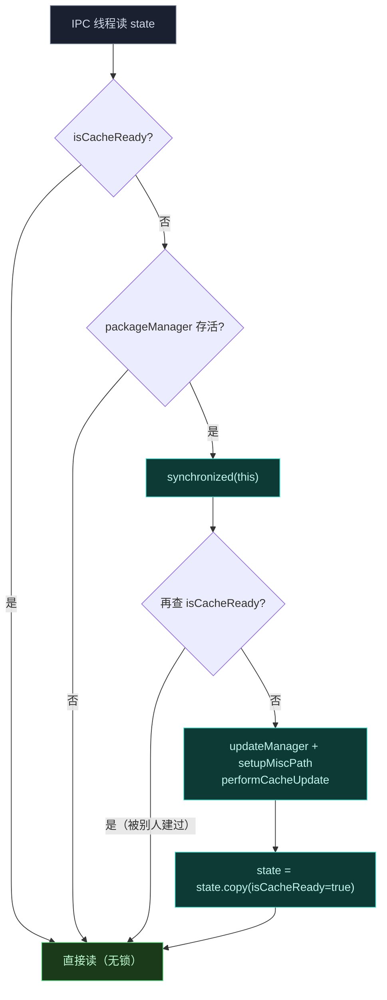
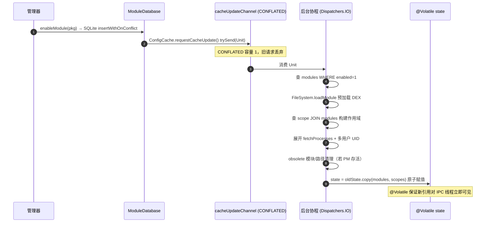
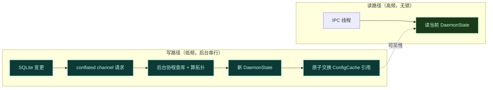
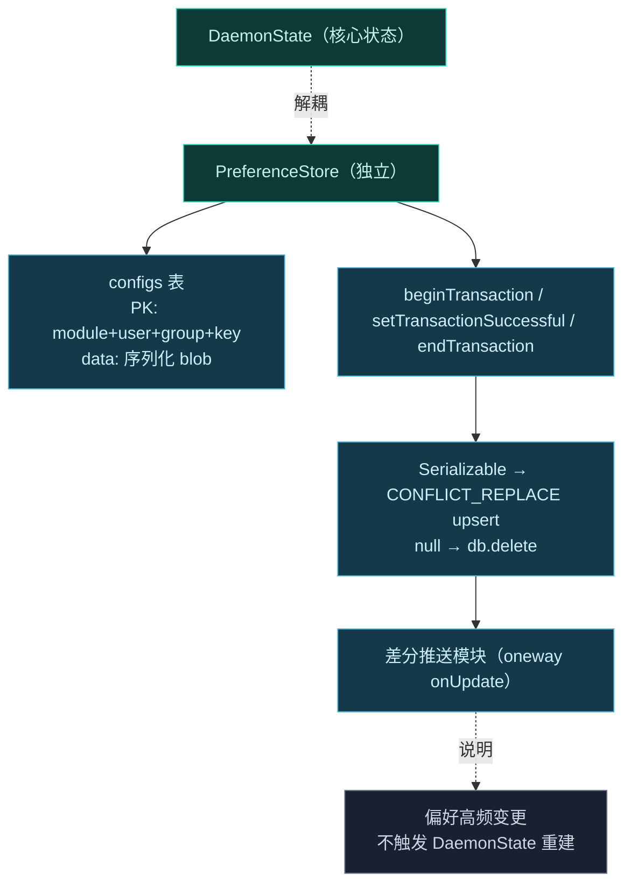
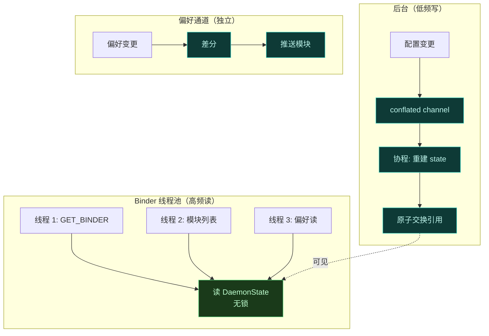
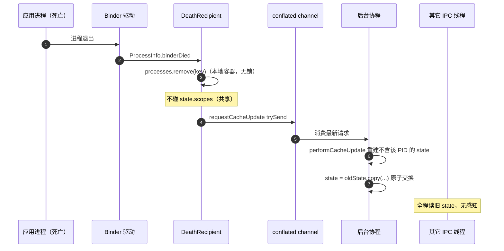

# Daemon 并发模型

Daemon 是所有目标进程的中央协调者，同时服务大量 IPC 请求。它要在不饿死 Binder 线程池的前提下处理并发，又要让高频的配置读取不阻塞。Vector 的解法是**不可变状态 + 原子交换 + 写读分离**——读路径完全无锁，写路径后台串行。这一页拆解这条并发管线。

## 问题：Binder 线程池不能阻塞

Android Binder 线程池是有限的（默认 15 个左右）。每个目标进程的 `GET_BINDER`、模块列表查询、偏好读写都是一次 IPC。若每次读都加锁等数据库查询，线程池很快耗尽，新 IPC 排队超时，目标进程注入失败。

## 不可变 DaemonState

`DaemonState` 是一个 data class，持有所有已启用模块与进程作用域的**冻结快照**。它是不可变的——构造完成后绝不修改。IPC 线程读取它**无需加锁**，因为不可变对象天生线程安全：多个线程同时读同一个引用，谁也不会读到半成品状态。

[`DaemonState`](https://github.com/android-security-engineer/Vector-skills/blob/master/daemon/src/main/kotlin/org/matrix/vector/daemon/data/DaemonState.kt) 的字段分两类：用户不可配的 `isDexObfuscateEnabled`（`!BuildConfig.DEBUG`，编译期定死），和系统就绪后填充的 `isCacheReady`/`managerUid`/`miscPath`/`modules`/`scopes`。所有变更都经 `state.copy(...)` 生成新实例再赋值——从不就地修改。`ProcessScope(processName, uid)` 是 `scopes` 映射的 key，`modules` 是 `Map<String, Module>`，两者都是不可变 `Map`，构造完即冻结。

### 延迟初始化：双检锁保证只建一次

系统服务（`package`/`activity`）就绪前，`DaemonState` 是空壳。`ensureCacheReady` 用经典双检锁（DCL）保证只建一次完整缓存：

> [!TIP]
> 这里的"可见性"靠 `@Volatile var state`（见 [ConfigCache.kt](https://github.com/android-security-engineer/Vector-skills/blob/master/daemon/src/main/kotlin/org/matrix/vector/daemon/data/ConfigCache.kt)）：`volatile` 写保证新引用立刻对其它线程可见，`synchronized` 块内的 `performCacheUpdate` 又保证了模块/作用域映射与 `isCacheReady` 标志一起发布——不会有"缓存标记已就绪但映射还是空"的撕裂窗口。

## 写路径：原子交换

配置变更（用户在管理器里勾选模块、改作用域）是低频操作。变更经 SQLite 落库后，Daemon 走写路径：

1. **触发**：[`ConfigCache.requestCacheUpdate()`](https://github.com/android-security-engineer/Vector-skills/blob/master/daemon/src/main/kotlin/org/matrix/vector/daemon/data/ConfigCache.kt) 往 `Channel<Unit>(Channel.CONFLATED)` `trySend` 一个请求——`CONFLATED` 容量为 1，旧请求被丢弃只留最新。
2. **构建**：`init` 块启动的后台协程 `for (request in cacheUpdateChannel)` 消费请求，调 `performCacheUpdate()`：查 `modules WHERE enabled=1`、`scope INNER JOIN modules ON scope.mid=modules.mid`，用 `FileSystem.loadModule` 预加载 `PreLoadedApk`，展开进程名与多用户 UID。
3. **交换**：`state = oldState.copy(modules = newModules, scopes = newScopes)`——`@Volatile var state` 的引用赋值是原子的，旧引用被换掉。
4. **可见**：此后 IPC 线程读到的是新 state。

`performCacheUpdate` 的关键容错：找不到 `pkgInfo` 的模块进 `obsoleteModules` 集合，事务后 `ModuleDatabase.removeModule` 清掉；APK 路径变化的进 `obsoletePaths`，`updateModuleApkPath` 更新。若系统服务 Binder 不存活（`packageManager.asBinder().isBinderAlive` 为 false），跳过 obsolete 清理避免误删——等下次系统就绪再清。

### conflated channel 的作用

conflated channel 是一种"只保留最新值"的通道：若多个变更在后台协程消费前堆积，旧请求被丢弃，只处理最新。这保证了写路径**串行化且去抖**——用户快速连续改几次作用域，不会触发多次完整数据库重建，只重建最后一次。

### 原子交换为何安全

引用赋值在 JVM 层是原子的（`volatile` 引用写）。旧 state 引用被换掉的瞬间，正在读旧 state 的线程仍持有旧引用，读完即释；新读请求拿到新引用。没有读写竞争，没有撕裂状态。

## 偏好隔离与差分更新

模块偏好（`SharedPreferences`）是高频读写，但语义上和核心状态（模块列表/作用域）不同——偏好是每个模块自己的键值对，变更粒度小、频率高。若每次偏好变更都重建整个 `DaemonState`，写路径会被打爆。

为此偏好由 `PreferenceStore` 独立管理，与核心状态解耦：

- 偏好序列化为二进制 blob（`SerializationUtilsX.serialize`），存进 SQLite `configs` 表，主键是 `module_pkg_name + user_id + group + key` 四元组。
- 以**差分更新**推送给模块——只传变化的部分，不重传整个偏好集。
- 避免不必要的缓存重建。

> [!TIP]
> [`PreferenceStore`](https://github.com/android-security-engineer/Vector-skills/blob/master/daemon/src/main/kotlin/org/matrix/vector/daemon/data/PreferenceStore.kt) 把偏好存进 SQLite `configs` 表（`module_pkg_name + user_id + group + key` 四元组主键，value 是 `SerializationUtilsX.serialize` 的二进制 blob）。`updateModulePrefs` 用 `beginTransaction`/`setTransactionSuccessful`/`endTransaction` 包整批 diff——`value == null` 走 `db.delete`，`Serializable` 走 `CONFLICT_REPLACE` upsert。差分推送给模块时，`ModuleService.updateRemotePreferences` 把 `delete`/`put` 两个集合塞进 Bundle，再经 `InjectedModuleService.onUpdateRemotePreferences` 调所有已订阅回调的 `onUpdate(diff)`——这是 oneway 调用，不阻塞 Daemon 的 Binder 线程。

## 读写分离的全景

把读路径和写路径彻底分到不同线程域：

| 路径 | 频率 | 线程 | 加锁 | 操作 |
| :--- | :--- | :--- | :--- | :--- |
| 读 | 高频 | Binder IPC 线程池 | 无锁 | 读当前 `DaemonState` 引用 |
| 写（核心） | 低频 | 单后台协程 | 串行 | 重建 `DaemonState` + 原子交换 |
| 写（偏好） | 高频 | `PreferenceStore` | 独立 | 差分更新，不碰核心状态 |

差分推送的意义在于：一个模块可能有数百个偏好键，但单次用户操作通常只改一两个。全量重传会让 IPC payload 膨胀、序列化耗时；差分只传变化部分，单次推送开销恒定在小常数级。配合 conflated channel 的去抖特性，即使偏好被快速连续修改，也只会触发一次差分推送，不会打满 Binder 线程。

## 与进程生命周期的协作

进程死亡清理（见 [进程生命周期与心跳](./lifecycle)）也走写路径。`DeathRecipient` 触发后，不直接修改共享映射（那会破坏无锁读），而是触发 conflated channel 请求，后台协程构建不含该 PID 的新 `DaemonState` 并原子交换。正在服务其它进程的 IPC 线程完全不受影响。

> [!TIP]
> 注意 `processes`（`ConcurrentHashMap`）和 `state.scopes`（不可变快照）是两个独立容器。前者跟踪"已注册心跳的进程"，`binderDied` 直接 `remove` 是安全的（CHM 自带并发安全）；后者是核心状态，必须走写路径原子交换。这个区分是无锁读安全的关键。

## 小结

| 设计 | 解决的问题 |
| :--- | :--- |
| 不可变 `DaemonState` | 读路径无锁，线程安全 |
| conflated channel | 写路径串行化、去抖 |
| 原子交换引用 | 无锁切换快照，读写不竞争 |
| 偏好隔离 | 高频偏好变更不打爆核心状态重建 |
| 差分更新 | 偏好推送只传变化部分 |
| 死亡清理走写路径 | 不破坏正在服务的 IPC 线程 |

## 相关链接

- [Daemon 守护进程](./daemon) — 并发模型在 Daemon 整体职责中的位置
- [进程生命周期与心跳](./lifecycle) — 死亡清理如何走写路径
- [IPC 与 Binder 中继](./ipc) — 读路径服务的高频 IPC 来源
