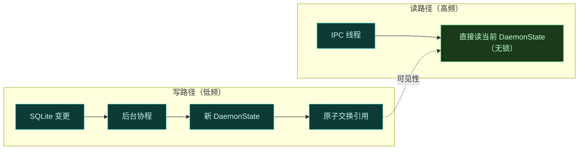

# Daemon 守护进程

Daemon 是一个独立的、root 权限的 Dalvik 可执行程序，经 `app_process` 引导，完全运行在标准 Android 应用沙箱之外。它是 Vector 的中央协调者、状态管理者和 IPC 资产服务器。

## 为什么需要它

目标进程受严格沙箱与 SELinux 约束，**无法安全地访问外部配置文件或 SQLite 数据库**。Daemon 把这些操作卸载到自己身上，提供一个 IPC 后端，向目标应用安全高效地交付内存映射资源、配置状态和 native 文件描述符。

## 目录结构

```text
src/main/
├── jni/                      # Native C++（dex2oat 包装、logcat 解析）
└── kotlin/org/matrix/vector/daemon/
    ├── data/                 # SQLite schema、不可变状态缓存、文件操作
    ├── env/                  # UNIX domain socket 服务、native 进程监控
    ├── ipc/                  # AIDL 端点（Application/Manager/Module/SystemServer）
    ├── system/               # 系统 binder 代理、通知 UI
    ├── utils/                # 上下文伪造、签名校验、JNI 桥
    ├── Cli.kt                # 命令行接口定义
    ├── VectorDaemon.kt       # 主入口与 looper 初始化
    └── VectorService.kt      # 主 IDaemonService 实现
```

## 并发与状态管理

为在不饿死 Android Binder 线程池的前提下处理并发 IPC 请求，Daemon 把后台 I/O 与状态读取分离开。

- **不可变状态容器**：`DaemonState` data class 持有所有已启用模块与进程作用域的冻结快照。IPC 线程读取它**无需加锁**。
- **原子交换**：底层 SQLite 变更时，Daemon 触发一个 conflated channel 请求。后台协程查询数据库、计算新模块拓扑、实例化新 `DaemonState`，并在 `ConfigCache` 里**原子交换**引用。
- **偏好隔离**：高频的模块偏好读写与核心状态解耦。由 `PreferenceStore` 管理，偏好序列化为二进制 blob 并以**差分更新**推送给模块，避免不必要的缓存重建。



## IPC 架构

Daemon 实现了多层 IPC 设计，结合 Android Binder 与 UNIX domain socket。它**避免**向 `ServiceManager` 注册标准 AIDL 服务，转而经 Zygisk 模块拦截 Binder 事务并主动向目标进程推送 Binder 引用。

完整的两阶段 Binder 中继见 [IPC 与 Binder 中继](./ipc)。Daemon 侧的四个关键机制：

### 1. system_server 引导

Daemon 注册 `IServiceCallback` 监听硬件代理服务（通常是 `serial`）的注册。一旦截获，Daemon 用自己的 binder 替换该代理服务。Zygisk 模块查询此代理服务，经 `SharedMemory` 拉取框架加载器 DEX 和类混淆映射。

同时 Daemon 向 `activity` 服务发送原始 `ACTION_SEND_BINDER` 事务。Zygisk 模块的 JNI hook 在事务到达 Activity Manager 前截获，提取并保存 Daemon 的主 `VectorService` binder。

### 2. 目标应用会合

应用向 Daemon 请求框架访问，经 `system_server` 中转：

1. 应用查询 `activity` 服务，`system_server` 内的 Zygisk 模块截获。
2. `system_server` 把应用 UID/PID/进程名和新创建的心跳 `BBinder` 转发给 Daemon。
3. Daemon 核对 `ConfigCache` 判断应用是否在某已启用模块的作用域内。
4. 批准则返回 `ApplicationService` binder，由 `system_server` 转交应用。
5. Daemon 把 `DeathRecipient` 链接到心跳 binder，应用进程死亡时自动清理内部跟踪映射。
6. 应用用 `ApplicationService` binder 拉取自己的模块列表、框架 DEX 和混淆映射。

### 3. libxposed 模块注入

与目标应用的"请求访问"不同，Daemon **主动推送** API binder 给模块进程，仅限使用现代 libxposed API 的模块。

1. Daemon 向 Activity Manager 注册 `IUidObserver` 监控进程生命周期。
2. UID 活跃时，`ModuleService` 检查它是否属于已启用 libxposed 模块。
3. Daemon 取 `IXposedService` binder，经 `IActivityManager.getContentProviderExternal` 投递到按模块包名构造的合成 authority。
4. 执行 `IContentProvider.call`，动作 `SEND_BINDER`，Bundle 内装 binder。Binder 在 `Application.onCreate` 执行前注入模块进程。

### 4. native socket IPC

对 Java Binder 上下文之外的 native 组件，Daemon 提供两种 UNIX domain socket。

- **命令行接口**：`CliSocketServer` 在 `/data/adb/lspd/.cli_sock` 暴露文件系统 socket。CLI 客户端用编译期 UUID 令牌认证，以结构化 JSON 通信。实时日志流场景下，Daemon 把日志文件的原始 `FileDescriptor` 附到 socket 回复 payload，客户端直接从 OS 级流缓冲读取。
- **Dex2Oat 包装器**：`Dex2OatServer` 监听一个 abstract UNIX domain socket。为防冲突与检测，此 abstract socket 名在模块安装时随机化。C++ `dex2oat` 包装器连此 socket，经 `SCM_RIGHTS` 接收必要文件描述符。

## native 环境子系统

Daemon 依赖 native C++ 子系统拦截 Android 编译管线并直接解析系统日志缓冲，避开标准 shell 工具的开销与局限。

### AOT 编译劫持

详见 [dex2oat 编译劫持](./dex2oat)。Daemon 侧的关键：为确保替换后的编译器二进制对所有新进程可见，Daemon fork 一个特权子进程，用 `setns` 配 `CLONE_NEWNS` 经 `/proc/1/ns/mnt` 进入 init (PID 1) 挂载命名空间，对 `/apex` 下的目标编译器执行只读 bind mount。

为保障包装器连接无 SELinux 拒绝，Daemon 在绑定 socket 前动态写 `/proc/self/task/[tid]/attr/sockcreate`，指示内核用特定上下文（如 `u:r:dex2oat:s0` 或 `u:r:installd:s0`）标记该 abstract socket。

若包装器被禁用或不兼容，Daemon 卸载二进制并以 `resetprop` 把内联标志直接注入 `dalvik.vm.dex2oat-flags` 系统属性作为回退。Kotlin Daemon 经 `FileObserver` 监控 `/sys/fs/selinux/enforce` 及策略文件，在系统切到 permissive 或改动策略时动态重新挂载包装器。

### native logcat 监控

Daemon 不依赖标准 logcat shell 执行，而是运行一个 native C++ 进程直接对接 Android `liblog` 缓冲（`LOG_ID_MAIN` 与 `LOG_ID_CRASH`）。

native 解析器对日志事件做**零拷贝**处理，严格按预定义精确标签（Magisk、KernelSU）和前缀标签（dex2oat、Vector、LSPosed）过滤输出，写入两个轮转日志文件（一个模块框架、一个详细系统调试），达 4MB 自动轮转。

为控制这个隔离的 native 循环，Kotlin Daemon 把特定字符串触发器（如 `!!refresh_modules!!`、`!!start_verbose!!`）直接注入 Android 日志流。C++ 解析器截获来自自身父 PID 的这些消息，动态轮转文件描述符或改变详尽度状态，无需额外 IPC 开销。
