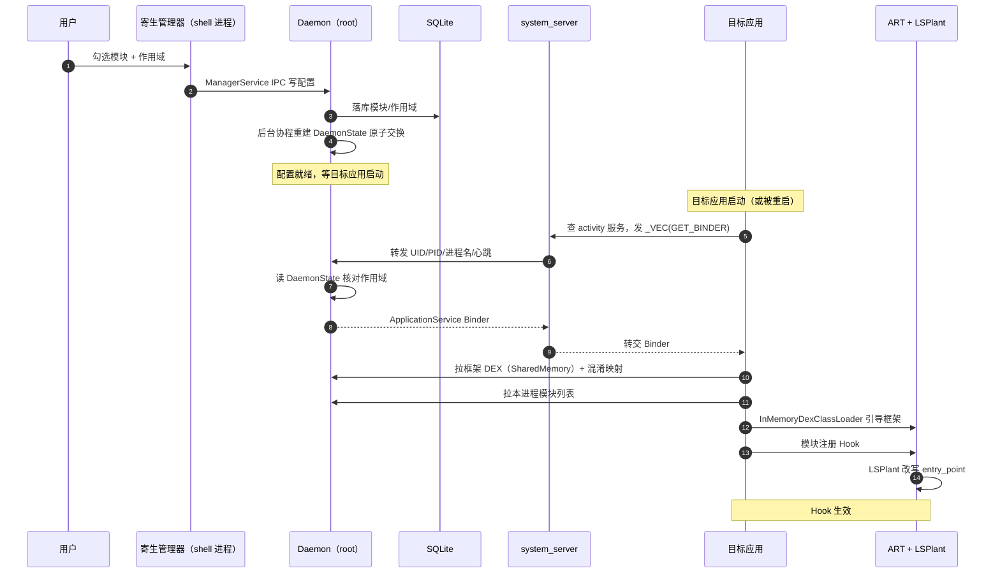
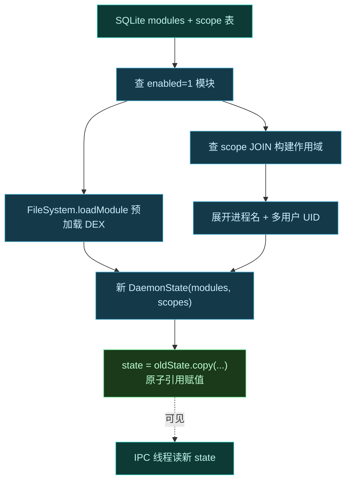
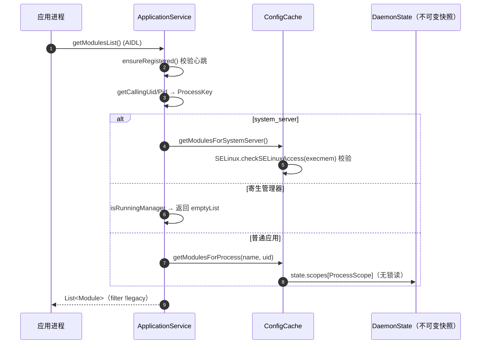
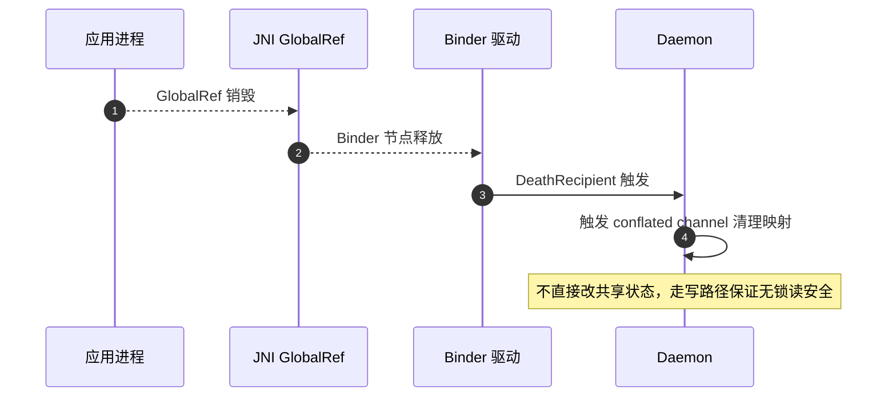

# 🔁 数据流总览

这一页用一个完整链路回答："用户在管理器里点了一下启用模块，到目标进程里 Hook 真正生效，中间数据走了哪些路？"理解了这条链路，就理解了 Vector 各子系统如何串联。

## 全链路一图



## 阶段拆解

### 阶段 1：配置写入（低频，写路径）

用户操作经管理器到 Daemon 的 SQLite，再原子交换进不可变状态。


关键点：写路径串行化、去抖，不阻塞读路径。详见 [Daemon 并发模型](./concurrency)。

### 配置写入的精确链路

管理器经 `ILSPManagerService` 调 [`ManagerService`](https://github.com/android-security-engineer/Vector-skills/blob/master/daemon/src/main/kotlin/org/matrix/vector/daemon/ipc/ManagerService.kt) 的 `enableModule`/`disableModule`/`setModuleScope`，落到 [`ModuleDatabase`](https://github.com/android-security-engineer/Vector-skills/blob/master/daemon/src/main/kotlin/org/matrix/vector/daemon/data/ModuleDatabase.kt) 写 SQLite `modules`/`scope` 表，事务化 `insertWithOnConflict(CONFLICT_IGNORE)`。每次成功变更都调 `ConfigCache.requestCacheUpdate()`——往 `Channel<Unit>(Channel.CONFLATED)` `trySend` 一个请求，旧请求被丢弃只留最新。

后台协程消费该 channel 跑 `performCacheUpdate`：查 `modules WHERE enabled=1`、按用户遍历 `getPackageInfoCompat` 找 APK、用 `FileSystem.loadModule` 预加载 `PreLoadedApk`（`SharedMemory` 预映射 DEX），再查 `scope INNER JOIN modules` 构建进程作用域映射。最关键的一步是原子交换：



> [!TIP]
> 作用域映射的 key 是 `ProcessScope(processName, uid)`，见 [DaemonState.kt](https://github.com/android-security-engineer/Vector-skills/blob/master/daemon/src/main/kotlin/org/matrix/vector/daemon/data/DaemonState.kt)。`performCacheUpdate` 会展开 `pkgInfo.fetchProcesses()` 拿到所有声明进程名，并对"模块自身作为目标"的情况按多用户展开（`user.id * PER_USER_RANGE + appId`）——保证模块进程自己也注入自己。`system` 作用域单独映射到 `ProcessScope("system_server", 1000)`。

### 阶段 2：目标应用会合（每个应用启动时）

应用经 `system_server` 中转拿到 Daemon 的专用 Binder。

| 步骤 | 数据 | 通道 |
| :--- | :--- | :--- |
| 应用发 `GET_BINDER` | 进程名 + 心跳 BBinder | Binder（`_VEC` 事务码搭便车） |
| system_server 转发 | UID/PID/心跳 | Binder 转给 Daemon |
| Daemon 核对作用域 | 读 DaemonState | 内存读，无锁 |
| 返回 | ApplicationService Binder | 写回应用回复 parcel |

> [!TIP]
> 作用域核对在 [VectorService.kt](https://github.com/android-security-engineer/Vector-skills/blob/master/daemon/src/main/kotlin/org/matrix/vector/daemon/VectorService.kt) 的 `requestApplicationService`：先认 `Binder.getCallingUid()==1000`，再 `ApplicationService.hasRegister` 去重，最后 `ConfigCache.shouldSkipProcess(ProcessScope)` 查 `state.scopes.containsKey`。寄生管理器走 `tryRegisterManagerProcess` 旁路（命中 `managerUid` 且进程名匹配）。

### 模块列表的分流（getModulesList）

拿到 `ApplicationService` Binder 后，应用调 `getModulesList()` / `getLegacyModulesList()` 拉本进程模块。[ApplicationService.kt](https://github.com/android-security-engineer/Vector-skills/blob/master/daemon/src/main/kotlin/org/matrix/vector/daemon/ipc/ApplicationService.kt) 的 `getAllModules()` 按调用方身份分流：

| 调用方身份 | 判定 | 返回 |
| :--- | :--- | :--- |
| system_server | `uid == SYSTEM_UID && processName == "system"` | `ConfigCache.getModulesForSystemServer()`（含 SELinux execmem 校验，被拒则返回空） |
| 寄生管理器 | `ManagerService.isRunningManager(pid, uid)` | `emptyList()`（管理器自身不注入模块） |
| 普通应用 | 其他已注册进程 | `ConfigCache.getModulesForProcess(processName, uid)`（查 `state.scopes`） |

`getModulesList` 与 `getLegacyModulesList` 再按 `module.file.legacy` 拆分：现代 libxposed 模块走推模式注入（见 [IPC](./ipc)），经典 Xposed 模块走拉模式。`getPrefsPath` 还会按模块 UID 做 `chown`/`chmod`（根目录 755、子目录 711、文件 744），让目标进程能读自己的偏好。



### 阶段 3：资产交付（内存加载）

应用用专用 Binder 拉取框架 DEX 与模块列表，全程内存。关键设计是 **SharedMemory 跨进程零拷贝 + ashmem 即时解除映射**——DEX 字节只在两个进程的虚拟地址空间里短暂出现，不落盘到 `/data` 任何文件，也不留持久 FD：

```text
   Daemon (root)                          Application (sandboxed)
   ┌──────────────────────┐               ┌──────────────────────────┐
   │ FileSystem           │   _DEX 事务    │ ApplicationService.onTransact│
   │ .getPreloadDex()     │◄──────────────│  reply: shm.writeToParcel  │
   │  └─ SharedMemory     │   (parcel 含  │  + writeLong(shm.size)     │
   │     (ashmem fd +     │   fd + size)  │        │                   │
   │      mmap 预映射)    │──────────────►│        ▼                   │
   └──────────────────────┘               │ detachFd() 取 fd           │
                                          │   ▼                        │
   ┌──────────────────────┐               │ mmap(fd, size) → ByteBuffer│
   │ Daemon 不再持有该    │               │   ▼                        │
   │ ashmem 的 mmap 映射  │◄──────────────│ close(fd) ← FD 可关        │
   │ （预加载时建好，     │   (mmap 已    │   ▼                        │
   │  投递后由 native     │    复制字节)  │ InMemoryDexClassLoader     │
   │  端 detachFd 后      │               │   ▼                        │
   │  关闭)               │               │ ART 摄取 DEX → ClassLoader │
   └──────────────────────┘               │   ▼                        │
                                          │ ashmem 解除映射            │
                                          │  框架常驻内存，无文件无 FD │
                                          └──────────────────────────┘
```

同时拉取混淆映射，让 native 能定位随机化的入口类。详见 [类名混淆](./obfuscation) 与 [内存 ClassLoader](./loader)。


> [!TIP]
> DEX 投递在 [ApplicationService.kt](https://github.com/android-security-engineer/Vector-skills/blob/master/daemon/src/main/kotlin/org/matrix/vector/daemon/ipc/ApplicationService.kt) 的 `onTransact(DEX_TRANSACTION_CODE)`：`FileSystem.getPreloadDex` 返回 `SharedMemory`，`writeToParcel` 后再 `writeLong(shm.size)`。混淆映射走 `OBFUSCATION_MAP_TRANSACTION_CODE`，成对写字符串（`signatures.size * 2` 计数），`isDexObfuscateEnabled` 关闭时回写原名——这样 native 侧无需分支判断。native 消费方在 [ipc_bridge.cpp](https://github.com/android-security-engineer/Vector-skills/blob/master/zygisk/src/main/cpp/ipc_bridge.cpp) 的 `FetchFrameworkDex`/`FetchObfuscationMap`，`detachFd` 取 FD 后 `close(dex_fd)`（mmap 已复制）。`getPreloadDex` 在 `ConfigCache.scope.launch` 时已预映射（`isDexObfuscateEnabled` 决定取混淆版还是原版 DEX），首次 IPC 调用无需等映射。

### 阶段 4：Hook 生效（ART 改写）

模块代码在应用进程内执行，调 Hook API，最终落到 LSPlant 改写方法入口点。在 [module.cpp](https://github.com/android-security-engineer/Vector-skills/blob/master/zygisk/src/main/cpp/module.cpp) 的 `postAppSpecialize` 里，整个引导链是**同步**的——`RequestAppBinder` → `FetchFrameworkDex` → `LoadDex` → `InitArtHooker` → `SetupEntryClass` → `FindAndCall forkCommon`，全部完成后才把控制权交回 Android 框架（`Application.onCreate` 之前）。`lsplant::InitInfo` 的 `inline_hooker`/`inline_unhooker` 走 Dobby 风格的 `HookInline`/`UnhookInline`，`art_symbol_resolver` 走 `ElfSymbolCache::GetArt()` 惰性缓存，`generated_class_name = "Vector_"`、`generated_source_name = "Dobby"` 是 trampoline 生成类的命名前缀。

| 数据 | 流向 | 关键机制 |
| :--- | :--- | :--- |
| 模块 Hook 注册 | Java → JNI → native HookBridge | LSPlant `InlineHook` 备份原方法 trampoline |
| entry_point 改写 | LSPlant 修改 ArtMethod 结构 | 替换 `entry_point_from_quick_compiled_code` |
| 内联抑制 | dex2oat 劫持 `--inline-max-code-units=0` | 防止被 Hook 方法被内联进调用方，否则 entry_point 改写失效 |
| 已编译方法反优化 | VectorDeopter 逐回解释器 | 已 AOT 编译的方法走快速路径会绕过 entry_point，必须强制回解释执行 |

此后每次调用被 Hook 方法，先进入模块拦截逻辑。详见 [ART Hook 原理](../guide/art-hook) 与 [Xposed API 实现](./xposed)。

## 关键数据载体

| 载体 | 携带内容 | 为何这样设计 |
| :--- | :--- | :--- |
| `SharedMemory` FD | 框架 DEX | 跨进程零拷贝传递大块字节 |
| 序列化混淆字典 | 原名→随机名映射 | native 与 Kotlin 共用同一份定位 |
| 心跳 BBinder | 进程存活信号 | 借 Binder 死亡通知免轮询清理 |
| 不可变 DaemonState | 模块列表/作用域快照 | 读路径无锁 |
| 差分偏好 blob | 模块偏好变化 | 只传变化部分，IPC 开销恒定 |

## 反向数据流：进程死亡清理

进程退出时数据反向回流，触发清理。



详见 [进程生命周期与心跳](./lifecycle)。

> [!TIP]
> 死亡清理的容器是 [ApplicationService.kt](https://github.com/android-security-engineer/Vector-skills/blob/master/daemon/src/main/kotlin/org/matrix/vector/daemon/ipc/ApplicationService.kt) 的 `ConcurrentHashMap<ProcessKey, ProcessInfo>`，`ProcessInfo` 自身就是 `DeathRecipient`——构造时 `heartBeat.linkToDeath(this, 0)`，`binderDied` 里 `unlinkToDeath` + `processes.remove(key)`。`ModuleService.uidGone` 路径清 `uidSet` 但**不**直接改 `state`，状态变更仍走 `requestCacheUpdate` 写路径，保证无锁读安全。

## 小结

| 阶段 | 主角 | 关键机制 |
| :--- | :--- | :--- |
| 配置写入 | Daemon | 不可变状态 + 原子交换 |
| 应用会合 | system_server 中转 | Binder Trap + `_VEC` 搭便车 |
| 资产交付 | SharedMemory | 内存加载，ashmem 即时解除映射 |
| Hook 生效 | LSPlant + dex2oat | 入口点改写 + 禁内联 + 反优化 |
| 死亡清理 | 心跳 Binder | Binder 死亡通知免轮询 |

## 相关链接

- [启动与注入链路](./boot-flow) — 注入时序细节
- [IPC 与 Binder 中继](./ipc) — 通信机制
- [Daemon 守护进程](./daemon) — 配置与资产服务
- [Daemon 并发模型](./concurrency) — 读写分离
