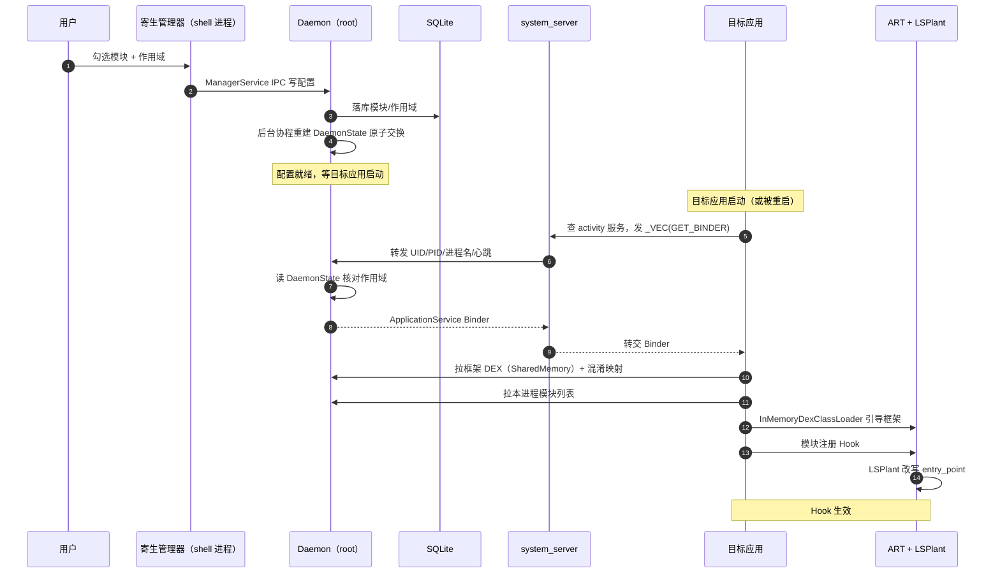
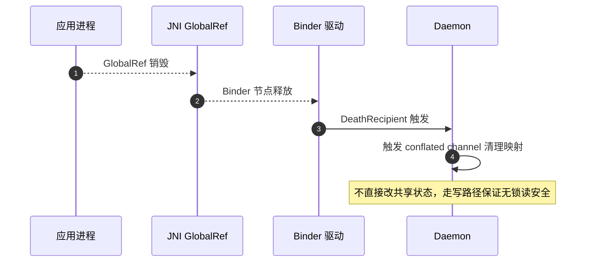

# 🔁 数据流总览

这一页用一个完整链路回答："用户在管理器里点了一下启用模块，到目标进程里 Hook 真正生效，中间数据走了哪些路？"理解了这条链路，就理解了 Vector 各子系统如何串联。

## 全链路一图

## 阶段拆解

### 阶段 1：配置写入（低频，写路径）

用户操作经管理器到 Daemon 的 SQLite，再原子交换进不可变状态。

关键点：写路径串行化、去抖，不阻塞读路径。详见 [Daemon 并发模型](./concurrency)。

### 阶段 2：目标应用会合（每个应用启动时）

应用经 `system_server` 中转拿到 Daemon 的专用 Binder。

| 步骤 | 数据 | 通道 |
| :--- | :--- | :--- |
| 应用发 `GET_BINDER` | 进程名 + 心跳 BBinder | Binder（`_VEC` 事务码搭便车） |
| system_server 转发 | UID/PID/心跳 | Binder 转给 Daemon |
| Daemon 核对作用域 | 读 DaemonState | 内存读，无锁 |
| 返回 | ApplicationService Binder | 写回应用回复 parcel |

### 阶段 3：资产交付（内存加载）

应用用专用 Binder 拉取框架 DEX 与模块列表，全程内存。

同时拉取混淆映射，让 native 能定位随机化的入口类。详见 [类名混淆](./obfuscation) 与 [内存 ClassLoader](./loader)。

### 阶段 4：Hook 生效（ART 改写）

模块代码在应用进程内执行，调 Hook API，最终落到 LSPlant 改写方法入口点。

| 数据 | 流向 |
| :--- | :--- |
| 模块 Hook 注册 | Java → JNI → native HookBridge |
| entry_point 改写 | LSPlant 修改 ArtMethod 结构 |
| 内联抑制 | dex2oat 劫持 `--inline-max-code-units=0` |
| 已编译方法反优化 | VectorDeopter 逐回解释器 |

此后每次调用被 Hook 方法，先进入模块拦截逻辑。详见 [ART Hook 原理](../guide/art-hook) 与 [Xposed API 实现](./xposed)。

## 关键数据载体

| 载体 | 携带内容 | 为何这样设计 |
| :--- | :--- | :--- |
| `SharedMemory` FD | 框架 DEX | 跨进程零拷贝传递大块字节 |
| 序列化混淆字典 | 原名→随机名映射 | native 与 Kotlin 共用同一份定位 |
| 心跳 BBinder | 进程存活信号 | 借 Binder 死亡通知免轮询清理 |
| 不可变 DaemonState | 模块列表/作用域快照 | 读路径无锁 |
| 差分偏好 blob | 模块偏好变化 | 只传变化部分，IPC 开销恒定 |

## 反向数据流：进程死亡清理

进程退出时数据反向回流，触发清理。

详见 [进程生命周期与心跳](./lifecycle)。

## 小结

| 阶段 | 主角 | 关键机制 |
| :--- | :--- | :--- |
| 配置写入 | Daemon | 不可变状态 + 原子交换 |
| 应用会合 | system_server 中转 | Binder Trap + `_VEC` 搭便车 |
| 资产交付 | SharedMemory | 内存加载，ashmem 即时解除映射 |
| Hook 生效 | LSPlant + dex2oat | 入口点改写 + 禁内联 + 反优化 |
| 死亡清理 | 心跳 Binder | Binder 死亡通知免轮询 |

## 相关链接

- [启动与注入链路](./boot-flow) — 注入时序细节
- [IPC 与 Binder 中继](./ipc) — 通信机制
- [Daemon 守护进程](./daemon) — 配置与资产服务
- [Daemon 并发模型](./concurrency) — 读写分离
