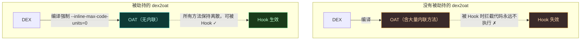
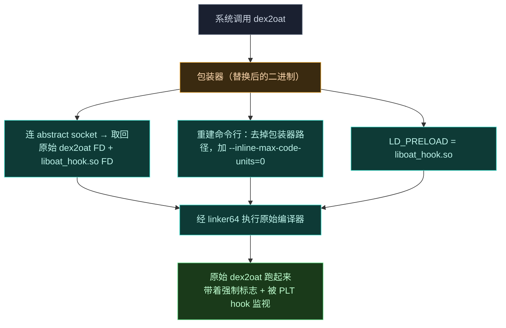
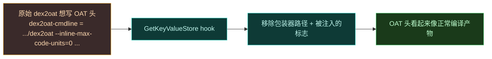

# dex2oat 编译劫持

`dex2oat` 是 Android 的 AOT（Ahead-of-Time）编译器，把 DEX 编译成 OAT。VectorDex2Oat 是一套针对它的包装与插桩工具，用于拦截编译过程、强制特定编译行为（特指禁止方法内联），并透明伪装生成的 OAT 元数据以隐藏包装器存在。

## 为什么必须劫持它

回顾 [ART Hook 原理](../guide/art-hook)：ART 会把短方法**内联**进调用者。一旦被内联，调用方直接执行内联的机器码，根本不查方法入口点——Hook 失效。

## 两个组件

| 组件 | 角色 |
| :--- | :--- |
| **dex2oat (Wrapper)** | 替换二进制，拦截执行，经 Unix socket 取得原始编译器，带强制标志执行它 |
| **liboat_hook.so (Hooker)** | 经 `LD_PRELOAD` 注入 `dex2oat` 进程，用 PLT hook 清洗 OAT 头的命令行元数据 |

## 关键特性

- **内联抑制**：向编译器参数追加 `--inline-max-code-units=0`，确保所有方法保持离散可 Hook。
- **基于 FD 的执行**：经系统 linker 用 `/proc/self/fd/` 路径执行原始 `dex2oat`，避免直接执行磁盘文件。
- **元数据伪装**：拦截 `art::OatHeader::ComputeChecksum` 或 `art::OatHeader::GetKeyValueStore`，从最终 `.oat` 文件移除包装器及其注入标志的痕迹。
- **Abstract Socket 通信**：用 Linux Abstract Namespace 的 Unix socket 在控制器与包装器间协调文件描述符传递。

## 架构

### 包装器 [dex2oat.cpp](https://github.com/android-security-engineer/Vector-skills/blob/master/dex2oat/src/main/cpp/dex2oat.cpp)

包装器充当编译器的"中间人"。被系统调用时：

1. 连接预定义 Unix socket（桩名 `5291374ceda0...` 在 Vector 安装时被替换）。
2. 识别目标架构（32 位 vs 64 位）与调试状态。
3. 接收原始 `dex2oat` 二进制和 `oat_hook` 库的文件描述符。
4. 重建命令行，用原始二进制路径替换包装器路径，并追加"no-inline"标志。
5. 清除 `LD_LIBRARY_PATH`，把 `LD_PRELOAD` 设为 hooker 库的 FD。
6. 调用动态链接器（`linker64`）执行编译器。

### Hooker [oat_hook.cpp](https://github.com/android-security-engineer/Vector-skills/blob/master/dex2oat/src/main/cpp/oat_hook.cpp)

hooker 库被预加载进编译器地址空间。它用 [LSPlt](https://github.com/JingMatrix/LSPlt) 库：

1. 扫描内存映射找到 `dex2oat` 二进制。
2. 定位并 hook 内部 ART 函数：
   - [`art::OatHeader::GetKeyValueStore`](https://cs.android.com/android/platform/superproject/+/android-latest-release:art/runtime/oat/oat.cc;l=366)
   - [`art::OatHeader::ComputeChecksum`](https://cs.android.com/android/platform/superproject/+/android-latest-release:art/runtime/oat/oat.cc;l=366)
3. 编译器尝试把 "dex2oat-cmdline" key 写入 OAT 头时，hooker 截获调用，解析 key-value store，移除包装器特有标志和路径。

这样最终生成的 `.oat` 文件里**没有任何包装器或强制标志的痕迹**——即便有人检查编译元数据也察觉不到异常。

## 全局挂载

要让替换后的编译器二进制对**所有新进程**可见，Daemon 会 fork 一个特权子进程，用 `setns` + `CLONE_NEWNS` 进入 init (PID 1) 的挂载命名空间，对 `/apex` 下的 `dex2oat`/`dex2oat64` 执行只读 bind mount。详见 [Daemon 守护进程](./daemon#aot-编译劫持)。
