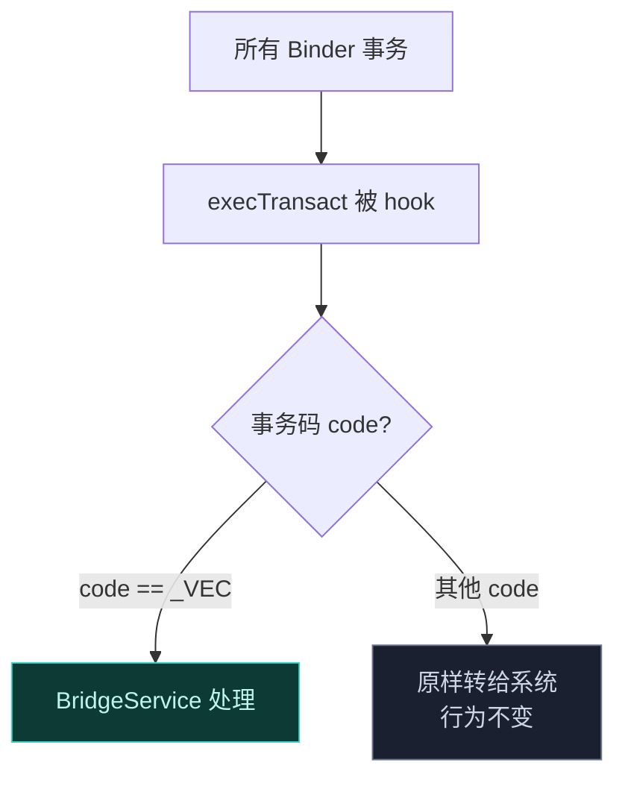
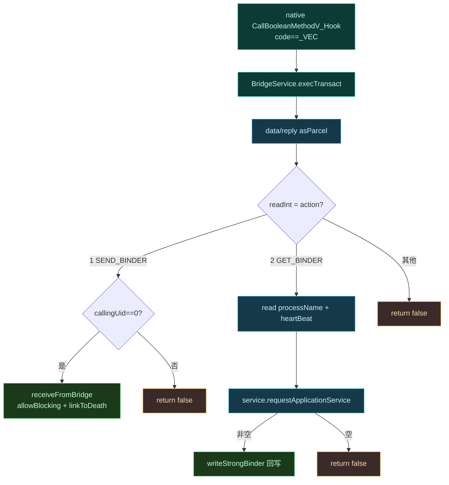
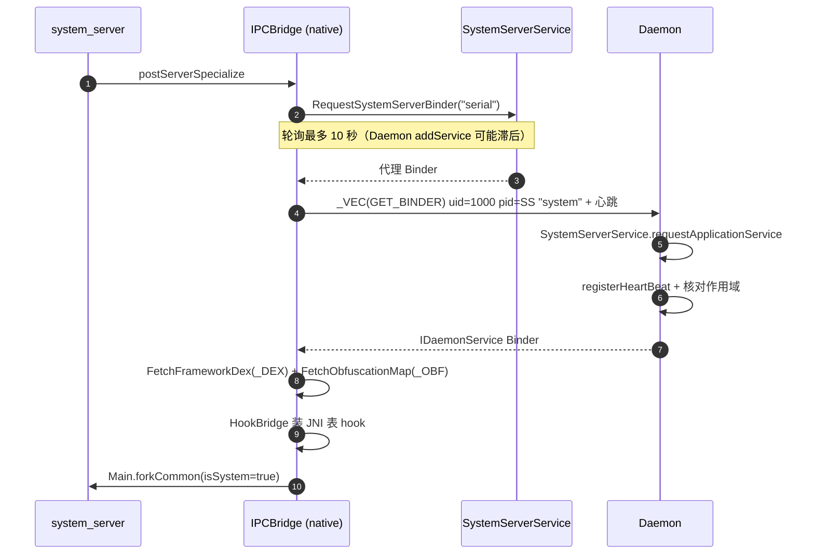
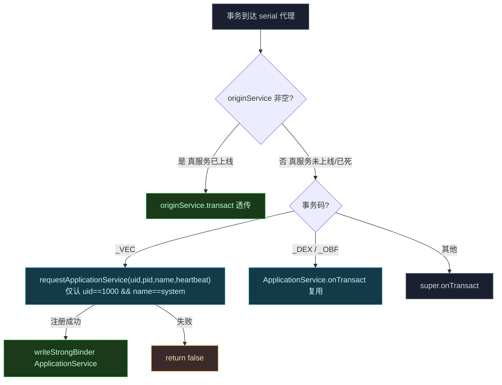
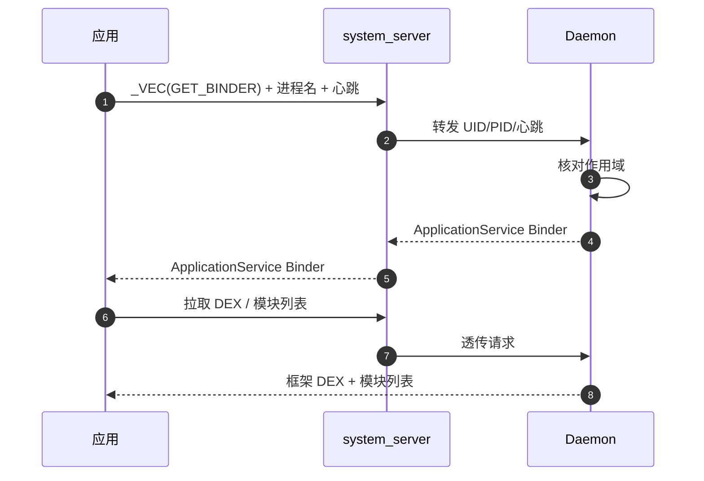
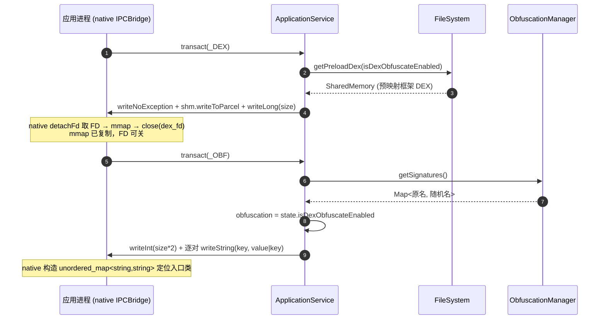
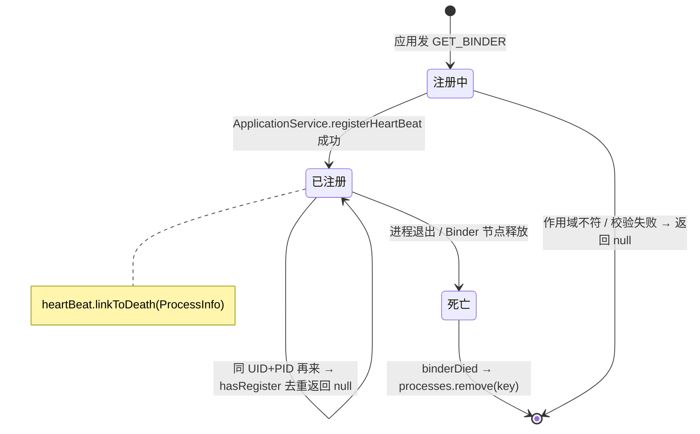
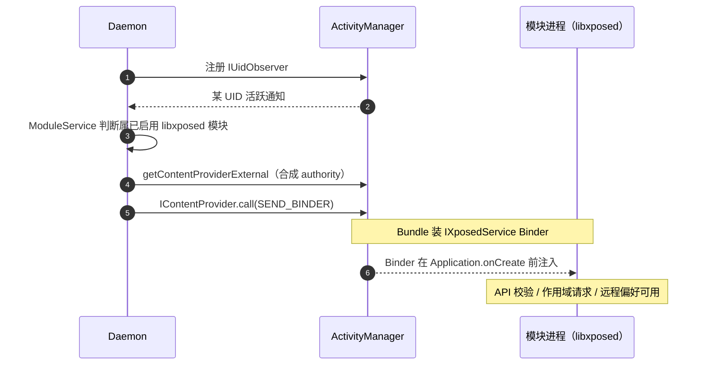
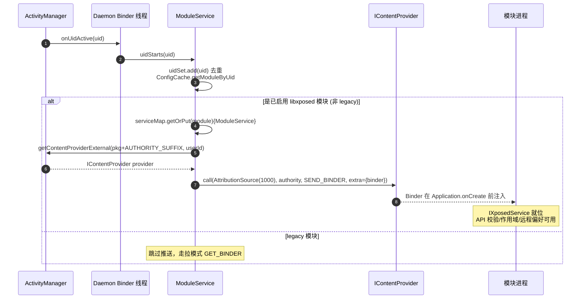
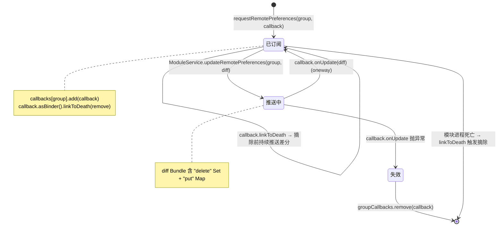

# IPC 与 Binder 中继

Vector 的进程间通信是它最隐蔽、也最精巧的部分。它要在不注册任何系统服务的前提下，让 root 守护进程、`system_server`、用户应用三者之间可靠传递 Binder 引用。

## 为什么不用标准 AIDL

标准 Android IPC 的做法是把 AIDL 服务注册进 `ServiceManager`，别人按名字查询。但 `ServiceManager` 里的服务是**可枚举**的——任何进程都能 `service list` 看到它。对反作弊来说，发现一个陌生的 Hook 框架服务几乎是零成本。

```mermaid
graph TD
    subgraph 标准方式["标准方式：注册服务"]
        D1["Daemon"] -->|注册 "vector" 服务| SM["ServiceManager"]
        AC["反作弊"] -->|listServices| SM
        SM -.被发现 ✗.-> AC
    end
    subgraph Vector["Vector：不注册任何服务"]
        V1["hook Binder.execTransact"] -->|只认 _VEC 码| V2["系统视角：什么都没发生 ✓"]
    end
    style SM fill:#3a2a2a,stroke:#e8a838,color:#ffd9b0
    style V2 fill:#0e3a36,stroke:#3dd8c8,color:#bff5ec
```

## JNI Binder Trap

这是整个 IPC 的基石。在 `ipc_bridge.cpp` 里，Vector 用 ART 内部函数 `SetTableOverride` 替换了 JNI 函数 `CallBooleanMethodV`。

这个替换拦截了**系统范围**所有对 `android.os.Binder.execTransact` 的 native 调用——也就是所有 Binder 事务的入口。Hook 会检查事务码：

- 匹配常量 `kBridgeTransactionCode`（即 `_VEC`）：劫持到 Kotlin 静态方法 `BridgeService.execTransact`。
- 其他事务码：原样放行给 Android 框架，行为不变。



这意味着 Vector 借用了系统已有的 Binder 通道（比如对 `activity`、`serial` 服务的调用），在自己的事务码上"搭便车"，而不需要新建任何可被发现的服务。

### 事务码与动作码一览

三套事务码都用 4 字符移位编码，看起来像随机整数，避开标准 Binder 的 interface descriptor 校验。在 [ApplicationService.kt](https://github.com/android-security-engineer/Vector-skills/blob/master/daemon/src/main/kotlin/org/matrix/vector/daemon/ipc/ApplicationService.kt) 与 [ipc_bridge.cpp](https://github.com/android-security-engineer/Vector-skills/blob/master/zygisk/src/main/cpp/ipc_bridge.cpp) 中定义为同名常量：

| 常量 | 编码 | 方向 | 携带内容 |
| :--- | :--- | :--- | :--- |
| `BRIDGE_TRANSACTION_CODE`（`_VEC`） | `('_'<<24)\|('V'<<16)\|('E'<<8)\|'C'` | 双向 | 控制平面：首字节是动作码 |
| `DEX_TRANSACTION_CODE`（`_DEX`） | `('_'<<24)\|('D'<<16)\|('E'<<8)\|'X'` | Daemon→进程 | 框架 DEX（`SharedMemory` + size） |
| `OBFUSCATION_MAP_TRANSACTION_CODE`（`_OBF`） | `('_'<<24)\|('O'<<16)\|('B'<<8)\|'F'` | Daemon→进程 | 混淆字典（成对字符串） |

`_VEC` 事务的 data parcel 首个 int 是动作码。在 [BridgeService.kt](https://github.com/android-security-engineer/Vector-skills/blob/master/zygisk/src/main/kotlin/org/matrix/vector/service/BridgeService.kt) 中用枚举定义：

| 动作码 | 名称 | 含义 | 调用方 |
| :--- | :--- | :--- | :--- |
| `1` | `SEND_BINDER` | Daemon 把主 `IDaemonService` Binder 推给 system_server | Daemon（UID 0） |
| `2` | `GET_BINDER` | 进程请求自己的 `ILSPApplicationService` | 应用 / system_server |

> [!TIP]
> native 侧的 `kActionGetBinder = 2` 见 [ipc_bridge.cpp](https://github.com/android-security-engineer/Vector-skills/blob/master/zygisk/src/main/cpp/ipc_bridge.cpp) 第 94 行常量段；`kBridgeTransactionCode` / `kDexTransactionCode` / `kObfuscationMapTransactionCode` 在同文件第 89-91 行。Daemon 侧的 `ACTION_SEND_BINDER = 1` 见 [VectorDaemon.kt](https://github.com/android-security-engineer/Vector-skills/blob/master/daemon/src/main/kotlin/org/matrix/vector/daemon/VectorDaemon.kt) 第 35 行。两侧靠数值对齐，不共享 AIDL。

### BridgeService.execTransact 的处理路径

[BridgeService.kt](https://github.com/android-security-engineer/Vector-skills/blob/master/zygisk/src/main/kotlin/org/matrix/vector/service/BridgeService.kt) 的 `execTransact` 是 native hook 的 Java 落点。它先把 native 传来的 `dataObj`/`replyObj` 长指针 `asParcel()` 成 `Parcel`，读首个 int 取动作码，再分流：

| 动作码 | 调用方校验 | 处理 |
| :--- | :--- | :--- |
| `SEND_BINDER` | `Binder.getCallingUid() == 0`（只认 root） | `receiveFromBridge(data.readStrongBinder())`：`Binder_allowBlocking` 后存进 `@Volatile serviceBinder`，`asInterface` 成 `IDaemonService`，挂 `serviceRecipient` 死亡监听，再 `dispatchSystemServerContext` 回传 `IApplicationThread` + activity token |
| `GET_BINDER` | 无 uid 校验（任意调用方） | 读 `processName` + `heartBeat`，调 `service.requestApplicationService(callingUid, callingPid, processName, heartBeat)`，返回非空则 `writeStrongBinder` 写回 |
| 其他 | — | 返回 `false`，交给系统 |

异常路径有个细节：若 `execTransact` 抛异常且事务**非 oneway**（`flags & FLAG_ONEWAY == 0`），会把异常 `writeException` 进 reply parcel 回传给调用方；oneway 事务则只记日志。`data`/`reply` parcel 在 `finally` 里 `recycle`，避免泄漏 native parcel 内存。



### JNI 表替换为何是进程级的

`SetTableOverride` 是 ART 内部 `JNIEnvExt` 的函数，它把当前进程的 JNI 函数表指针整体换掉。Vector 复制原表、只改 `CallBooleanMethodV` 一项为 `CallBooleanMethodV_Hook`，再原子交换。这样**所有线程**此后调 `CallBooleanMethodV` 都走 hook，但其它 JNI 入口完全不变——开销与侵入面都压到最小。

hook 内部还做了一次"短路优化"：用 `BinderCaller` 解析 libbinder 的 `IPCThreadState::selfOrNull/getCallingPid/getCallingUid`（mangled 符号见 [ipc_bridge.cpp](https://github.com/android-security-engineer/Vector-skills/blob/master/zygisk/src/main/cpp/ipc_bridge.cpp) 的 `BinderCaller::Initialize`），拼成 64 位 caller id。若上一次该 caller 被 `BridgeService` 拒绝（`execTransact` 返回 false），就记进 `g_last_failed_id` 原子量，下次直接放行给原函数——避免对无关 caller 反复进 Java 层空跑。

## 两阶段 Binder 中继

### 三进程 Binder 拓扑

整个 IPC 体系横跨三个进程，靠"借道"系统既有 Binder 通道传递 Vector 自己的事务：

```text
       ┌─────────────────────────── root 命名空间 ───────────────────────────┐
       │                                                                      │
       │   ┌─────────────── Daemon (app_process, root) ───────────────┐      │
       │   │  VectorService : IDaemonService                            │      │
       │   │  SystemServerService : ILSPSystemServerService (占位 serial)│     │
       │   │  ApplicationService : ILSPApplicationService               │      │
       │   │  ManagerService : ILSPManagerService                       │      │
       │   │  ModuleService    : IXposedService (推给模块进程)            │     │
       │   └───────────────┬───────────────────────────┬────────────────┘      │
       │                   │ 1.占位 serial 服务         │ 2._VEC(SEND_BINDER)   │
       │                   │ (ServiceManager.addService)│ (经 activity 服务)    │
       │                   ▼                            ▼                       │
       │  ┌──────── system_server (UID 1000) ─────────────────────┐           │
       │  │  BridgeService.execTransact (JNI 表 hook 入口)          │           │
       │  │  ├─ SEND_BINDER → 缓存 IDaemonService + 死亡监听         │           │
       │  │  └─ GET_BINDER  → 转发给 Daemon.requestApplicationService│          │
       │  │  ParasiticManagerSystemHooker (resolveActivity 重定向)   │           │
       │  └───────────────────────┬────────────────────────────────┘           │
       │                          │ 3._VEC(GET_BINDER) + 进程名 + 心跳           │
       │                          ▼                                            │
       │  ┌──────── 目标应用 / 模块进程 (各 UID) ───────────────┐              │
       │  │  IPCBridge (native): RequestAppBinder / FetchDex      │             │
       │  │  心跳 BBinder (GlobalRef 保活) → DeathRecipient       │             │
       │  │  InMemoryDexClassLoader ← SharedMemory FD              │            │
       │  └───────────────────────────────────────────────────────┘             │
       │                                                                      │
       └──────────────────────────────────────────────────────────────────────┘
                          ↑ 所有事务都搭便车于系统既有 Binder 通道，
                            不向 ServiceManager 注册任何 Vector 服务
```

> [!TIP]
> Daemon 用 `Os.seteuid(0)` 完成事务后再回落 `seteuid(1000)`，把 root 暴露面压到事务窗口内。见 [VectorDaemon.kt](https://github.com/android-security-engineer/Vector-skills/blob/master/daemon/src/main/kotlin/org/matrix/vector/daemon/VectorDaemon.kt) 的 `sendToBridge`。

### 阶段 1：Daemon 把主 Binder 交给 system_server

`system_server` 是天然的中介。Daemon 在开机时主动联系它：

1. `system_server` 的 Zygisk 模块查询 `serial` 服务（或 `serial_vector`）作为临时会合点。
2. 发 `_VEC` 事务拉取临时 Binder，用它取框架 DEX FD 和混淆映射。
3. 安装 Binder Trap，引导 Kotlin 层。
4. **同时**，Daemon 直接向 `system_server` 发起一个 Binder 事务。Trap 截获，`BridgeService` 处理 `SEND_BINDER` 动作，**保存 Daemon 的主 `IDaemonService` Binder**，并回传 `system_server` 上下文、链接 `DeathRecipient`。

从此 `system_server` 持有了 Daemon 的主 Binder。

### system_server 引导时序

`system_server` 的引导在 [module.cpp](https://github.com/android-security-engineer/Vector-skills/blob/master/zygisk/src/main/cpp/module.cpp) 的 `postServerSpecialize` 完成。它先经 `serial` 代理服务拿到临时会合点，再经 `_VEC(GET_BINDER)` 向 Daemon 取主 Binder，最后才装 JNI 表 hook：



> [!TIP]
> `SystemServerService.registerProxyService` 在 [SystemServerService.kt](https://github.com/android-security-engineer/Vector-skills/blob/master/daemon/src/main/kotlin/org/matrix/vector/daemon/ipc/SystemServerService.kt) 里用 `IServiceCallback` 监听同名真服务注册——真 `serial` 一上线就被捕获、暂存进 `originService`，此后非 `_VEC` 事务原样转发给真服务，保证系统无感知。

`SystemServerService.onTransact` 的路由优先级很关键：先查 `originService` 是否非空（真 serial 已注册且存活），非空则**所有**事务 `originService.transact(...)` 透传——Vector 的代理只在真服务还没上线时短暂接管。真服务上线后走 `binderDied`→`unlinkToDeath`→`originService=null` 的清理；只有 Vector 自己的 `_VEC`/`_DEX`/`_OBF` 三种事务码会落到自身分支处理：

| 事务码 | 处理 |
| :--- | :--- |
| `_VEC`（BRIDGE_TRANSACTION_CODE） | 读 `uid`/`pid`/`processName`/`heartBeat`，调 `requestApplicationService`（固定只认 `uid==1000 && processName=="system"`），成功写回 `ApplicationService` Binder |
| `_DEX` / `_OBF` | 直接 `ApplicationService.onTransact(code, ...)` 复用同一套 DEX/混淆映射投递逻辑 |
| 其他 | `super.onTransact`（走 AIDL 默认分发） |



### 阶段 2：应用通过 system_server 中转到 Daemon

应用不直接认识 Daemon，它只跟 `system_server` 里的 `activity` 服务说话：

1. 应用在 `postAppSpecialize` 查询 `activity` 服务。
2. 发 `_VEC` 事务，动作 `GET_BINDER`，附带进程名 + 新分配的心跳 `BBinder`。
3. `system_server` 内的 Trap **在 Activity Manager 处理之前**截获这个事务。
4. `system_server` 的 `BridgeService` 用阶段 1 拿到的 Daemon Binder，把应用的 UID/PID/心跳转发给 Daemon。
5. Daemon 评估作用域。批准则生成 `ApplicationService` Binder，经 `system_server` 写回应用的回复 parcel。
6. 应用用这个专用 Binder 拉取框架 DEX 和混淆映射。



> [!TIP]
> Daemon 侧 [VectorService.kt](https://github.com/android-security-engineer/Vector-skills/blob/master/daemon/src/main/kotlin/org/matrix/vector/daemon/VectorService.kt) 的 `requestApplicationService` 先校验 `Binder.getCallingUid() == 1000`（只认 system_server 转发），再查 `ApplicationService.hasRegister` 去重、调 `ConfigCache.shouldSkipProcess` 核对作用域。`system_server` 自身的请求走 [SystemServerService.kt](https://github.com/android-security-engineer/Vector-skills/blob/master/daemon/src/main/kotlin/org/matrix/vector/daemon/ipc/SystemServerService.kt) 的 `onTransact`，固定只接受 `uid==1000 && processName=="system"`。

### ApplicationService 的事务码与 parcel 布局

`ApplicationService` 本身是 `ILSPApplicationService.Stub`，但 DEX/混淆映射投递不走 AIDL 方法，而是直接重写 `onTransact` 拦截两个自定义事务码。布局由 [ApplicationService.kt](https://github.com/android-security-engineer/Vector-skills/blob/master/daemon/src/main/kotlin/org/matrix/vector/daemon/ipc/ApplicationService.kt) 定义：

| 事务码 | reply parcel 布局 | 说明 |
| :--- | :--- | :--- |
| `DEX_TRANSACTION_CODE`（`_DEX`） | `writeNoException()` → `SharedMemory.writeToParcel` → `writeLong(shm.size)` | `FileSystem.getPreloadDex(isDexObfuscateEnabled)` 返回预映射的 `SharedMemory`，size 单独写一个 long 给 native 端校验 |
| `OBFUSCATION_MAP_TRANSACTION_CODE`（`_OBF`） | `writeNoException()` → `writeInt(signatures.size * 2)` → 逐对 `writeString(key)` / `writeString(value 或 key)` | 成对写：混淆开启写 `key→value`（原名→随机名），关闭写 `key→key`（native 侧无需分支判断） |



> [!TIP]
> `requestInjectedManagerBinder` 走的是标准 AIDL 方法而非自定义事务码：先 `ensureRegistered()` 校验调用方已注册心跳，再 `InstallerVerifier.verifyInstallerSignature` 验管理器 APK 签名，通过后 `binderList.add(ManagerService binder)` 并返回管理器 APK 的只读 `ParcelFileDescriptor`。寄生管理器靠这个 FD 拿到 APK 装载自身。

### 心跳 Binder 的生命周期

每个被批准的进程都会向 Daemon 注册一个 `BBinder` 心跳。它是进程存活信号——进程一死，Binder 驱动下发 `binderDied`，Daemon 立即清理跟踪映射。状态机：



## 主动推送：libxposed 模块的注入

上面是"应用请求访问"的拉模式。但对**现代 libxposed 模块**，Daemon 走的是**推模式**——在模块进程的 `Application.onCreate` 之前，主动把 API Binder 塞进去。

1. Daemon 向 Activity Manager 注册 `IUidObserver`，监控进程生命周期。
2. 某 UID 活跃时，`ModuleService` 检查它是否属于已启用的 libxposed 模块。
3. 若是，Daemon 调 `IActivityManager.getContentProviderExternal`，目标是按模块包名构造的**合成 authority**。
4. 执行 `IContentProvider.call`，动作 `SEND_BINDER`，Bundle 里装着 `IXposedService` Binder。
5. Binder 在 `Application.onCreate` 之前就被注入模块进程，提供 API 校验、作用域请求、远程偏好访问。



> [!TIP]
> 合成 authority = `模块包名 + AUTHORITY_SUFFIX`，见 [ModuleService.kt](https://github.com/android-security-engineer/Vector-skills/blob/master/daemon/src/main/kotlin/org/matrix/vector/daemon/ipc/ModuleService.kt) 的 `sendBinder`。`IContentProvider.call` 的调用签名按 SDK 分支适配：

| SDK | `IContentProvider.call` 签名 | AttributionSource |
| :--- | :--- | :--- |
| Android S+（API 31+） | `call(AttributionSource, authority, "android" 域, SEND_BINDER, null, extra)` | `AttributionSource.Builder(1000).setPackageName("android")` 伪造 |
| Android R（API 30） | `call("android", null, authority, SEND_BINDER, null, extra)` | 字符串包名 |
| Android Q（API 29） | `call("android", authority, SEND_BINDER, null, extra)` | — |
| Android Q 以下 | `call("android", SEND_BINDER, null, extra)` | — |

Bundle 里 `putBinder("binder", asBinder())` 装 `IXposedService`。`uidStarts` 用 `ConcurrentHashMap.newKeySet` 去重，`WeakHashMap<Module, ModuleService>` 缓存每个模块的服务实例——模块对象被 GC 时服务自动随之释放。`getFrameworkProperties` 返回的 capability 位带 `PROP_CAP_SYSTEM`/`PROP_CAP_REMOTE`，`isDexObfuscateEnabled` 开启时再或上 `PROP_RT_API_PROTECTION`。

### ContentProvider 推送的时序与线程

推模式发生在 Daemon 的 Binder 线程上（`IUidObserver.onUidActive` 回调），全程不阻塞——`getContentProviderExternal` 拿到的 `IContentProvider` 是系统侧缓存句柄，`call` 是单向投递，模块进程的 `Application.onCreate` 还没跑，Binder 已在进程内就位：



### 远程偏好的差分回调

`IXposedService` 推送的 Binder 同时承载远程偏好。模块调 `requestRemotePreferences(group, callback)` 时，[InjectedModuleService.kt](https://github.com/android-security-engineer/Vector-skills/blob/master/daemon/src/main/kotlin/org/matrix/vector/daemon/ipc/InjectedModuleService.kt) 一次性返回当前全量偏好（`Bundle.putSerializable("map", ...)`），并登记 `IRemotePreferenceCallback`；此后偏好变更只推差分 Bundle。回调容器是 `ConcurrentHashMap<String, MutableSet<IRemotePreferenceCallback>>`（按 group 分桶，每组 `ConcurrentHashMap.newKeySet`），回调自身也挂死亡监听，模块一死自动从回调集合摘除：



> [!TIP]
> `IRemotePreferenceCallback.onUpdate` 是 `oneway` 调用，不阻塞 Daemon 的 Binder 线程。差分 Bundle 的结构由 [ModuleService.kt](https://github.com/android-security-engineer/Vector-skills/blob/master/daemon/src/main/kotlin/org/matrix/vector/daemon/ipc/ModuleService.kt) 的 `updateRemotePreferences` 定义：`diff.getSerializable("delete")` 是要删的 key 集合（`Set<*>`，值为 null），`diff.getSerializable("put")` 是要写的新值映射（`Map<*,*>`）。落库走 [PreferenceStore](https://github.com/android-security-engineer/Vector-skills/blob/master/daemon/src/main/kotlin/org/matrix/vector/daemon/data/PreferenceStore.kt) 的 `updateModulePrefs`，整批 diff 包在 `beginTransaction`/`setTransactionSuccessful`/`endTransaction` 事务里——`Serializable` 值走 `CONFLICT_REPLACE` upsert，null 值走 `db.delete`。

## 小结

| 机制 | 解决的问题 |
| :--- | :--- |
| JNI Binder Trap（hook `execTransact`） | 不注册服务就能截获特定事务 |
| `_VEC` 事务码 | 在公共 Binder 通道上搭便车，系统无感知 |
| 两阶段中继 | 通过 `system_server` 中介，Daemon 与应用解耦 |
| 心跳 Binder + DeathRecipient | 进程死亡即清理，无需轮询 |
| ContentProvider 推送 | libxposed 模块的 Binder 在 onCreate 前就位 |

## AIDL 接口速查

Vector 的 Binder 接口定义在 [services/daemon-service/src/main/aidl/](https://github.com/android-security-engineer/Vector-skills/blob/master/services/daemon-service/src/main/aidl/org/lsposed/lspd/service/) 下，但**全程不经 ServiceManager 注册**——它们仅作为 parcel 编解码契约，由上面的 Binder Trap 通道承载：

| 接口 | 关键方法 | 承载通道 |
| :--- | :--- | :--- |
| [`IDaemonService`](https://github.com/android-security-engineer/Vector-skills/blob/master/services/daemon-service/src/main/aidl/org/lsposed/lspd/service/IDaemonService.aidl) | `requestApplicationService` / `dispatchSystemServerContext` / `preStartManager` | Daemon 主 Binder（经 `SEND_BINDER` 投递） |
| [`ILSPSystemServerService`](https://github.com/android-security-engineer/Vector-skills/blob/master/services/daemon-service/src/main/aidl/org/lsposed/lspd/service/ILSPSystemServerService.aidl) | `requestApplicationService` | `serial` 代理服务（system_server 引导期） |
| [`ILSPApplicationService`](https://github.com/android-security-engineer/Vector-skills/blob/master/services/daemon-service/src/main/aidl/org/lsposed/lspd/service/ILSPApplicationService.aidl) | `getModulesList` / `getLegacyModulesList` / `getPrefsPath` / `requestInjectedManagerBinder` | per 进程 Binder（`GET_BINDER` 返回） |
| [`ILSPInjectedModuleService`](https://github.com/android-security-engineer/Vector-skills/blob/master/services/daemon-service/src/main/aidl/org/lsposed/lspd/service/ILSPInjectedModuleService.aidl) | `getFrameworkProperties` / `requestRemotePreferences` / `openRemoteFile` | libxposed 模块的 `IXposedService` 包装 |
| [`IRemotePreferenceCallback`](https://github.com/android-security-engineer/Vector-skills/blob/master/services/daemon-service/src/main/aidl/org/lsposed/lspd/service/IRemotePreferenceCallback.aidl) | `oneway onUpdate(Bundle)` | Daemon→模块差分偏好推送 |

详细的 Daemon 侧实现见 [Daemon 守护进程](./daemon)，native 侧的 Trap 实现见 [Zygisk 模块](./zygisk)。
