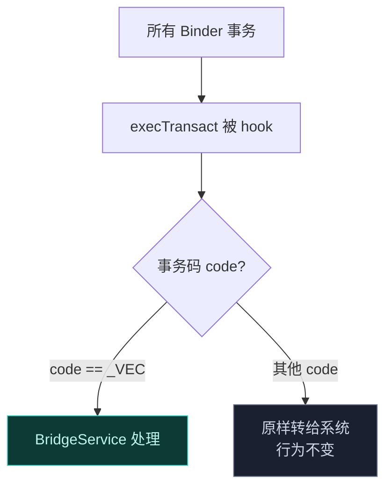
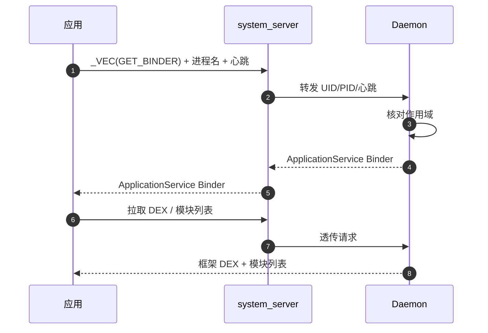
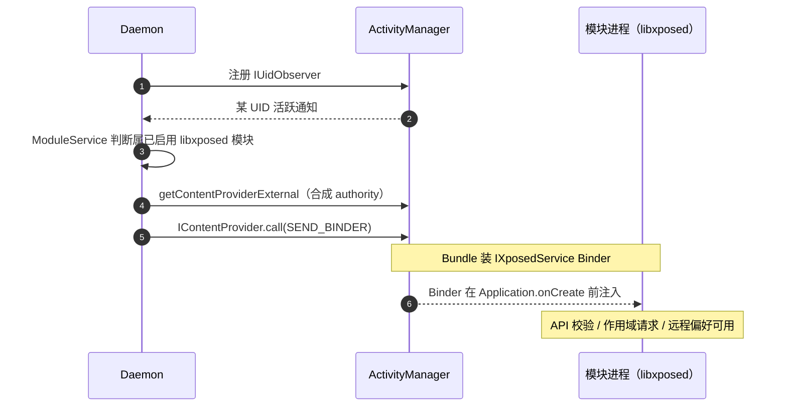

# IPC 与 Binder 中继

Vector 的进程间通信是它最隐蔽、也最精巧的部分。它要在不注册任何系统服务的前提下，让 root 守护进程、`system_server`、用户应用三者之间可靠传递 Binder 引用。

## 为什么不用标准 AIDL

标准 Android IPC 的做法是把 AIDL 服务注册进 `ServiceManager`，别人按名字查询。但 `ServiceManager` 里的服务是**可枚举**的——任何进程都能 `service list` 看到它。对反作弊来说，发现一个陌生的 Hook 框架服务几乎是零成本。

```mermaid
graph TD
    subgraph 标准方式["标准方式：注册服务"]
        D1["Daemon"] -->|注册 "vector" 服务| SM["ServiceManager"]
        AC["反作弊"] -->|listServices| SM
        SM -.被发现 ✗.-> AC
    end
    subgraph Vector["Vector：不注册任何服务"]
        V1["hook Binder.execTransact"] -->|只认 _VEC 码| V2["系统视角：什么都没发生 ✓"]
    end
    style SM fill:#3a2a2a,stroke:#e8a838,color:#ffd9b0
    style V2 fill:#0e3a36,stroke:#3dd8c8,color:#bff5ec
```

## JNI Binder Trap

这是整个 IPC 的基石。在 `ipc_bridge.cpp` 里，Vector 用 ART 内部函数 `SetTableOverride` 替换了 JNI 函数 `CallBooleanMethodV`。

这个替换拦截了**系统范围**所有对 `android.os.Binder.execTransact` 的 native 调用——也就是所有 Binder 事务的入口。Hook 会检查事务码：

- 匹配常量 `kBridgeTransactionCode`（即 `_VEC`）：劫持到 Kotlin 静态方法 `BridgeService.execTransact`。
- 其他事务码：原样放行给 Android 框架，行为不变。



这意味着 Vector 借用了系统已有的 Binder 通道（比如对 `activity`、`serial` 服务的调用），在自己的事务码上"搭便车"，而不需要新建任何可被发现的服务。

## 两阶段 Binder 中继

### 阶段 1：Daemon 把主 Binder 交给 system_server

`system_server` 是天然的中介。Daemon 在开机时主动联系它：

1. `system_server` 的 Zygisk 模块查询 `serial` 服务（或 `serial_vector`）作为临时会合点。
2. 发 `_VEC` 事务拉取临时 Binder，用它取框架 DEX FD 和混淆映射。
3. 安装 Binder Trap，引导 Kotlin 层。
4. **同时**，Daemon 直接向 `system_server` 发起一个 Binder 事务。Trap 截获，`BridgeService` 处理 `SEND_BINDER` 动作，**保存 Daemon 的主 `IDaemonService` Binder**，并回传 `system_server` 上下文、链接 `DeathRecipient`。

从此 `system_server` 持有了 Daemon 的主 Binder。

### 阶段 2：应用通过 system_server 中转到 Daemon

应用不直接认识 Daemon，它只跟 `system_server` 里的 `activity` 服务说话：

1. 应用在 `postAppSpecialize` 查询 `activity` 服务。
2. 发 `_VEC` 事务，动作 `GET_BINDER`，附带进程名 + 新分配的心跳 `BBinder`。
3. `system_server` 内的 Trap **在 Activity Manager 处理之前**截获这个事务。
4. `system_server` 的 `BridgeService` 用阶段 1 拿到的 Daemon Binder，把应用的 UID/PID/心跳转发给 Daemon。
5. Daemon 评估作用域。批准则生成 `ApplicationService` Binder，经 `system_server` 写回应用的回复 parcel。
6. 应用用这个专用 Binder 拉取框架 DEX 和混淆映射。



## 主动推送：libxposed 模块的注入

上面是"应用请求访问"的拉模式。但对**现代 libxposed 模块**，Daemon 走的是**推模式**——在模块进程的 `Application.onCreate` 之前，主动把 API Binder 塞进去。

1. Daemon 向 Activity Manager 注册 `IUidObserver`，监控进程生命周期。
2. 某 UID 活跃时，`ModuleService` 检查它是否属于已启用的 libxposed 模块。
3. 若是，Daemon 调 `IActivityManager.getContentProviderExternal`，目标是按模块包名构造的**合成 authority**。
4. 执行 `IContentProvider.call`，动作 `SEND_BINDER`，Bundle 里装着 `IXposedService` Binder。
5. Binder 在 `Application.onCreate` 执行前就被注入模块进程，提供 API 校验、作用域请求、远程偏好访问。



## 小结

| 机制 | 解决的问题 |
| :--- | :--- |
| JNI Binder Trap（hook `execTransact`） | 不注册服务就能截获特定事务 |
| `_VEC` 事务码 | 在公共 Binder 通道上搭便车，系统无感知 |
| 两阶段中继 | 通过 `system_server` 中介，Daemon 与应用解耦 |
| 心跳 Binder + DeathRecipient | 进程死亡即清理，无需轮询 |
| ContentProvider 推送 | libxposed 模块的 Binder 在 onCreate 前就位 |

详细的 Daemon 侧实现见 [Daemon 守护进程](./daemon)，native 侧的 Trap 实现见 [Zygisk 模块](./zygisk)。
