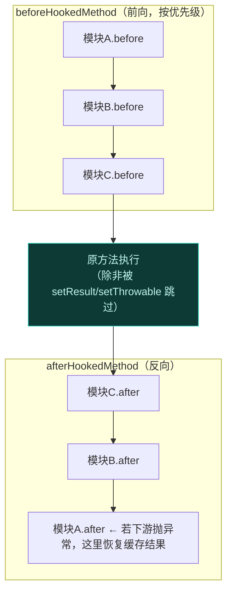
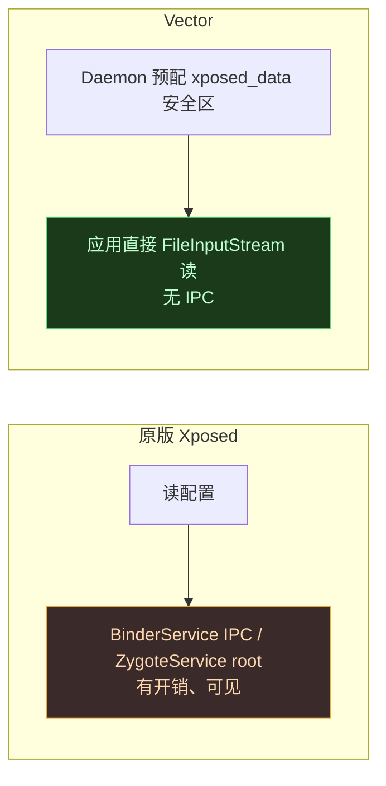

# Legacy 兼容层

`legacy` 子系统提供向后兼容层，实现经典 `de.robv.android.xposed` API 命名空间，同时把执行路由到现代 native ART hook 引擎。它让大量存量 Xposed 模块无需改动即可运行。

## 模块拓扑与边界

legacy 兼容子系统跨越多个编译边界，强制 API 表面、Dalvik/ART 运行时与 native 执行环境之间的严格分离。

| 边界 | 职责 |
| :--- | :--- |
| [legacy](https://github.com/android-security-engineer/Vector-skills/tree/master/legacy) | Java API 表面 (`de.robv.android.xposed.*`)、状态翻译处理器 (`LegacyDelegateImpl`)、反射缓存、资源/共享偏好覆盖 |
| [xposed](./xposed) | 隔离 classloader (`VectorModuleClassLoader`)、AOT 反优化器 (`VectorDeopter`)、依赖注入框架 |
| [native](./native) | JNI 桥 (`hook_bridge.cpp`、`resources_hook.cpp`)、并发 hook registry、栈分配调用逻辑、内存 DEX 生成、二进制 XML 突变 |
| [daemon](./daemon) | 进程外提权运作，预配 SELinux 宽松目录、管理跨进程文件共享的文件系统上下文 |

## 依赖注入与引导

进程启动时，`zygisk` 模块里的 `Startup.initXposed` 被调用。此例程建立 DI 契约：实例化 `LegacyDelegateImpl` 并经 `VectorBootstrap.INSTANCE.init()` 注入 `xposed` 模块。

`LegacyDelegateImpl` 满足 `LegacyFrameworkDelegate` 接口，作为以下功能的唯一翻译边界：

- 应用包加载事件 (`onPackageLoaded`)
- 系统服务器初始化 (`onSystemServerLoaded`)
- native hook 执行路由 (`processLegacyHook`)
- 资源目录跟踪 (`setPackageNameForResDir`)

## 模块初始化

legacy 模块在初始化阶段经 `XposedInit.loadLegacyModules()` 加载。框架查询 Daemon (`VectorServiceClient.INSTANCE.getLegacyModulesList()`) 取得已启用 APK 路径列表。

模块**不**用标准 Android 机制加载。为防 `ClassLoader.getParent()` 链式反射检测并消除残余文件描述符，`XposedInit.loadModule` 用 `VectorModuleClassLoader` 把模块 APK **直接加载进内存**，把模块执行环境与宿主应用 classpath 隔离。

映射进内存后，框架解析 APK 内两个特定清单文件初始化 Java 与 native 执行 hook：

### 1. `assets/xposed_init`

定义 Java 入口类，经 `VectorModuleClassLoader` 加载并检查 `IXposedMod` 实现，注册到内部回调数组：

- `IXposedHookZygoteInit`：立即调用，带含模块路径与 system_server 状态的 `StartupParam`。
- `IXposedHookLoadPackage`：包进 `IXposedHookLoadPackage.Wrapper`，追加到 `XposedBridge.sLoadedPackageCallbacks` 数组。
- `IXposedHookInitPackageResources`：追加到 `XposedBridge.sInitPackageResourcesCallbacks` 数组，随后经 `XposedInit.hookResources()` 触发 native 资源 hook 子系统。

### 2. `assets/native_init`

定义作为 [native hooking 模块](https://github.com/LSPosed/LSPosed/wiki/Native-Hook) 的 native 库文件名。这些名字经 `NativeAPI::recordNativeEntrypoint` 注册，在动态链接过程中被拦截。`native` 模块为 native 模块提供经 [native_api_bridge.cpp](https://github.com/android-security-engineer/Vector-skills/blob/master/native/src/jni/native_api_bridge.cpp) 进行 inline hook 的基础设施，无需直接访问框架核心符号。

## 生命周期事件翻译

`xposed` 模块管理 Android 生命周期事件（如 `LoadedApk.createOrUpdateClassLoaderLocked`），向 `LegacyDelegateImpl` 派发 `LegacyPackageInfo` payload。

`LegacyDelegateImpl.onPackageLoaded` 把现代 payload 翻译成经典 Xposed 格式。它构造 `XC_LoadPackage.LoadPackageParam`，映射字段：`packageName`、`processName`、`classLoader`、`appInfo`、`isFirstApplication`。填充后的参数对象传给 `XC_LoadPackage.callAll`，后者遍历 `sLoadedPackageCallbacks` 数组执行已注册模块回调。

`system_server` 是独特的生命周期边界情况。`LegacyDelegateImpl.onSystemServerLoaded` 手动把 `android` 注册进 `loadedPackagesInProcess` 集合，并构造一个进程名硬编码为 `system_server` 的 `LoadPackageParam`。

## 执行路由与方法 Hook

方法 hook 生命周期涉及：经反射定位目标 executable、确保 ART 合规（反优化编译代码）、注册 JNI trampoline、并在调用期间管理执行状态。

### 结构化反射缓存

legacy 模块重度依赖反射定位目标方法与字段（如经 `XposedHelpers.findAndHookMethod`）。`legacy` 模块在 `XposedHelpers` 内实现结构化缓存机制。查询被封装进 `MemberCacheKey` 子类（`Method`、`Constructor`、`Field`）。这些 key 基于对象身份和结构属性（类引用、参数数组内容、精确性标志）而非字符串计算哈希。key 存在 `ConcurrentHashMap` 实例（`fieldCache`、`methodCache`、`constructorCache`）中，使重复反射查找能**零分配**命中缓存。

### AOT 反优化

见 [ART Hook 原理](../guide/art-hook#坎二已编译的方法绕过入口点)。`xposed` 模块实现 `VectorDeopter`。初始化或应用加载时，`VectorDeopter.deoptMethods()` 查询已知内联方法 registry [VectorInlinedCallers](https://github.com/android-security-engineer/Vector-skills/blob/master/xposed/src/main/kotlin/org/matrix/vector/impl/core/VectorInlinedCallers.kt)，遍历这些目标发 native 命令 (`HookBridge.deoptimizeMethod`) 强制 ART 丢弃目标编译机器码，把方法执行逐回 ART 解释器（经 `lsplant` 的 `ClassLinker::SetEntryPointsToInterpreter`），严格尊重方法边界、保证已安装 JNI trampoline 的执行。

### native Hook Registry 与执行状态翻译

Hook 注册从 `XposedBridge` 路由到 native 层的 [hook_bridge.cpp](https://github.com/android-security-engineer/Vector-skills/blob/master/native/src/jni/hook_bridge.cpp)。native 环境管理并发全局 registry 跟踪被 hook 的 executable 及其关联回调。

被 hook 方法执行时，native 引擎暂停标准执行并把控制路由回 `xposed`，后者调用 `LegacyFrameworkDelegate.processLegacyHook` 接口。

`LegacyDelegateImpl` 把现代执行状态 (`OriginalInvoker`) 翻译成 legacy 规范。它把调用状态包进 `LegacyApiSupport` 并执行以下循环：

1. **前向**遍历所有已注册 `XC_MethodHook` 实例，调用 `beforeHookedMethod`。
2. 检查是否有模块调用了 `setResult()` 或 `setThrowable()`。若执行未被跳过，命令 `OriginalInvoker` 继续执行 native 方法。
3. **反向**遍历回调，调用 `afterHookedMethod`。若下游模块在执行期间抛异常，`LegacyApiSupport` 捕获并恢复原缓存结果或 throwable，保护宿主进程免受未处理模块异常影响。

## 资源 Hook、偏好与 SELinux

legacy 模块还包含两个重要子系统，篇幅较长，单独成页：

- [资源 Hook 子系统](./resources) — 动态类层级、二进制 XML 突变、无锁替换缓存
- 其中 SharedPreferences / SELinux 边界的处理见下方。

## SharedPreferences 与 SELinux 边界

经典 Xposed API 依赖 `Context.MODE_WORLD_READABLE`，允许目标应用直接从模块 `/data/data/<package>/shared_prefs/` 读配置文件。Android 7.0 起，使用此标志会抛 `SecurityException`。此外，现代 SELinux 策略强制应用数据隔离，无论 Unix 文件权限如何都阻止跨进程目录遍历。

为在不妥协系统稳定性的前提下恢复 `XSharedPreferences` 功能，框架实现了一个结合进程外 Daemon 与运行时路径重定向的协同绕过。

::: tip 详见
Daemon 预配 `xposed_data` SELinux 上下文安全区的机制见 [Daemon 守护进程](./daemon)。此处聚焦 legacy 侧如何透明使用它。
:::

### 拦截与重定向

为透明使用安全区，`legacy` 模块在模块自身 UI 进程内拦截配置保存机制。应用加载时，`LegacyDelegateImpl` 经 `VectorMetaDataReader` 解析模块 APK 元数据。若模块声明 `xposedminversion` 大于 92 或含 `xposedsharedprefs` 标志，框架触发 `hookNewXSP`。此例程对 `android.app.ContextImpl` 应用两个关键 hook：

1. **标志剥离**：hook `checkMode` 拦截 mode 整数。若含 `MODE_WORLD_READABLE` 位，把 hook throwable 设为 null 以抑制 `SecurityException`。
2. **路径重定向**：用 `XC_MethodReplacement` hook `getPreferencesDir`。不返回标准隔离数据目录，而返回经 `VectorServiceClient.INSTANCE.getPrefsPath` 取得的 Daemon 预配安全区路径。

模块尝试保存标准 `SharedPreferences` 时，Android 框架透明地把 XML 文件写进 SELinux 宽松桥。

### 文件 I/O 与 IPC 绕过

目标应用被 hook 并实例化 `XSharedPreferences` 时，框架按目标 API level 决定路径。对现代模块，完全绕过 legacy `/data/data` 路径，直接映射到安全区。

原版 [Xposed 框架](https://github.com/rovo89/XposedBridge)在读取时绕过 SELinux 需要经 BinderService 同步 IPC 或经 ZygoteService 的 native root 访问。Vector 框架移除了这些 IPC 机制。因 Daemon 预先给安全区分配了宽松 SELinux 上下文，目标应用进程拥有直接读文件所需权限。`SELinuxHelper` 无条件返回 `DirectAccessService`（`BaseService` 的实现），纯粹作为结构性 API 垫片维持 `XSharedPreferences` 内部缓存逻辑兼容性，用标准 `FileInputStream`/`BufferedInputStream` 做原始读取，**无 IPC 开销**。

由于标准 Android IPC 机制（广播 intent、content provider）对跨进程偏好跟踪过于可见，`XSharedPreferences` 实现进程内文件系统监视器处理实时更新。注册 `OnSharedPreferenceChangeListener` 时，框架生成内部守护线程 (`sWatcherDaemon`)。该线程用 `java.nio.file.WatchService`（Linux `inotify` 子系统的抽象）监视安全区目录。线程阻塞在 `sWatcher.take()`，收到目标 XML 文件的 `ENTRY_MODIFY` 或 `ENTRY_DELETE` 事件时校验文件哈希并 native 派发 legacy 偏好变更回调给已注册监听器。
