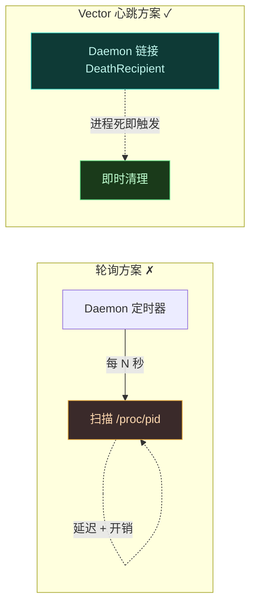
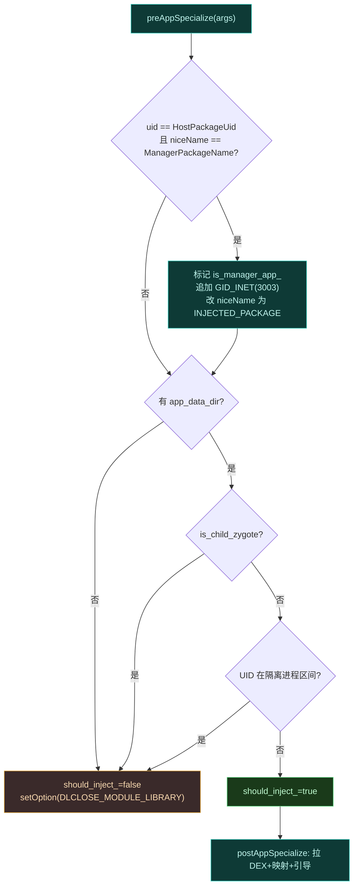
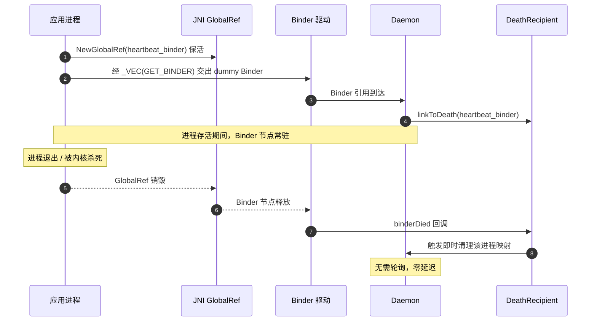
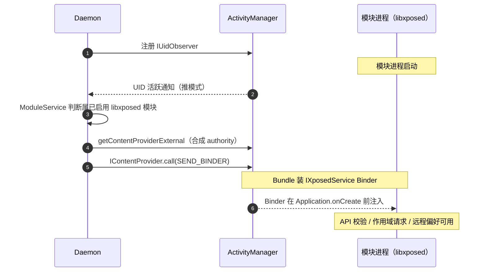
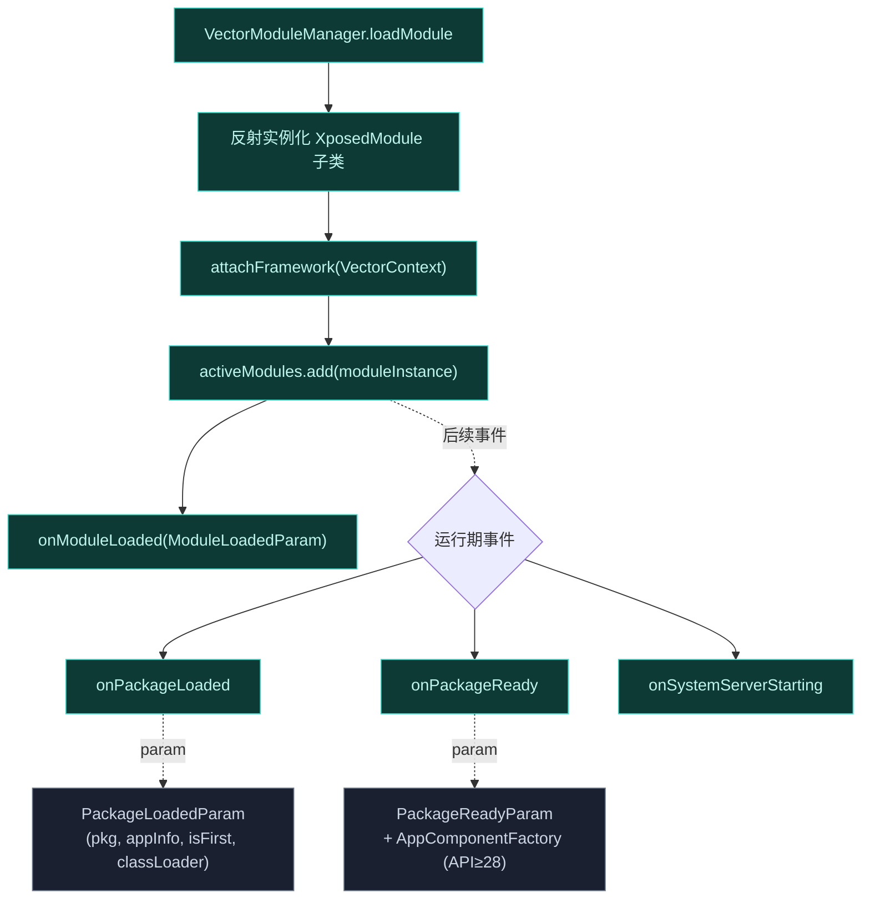

# 进程生命周期与心跳

Vector 要在大量目标进程里常驻 Hook，就必须回答一个问题：**进程死了，Daemon 怎么立刻知道？** 轮询不可取——开销大、延迟高。Vector 用一个假 Binder 对象当"心跳"，借助 Binder 死亡通知机制实现免轮询的即时清理。这一页讲清楚心跳链路、JNI 保活、死亡回调，以及 libxposed 模块的推模式生命周期。

## 核心问题：免轮询的死亡感知

Daemon 为每个授权进程维护内部跟踪映射（模块列表、偏好句柄、作用域缓存等）。进程退出后这些状态必须立即清理，否则泄漏。传统做法是定时轮询 `kill(pid, 0)` 或 `/proc/pid`，但：

- 轮询间隔长 → 清理延迟大，期间状态脏。
- 轮询频繁 → CPU 开销大，且 `/proc` 扫描本身可被检测。

## 进程准入决策

并非每个 fork 出来的进程都要注入。Zygisk 模块在 [preAppSpecialize](https://github.com/android-security-engineer/Vector-skills/blob/master/zygisk/src/main/cpp/module.cpp) 里做严格的准入过滤，决定 `should_inject_` 标志：

隔离进程区间是 [Android 文件系统配置](https://android.googlesource.com/platform/system/core/+/master/libcutils/include/private/android_filesystem_config.h) 定义的常量，模块里硬编码：

| 区间 | UID 范围 | 含义 | 为何跳过 |
| :--- | :--- | :--- | :--- |
| isolated_app | 99000–99999 | WebView 渲染、沙箱 | 重度沙箱，注入无意义且风险高 |
| app_zygote_isolated | 90000–98999 | 应用 zygote 子进程 | 同上 |
| SHARED_RELRO_UID | 1037 | 共享 RELRO 进程 | 不需 Hook |

`setOption(zygisk::DLCLOSE_MODULE_LIBRARY)` 告诉 Zygisk"我们不注入，可以 dlclose 我的 .so"——避免在无关进程里残留 native 库映射，既是资源节约也是隐蔽性（扫描 `/proc/pid/maps` 找不到 Vector 的 so）。`instance_.release()` 防止静态 `unique_ptr` 析构时 double-free。

## 心跳 Binder 是什么

心跳不是一个真正的"心跳信号"（定时 ping），而是一个**假 Binder 对象**（`heartbeat_binder`）。它的精髓在于：Binder 内核驱动天生就具备死亡通知能力。当一个持有 Binder 引用的进程死亡，驱动会通知所有链接了 `DeathRecipient` 的进程。

Vector 利用这一点：

1. 应用/`system_server` 初始化时 native 生成一个 dummy `BBinder`。
2. 经 JNI `NewGlobalRef` 保活——只要进程活着，GlobalRef 不释放，Binder 节点不消失。
3. 把这个 dummy Binder 经 `_VEC(GET_BINDER)` 事务交给 Daemon。
4. Daemon 把 `DeathRecipient` 链接到该 Binder。
5. 进程死亡 → GlobalRef 销毁 → Binder 节点释放 → 驱动通知 Daemon → `DeathRecipient` 触发清理。

## 为什么用 GlobalRef 保活

dummy Binder 是 Java 对象。若不保活，GC 随时可能回收它，Binder 节点提前释放，Daemon 误以为进程死了。`NewGlobalRef` 把它钉在内存里，生命周期与进程绑定——只有进程整体退出（或被内核杀死）时 GlobalRef 才随 JNI 环境销毁。这把"进程存活"这个语义精确地映射到了"Binder 节点存活"。

## 两阶段初始化中的心跳

心跳在两阶段注入里都建立：

- **阶段 1（system_server）**：`postServerSpecialize` 生成 dummy Binder，Daemon 经 `SEND_BINDER` 保存主 `IDaemonService` Binder 的同时，`system_server` 也交出自己的心跳。Daemon 链接 `DeathRecipient`。
- **阶段 2（用户应用）**：`postAppSpecialize` 发 `_VEC(GET_BINDER)`，附带进程名 + 新分配的心跳 `BBinder`。`system_server` 内的 Trap 截获，把应用 UID/PID/心跳转发给 Daemon。Daemon 核对作用域、批准后返回 `ApplicationService` Binder，并链接该心跳的 `DeathRecipient`。

## 死亡清理做什么

`DeathRecipient` 触发时，Daemon 清理该进程的全部内部跟踪状态：

| 跟踪项 | 清理动作 |
| :--- | :--- |
| 进程作用域缓存 | 从 `DaemonState` 视图移除该 PID |
| 模块列表句柄 | 释放为该进程实例化的模块引用 |
| 偏好差分订阅 | 取消该进程的偏好推送 |
| ApplicationService Binder | 失效，应用侧调用即返回死亡错误 |

因 `DaemonState` 不可变、读路径无锁（见 [Daemon 并发模型](./concurrency)），清理走写路径：后台协程构建新 `DaemonState` 并原子交换引用，不影响正在服务其它进程的 IPC 线程。

## 推模式：IUidObserver

心跳解决的是"Daemon 已知的进程死了怎么知道"。但 libxposed 模块场景有个前置问题：Daemon 怎么知道某模块进程**启动了**？轮询进程列表同样不可取。

Vector 用推模式。Daemon 向 Activity Manager 注册 `IUidObserver`，内核级的 UID 生命周期通知：

1. 某 UID 活跃时，AM 主动通知 Daemon（无需 Daemon 查询）。
2. `ModuleService` 检查该 UID 是否属于已启用的 libxposed 模块。
3. 若是，Daemon 调 `IActivityManager.getContentProviderExternal`，目标是按模块包名构造的**合成 authority**。
4. 执行 `IContentProvider.call`，动作 `SEND_BINDER`，Bundle 装 `IXposedService` Binder。
5. Binder 在模块进程的 `Application.onCreate` **执行前**就被注入。

推模式的好处：Daemon 不扫进程列表，模块进程一启动 API 就就位，模块代码执行时不会"错过了早期 Hook 窗口"。

## libxposed 模块的生命周期事件派发

模块实例化后并非"一次 Hook 永久生效"。libxposed API 定义了一套生命周期回调，框架在合适的时机派发。[VectorLifecycleManager](https://github.com/android-security-engineer/Vector-skills/blob/master/xposed/src/main/kotlin/org/matrix/vector/impl/VectorLifecycleManager.kt) 持有 `activeModules: MutableSet<XposedModule>`（`ConcurrentHashMap.newKeySet()` 线程安全集），每个回调遍历集合并对每个模块 `runCatching` 包裹——单个模块抛异常不影响其它模块。

三个派发入口：

- [VectorModuleManager.loadModule](https://github.com/android-security-engineer/Vector-skills/blob/master/xposed/src/main/kotlin/org/matrix/vector/impl/core/VectorModuleManager.kt)：实例化后立即派发 `onModuleLoaded`，这是模块的"出生通知"，模块可在此注册自身 Hook。
- `dispatchPackageLoaded` / `dispatchPackageReady`：由 [LoadedApkHookers](https://github.com/android-security-engineer/Vector-skills/blob/master/xposed/src/main/kotlin/org/matrix/vector/impl/hookers/LoadedApkHookers.kt) 拦截 `LoadedApk` 构造与 `createOrUpdateClassLoaderLocked` 时触发。`PackageReadyParam` 在 API ≥ 28 时携带 `AppComponentFactory`（隔离为 `PackageReadyParamImplP` 类，避免在 Android 8.1 及以下 Verifier 崩溃）。
- `dispatchSystemServerStarting`：仅 system_server，模块可在此 Hook 系统服务启动期方法。

### @AfterInvocation 与 legacy 桥接

legacy 模块（`assets/xposed_init`）走的是经典 `XC_LoadPackage` 回调，需经 [VectorBootstrap](https://github.com/android-security-engineer/Vector-skills/blob/master/xposed/src/main/kotlin/org/matrix/vector/impl/di/VectorBootstrap.kt) 的 `LegacyFrameworkDelegate` 桥接。`processLegacyHook` 在 Hook 原方法前后插入 legacy 回调链，靠 `OriginalInvoker.invoke()` 在合适时机回调原实现——这是 `@AfterInvocation` 语义的实现基础：Hook 方法返回后，legacy 包装层仍能拿到返回值继续处理。

完整性检查：`loadModule` 里若 `moduleClassLoader.loadClass("io.github.libxposed.api.XposedModule").classLoader !== initLoader`，说明模块把 API 类编译进了自己 APK，直接拒绝加载——防止模块自带被篡改的 API 绕过框架约束。

## 两种生命周期机制对比

| 机制 | 解决的问题 | 触发方 |
| :--- | :--- | :--- |
| 心跳 Binder + DeathRecipient | 进程死了即时清理 | Binder 驱动死亡通知 |
| IUidObserver | 模块进程启动即注入 API | ActivityManager UID 通知 |

二者互补：`IUidObserver` 负责"出生感知"，心跳 Binder 负责"死亡感知"。Daemon 对每个模块进程都同时持有这两条通道，全程免轮询。

## 小结

| 环节 | 机制 |
| :--- | :--- |
| 死亡感知 | dummy `heartbeat_binder` + `DeathRecipient` |
| 保活 | JNI `NewGlobalRef`，生命周期绑定进程 |
| 建立 | 两阶段注入时各进程交出心跳，Daemon 链接 |
| 清理 | `DeathRecipient` 触发，走写路径原子交换状态 |
| 出生感知 | `IUidObserver` 推模式，UID 活跃即通知 |
| 早期注入 | 合成 authority + `SEND_BINDER`，`onCreate` 前就位 |

## 相关链接

- [IPC 与 Binder 中继](./ipc) — 心跳在两阶段中继中的位置
- [启动与注入链路](./boot-flow) — 心跳建立的时序
- [Daemon 守护进程](./daemon) — `DeathRecipient` 与清理
- [Daemon 并发模型](./concurrency) — 清理走写路径无锁读
