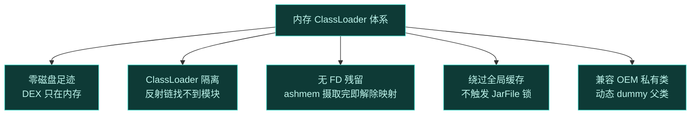
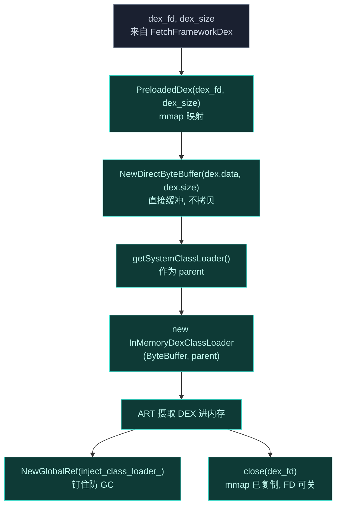
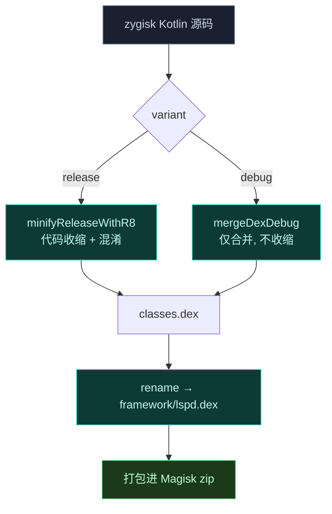
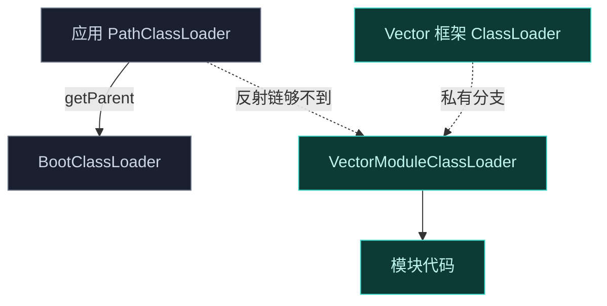
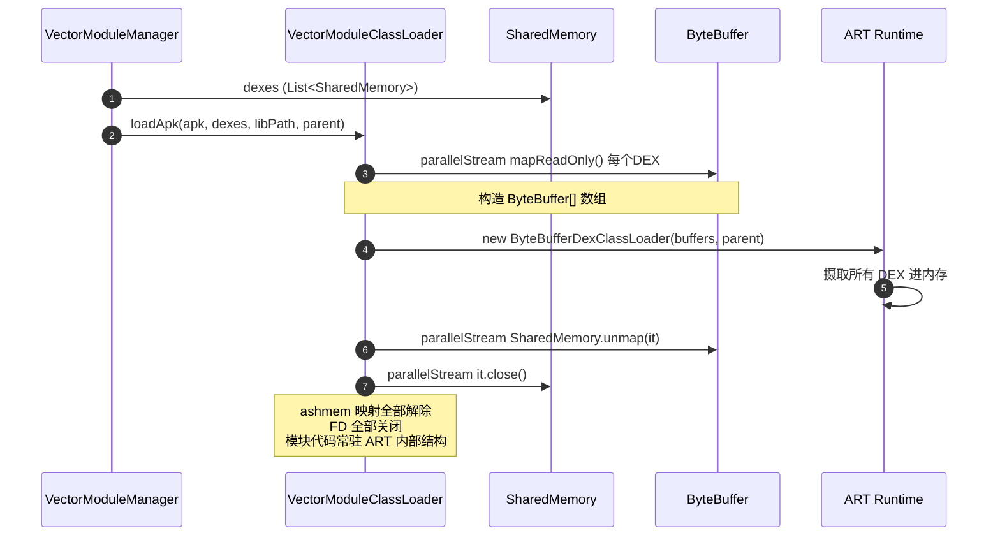
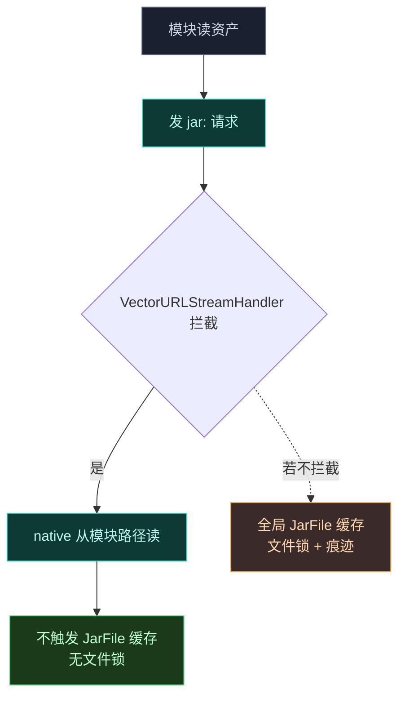
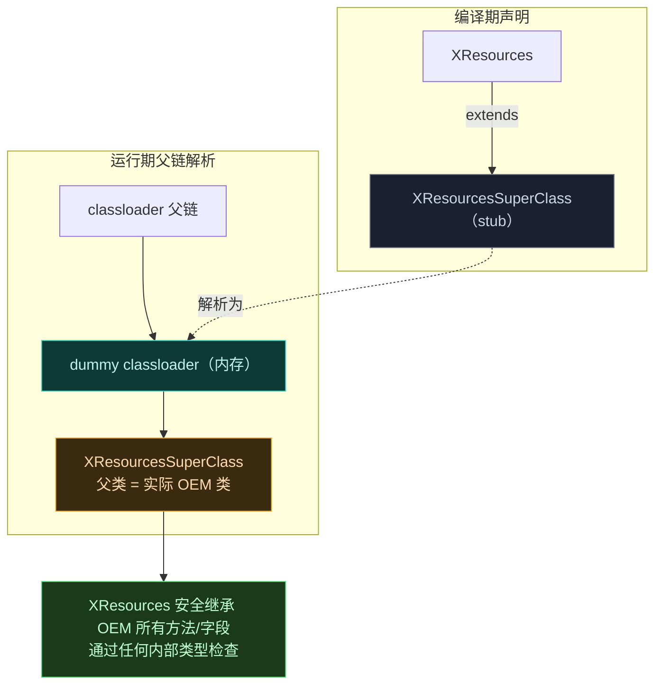
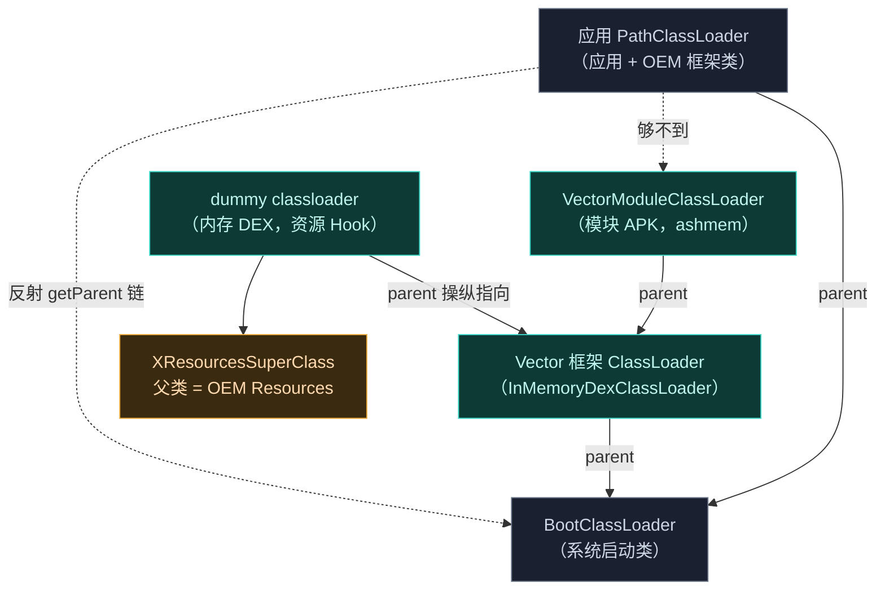

# 内存 ClassLoader 体系

Vector 的模块代码全程只在内存里执行，不落盘。但"从内存加载 DEX"只是起点——真正难的是**隔离**：模块的 ClassLoader 必须挂得让目标应用反射链找不到，资产读取不能触发 OS 全局缓存，还要兼容 OEM 私有类。这一页拆解 Vector 的内存 ClassLoader 体系。

## 设计目标

## 框架 DEX 的内存加载：LoadDex

框架 DEX（`framework/lspd.dex`）由 Daemon 经 SharedMemory FD 交付，native 侧 [VectorModule::LoadDex](https://github.com/android-security-engineer/Vector-skills/blob/master/zygisk/src/main/cpp/module.cpp) 把它喂给 ART。核心是 `DirectByteBuffer` + `InMemoryDexClassLoader` 的组合：

关键点：

- `env->NewDirectByteBuffer(dex.data(), dex.size())` 用 JNI 直接缓冲区包裹 mmap 出来的 native 指针，**零拷贝**——不把 DEX 内容复制进 Java 堆。ART 的 `InMemoryDexClassLoader` 直接从这个缓冲区摄取 DEX。
- parent ClassLoader 是 `getSystemClassLoader()`，框架 ClassLoader 挂在系统 ClassLoader 之下，与应用 `PathClassLoader` **并列**而非串联——这是隔离边界。
- `NewGlobalRef` 钉住 ClassLoader 防止 GC 回收，因为后续 `SetupEntryClass` 与 `FindAndCall` 都要靠它。
- `close(dex_fd)` 在 `PreloadedDex` 析构后执行——mmap 映射已把内容复制进 ART 的内部结构，FD 可安全关闭。

## lspd.dex 的构建产物分支

`framework/lspd.dex` 不是源码里现成的文件，而是 Gradle 在 [zygisk/build.gradle.kts](https://github.com/android-security-engineer/Vector-skills/blob/master/zygisk/build.gradle.kts) 的 `prepareModuleFiles` 任务里按构建类型**从不同中间产物改名**而来：

release 走 R8（`intermediates/dex/release/minifyReleaseWithR8`），开启代码收缩与混淆，DEX 更小、特征更少；debug 走 `mergeDexDebug`，仅合并多 DEX 不收缩，便于调试。两者最终都 `rename("classes.dex", "lspd.dex")` 落入 `framework/` 目录。`lspd.dex` 这个名字是 LSPosed 时代延续的命名，不代表内容是 LSPosed——它是 Vector 框架 Kotlin 层的引导 DEX。

## VectorModuleClassLoader：私有分支隔离

标准 Android 用 `PathClassLoader` 加载 APK，挂在应用 classpath 链上。模块若也走这条路，目标应用经 `ClassLoader.getParent()` 链式反射就能遍历到模块 ClassLoader，发现模块存在。

`VectorModuleClassLoader` **独占**挂到 Xposed 框架的 classloader 分支，不挂在应用 classpath 主链上。目标应用的反射链到不了模块 ClassLoader。

## InMemoryDexClassLoader 与 ashmem 解除映射

模块 APK 被加载进 `SharedMemory`（ashmem）以绕过 Java 堆限制。C++ 层把 FD 包成 `DirectByteBuffer`，初始化 `InMemoryDexClassLoader` 摄取 DEX。关键一步：**ART 摄取完 DEX 缓冲区后，ashmem 立即解除映射**，防内存泄漏、不留残余文件描述符。

模块级加载走的是 `ByteBufferDexClassLoader`（框架私有 hidden API），不是 `InMemoryDexClassLoader`——因为模块可能有多个 DEX（`classes.dex` + `classes2.dex` + ...），需用 `ByteBuffer[]` 数组。[VectorModuleClassLoader.loadApk](https://github.com/android-security-engineer/Vector-skills/blob/master/xposed/src/main/kotlin/org/matrix/vector/impl/utils/VectorModuleClassLoader.kt) 把 `List<SharedMemory>` 全部 `mapReadOnly()` 成 `ByteBuffer[]` 喂给 `ByteBufferDexClassLoader`，构造完成后立即 `SharedMemory.unmap` + `close`：

`mapReadOnly` 而非 `mapReadWrite` 是刻意约束——只读映射防止模块代码运行期意外改写 DEX 缓冲区，也避免 COW 页产生。`parallelStream` 并行处理多 DEX 的映射与解除，减少大模块加载延迟。

框架 DEX（`lspd.dex`）走 `InMemoryDexClassLoader`（单个 ByteBuffer），模块 APK 走 `ByteBufferDexClassLoader`（数组）——两条路径互补，对应"单一框架 DEX"和"多 DEX 模块"两种形态。

这一步同时服务于隐蔽性（见 [安全与隐蔽性设计](./security)）和稳定性（ashmem 不解除映射会持续占内存并留 FD，长期运行泄漏）。

## VectorURLStreamHandler：拦截 jar: 请求

模块代码读取自身资产（资源、布局）时，标准 Java 会发 `jar:` URL 请求，触发 Android 全局 `JarFile` 缓存。这会导致两个问题：OS 级文件锁（模块资产被锁住无法更新）、缓存痕迹（反作弊可枚举缓存发现模块）。

`VectorURLStreamHandler` 拦截标准 `jar:` 请求，从模块路径 native 读取资产与资源，**不触发 Android 全局 `JarFile` 缓存**，防止 OS 级文件锁。

## 动态 dummy 父类：兼容 OEM 私有类型

资源 Hook 需要用 `XResources`/`XTypedArray` 替换 OS 资源实例。但若硬编码 `XResources` 直接继承 AOSP 基类 `Resources`，深度定制的 OEM 框架把注入对象强转回其私有类型时会触发致命 `ClassCastException`。

解法是运行时动态生成中间类层级：

1. 检测系统资源与 typed array 的确切运行时类（可能是 OEM 私有类）。
2. native 桥 `ResourcesHook.makeInheritable` 在 ART 层剥离 OEM 类的 `final` 修饰符。
3. `ResourcesHook.buildDummyClassLoader` 用 `dex_builder` 在内存缓冲区构造 DEX，生成 `xposed.dummy.XResourcesSuperClass`，动态把其父类设为检测到的实际 OEM 类。
4. 内存缓冲经 `InMemoryDexClassLoader` 加载。
5. legacy 模块操纵自身 classloader 父链，覆盖 parent 字段指向内存中的 dummy classloader。

这样 `XResources` 安全继承 OEM 的所有方法与字段，通过任何内部类型检查。详见 [资源 Hook 子系统](./resources#动态类层级生成)。

## ClassLoader 父链全景

把所有 ClassLoader 串起来看 Vector 的隔离边界：

关键边界：框架与模块 ClassLoader 挂在 `BootClassLoader` 分支，**不经过应用 `PathClassLoader`**。应用反射链 `getParent` 只能向上到 Boot，碰不到模块。

## 小结

| 组件 | 解决的问题 |
| :--- | :--- |
| `VectorModuleClassLoader` | 模块挂框架私有分支，反射链找不到 |
| `InMemoryDexClassLoader` | DEX 从内存加载，不落盘 |
| ashmem 解除映射 | ART 摄取完即取消映射，无 FD 残留 |
| `VectorURLStreamHandler` | 拦截 `jar:` 请求，不触发全局 JarFile 缓存/文件锁 |
| 动态 dummy 父类 | 兼容 OEM 私有类型，剥离 final，运行时设父类 |
| 父链操纵 | dummy classloader 挂框架分支，资源 Hook 通过类型检查 |

## 相关链接

- [Xposed API 实现](./xposed) — `VectorModuleClassLoader` 的归属
- [Legacy 兼容层](./legacy) — 内存加载模块与 `xposed_init` 解析
- [资源 Hook 子系统](./resources) — 动态 dummy 父类的完整流程
- [安全与隐蔽性设计](./security) — 隔离在整体隐蔽设计中的位置
- [启动与注入链路](./boot-flow) — 从内存引导框架的时序
