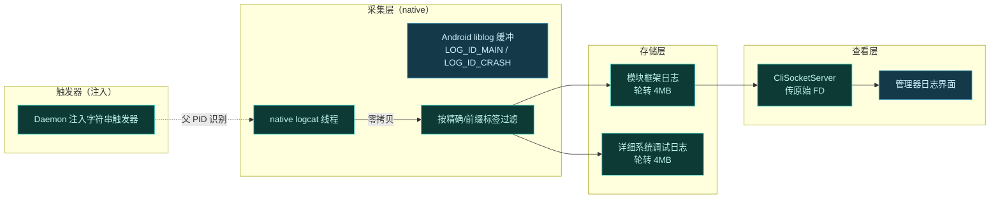
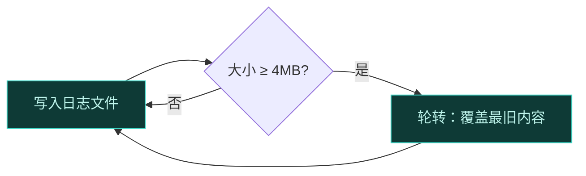
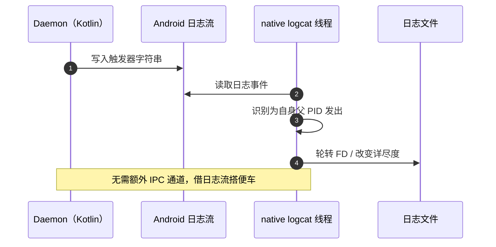
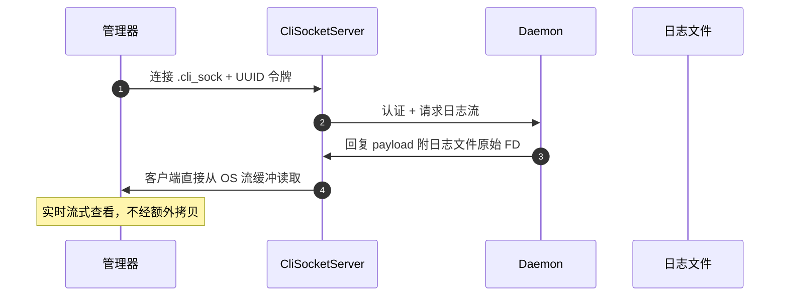

# 📝 日志体系

Vector 的日志不是简单的 `Log.d` 堆叠，而是一套零拷贝、轮转、可远程触发的 native 日志管线。这一页讲清楚日志怎么采集、怎么轮转、怎么被触发器动态控制，以及用户如何在管理器里查看。

## 日志管线全景

## 采集：零拷贝与标签过滤

Daemon 不调用标准 `logcat` shell 命令（开销大、局限多），而是运行一个 native C++ 线程直接对接 Android `liblog` 缓冲。

| 特性 | 说明 |
| :--- | :--- |
| 零拷贝 | native 解析器直接读 liblog 缓冲，不经 shell 管道 |
| 精确标签 | 严格匹配 Magisk、KernelSU 等精确 tag |
| 前缀标签 | 匹配 dex2oat、Vector、LSPosed 等前缀 tag |
| 双缓冲 | 同时监听 `LOG_ID_MAIN` 与 `LOG_ID_CRASH` |

这样既覆盖了 Vector 自身日志，也捕获 root 管理器和编译器相关日志，排错时一应俱全。

## 存储：双文件轮转

过滤后的输出写入两个轮转日志文件：

| 文件 | 内容 | 轮转阈值 |
| :--- | :--- | :--- |
| 模块框架日志 | Vector 框架与模块相关 | 达 4MB 自动轮转 |
| 详细系统调试日志 | 系统级调试信息 | 达 4MB 自动轮转 |

轮转意味着旧内容被覆盖，日志总量有界，不会无限增长占满磁盘。

## 触发器：日志流里的控制信号

这是最巧妙的部分。Kotlin Daemon 把特定字符串触发器**直接注入 Android 日志流**，native 解析器截获来自自身父 PID 的这些消息，执行控制动作。

| 触发器 | 作用 |
| :--- | :--- |
| `!!refresh_modules!!` | 动态轮转文件描述符 |
| `!!start_verbose!!` | 切换到详尽日志模式 |

为什么用日志流而不是 IPC？因为这些触发器和日志数据本身在同一条 native 管线里，复用已有读取循环，零额外开销，也不新增可被检测的通信通道。

## 查看：管理器日志界面

用户在寄生管理器里查看日志，走的是 CLI socket 通道。

关键：Daemon 把日志文件的原始 `FileDescriptor` 附到 socket 回复 payload，客户端直接从 OS 级流缓冲读取，实现实时日志流。详见 [Daemon 守护进程](./daemon#native-socket-ipc)。

## 日志与排错

排错时日志是第一手资料。建议：

- 用 **debug 构建**复现问题——debug 版提供更详尽的日志。
- 同时看模块框架日志与系统调试日志。
- 日志含 native 轮转文件，Bug 报告应附上。

::: caution Bug 报告要求
本项目只接受基于**最新 debug 构建**的 Bug 报告，且**仅接受英文 Issue**。中文用户请用翻译工具辅助。详见 [兼容性矩阵](../guide/compatibility#反馈不兼容问题)。
:::

## 设计要点小结

| 设计 | 解决的问题 |
| :--- | :--- |
| native 直连 liblog | 避开 shell logcat 的开销与局限 |
| 零拷贝 + 标签过滤 | 高效采集，只留相关信息 |
| 双文件 4MB 轮转 | 日志总量有界 |
| 字符串触发器 | 复用日志流做控制，零额外 IPC |
| 原始 FD 传递 | 管理器实时流式查看，无拷贝 |

## 相关链接

- [Daemon 守护进程](./daemon) — native logcat 与 CLI socket
- [线程模型](./threading) — native logcat 线程定位
- [故障排查](../guide/troubleshooting) — 怎么用日志排错
- [兼容性矩阵](../guide/compatibility) — debug 构建与反馈
