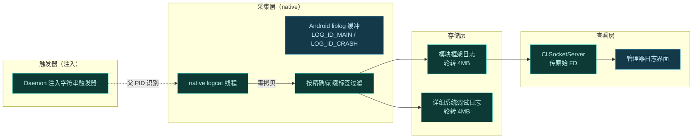
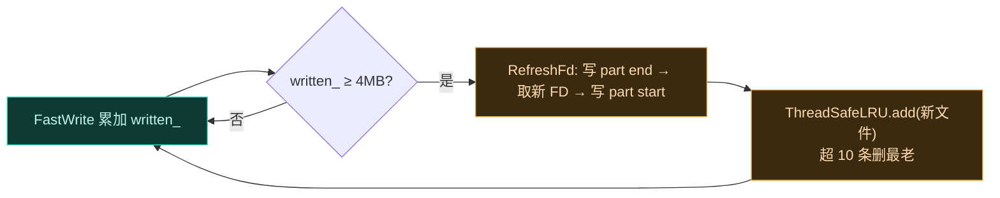
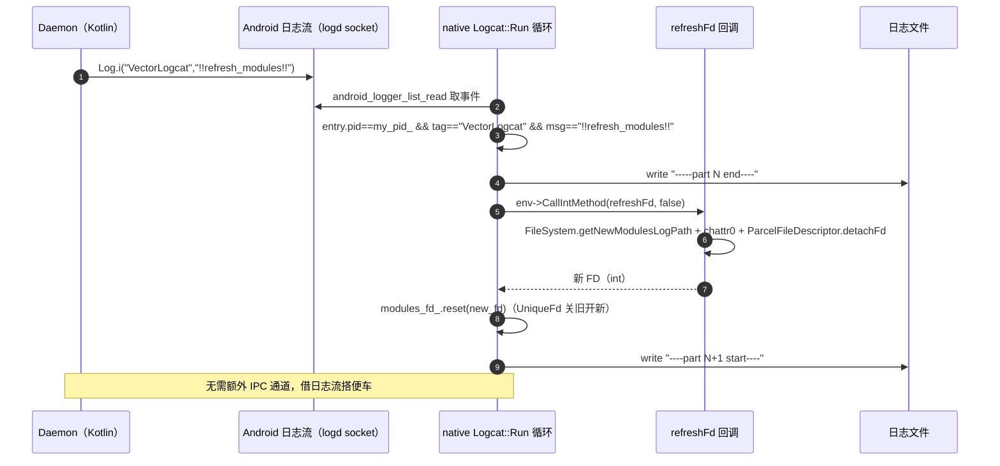
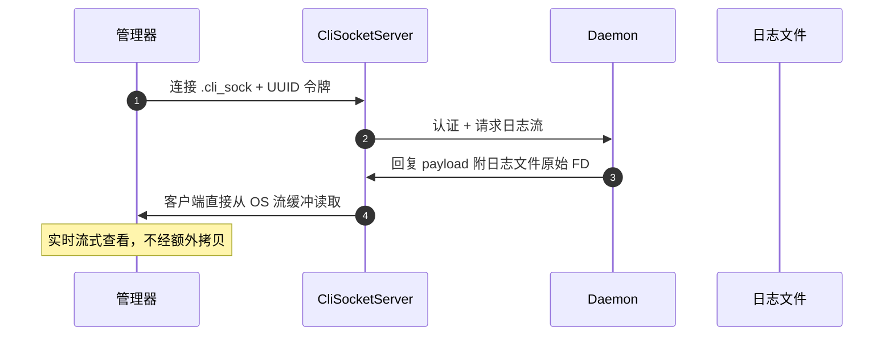
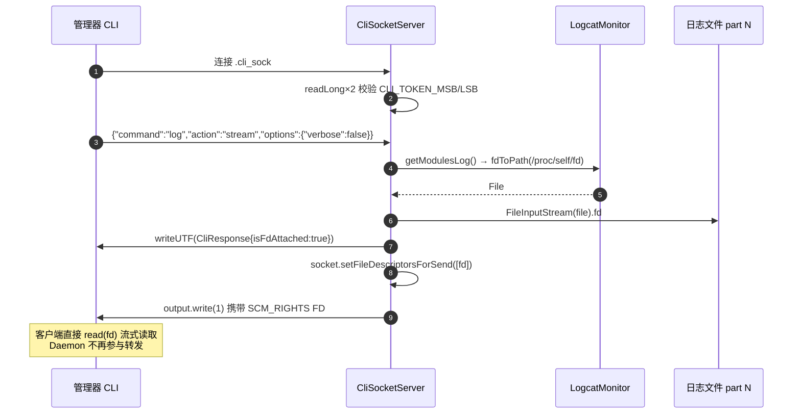
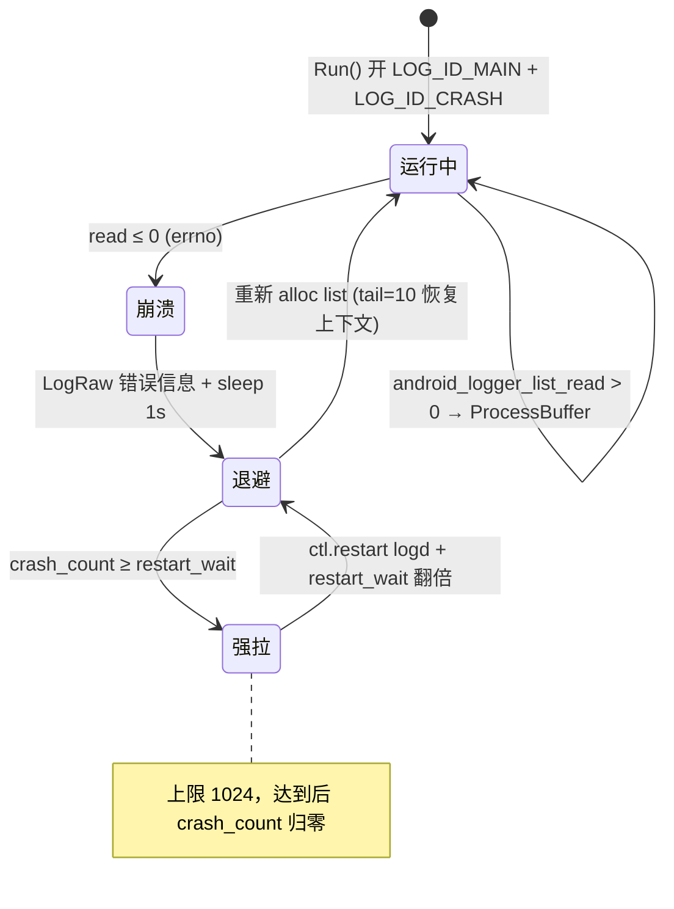

# 📝 日志体系

Vector 的日志不是简单的 `Log.d` 堆叠，而是一套零拷贝、轮转、可远程触发的 native 日志管线。这一页讲清楚日志怎么采集、怎么轮转、怎么被触发器动态控制，以及用户如何在管理器里查看。

## 日志管线全景



## 采集：零拷贝与标签过滤

Daemon 不调用标准 `logcat` shell 命令（开销大、局限多），而是运行一个 native C++ 线程直接对接 Android `liblog` 缓冲。核心实现是 [logcat.cpp](https://github.com/android-security-engineer/Vector-skills/blob/master/daemon/src/main/jni/logcat.cpp) 的 `Logcat::Run()` 循环，经 `android_logger_list_alloc` / `android_logger_open` 打开 `LOG_ID_MAIN` 与 `LOG_ID_CRASH` 两个日志缓冲，再用 `android_logger_list_read` 阻塞式读取。

| 特性 | 说明 |
| :--- | :--- |
| 零拷贝 | native 解析器直接读 liblog 缓冲，不经 shell 管道 |
| 双缓冲 | 同时监听 `LOG_ID_MAIN` 与 `LOG_ID_CRASH`（崩溃日志单独流） |
| 内部缓冲 128KB | `android_logger_set_log_size` 强制设为 `kLogBufferSize = 128*1024`，小于此值则上调 |
| Scatter-Gather 写入 | `FastWrite` 用 `writev` 一次系统调用拼 5 段 iovec（前缀 `[ `、时间、元数据、消息、换行） |
| 二分查找标签 | `kModuleTags`/`kExactTags` 排序后 `std::binary_search`，O(log N) |

标签过滤在 `ProcessBuffer` 里分三组，路由到两个输出流：

| 标签组 | 匹配方式 | 路由 | 具体标签（来自 logcat.cpp 常量） |
| :--- | :--- | :--- | :--- |
| 模块标签 `kModuleTags` | 精确（`binary_search`） | 只进 modules 流 | `VectorContext`、`VectorLegacyBridge`、`VectorModuleManager`、`XSharedPreferences` |
| 精确标签 `kExactTags` | 精确（`binary_search`） | 进 verbose 流 | `APatchD`、`Dobby`、`KernelSU`、`LSPlant`、`LSPlt`、`Magisk`、`SELinux`、`TEESimulator` |
| 前缀标签 `kPrefixTags` | 前缀（`starts_with`） | 进 verbose 流 | `LSPosed`、`Vector`、`dex2oat`、`zygisk` |

此外 verbose 流还无条件收录三类来源：自身进程（`entry.pid == my_pid_`，含触发器）、modules 命中的标签（避免模块日志在 verbose 关闭时丢）、`LOG_ID_CRASH`（崩溃日志始终保留）。这样既覆盖了 Vector 自身日志，也捕获 root 管理器和编译器相关日志，排错时一应俱全。

> [!TIP]
> 日志优先级字符映射在 `kLogChar` 数组里：`V/D/I/W/E/F` 对应 `ANDROID_LOG_VERBOSE..FATAL`。`FastWrite` 的元数据行格式是 `[ 2025-01-01T00:00:00.000  uid: pid: tid: P/tag ]`——固定宽度，方便 `grep` 与时间对齐。

## 存储：双文件轮转

过滤后的输出写入两个轮转日志文件，由 `Logcat::RefreshFd` 管理：

| 文件 | 内容 | 路径来源 | 轮转阈值 |
| :--- | :--- | :--- | :--- |
| 模块框架日志 | Vector 框架与模块相关（`kModuleTags` 命中） | `FileSystem.getNewModulesLogPath()` | `modules_written_ >= kMaxLogSize` |
| 详细系统调试日志 | 系统级调试信息（精确/前缀/崩溃/自身进程） | `FileSystem.getNewVerboseLogPath()` | `verbose_written_ >= kMaxLogSize` |

轮转阈值 `kMaxLogSize = 4 * 1024 * 1024`（4MB）。`FastWrite` 返回写入字节数，累加进 `modules_written_` / `verbose_written_`；达到阈值后在主循环里调 `RefreshFd` 触发轮转。轮转不是原地截断，而是**新开一个 part 文件**——旧 FD 关闭、新 FD 打开，并在文件首尾写 `----part N start----` / `-----part N end----` 分隔标记。`LogcatMonitor` 用 `ThreadSafeLRU`（默认 10 条）管理历史 part 文件，超出则删最老的。

```text
        modules 流（kModuleTags 命中）              verbose 流（精确/前缀/崩溃/自身）
        ┌──────────────────────────┐              ┌──────────────────────────┐
  4MB → │ part 1  [已满，关闭]      │              │ part 1  [已满，关闭]      │
        │ part 2  [已满，关闭]      │              │ part 2  [已满，关闭]      │
        │ part 3  ← 当前写入 FD      │              │ part 3  ← 当前写入 FD      │
        │ ...    (ThreadSafeLRU 10) │              │ ...    (ThreadSafeLRU 10) │
        └──────────────────────────┘              └──────────────────────────┘
                 ▲                                          ▲
                 │ RefreshFd(false)                         │ RefreshFd(true)
                 │ （!!refresh_modules!! 触发或 4MB 满）       │ （!!refresh_verbose!! 触发或 4MB 满）
                 │                                          │
        ┌────────┴──────────────────────────────────────────┴────────┐
        │  native Logcat::Run  (liblog socket 阻塞读 + ProcessBuffer) │
        │  my_pid_ = getpid()  ← 触发器只认自身父 PID                  │
        └─────────────────────────────────────────────────────────────┘
```

轮转意味着旧 part 文件被 LRU 淘汰覆盖，日志总量有界，不会无限增长占满磁盘。



> [!TIP]
> `LogcatMonitor.checkFd` 还能"复活"被外部删除的日志文件：检测到 `st_nlink == 0`（文件已删但 FD 仍开着）时，从 `/proc/self/fd/<fd>` 读符号链接拿到原路径，`Files.copy` 复制回原位。`refreshFd(isVerboseLog)` 由 native 经 JNI 回调，返回新 detach 的 `ParcelFileDescriptor` FD 给 native 写——`detachFd()` 把 FD 所有权转移给 native，Java 侧不再 close 它。

## 触发器：日志流里的控制信号

这是最巧妙的部分。Kotlin Daemon 把特定字符串触发器**直接注入 Android 日志流**（tag 固定为 `VectorLogcat`），native 解析器 [logcat.cpp](https://github.com/android-security-engineer/Vector-skills/blob/master/daemon/src/main/jni/logcat.cpp) 的 `ProcessBuffer` 截获来自自身父 PID（`entry.pid == my_pid_`）的这些消息，执行控制动作。

| 触发器（消息体精确匹配） | 作用 | native 处理 |
| :--- | :--- | :--- |
| `!!start_verbose!!` | 切换到详尽日志模式 | `verbose_enabled_ = true`，并把这条日志本身写入 verbose 流留痕 |
| `!!stop_verbose!!` | 关闭详尽日志模式 | `verbose_enabled_ = false`（后续 verbose 流不再写入，但 modules 流不受影响） |
| `!!refresh_modules!!` | 轮转模块日志 FD | 调 `RefreshFd(false)`，写 `-----part N end----` 收尾，经 JNI 回调 `LogcatMonitor.refreshFd(false)` 取新 FD，再写 `----part N+1 start----` |
| `!!refresh_verbose!!` | 轮转详尽日志 FD | 同上，`RefreshFd(true)` |

触发器由 [LogcatMonitor.kt](https://github.com/android-security-engineer/Vector-skills/blob/master/daemon/src/main/kotlin/org/matrix/vector/daemon/env/LogcatMonitor.kt) 的 `startVerbose()`/`stopVerbose()`/`refresh(isVerboseLog)` 发出，本质就是一句 `Log.i("VectorLogcat", "!!start_verbose!!")`。



> [!TIP]
> 触发器能工作的前提是 native 进程的 `my_pid_ = getpid()` 与 Kotlin 侧 `Log.i` 写入的进程 PID 一致——也就是说 native logcat 线程跑在 Daemon 进程内（经 `System.load` 加载 `libdaemon.so`），不是 fork 出去的子进程。`logcat.cpp` 里 `my_pid_` 在 `Logcat` 构造时一次性取定，整个循环复用。

为什么用日志流而不是 IPC？因为这些触发器和日志数据本身在同一条 native 管线里，复用已有 `android_logger_list_read` 读取循环，零额外开销，也不新增可被检测的通信通道——对反作弊来说，它只看到一条普通 `Log.i` 调用。

## 查看：管理器日志界面

用户在寄生管理器里查看日志，走的是 CLI socket 通道。



关键：Daemon 把日志文件的原始 `FileDescriptor` 经 `socket.setFileDescriptorsForSend(arrayOf(fd))` 附到 socket 回复（SCM_RIGHTS 传 FD），再用一个触发字节 `output.write(1)` 把辅助数据"携带"出去。客户端直接从 OS 级流缓冲读取，不经 Daemon 转发拷贝。详见 [Daemon 守护进程](./daemon#native-socket-ipc)。



> [!TIP]
> CLI 令牌是构建期 `UUID.randomUUID()` 生成的 MSB/LSB 两个 long，写进 `BuildConfig.CLI_TOKEN_MSB/LSB`（见 [daemon/build.gradle.kts](https://github.com/android-security-engineer/Vector-skills/blob/master/daemon/build.gradle.kts)）。客户端必须先发这两个 long 校验，不匹配直接 `socket.close()`——没有令牌的进程连不上。`log stream` 之外的命令（`status`/`modules`/`scope`/`config`/`db`/`log clear`）走 [`CliHandler`](https://github.com/android-security-engineer/Vector-skills/blob/master/daemon/src/main/kotlin/org/matrix/vector/daemon/ipc/CliHandler.kt)，以 JSON 往返 `CliRequest`/`CliResponse`。

## logd 崩溃恢复与启动期快照

native logcat 循环依赖 `logd` 守护进程提供的 Unix socket。若 `logd` 自身崩溃，`android_logger_list_read` 会返回非正值，`OnCrash` 接管：先记一条错误日志到两个流（`LogRaw` 同时写 modules 和 verbose），按指数退避等待（`restart_wait` 从 8 起步，每翻倍一次直到 1024 上限），超阈值后 `__system_property_set("ctl.restart", "logd")` 强拉 logd。重连时 `tail=10`，从崩溃前最后 10 行日志恢复上下文，便于排查崩溃本身。



此外 `LogcatMonitor.init` 在启动时一次性 `dumpPropsAndDmesg()`：先 `SELinux.setFSCreateContext("u:object_r:app_data_file:s0")` 限制文件上下文，再 `ProcessBuilder("sh","-c","echo -n u:r:untrusted_app:s0 > /proc/thread-self/attr/current; getprop")` 切到 untrusted_app 上下文跑 `getprop`（过滤掉 root 才可见的隐私属性），输出落到 `FileSystem.getPropsPath()`；`dmesg` 内核日志单独落 `FileSystem.getKmsgPath()`。这两份快照随日志 zip 一起打包，方便 Bug 报告时还原崩溃现场。对魅族设备的 `persist.sys.log_reject_level` 还做了清零 workaround（大于 0 时强制设回 0）。

## 日志与排错

排错时日志是第一手资料。建议：

- 用 **debug 构建**复现问题——debug 版提供更详尽的日志。
- 同时看模块框架日志与系统调试日志。
- 日志含 native 轮转文件，Bug 报告应附上。

::: caution Bug 报告要求
本项目只接受基于**最新 debug 构建**的 Bug 报告，且**仅接受英文 Issue**。中文用户请用翻译工具辅助。详见 [兼容性矩阵](../guide/compatibility#反馈不兼容问题)。
:::

## 设计要点小结

| 设计 | 解决的问题 |
| :--- | :--- |
| native 直连 liblog | 避开 shell logcat 的开销与局限 |
| 零拷贝 + 标签过滤 | 高效采集，只留相关信息 |
| 双文件 4MB 轮转 | 日志总量有界 |
| 字符串触发器 | 复用日志流做控制，零额外 IPC |
| 原始 FD 传递 | 管理器实时流式查看，无拷贝 |

## 相关链接

- [Daemon 守护进程](./daemon) — native logcat 与 CLI socket
- [线程模型](./threading) — native logcat 线程定位
- [故障排查](../guide/troubleshooting) — 怎么用日志排错
- [兼容性矩阵](../guide/compatibility) — debug 构建与反馈
