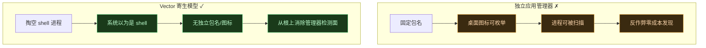
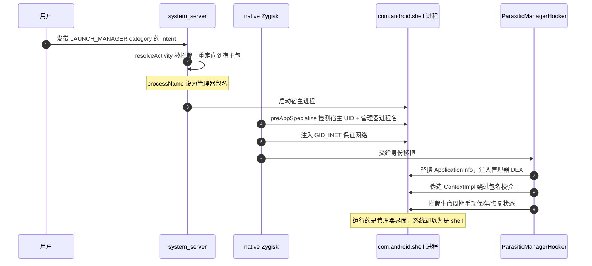
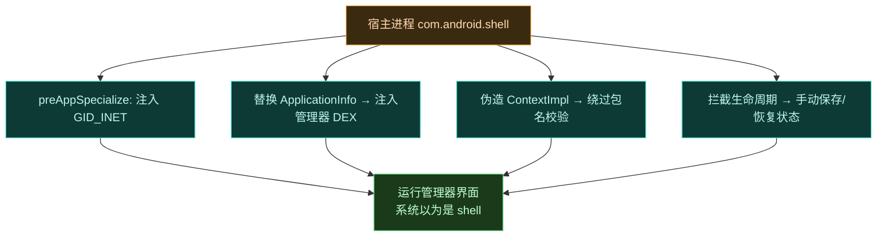
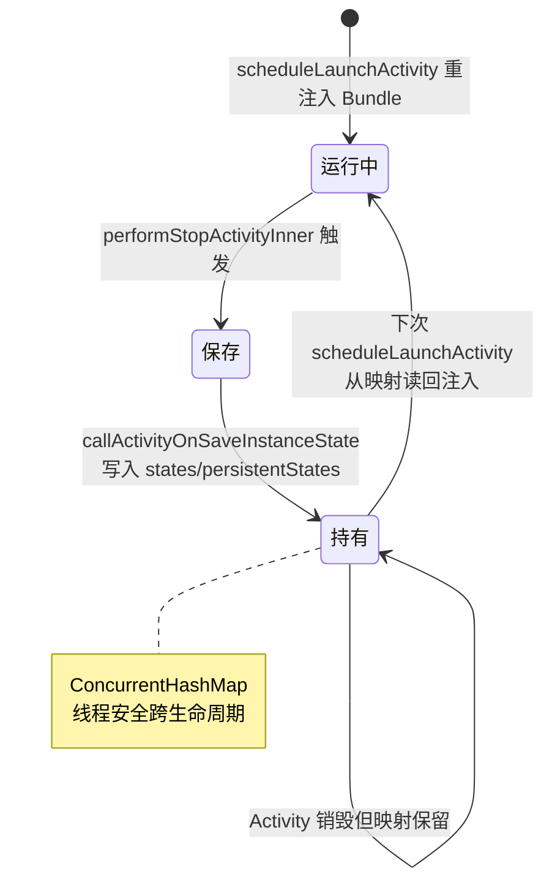

# 🐚 寄生管理器深入

Vector 管理器不以独立应用存在，而是"掏空"一个宿主进程寄生运行。这是它最反直觉、也最能体现隐蔽设计哲学的一环。这一页深入讲清楚宿主选择、身份移植全流程，以及为什么是 `com.android.shell`。

## 为什么不用独立应用

独立应用有固定包名、桌面图标可枚举、进程可被反作弊扫描。寄生模型让管理器**根本不以独立应用存在**——系统以为运行的是宿主，实际跑的是管理器界面。代价是用户不能用常规方式打开它，需经系统通知进入。

## 宿主选择：为什么是 com.android.shell

| 候选 | 选用原因 / 不选原因 |
| :--- | :--- |
| `com.android.shell` | ✅ 选用。系统内置、无法被卸载、UID 固定、有 shell 权限但又不至于过于敏感，是天然的伪装宿主 |
| 普通第三方应用 | ❌ 可能被卸载、包名不稳定、权限不足 |
| system_server | ❌ 系统核心进程，寄生会危及稳定性 |

`com.android.shell` 是 Android 系统自带的 shell 进程，几乎所有设备都有，且正常运行时不会引起怀疑。Vector 把它的进程内容替换为管理器代码，系统层面看到的是 shell 在运行。

## 身份移植全流程

寄生不是简单的"在 shell 里跑代码"，而是一整套身份伪造。分 system_server 侧与应用宿主侧两步。

### 1. system_server 意图重定向

`ParasiticManagerSystemHooker` 拦截 `ActivityTaskSupervisor.resolveActivity`。检测到带 `LAUNCH_MANAGER` category 的 Intent 时，动态修改返回的 ActivityInfo：

- 强制系统启动宿主包（`com.android.shell`）。
- 把 `processName` 设为管理器包名。
- 调整主题和 recents 标志以模仿独立应用。

这样系统以为在启动 shell，实际加载的是管理器。

> [!TIP]
> 类名按 SDK 分支探查：Android 12+ 用 `com.android.server.wm.ActivityTaskSupervisor`，10–11 用 `ActivityStackSupervisor`（wm 包），8.1–9 用同名类（am 包）。见 [ParasiticManagerSystemHooker.kt](https://github.com/android-security-engineer/Vector-skills/blob/master/zygisk/src/main/kotlin/org/matrix/vector/ParasiticManagerSystemHooker.kt)。重定向前还调 `BridgeService.getService()?.preStartManager()` 给 Daemon 打"待启动"标记，让后续 `requestApplicationService` 知道这是寄生管理器而非普通 shell。

### 2. 应用宿主劫持

native 模块在 `preAppSpecialize` 检测到宿主包 UID 和管理器进程名时，先向进程 GID 数组注入 `GID_INET` (3003) 保证网络访问，然后交给 `ParasiticManagerHooker.kt` 执行身份移植：

| 步骤 | 作用 |
| :--- | :--- |
| 代码注入 | 拦截 `LoadedApk.getClassLoader` 与 `ActivityThread.handleBindApplication`，用管理器 APK（经 FD 提供）替换宿主 ApplicationInfo，把管理器 DEX 注入宿主 `PathClassLoader` |
| 状态伪造 | 系统 ActivityManager 不知伪造的管理器 Activity，旋转等生命周期切换会丢数据——hooker 拦截 `performStopActivityInner` 手动把 Bundle/PersistableBundle 存进静态并发映射，`scheduleLaunchActivity` 时重注入 |
| 上下文伪造 | 拦截 `ActivityThread.installProvider` 与 `WebViewFactory.getProvider`，构造伪造 `ContextImpl` 绕过 Android 与 Chromium 内部的包名校验 |

### 身份移植的 7 个 Hook 点

[ParasiticManagerHooker.kt](https://github.com/android-security-engineer/Vector-skills/blob/master/zygisk/src/main/kotlin/org/matrix/vector/ParasiticManagerHooker.kt) 的 `hookForManager` 注册了 7 个 hook，构成完整的身份伪造链。入口 `start()` 先经 `VectorServiceClient.requestInjectedManagerBinder` 拿到管理器 APK 的 `ParcelFileDescriptor`（`managerFd = pfd.detachFd()`）和 `ILSPManagerService` Binder：

| # | Hook 点 | 作用 |
| :--- | :--- | :--- |
| 1 | `ActivityThread.handleBindApplication`（before） | 从 `AppBindData.appInfo` 取宿主 ApplicationInfo，构造混合 PkgInfo（管理器代码 + 宿主路径/UID），替换 `appInfo` 字段 |
| 2 | `LoadedApk.getClassLoader`（after） | 校验 `mApplicationInfo == managerAppInfo` 后，若 DEX 不在 `getDexPaths()` 里则 `addDexPath`，再 `sendBinderToManager` 把 `ILSPManagerService` 注入管理器 `Constants` 类，注入完即 `unhook` |
| 3 | `ActivityClientRecord` 全构造器 / `scheduleLaunchActivity` | 把 `Intent.component` 重定向到 `MainActivity`，并从 `states`/`persistentStates` 静态映射重注入 Bundle |
| 4 | `ActivityThread.handleReceiver`（替换） | 宿主的 BroadcastReceiver 与管理器无关，直接 `PendingResult.finish()` 吞掉 |
| 5 | `ActivityThread.installProvider`（before） | 给管理器 ContentProvider 造一个 `.origin` 后缀的伪 ContextImpl，绕过 `info.applicationInfo.packageName` 校验 |
| 6 | `WebViewFactory.getProvider`（替换） | 手动调 `getProviderClass` + `create(WebViewDelegate)` 绕过 Chromium 包名校验 |
| 7 | `performStopActivityInner`（before） | 调 `callActivityOnSaveInstanceState` 把 `state`/`persistentState` 存进 `ConcurrentHashMap`，供 hook 3 恢复 |

### 活动状态保存/恢复流转

系统不知道伪造 Activity 存在，旋转/后台切换会丢状态。Hook 7 在 stop 时抓取，Hook 3 在 launch 时重注入——两个静态并发映射 `states` / `persistentStates` 充当中转：

### ManagerGuard 死亡回收

寄生管理器进程死掉时不能让 Daemon 以为它还活着。`obtainManagerBinder` 会构造一个 `ManagerGuard(binder, pid, uid)`，它既是 `DeathRecipient` 又持一个空 `IServiceConnection`（配合 `applyXspaceWorkaround` 防 Xspace 双开清理）。管理器 binder 一死，`binderDied` 解链、`unbindService`、把 `ManagerService.guard` 置 null。这样下次 `preStartManager`/`postStartManager` 判定才不会误命中僵尸 PID。

## 进入方式：系统通知

既然桌面没图标，用户怎么打开管理器？开机后 Vector 通过 Daemon 的通知 UI 推一个系统通知，点击即触发带 `LAUNCH_MANAGER` category 的 Intent，进入上述重定向流程。

进入路径不止通知一条。Daemon 还注册了拨号器密钥码 `5776733`（拼出 `LSPosed` 的 T9）作为备用入口——`VectorService` 在 [VectorService.kt](https://github.com/android-security-engineer/Vector-skills/blob/master/daemon/src/main/kotlin/org/matrix/vector/daemon/VectorService.kt) 注册 `ACTION_SECRET_CODE` receiver（`android_secret_code://5776733`），唯一一个 `RECEIVER_EXPORTED` 的 receiver（用 `CONTROL_INCALL_EXPERIENCE` 权限限定电话应用可触发）。

`ManagerService.getManagerIntent` 的探查顺序也值得一提：先按 `CATEGORY_INFO` 查管理器 Activity，找不到回落 `CATEGORY_LAUNCHER`，再不行就直接取 `pkgInfo.activities` 第一个 `processName == packageName` 的 Activity。最终统一加上 `org.lsposed.manager.LAUNCH_MANAGER` category 交给 system_server 重定向。通知被清理？检查系统设置 → 应用 → shell → 通知权限；仍不行则重启设备重新触发。详见 [常见问题 FAQ](../guide/faq#管理器闪退--打不开)。

## 稳定性兜底

寄生模型最大的风险是系统不知伪造 Activity 存在，生命周期切换会丢状态。Vector 的兜底：

| 风险 | 兜底机制 |
| :--- | :--- |
| 屏幕旋转丢数据 | 拦截 `performStopActivityInner` 手动保存 Bundle，`scheduleLaunchActivity` 重注入 |
| WebView 包名校验失败 | 伪造 `ContextImpl` 绕过 Chromium 校验 |
| ContentProvider 安装失败 | 拦截 `installProvider` 注入伪造上下文 |
| 网络访问被拒 | `preAppSpecialize` 注入 `GID_INET` |
| 宿主被冻结/清理 | 加入电池优化白名单或重新发通知 |
| 管理器 APK 被篡改 | `requestInjectedManagerBinder` 投递前 `InstallerVerifier.verifyInstallerSignature` 校验 |
| 管理器进程崩溃残留 | `ManagerGuard` 死亡回调清 `guard` 引用 |
| SDK≤28 无法经 FD 解析 APK | 复制到宿主 cache 再 `getPackageArchiveInfo` |

### 签名校验

[InstallerVerifier.kt](https://github.com/android-security-engineer/Vector-skills/blob/master/daemon/src/main/kotlin/org/matrix/vector/daemon/utils/InstallerVerifier.kt) 用 `com.android.apksig.ApkVerifier`（`setMinCheckedPlatformVersion(27)`）校验管理器 APK 签名，并比对主证书 `SignInfo.CERTIFICATE` 字节数组——该常量由 [daemon/build.gradle.kts](https://github.com/android-security-engineer/Vector-skills/blob/master/daemon/build.gradle.kts) 的 `generateSignInfo` 任务从 `signingConfig` 证书提取、编译期生成。校验在两处触发：

- `ApplicationService.requestInjectedManagerBinder`：投递管理器 APK FD 前校验。
- `ConfigCache.updateManager`：缓存管理器 UID 时校验安装路径。

任何一处签名不符都抛 `IOException`，管理器拒绝加载——防止被替换的 APK 借寄生通道执行。

## 小结

| 设计点 | 解决的问题 |
| :--- | :--- |
| 寄生而非独立安装 | 消除管理器自身的包名/图标/进程检测面 |
| 选 `com.android.shell` | 系统内置、不可卸载、不引人怀疑 |
| system_server 重定向 | 让系统以为启动的是 shell |
| 身份移植三步 | 代码注入 + 状态伪造 + 上下文伪造 |
| 系统通知进入 | 桌面无图标场景下的可靠入口 |
| 生命周期手动保存恢复 | 应对系统不知伪造 Activity 的风险 |

## 相关链接

- [Zygisk 模块](./zygisk#寄生式管理器与身份移植) — 寄生管理器的实现位置
- [安全与隐蔽性设计](./security#防线六寄生式管理器) — 寄生作为隐蔽防线
- [常见问题 FAQ](../guide/faq) — 管理器找不到/闪退
- [快速上手](../guide/quickstart) — 经通知进入管理器
