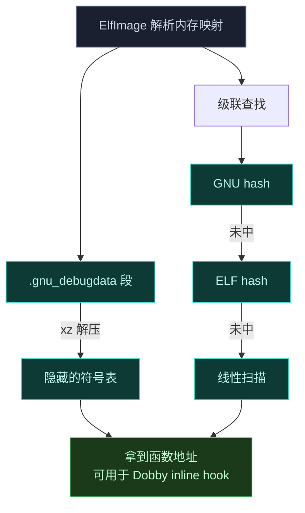

# Native 原生库

`native` 库提供 Android OS 的底层 hook 与修改能力。它不是独立应用，而是一组设计为被更大加载机制（如 Zygisk 模块）集成的组件。

## 设计哲学

这个库不假设自己如何被加载。它定义抽象，由消费者（Zygisk 模块）提供具体实现。这样核心引擎与具体的注入环境解耦。

## 模块拆分

```text
native/
├── core      # 抽象引擎：注入生命周期、配置缓存、native 模块支持
├── elf       # 符号解析：ELF 内存解析、调试数据解压
├── jni       # 业务逻辑接口：JNI 桥，框架的核心服务层
├── common    # 基础工具：fmt 日志、常量、辅助函数
└── framework # 镜像 libandroidfw.so 内部结构的 C++ 定义
```

### core — 抽象引擎

定义核心抽象并管理运行时状态，是库的概念心脏。

- **`Context`**：定义注入生命周期的抽象基类。含 `LoadDex`、`SetupEntryClass` 等纯虚方法。库的消费者必须继承 `Context` 并提供这些步骤的具体实现。
- **`ConfigBridge`**：简单的 native 侧单例，作为配置数据（特指混淆映射）的缓存，由消费者获取并提供。
- **`native_api`**：实现 native 模块支持系统。它 hook 系统的 `do_dlopen` 函数，检测到已注册模块库被加载时，调用该库的 `native_init` 入口点，并提供一组创建自身 native hook 的 [API](https://github.com/android-security-engineer/Vector-skills/blob/master/native/include/core/native_api.h)。

### elf — 符号解析

负责运行时在共享库里查找符号，是 native hooking 的关键功能。

- **`ElfImage`**：解析映射进当前进程内存的 ELF 文件。能在 stripped 二进制里解析符号——定位、解压（用 `xz-embedded`）并解析 `.gnu_debugdata` 段。采用级联查找策略：GNU hash → ELF hash → 符号表线性扫描。
- **`ElfSymbolCache`**：`ElfImage` 实例的线程安全、惰性初始化缓存，为 `libart.so`、linker 等常用库提供安全访问。



### jni — 业务逻辑接口

最显著的模块，代表库的主要服务层。包含一组 JNI 桥，把核心特性暴露给注入的 Java 框架代码。这里的功能是 native 库的主产品。

- **`jni_bridge.h`**：提供一组辅助宏（`VECTOR_NATIVE_METHOD`、`REGISTER_VECTOR_NATIVE_METHODS` 等），标准化并简化繁琐的 JNI 模板代码。
- **`HookBridge`**：ART 方法 hook 的引擎。维护所有活动 hook 的线程安全映射。还含稳定性控制：用原子操作设置备份方法 trampoline，若用户尝试调用失败 hook 的原方法，**抛 Java 异常而非 native 崩溃**。
- **`ResourcesHook`**：实时拦截并改写 Android 二进制 XML 资源。依赖 `libandroidfw.so` 的非公开结构，用 `elf` 模块运行时查找必要函数符号。
- **`NativeApiBridge`**：`core/native_api` 的 JNI 对应物，暴露一个方法让 Java 框架注册第三方 native 模块的文件名。

### common 与 framework

- **`common`**：基础工具集合，含基于 `fmt` 的日志系统、全局常量和辅助函数。
- **`framework`**：极简 C++ 结构定义，镜像 Android 内部 `libandroidfw.so` 的结构。正确解释资源数据指针所必需。

## 构建系统

库用 CMake 配置为**静态库 `libnative.a`**。所有外部依赖也静态链接，最大化可移植性。

## 与其他子系统的关系

- 被 [Zygisk 模块](./zygisk) 的 `Context` 实现消费，提供注入生命周期。
- `HookBridge` 是 [xposed](./xposed) 与 [legacy](./legacy) 两套 API 共用的底层 Hook 引擎入口。
- `ResourcesHook` 被 [legacy](./legacy) 的资源 Hook 子系统驱动。
- `elf` 模块也被 [dex2oat](./dex2oat) 包装器复用于符号定位。
