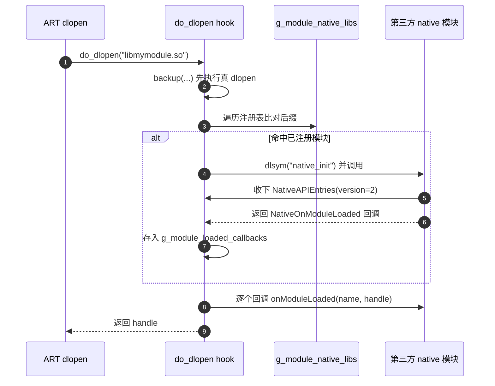
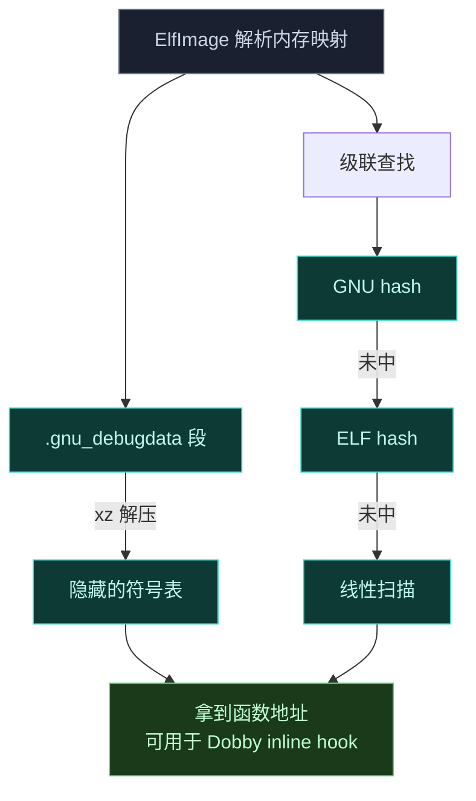
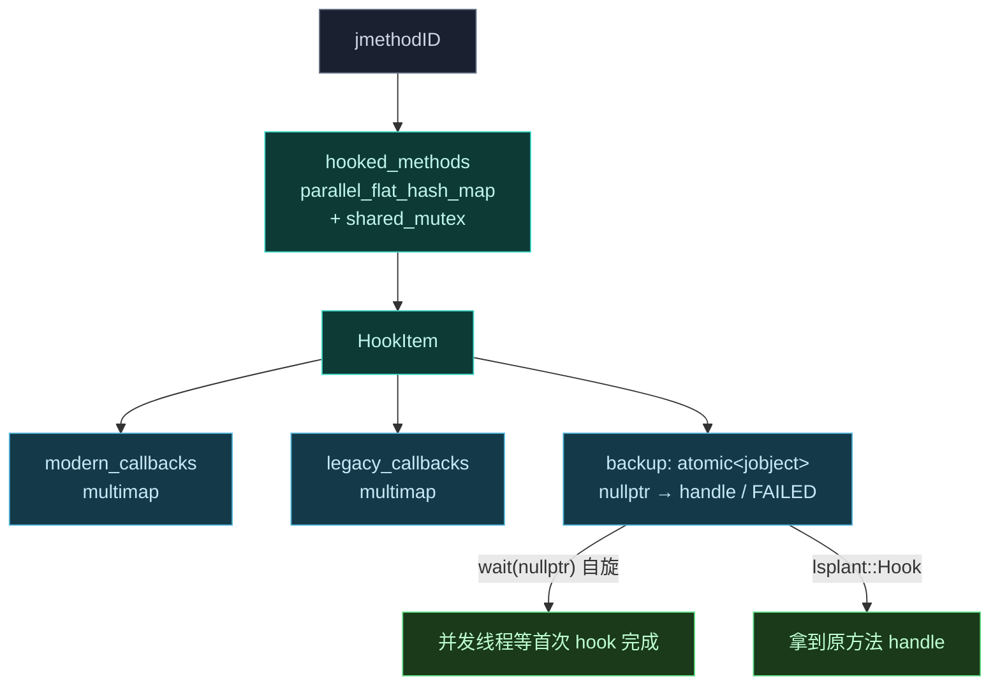

# Native 原生库

`native` 库提供 Android OS 的底层 hook 与修改能力。它不是独立应用，而是一组设计为被更大加载机制（如 Zygisk 模块）集成的组件。

## 设计哲学

这个库不假设自己如何被加载。它定义抽象，由消费者（Zygisk 模块）提供具体实现。这样核心引擎与具体的注入环境解耦。

## 模块拆分

```text
native/
├── core      # 抽象引擎：注入生命周期、配置缓存、native 模块支持
├── elf       # 符号解析：ELF 内存解析、调试数据解压
├── jni       # 业务逻辑接口：JNI 桥，框架的核心服务层
├── common    # 基础工具：fmt 日志、常量、辅助函数
└── framework # 镜像 libandroidfw.so 内部结构的 C++ 定义
```

### core — 抽象引擎

定义核心抽象并管理运行时状态，是库的概念心脏。

- **`Context`**（[context.cpp](https://github.com/android-security-engineer/Vector-skills/blob/master/native/src/core/context.cpp)）：定义注入生命周期的抽象基类。纯虚方法 `LoadDex` / `SetupEntryClass` 由消费者（Zygisk 模块）实现。它还提供两个具体能力：
  - `InitArtHooker` 调 `lsplant::Init(env, initInfo)` 初始化 LSPlant，传入 inline hooker、ART 符号解析器（走 `ElfSymbolCache::GetArt()`）等回调。
  - `InitHooks` 做 **DEX 提权**：遍历注入 ClassLoader 的 `DexPathList.dexElements`，逐个取出 `DexFile.mCookie`，调 `lsplant::MakeDexFileTrusted` 把内存 DEX 标记为可信（等同 BootClassPath），从而绕过 hidden API 限制；随后注册 `ResourcesHook` / `HookBridge` / `NativeApiBridge` 三组 JNI 方法。
  - 内嵌 `PreloadedDex`：用 `mmap(PROT_READ, MAP_SHARED, fd)` 把 DEX FD 映射成内存，析构时 `munmap`，是零拷贝 DEX 加载的基础。
- **`ConfigBridge`**：native 侧单例，缓存混淆映射（`std::map<string,string>`）。Zygisk 模块的 `ConfigImpl` 继承它并把映射存内存。
- **`native_api`**（[native_api.cpp](https://github.com/android-security-engineer/Vector-skills/blob/master/native/src/core/native_api.cpp) + [native_api.h](https://github.com/android-security-engineer/Vector-skills/blob/master/native/include/core/native_api.h)）：实现 native 模块支持系统。
  - 用 LSPlant 的 C++20 Hooking DSL hook 动态链接器 `__dl__Z9do_dlopenPKciPK17android_dlextinfoPKv`（即 `do_dlopen`）。每次任何库被 `dlopen` 时触发。
  - 比对库名后缀与 `g_module_native_libs` 注册表，命中则 `dlsym(handle, "native_init")`，调用它并传入 `NativeAPIEntries*`。
  - `NativeAPIEntries`（version=2，含 `hookFunc`/`unhookFunc` 指针，底层是 Dobby）被放进一页 `mmap` 的 4KB 内存，写完后 `mprotect(PROT_READ)` 改只读——这是给第三方模块的**公共 ABI**，结构体布局不能随意改。
  - 模块 `native_init` 返回的 `NativeOnModuleLoaded` 回调会被存进 `g_module_loaded_callbacks`，此后每次有新库加载都会逐个调用，支持"晚期 hook"。



### elf — 符号解析

负责运行时在共享库里查找符号，是 native hooking 的关键功能。

- **`ElfImage`**：解析映射进当前进程内存的 ELF 文件。能在 stripped 二进制里解析符号——定位、解压（用 `xz-embedded`）并解析 `.gnu_debugdata` 段。采用级联查找策略：GNU hash → ELF hash → 符号表线性扫描。
- **`ElfSymbolCache`**：`ElfImage` 实例的线程安全、惰性初始化缓存，为 `libart.so`、linker 等常用库提供安全访问。



### jni — 业务逻辑接口

最显著的模块，代表库的主要服务层。包含一组 JNI 桥，把核心特性暴露给注入的 Java 框架代码。这里的功能是 native 库的主产品。

- **`jni_bridge.h`**：提供一组辅助宏（`VECTOR_NATIVE_METHOD`、`REGISTER_VECTOR_NATIVE_METHODS` 等），标准化并简化繁琐的 JNI 模板代码。
- **`HookBridge`**（[hook_bridge.cpp](https://github.com/android-security-engineer/Vector-skills/blob/master/native/src/jni/hook_bridge.cpp)）：ART 方法 hook 的引擎。核心数据结构是 `HookItem`：
  - 每个被 Hook 的 `jmethodID` 对应一个 `HookItem`，存于 `phmap::parallel_flat_hash_map`（带 `shared_mutex` 的并发哈希表，读多写少）。
  - `legacy_callbacks` 与 `modern_callbacks` 各是一个 `std::multimap<jint, jobject, std::greater<>>`——按 priority 降序，优先级高的先执行。
  - `backup` 是 `std::atomic<jobject>`：首次 hook 时用 `lsplant::Hook` 拿到原方法 handle，经 `compare_exchange_strong` 一次性写入；并发场景下其它线程在 `GetBackup` 里 `backup.wait(nullptr)` 自旋等待，避免读到半成品。失败用哨兵 `FAILED` 标记。
  - 稳定性控制：若用户调原方法但 `GetBackup()` 返回 null（hook 失败），**返回 JNI_FALSE / null 而非 native 崩溃**。
  - 关键方法：`hookMethod`、`unhookMethod`、`deoptimizeMethod`、`invokeOriginalMethod`、`invokeSpecialMethod`（用 `CallNonvirtual*MethodA` + 栈上 `alloca` 的 jvalue 数组实现非虚调用，并手动装箱/拆箱基本类型）、`allocateObject`、`instanceOf`、`setTrusted`、`callbackSnapshot`、`getStaticInitializer`。
- **`ResourcesHook`**：实时拦截并改写 Android 二进制 XML 资源。依赖 `libandroidfw.so` 的非公开结构，用 `elf` 模块运行时查找必要函数符号。
- **`NativeApiBridge`**：`core/native_api` 的 JNI 对应物，暴露一个方法让 Java 框架注册第三方 native 模块的文件名（即往 `g_module_native_libs` 里加条目）。



### common 与 framework

- **`common`**：基础工具集合，含基于 `fmt` 的日志系统、全局常量和辅助函数。
- **`framework`**：极简 C++ 结构定义，镜像 Android 内部 `libandroidfw.so` 的结构。正确解释资源数据指针所必需。

## 构建系统

库用 CMake 配置为**静态库 `libnative.a`**。所有外部依赖也静态链接，最大化可移植性。

## 与其他子系统的关系

- 被 [Zygisk 模块](./zygisk) 的 `Context` 实现消费，提供注入生命周期。
- `HookBridge` 是 [xposed](./xposed) 与 [legacy](./legacy) 两套 API 共用的底层 Hook 引擎入口。
- `ResourcesHook` 被 [legacy](./legacy) 的资源 Hook 子系统驱动。
- `elf` 模块也被 [dex2oat](./dex2oat) 包装器复用于符号定位。
