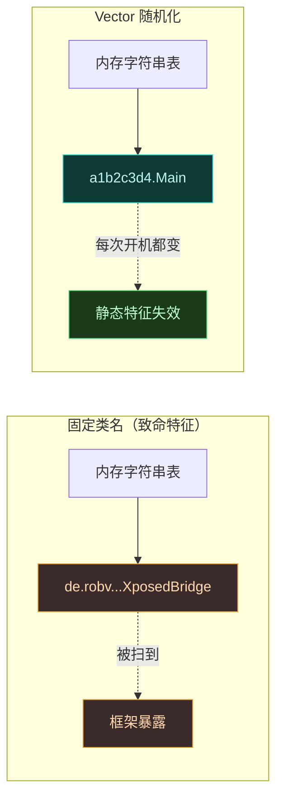
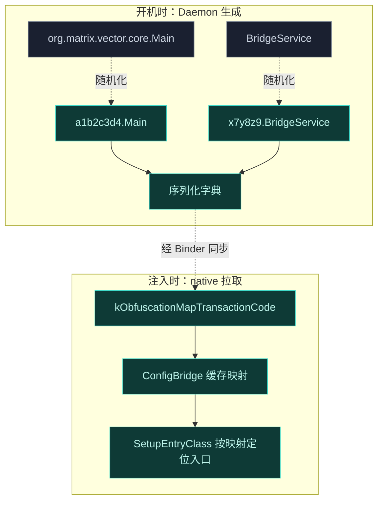
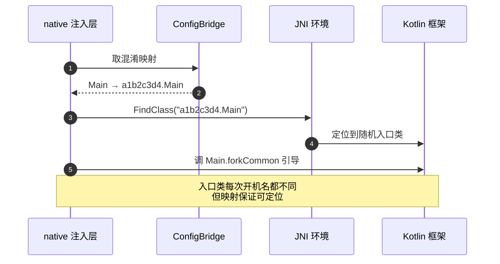
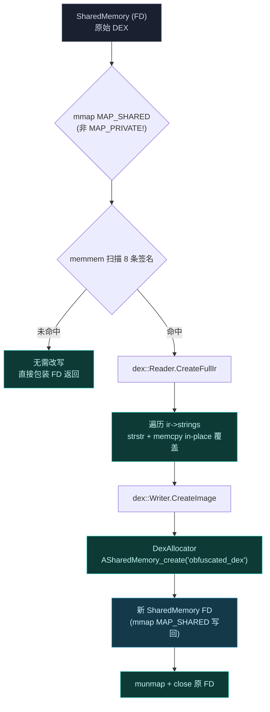
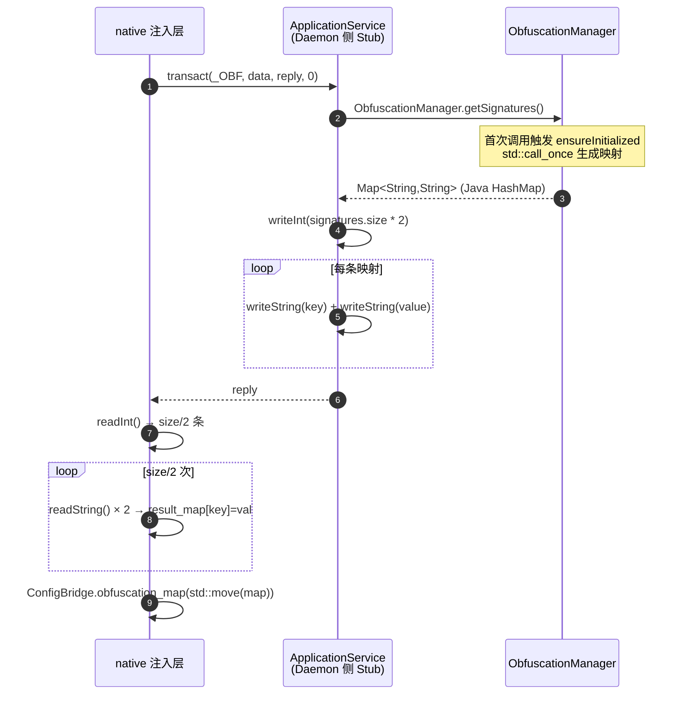
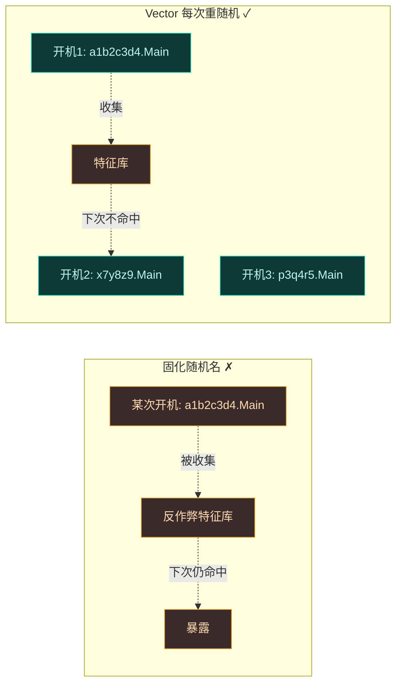

# 类名混淆机制

反作弊框架常按固定类名扫内存——`de.robv.android.xposed.XposedBridge` 这类符号一旦出现就暴露框架存在。Vector 的对策是：**每次开机都由 Daemon 随机化框架类名**，让框架每次启动后"长得都不一样"。这一页讲清楚混淆映射怎么生成、怎么同步、怎么用来定位入口。

## 为什么静态类名是致命特征

类名是字符串常量，编译进 DEX 后驻留在内存的字符串表里。反作弊只要扫描进程内存的 `.dex` 字符串区，按已知特征类名匹配，就能零成本确认框架存在。固定类名等于把框架签名刻在内存里。

## 映射的生成与同步

混淆映射是一份"原名 → 随机名"的字典。它由 Daemon 在开机时生成，native 层在注入时拉取同一份。两边必须用同一份映射，否则框架无法被定位。

生成逻辑在 [daemon/src/main/jni/obfuscation.cpp](https://github.com/android-security-engineer/Vector-skills/blob/master/daemon/src/main/jni/obfuscation.cpp) 的 `ensureInitialized`，用 `std::call_once` 保证进程内只生成一次。覆盖的签名前缀是硬编码的 8 条：

| 原始 Dex 签名前缀 | 对应的 Java 包/类族 | 谁会扫到 |
| :--- | :--- | :--- |
| `Lde/robv/android/xposed/` | 经典 Xposed API（`XposedBridge` 等） | 反作弊头号特征 |
| `Landroid/app/AndroidApp` | `AndroidAppHelper` 系 | 行为检测 |
| `Landroid/content/res/XRes` | `XResources`/`XTypedArray` | 资源 Hook 特征 |
| `Landroid/content/res/XModule` | 资源模块包装 | 资源 Hook 特征 |
| `Lio/github/libxposed/api/Xposed` | 现代 libxposed API | 新版特征 |
| `Lorg/matrix/vector/core/` | Vector 框架核心（含 `Main` 入口） | 框架自身 |
| `Lorg/matrix/vector/nativebridge/` | native 桥接层 | 框架自身 |
| `Lorg/matrix/vector/service/` | `BridgeService` 等 IPC 类 | 框架自身 |

### regen 算法：保持长度等长替换

`regen` 函数对每个前缀生成一段**等长**随机串。等长是刻意约束——DEX 字符串表里替换后偏移不变，slicer 的 IR 可直接 in-place `memcpy` 覆盖，无需重建整个 DEX 索引。算法细节：

- 字符集 `abcdefghijklmnopqrstuvwxyzABCDEFGHIJKLMNOPQRSTUVWXYZ`（52 字母，无数字/符号，避免触发其它特征匹配）。
- 每个 char 位有 ~10% 概率插入 `/`（包分隔符），但禁止 `L` 紧后斜杠、禁止末位前斜杠，避免破坏 Dex 类型描述符语法。
- 原串以 `/` 结尾（包前缀）则新串也以 `/` 结尾；否则末位随机字母——保持"是包前缀还是类前缀"的语义。

替换发生在两个层面：DEX 字符串表 in-place 改写（`obfuscateDex`），以及模块 init 列表里的类名前缀替换（`FileSystem.loadModule` 末尾 `moduleClassNames` 按映射 `replace`）。

Daemon 持有原版类名表，开机时为每个类名生成一段随机串，构建映射字典并序列化。注入时 native 模块经 `kObfuscationMapTransactionCode` 事务从 Daemon 拉取这份字典，存进 `ConfigBridge`（native 侧配置缓存单例）。

## SetupEntryClass：靠映射定位入口

native 的 `Context` 抽象基类定义了 `SetupEntryClass` 纯虚方法，由 Zygisk 模块的具体实现提供。这一步的任务是：在不硬编码类名的前提下，找到框架的 Kotlin 入口类并触发引导。

`SetupEntryClass` 从 `ConfigBridge` 取出映射，把逻辑类名 `org.matrix.vector.core.Main` 翻译成当前这次开机的随机名，再经 JNI `FindClass` 定位。同理定位 `BridgeService`——JNI Binder Trap 截获 `_VEC` 事务后，要把事务派发给 Kotlin 静态方法 `BridgeService.execTransact`，这个类名也是随机的。

## 两类需同步的资产

混淆不只覆盖入口类。注入时 native 需要从 Daemon 拉取两类资产，二者都经 Binder 事务码区分：

| 事务码 | 拉取内容 | 用途 |
| :--- | :--- | :--- |
| `kDexTransactionCode` | 框架 DEX（SharedMemory FD） | `InMemoryDexClassLoader` 引导 Kotlin 层 |
| `kObfuscationMapTransactionCode` | 序列化类名映射字典 | `SetupEntryClass` 定位随机入口 |

DEX 本身的类名在编译时就被随机化了，映射字典是"读这份 DEX 的索引"。两份资产必须来自同一次 Daemon 会话——映射与 DEX 不匹配则 `FindClass` 找不到入口，引导失败。

## DEX 字符串改写管线

混淆不只是给 native 层一份映射字典——DEX 文件本身的字符串表里，那些特征类名也得改掉，否则 `InMemoryDexClassLoader` 加载后内存字符串表里还是 `de.robv.android.xposed.XposedBridge`。改写发生在 Daemon 把 DEX 装进 `SharedMemory` 交付 native 之前。

[obfuscateDex](https://github.com/android-security-engineer/Vector-skills/blob/master/daemon/src/main/jni/obfuscation.cpp) 用 [dexlib/slicer](https://github.com/android-security-engineer/Vector-skills/blob/master/daemon/src/main/jni/obfuscation.h) 的 `dex::Reader` → IR → `dex::Writer` 管线：

两个工程上很关键的点（源码注释明确强调）：

1. **必须用 `MAP_SHARED` 而非 `MAP_PRIVATE`**。Android SharedMemory（ashmem/memfd）若以 `MAP_PRIVATE` 映射会触发 Copy-On-Write，而许多 Android 内核配置下 COW 层不会正确从源页 fault-in 初始内容，导致 native 侧看到全零页，slicer 立即失败。`MAP_SHARED` 保证直接访问 Java 层填充的物理页。
2. **in-place 零拷贝改写**。slicer 的 IR 字符串指针直接指向 mmap 缓冲区，`memcpy` 覆盖即更新 IR 状态，无需额外堆分配——安全是因为 Daemon 独占这个临时缓冲区生命周期，Java 调用方拿到新 SharedMemory 后会丢弃原始的。

[DexAllocator](https://github.com/android-security-engineer/Vector-skills/blob/master/daemon/src/main/jni/obfuscation.h) 是自定义的 `dex::Writer::Allocator`，它把 writer 产物写进新建的 ashmem（`ASharedMemory_create("obfuscated_dex", size)`），析构时 **不 close FD**——因为 FD 会被 `GetFd()` 提取出来交给 Java 侧的 `SharedMemory` 构造函数接管生命周期，避免双重 close。

## debug 构建禁用 DEX 混淆

DEX 混淆在 release 构建中默认开启，但 [DaemonState](https://github.com/android-security-engineer/Vector-skills/blob/master/daemon/src/main/kotlin/org/matrix/vector/daemon/data/DaemonState.kt) 把它写成 `isDexObfuscateEnabled = !BuildConfig.DEBUG`——debug 构建关闭。这是 [b71c33dd](https://github.com/android-security-engineer/Vector-skills/commit/b71c33dd) 提交引入的。

原因：部分 libxposed 模块（如 `io.github.mhmrdd.libxposed.ps.passit`/PlayStrong）在初始化时通过 JNI 按原签名调用 libxposed API 方法。DEX 混淆把这些签名改写后，模块的 JNI `FindClass`/`GetMethodID` 找不到类，初始化必失败。Vector 在 #597 重构中移除了用户侧"Xposed API 保护"开关（对多数用户过于技术化），因此 debug 构建成为兼容性测试通道——模块开发者用 debug 构建验证模块能否正常运行，再决定是否需要扩展兼容混淆模式（如继承 Xposed API 类）。

`OBFUSCATION_MAP_TRANSACTION_CODE` 事务在 debug 构建下仍会返回映射字典，但值等于键（`ApplicationService.onTransact` 里 `if (obfuscation) value else key`），native 侧 `SetupEntryClass` 拿到的就是原类名，行为等价于不混淆。

## FetchObfuscationMap 的事务格式

native 侧 [IPCBridge::FetchObfuscationMap](https://github.com/android-security-engineer/Vector-skills/blob/master/zygisk/src/main/cpp/ipc_bridge.cpp) 经 `kObfuscationMapTransactionCode` 事务拉取映射。Parcel 协议是自定义的：

`size * 2` 是因为 writeInt 写的是"键值对总数"（每个映射占 2 个 string），native 侧 `size / 2` 次循环每次读两个 string。这个 size 校验 `(size % 2 != 0)` 直接返回空 map——防止半截 Parcel 导致后续读串错位。

native 拉到后立刻 `ConfigBridge::GetInstance()->obfuscation_map(std::move(map))` 存进单例，后续 `SetupEntryClass` 与 `HookBridge` 都从这份缓存查，不再跨进程拉取。

## 对抗静态特征的多层设计

类名混淆不是孤立的防线，它与其它隐蔽设计叠加：

- **内存执行**：DEX 只在内存，不落盘，磁盘扫描找不到类文件。见 [内存 ClassLoader 体系](./loader)。
- **ClassLoader 隔离**：即便类名随机，若 ClassLoader 挂在标准链上，反射链可遍历。`VectorModuleClassLoader` 独占私有分支。
- **不注册服务**：`BridgeService` 不进 `ServiceManager`，按名查不到，只能经 `_VEC` 事务码触发。见 [IPC 与 Binder 中继](./ipc)。
- **dex2oat 抹痕**：编译产物里无框架类名残留（OAT 头被清洗）。

## 稳定性约束

随机化带来一个风险：映射不同步则框架无法引导。Vector 的保障：

1. **单一数据源**：映射只由 Daemon 生成，native 只拉取，不会本地生成第二份。
2. **开机时同步**：注入早期（`postServerSpecialize` / `postAppSpecialize`）就拉取映射，引导前必就绪。
3. **ConfigBridge 缓存**：拉取后缓存进 native 单例，后续 `FindClass` 都查缓存，避免反复跨进程拉取。

## 映射覆盖的范围

混淆映射不只覆盖一两个入口类。它是一份覆盖框架全部关键类的字典：

| 逻辑类 | 随机化后 | 谁用 |
| :--- | :--- | :--- |
| `org.matrix.vector.core.Main` | 每次开机随机 | `SetupEntryClass` 定位入口 |
| `BridgeService` | 每次开机随机 | JNI Trap 派发 `_VEC` 事务 |
| 框架内部服务类 | 每次开机随机 | Kotlin 框架内部反射 |
| Hook registry 相关类 | 每次开机随机 | native 回调 Java 层 |

原生符号（C++ 函数名）不在映射范围内——native 库本身就是 `libnative.a` 静态链接，符号在编译期已固定但不出现在 DEX 字符串表里。混淆针对的是 **DEX 字符串表里的 Java 类名**，因为那才是反作弊扫内存的主要目标。

## 为什么每次开机都重新随机

一个反问：为什么不一次性随机、固化为永久映射？因为固化的随机名本身又会变成新的静态特征——反作弊只要收集一次这个随机名，就能像对待 `XposedBridge` 一样对待它。每次开机重新随机，意味着反作弊即使收集到某次开机的类名，下次开机就失效了，无法建立持久特征库。

代价是每次开机都要重新同步映射，但这个开销在注入早期一次性付出，运行期无额外成本。

## 小结

| 环节 | 机制 |
| :--- | :--- |
| 映射生成 | Daemon 每次开机为框架类名生成随机串 |
| 映射同步 | native 经 `kObfuscationMapTransactionCode` 拉取同一份字典 |
| 入口定位 | `SetupEntryClass` 查 `ConfigBridge` 翻译类名，JNI `FindClass` |
| Trap 派发 | `BridgeService` 类名也随机，经映射定位 |
| 特征对抗 | 每次开机类名都变，静态签名失效 |
| 同步保障 | 单一数据源 + 注入早期同步 + native 缓存 |

## 相关链接

- [启动与注入链路](./boot-flow) — 混淆映射在两阶段注入中的时序
- [Zygisk 模块](./zygisk) — `SetupEntryClass` 与内存引导
- [Native 原生库](./native) — `Context` 抽象与 `ConfigBridge`
- [安全与隐蔽性设计](./security) — 混淆在整体隐蔽设计中的位置
