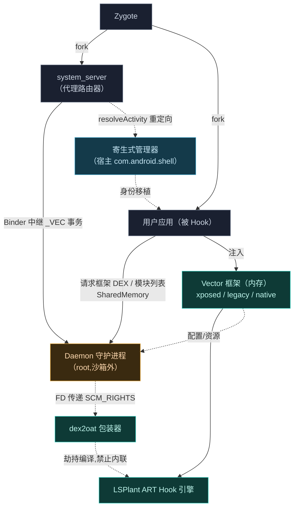
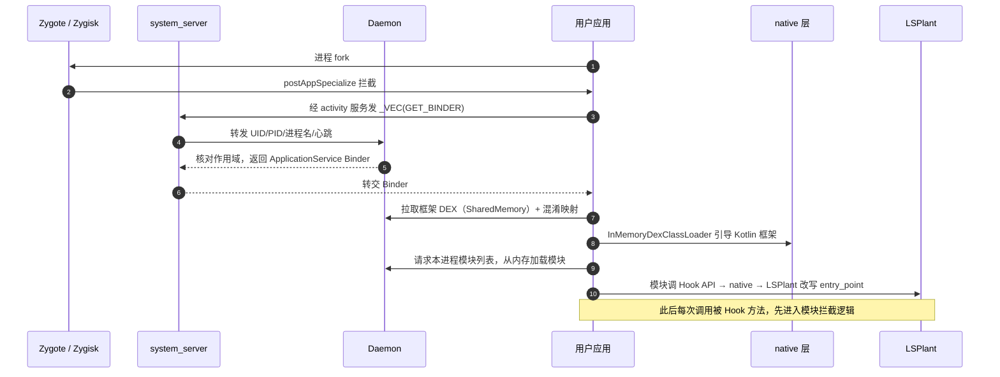
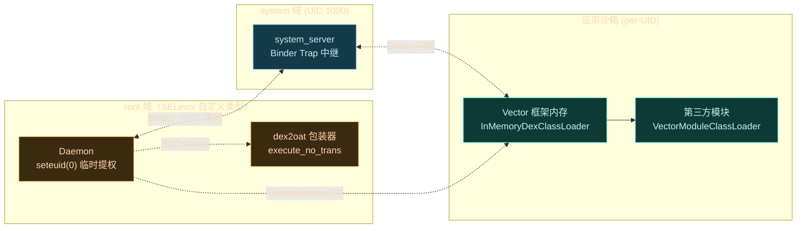

# 系统全景

Vector 由若干个边界清晰的子系统组成。这一页给出全局地图，后续每页深入一个子系统。

## Gradle 模块全景

Vector 的 Gradle 聚合工程在 [settings.gradle.kts](https://github.com/android-security-engineer/Vector-skills/blob/master/settings.gradle.kts) 中声明了以下模块（`native` 与 `magisk-loader` 不经 Gradle，分别由 CMake 与 shell 脚本产出）：

| 模块 | namespace | 产出 | 职责 |
| :--- | :--- | :--- | :--- |
| `:app` | `defaultManagerPackageName` | 管理器 APK | 寄生式管理器界面（不独立安装，经宿主进程加载） |
| `:daemon` | `org.matrix.vector.daemon` | `daemon` 二进制 | root 守护进程：IPC 资产服务器、模块数据库、状态管理 |
| `:dex2oat` | `org.matrix.vector.dex2oat` | dex2oat 包装器 | 劫持 AOT 编译器，禁止内联并抹除痕迹 |
| `:zygisk` | `org.matrix.vector` | Zygisk 模块 `.so` + Magisk 包 | 注入引擎：C++ Zygisk hook + Kotlin 框架引导 |
| `:xposed` | `org.matrix.vector.impl` | 框架 DEX 一部分 | libxposed 现代 API 实现：拦截器链、内存 ClassLoader |
| `:legacy` | `org.matrix.vector.legacy` | 框架 DEX 一部分 | 经典 `de.robv.android.xposed` API 兼容层 |
| `:services:daemon-service` | `org.lsposed.lspd.daemonservice` | AIDL 接口 | `ILSPApplicationService` / `ILSPSystemServerService` 等 Binder 契约 |
| `:services:manager-service` | `org.lsposed.lspd.managerservice` | AIDL 接口 | `ILSPManagerService` 管理面接口 |
| `:hiddenapi:stubs` | — | stub JAR | 编译期占位，提供 hidden API 符号 |
| `:hiddenapi:bridge` | — | bridge JAR | 运行期反射桥，访问非公开 API |
| `:external:axml` | — | 库 | 二进制 XML 解析（资源 Hook 依赖） |
| `:external:apache` | — | 库 | Apache 衍生工具（HTTP/编码） |
| `native`（CMake） | — | `libnative.a` | JNI 桥：ART 方法 Hook、ELF 解析、native 模块支持 |
| `magisk-loader`（脚本） | — | 打包脚本 | 把上述产物组装成可刷入的 Magisk 模块 zip |

## 组件地图

## 各子系统职责

| 子系统 | 语言 | 职责 | 深入阅读 |
| :--- | :--- | :--- | :--- |
| **Zygisk 模块** | C++ / Kotlin | 注入引擎：从 Zygote 接管进程创建，建立 IPC，从内存引导框架 | [→](./zygisk) |
| **Daemon 守护进程** | Kotlin / C++ | 沙箱外的协调者：状态管理、IPC 资产服务器、SELinux 安全区 | [→](./daemon) |
| **Native 原生库** | C++ | JNI 桥：ART 方法 Hook、资源改写、ELF 符号解析、native 模块支持 | [→](./native) |
| **dex2oat 劫持** | C++ | 劫持 AOT 编译器，禁止内联，并抹除劫持痕迹 | [→](./dex2oat) |
| **xposed 模块** | Kotlin | 现代 libxposed API 实现：拦截器链、内存 ClassLoader | [→](./xposed) |
| **legacy 模块** | Kotlin | 经典 Xposed API 兼容层：回调分发、资源 Hook、XSharedPreferences | [→](./legacy) |
| **资源 Hook** | Kotlin / C++ | 运行时替换应用资源：动态类层级、二进制 XML 突变 | [→](./resources) |

## 数据流：一次 Hook 是怎么发生的

以"用户应用启动时被 Hook"为例，串起所有子系统：

每一步都对应后续章节的一个子系统。建议按 [启动与注入链路](./boot-flow) → [IPC 与 Binder 中继](./ipc) 的顺序阅读，先把骨架建立起来，再逐个深入子系统。

## 进程拓扑与信任边界

Vector 的关键设计是：**只有 Daemon 持有 root**，应用进程里的框架代码运行在应用自己的沙箱权限下，root 与沙箱之间靠 Binder 跨越边界。下图展示各进程的信任级别与跨边界通道：

> [!TIP]
> Daemon 在向 `system_server` 投递主 Binder 时，会在 [VectorDaemon.kt](https://github.com/android-security-engineer/Vector-skills/blob/master/daemon/src/main/kotlin/org/matrix/vector/daemon/VectorDaemon.kt) 的 `sendToBridge` 中先 `Os.seteuid(0)`，事务完成后再 `Os.seteuid(1000)` 回落。这种"瞬时提权"把 root 暴露面压到最小。

## 关键源码索引

| 子系统 | 入口文件 |
| :--- | :--- |
| Zygisk C++ 模块 | [module.cpp](https://github.com/android-security-engineer/Vector-skills/blob/master/zygisk/src/main/cpp/module.cpp) |
| Zygisk IPC 桥 | [ipc_bridge.cpp](https://github.com/android-security-engineer/Vector-skills/blob/master/zygisk/src/main/cpp/ipc_bridge.cpp) |
| Kotlin 引导入口 | [Main.kt](https://github.com/android-security-engineer/Vector-skills/blob/master/zygisk/src/main/kotlin/org/matrix/vector/core/Main.kt) |
| Daemon 主入口 | [VectorDaemon.kt](https://github.com/android-security-engineer/Vector-skills/blob/master/daemon/src/main/kotlin/org/matrix/vector/daemon/VectorDaemon.kt) |
| Native 抽象引擎 | [context.cpp](https://github.com/android-security-engineer/Vector-skills/blob/master/native/src/core/context.cpp) |
| Hook 引擎注册表 | [hook_bridge.cpp](https://github.com/android-security-engineer/Vector-skills/blob/master/native/src/jni/hook_bridge.cpp) |
| 拦截器链 | [VectorChain.kt](https://github.com/android-security-engineer/Vector-skills/blob/master/xposed/src/main/kotlin/org/matrix/vector/impl/hooks/VectorChain.kt) |
