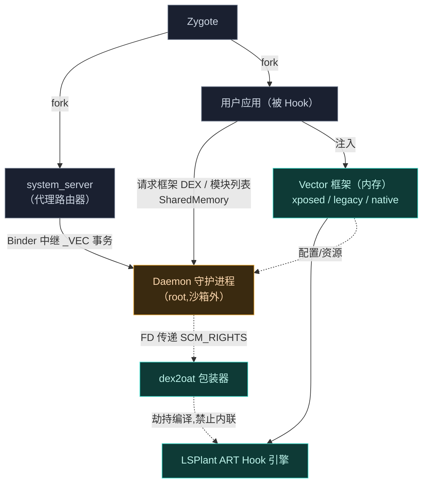
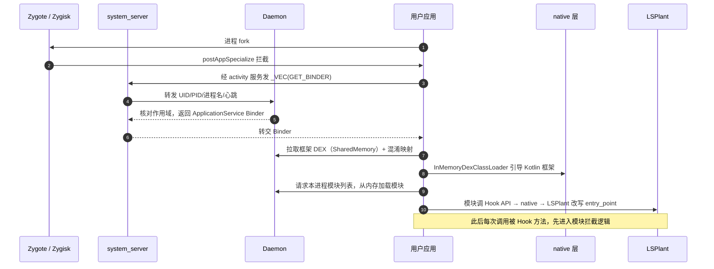

# 系统全景

Vector 由若干个边界清晰的子系统组成。这一页给出全局地图，后续每页深入一个子系统。

## 组件地图

## 各子系统职责

| 子系统 | 语言 | 职责 | 深入阅读 |
| :--- | :--- | :--- | :--- |
| **Zygisk 模块** | C++ / Kotlin | 注入引擎：从 Zygote 接管进程创建，建立 IPC，从内存引导框架 | [→](./zygisk) |
| **Daemon 守护进程** | Kotlin / C++ | 沙箱外的协调者：状态管理、IPC 资产服务器、SELinux 安全区 | [→](./daemon) |
| **Native 原生库** | C++ | JNI 桥：ART 方法 Hook、资源改写、ELF 符号解析、native 模块支持 | [→](./native) |
| **dex2oat 劫持** | C++ | 劫持 AOT 编译器，禁止内联，并抹除劫持痕迹 | [→](./dex2oat) |
| **xposed 模块** | Kotlin | 现代 libxposed API 实现：拦截器链、内存 ClassLoader | [→](./xposed) |
| **legacy 模块** | Kotlin | 经典 Xposed API 兼容层：回调分发、资源 Hook、XSharedPreferences | [→](./legacy) |
| **资源 Hook** | Kotlin / C++ | 运行时替换应用资源：动态类层级、二进制 XML 突变 | [→](./resources) |

## 数据流：一次 Hook 是怎么发生的

以"用户应用启动时被 Hook"为例，串起所有子系统：

每一步都对应后续章节的一个子系统。建议按 [启动与注入链路](./boot-flow) → [IPC 与 Binder 中继](./ipc) 的顺序阅读，先把骨架建立起来，再逐个深入子系统。
