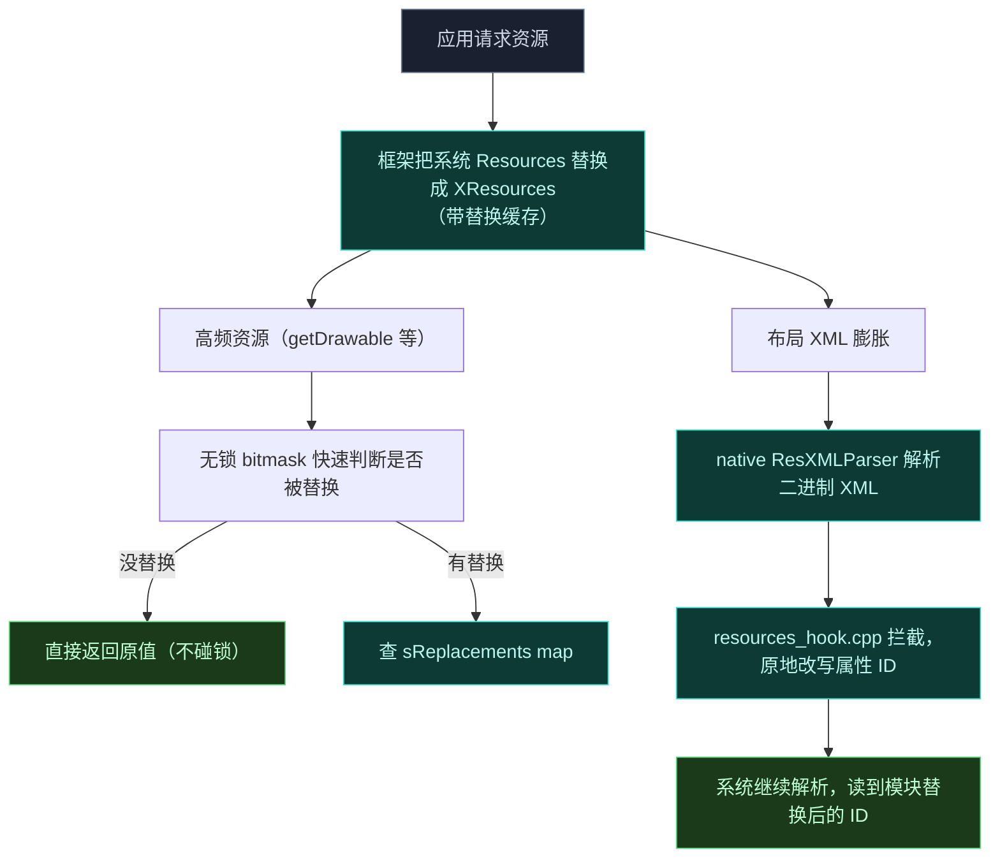
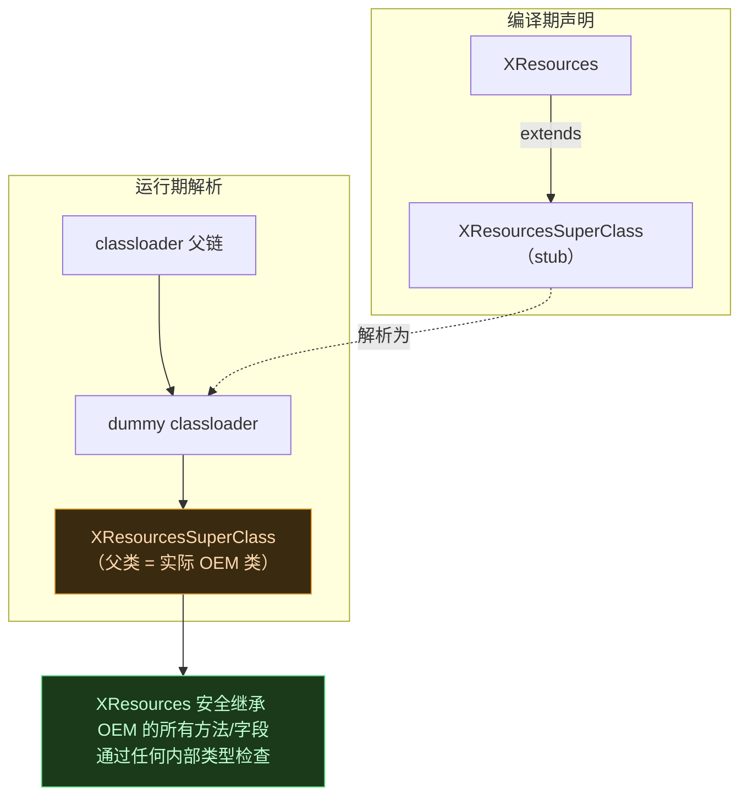
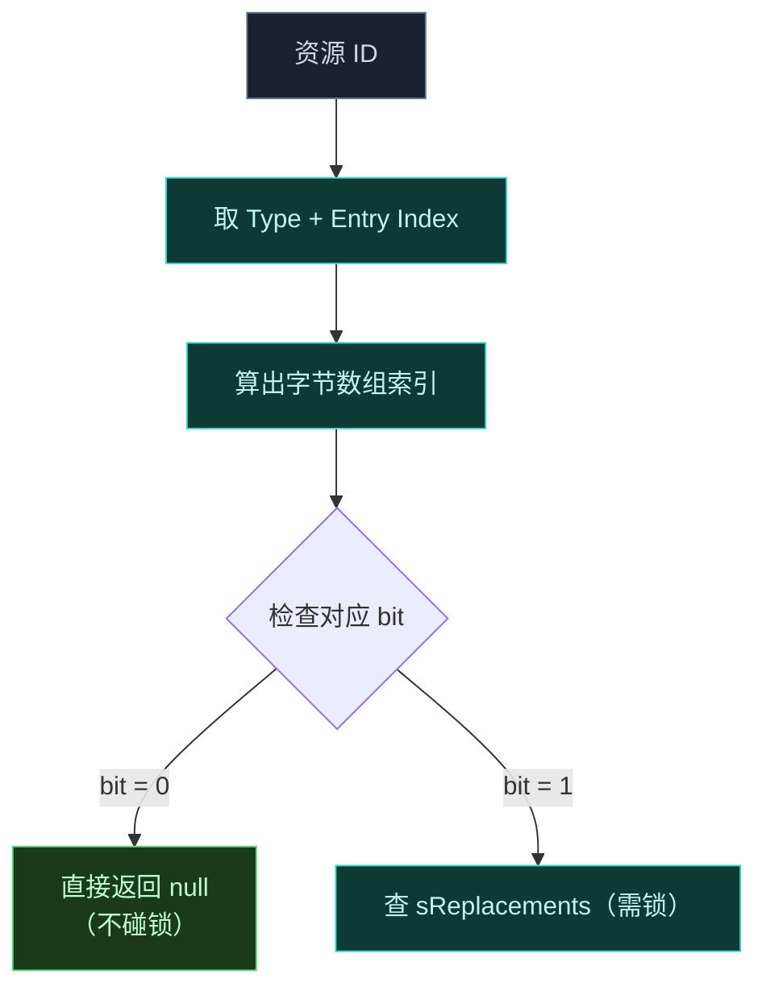
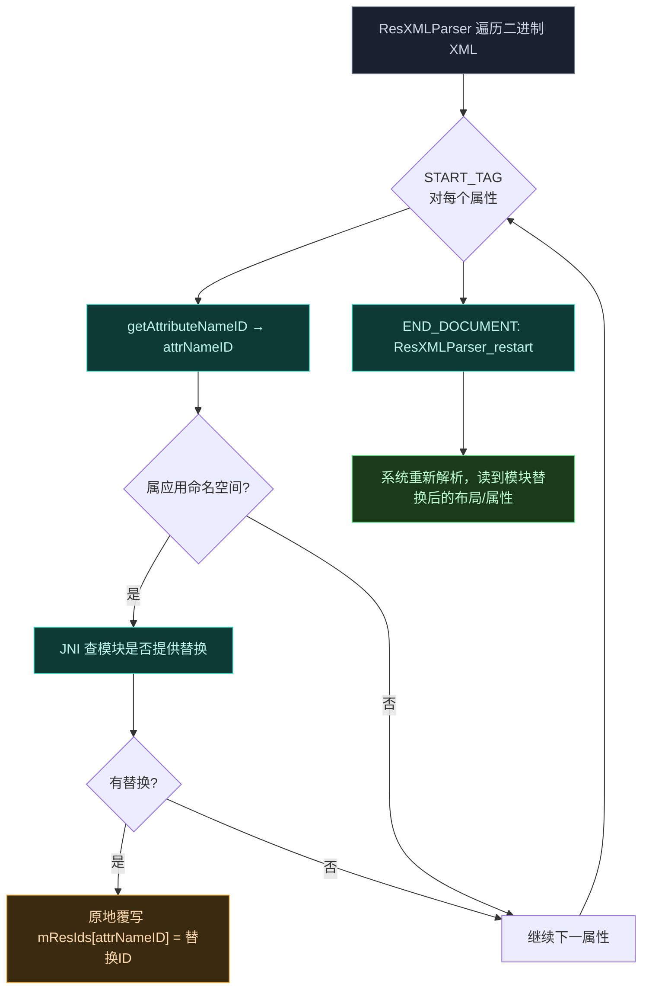

# 资源 Hook 子系统

资源 Hook 让 legacy 模块能在运行时替换应用资产、布局定义和字符串值。因为 Android 在 native C++ 代码里对资源检索与 XML 解析做了大量优化，这个子系统需要框架级注入、动态类生成与二进制 XML 结构的直接内存操作相结合。

## 整体思路

## 拦截资源查询

系统用默认 `Resources` 实例，框架替换为自定义 `XResources` 子类。框架启动时 `XposedInit.hookResources()` 拦截 `android.app.ResourcesManager`，对资源工厂方法应用 hook（Android 12+ 的 `createResources`、`createResourcesForActivity`，老版本的 `getOrCreateResources`）。应用请求新资源对象时，hook 回调执行 `cloneToXResources()`：实例化新 `XResources` 并经 `HiddenApiBridge.Resources_setImpl` 提取 `mResourcesImpl` 复制底层 OS 实现。新 `XResources` 实例注入回 OS 内部跟踪数组（如 `mResourceReferences` 或 `ActivityResource` 结构），包进 `WeakReference` 防内存泄漏。

## 动态类层级生成

### 问题

要拦截资源查询，框架须用 `XResources` 和 `XTypedArray` 替换 OS 提供的资源实例。但若硬编码 `XResources` 直接继承 AOSP 基类 `Resources`，当**深度定制的 OEM 框架**把注入对象强转回其私有类型时会触发致命 `ClassCastException`。

### 解法

运行时动态生成中间类层级。

1. 初始化时，`legacy` 模块的 `XposedBridge.initXResources` 检查系统资源与 typed array 的确切运行时类。
2. 调用 native 桥 `ResourcesHook.makeInheritable` 在 ART 层**剥离这些 OEM 类的 final 修饰符**，确保它们能被继承。
3. 调用 `ResourcesHook.buildDummyClassLoader`。native 实现用 `dex_builder` 库在内存缓冲区里构造 DEX 文件，生成名为 `xposed.dummy.XResourcesSuperClass` 和 `xposed.dummy.XTypedArraySuperClass` 的 dummy 类，动态把其父类设为之前检测到的确切 OEM 类。
4. 此内存缓冲经 `dalvik.system.InMemoryDexClassLoader` 加载进运行时。
5. `legacy` 模块操纵自身 classloader 的父链，覆盖 parent 字段指向内存中的 dummy classloader。

### ZUI 设备的边界情况

联想 ZUI 设备上，OEM 修改了 `obtainTypedArray` 实现，从 `android.app.ActivityThread.sCurrentActivityThread` 查询设备配置。Zygote 启动期间访问此字段返回 null，导致致命 `NullPointerException` 崩溃启动流程。legacy 模块的绕过：反射一个空的、未初始化的 `ActivityThread` 对象，注入静态 `sCurrentActivityThread` 字段，调用 `obtainTypedArray`，然后在 finally 块里立即把该字段置 null。

## 替换缓存与 native 二进制 XML 突变

### 无锁 bitmask 缓存

拦截高频渲染路径（如 `getDrawable`、`getColor`）并为模块替换查询标准 hash map 会引起严重锁竞争、降低 UI 线程性能。为此 `XResources` 用**无锁 bitmask 缓存**在 O(1) 时间内验证替换是否存在，再查主 `sReplacements` hash map。

- `sSystemReplacementsCache`：静态 256 字节数组，跟踪框架资源 ID（值小于 `0x7f000000`）。
- `mReplacementsCache`：128 字节数组，跟踪应用特定资源 ID（值大于等于 `0x7f000000`）。

bitmask 作为高性能快速路径拒绝过滤器，防止对未修改资源做同步 map 查询。注册时，框架把资源 ID 映射到字节数组的索引——从 Type 与 Entry Index 字段收获熵——并用 ID 最低 3 位设置特定位。资源检索时，`getReplacement` 做位检查；位为零则**立即返回 null 不获取 monitor**。这个 O(1) 检查确保多数资源请求绕过全局 `sReplacements` 锁，维持 UI 线程性能。

### 二进制 XML 突变

应用经 `LayoutInflater` 膨胀布局时，Android 用 native `android::ResXMLParser` C++ 类解析编译过的 AAPT 二进制 XML 文件。标准 Java hook 无法拦截此解析器内部的 ID 解析。为注入自定义模块布局，框架在内存里突变二进制 XML 树。

1. [resources_hook.cpp](https://github.com/android-security-engineer/Vector-skills/blob/master/native/src/jni/resources_hook.cpp) 的 `PrepareSymbols` 函数用 `ElfImage` 工具解析内存中的 `libandroidfw.so`，解析 `android::ResXMLParser::next`、`restart`、`getAttributeNameID` 的未导出 mangled C++ 符号，缓存其内存地址到全局函数指针。

2. 若请求的布局未缓存，`XResources` 提取 native 指针 (`mParseState`) 传给 JNI 桥 `rewriteXmlReferencesNative`。native 代码把 `jlong` 转回 `android::ResXMLParser*` 并执行循环，手动调用 `ResXMLParser_next`。

3. 解析器遇到 `android::ResXMLParser::START_TAG` token 时，提取属性计数并遍历该 tag 的属性。对每个属性，经缓存 `getAttributeNameID` 指针解析 `attrNameID`。若 ID 属于应用包命名空间 (`0x7f000000`)，经 JNI (`XResources.translateAttrId`) 查询 Java 层检查模块是否提供了替换。若返回替换 ID，native 代码**原地突变**二进制 XML 树，直接覆盖解析器内存分配里的整数 (`mResIds[attrNameID] = attrResID`)。对属性值引用经 `XResources.translateResId` 重复此评估与突变逻辑。

4. 到达 `END_DOCUMENT` token 时，native 循环退出并调用 `ResXMLParser_restart`。native 桥返回、Android 框架恢复膨胀过程时，它**不知不觉地解析了突变的二进制 XML 树**，正确解析模块提供的布局 ID。

这是整个框架最"硬核"的内存操作之一——直接改写 OS 解析器的内部数据结构，让系统自己把模块的布局读进去。
