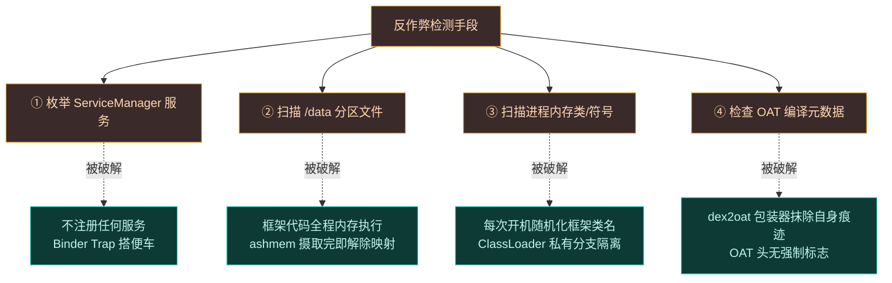
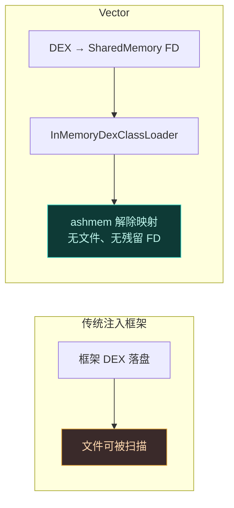
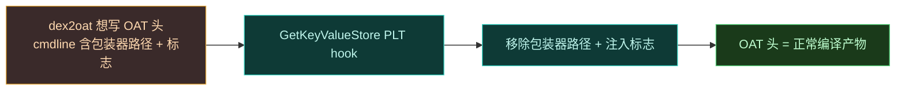
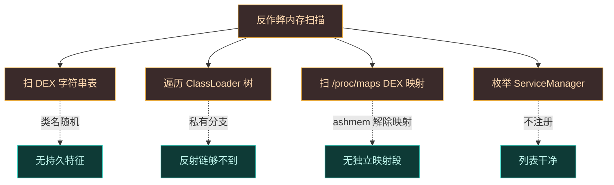

# 安全与隐蔽性设计

Vector 的首要设计约束不是"能不能 Hook"，而是"能不能不被发现"。这一页跨子系统汇总 Vector 对抗反作弊与静态特征检测的隐蔽设计——它不是某一行代码的功能，而是渗透在每个子系统里的工程哲学。

## 威胁模型

反作弊框架检测一个 Hook 框架，通常走四条路：枚举系统服务、扫描磁盘文件、扫描进程内存里的类与符号、检查编译产物元数据。Vector 对每一条都设了防线。

## 防线一：不注册任何服务

标准 Android IPC 把 AIDL 服务注册进 `ServiceManager`，别人按名字查。但 `service list` 可枚举——发现一个陌生 Hook 框架服务几乎是零成本。Vector 用 JNI Binder Trap 替换 `Binder.execTransact`，只认自有事务码 `_VEC`，借用 `activity`/`serial` 等公共通道搭便车。系统视角里什么都没发生。

详见 [IPC 与 Binder 中继](./ipc)。

## 防线二：内存执行，零磁盘足迹

Vector 不向 `/data` 分区写任何框架代码。

- 框架 DEX 经 `SharedMemory` FD 传递（`kDexTransactionCode`），C++ 层包成 `DirectByteBuffer` 初始化 `InMemoryDexClassLoader`。
- 模块 APK 映射进 ashmem，ART 摄取完 DEX 后**立即解除映射**，无 FD 残留。
- `VectorURLStreamHandler` 拦截 `jar:` 请求，从模块路径 native 读取资产，不触发 Android 全局 `JarFile` 缓存，避免 OS 级文件锁留下痕迹。

## 防线三：类名混淆与隔离

静态特征检测常按固定类名（如 `de.robv.android.xposed.XposedBridge`）扫内存。Vector 每次开机都由 Daemon **随机化**框架类名。

- native 层经 `kObfuscationMapTransactionCode` 拉取序列化字典。
- `SetupEntryClass` 用映射定位随机化入口类（`org.matrix.vector.core.Main`）和 `BridgeService`。
- 框架每次启动后"长得都不一样"，对抗基于类名/符号签名的静态特征。

详见 [类名混淆机制](./obfuscation)。

## 防线四：ClassLoader 隔离

即便类名随机，若模块 ClassLoader 挂在标准 `PathClassLoader` 链上，应用经 `ClassLoader.getParent()` 链式反射就能发现。`VectorModuleClassLoader` **独占**挂到框架私有分支，目标应用反射链找不到模块。配合 `jar:` 拦截，杜绝全局缓存泄露。详见 [内存 ClassLoader 体系](./loader)。

## 防线五：编译痕迹抹除

dex2oat 包装器往编译参数追加 `--inline-max-code-units=0` 禁内联，这会留下痕迹。`liboat_hook.so` 经 PLT hook 拦截 `art::OatHeader::GetKeyValueStore` 与 `ComputeChecksum`，从最终 `.oat` 头移除包装器路径和强制标志。最终编译产物看起来像正常编译的，元数据无异常。

详见 [dex2oat 编译劫持](./dex2oat)。

## 防线六：寄生式管理器

管理器**不**作为标准包安装。它掏空一个宿主进程（如 `com.android.shell`）以寄生模型运行：

- `ParasiticManagerSystemHooker` 拦截 `resolveActivity`，把管理器 Intent 重定向到宿主包，processName 设为管理器包名。
- native 在 `preAppSpecialize` 注入 `GID_INET` 保证网络，`ParasiticManagerHooker` 用管理器 APK 替换宿主 `ApplicationInfo`、伪造 `ContextImpl` 绕过包名校验、手动保存/恢复状态防旋转丢数据。
- 系统以为在跑 shell，实际跑的是管理器界面。桌面找不到图标，经系统通知进入。

详见 [Zygisk 模块 — 寄生式管理器](./zygisk#寄生式管理器与身份移植)。

## 防线七：SELinux 边界绕过

应用沙箱受 SELinux 强制访问控制约束，无法读跨进程数据目录。Daemon 预配 `xposed_data` 宽松上下文安全区，legacy 偏好读写透明重定向到此，应用用标准 `FileInputStream` 直接读，**无 IPC 开销**，也不暴露 Binder 服务。详见 [SELinux 边界处理](./selinux)。

## 隐蔽性 vs 稳定性权衡

隐蔽设计不能牺牲宿主稳定性。几个体现：

| 隐蔽机制 | 潜在风险 | 稳定兜底 |
| :--- | :--- | :--- |
| 随机类名 | 映射不同步则框架无法引导 | native 拉取同一份映射，开机同步 |
| 内存 ClassLoader | ashmem 泄漏 FD | ART 摄取完立即解除映射 |
| dex2oat 劫持 | 编译器不兼容致启动失败 | `resetprop` 注入 `dex2oat-flags` 回退 |
| Binder Trap | 误截获系统事务 | 仅认 `_VEC` 码，其余原样放行 |
| 寄生管理器 | 系统不知伪造 Activity，旋转丢状态 | 拦 `performStopActivityInner` 手动保存恢复 |

## 对抗内存扫描的纵深

静态特征被混淆打破后，反作弊可能转向**运行时内存扫描**——遍历进程的 `.dex` 映射区、ArtMethod 表、class loader 树。Vector 的对策是多层的：

- **类名随机化**：每次开机变，无持久特征（见 [类名混淆机制](./obfuscation)）。
- **ClassLoader 隔离**：模块挂在框架私有分支，不进应用 classpath 主链，反射遍历到不了。
- **ashmem 即时解除映射**：DEX 摄取完，内存映射取消，扫描 `/proc/pid/maps` 找不到独立 DEX 映射段。
- **无服务注册**：`ServiceManager` 里查不到任何 Vector 服务，`service list` 干净。

每一层单独都不绝对可靠——比如类名随机后，框架行为特征（Hook 了哪些系统方法）仍可能被行为分析捕获。Vector 的策略是**抬高检测成本到不划算**：反作弊要稳定检测 Vector，得投入运行时行为分析或针对 Hook 引擎本身的指纹，这比扫字符串表难几个数量级。对绝大多数场景，这已足够。

## 小结

| 威胁面 | 防线 | 涉及子系统 |
| :--- | :--- | :--- |
| 服务枚举 | Binder Trap 搭便车，不注册服务 | [IPC](./ipc) / [Zygisk](./zygisk) |
| 磁盘扫描 | 框架全程内存执行，ashmem 即时解除映射 | [Loader](./loader) / [Boot-flow](./boot-flow) |
| 内存类名特征 | 每次开机随机化框架类名 | [Obfuscation](./obfuscation) |
| 反射链探测 | ClassLoader 私有分支隔离 | [Loader](./loader) |
| 编译元数据 | dex2oat 包装器抹除 OAT 头痕迹 | [dex2oat](./dex2oat) |
| 管理器暴露 | 寄生宿主进程，系统不知其存在 | [Zygisk](./zygisk) |
| 跨进程数据访问 | Daemon 预配 SELinux 安全区 | [SELinux](./selinux) |

## 相关链接

- [IPC 与 Binder 中继](./ipc) — 不注册服务的通信
- [Zygisk 模块](./zygisk) — 寄生管理器与身份移植
- [类名混淆机制](./obfuscation) — 随机化类名
- [内存 ClassLoader 体系](./loader) — 隔离与零磁盘足迹
- [SELinux 边界处理](./selinux) — 安全区与偏好绕过
- [dex2oat 编译劫持](./dex2oat) — 编译痕迹抹除
