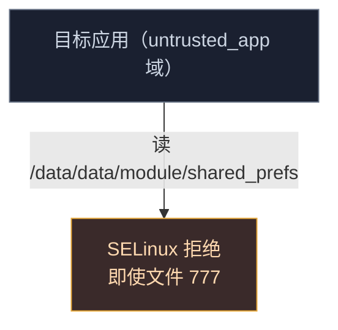
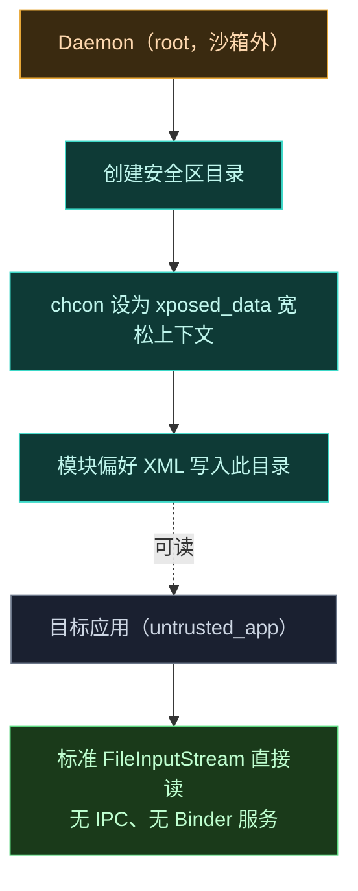
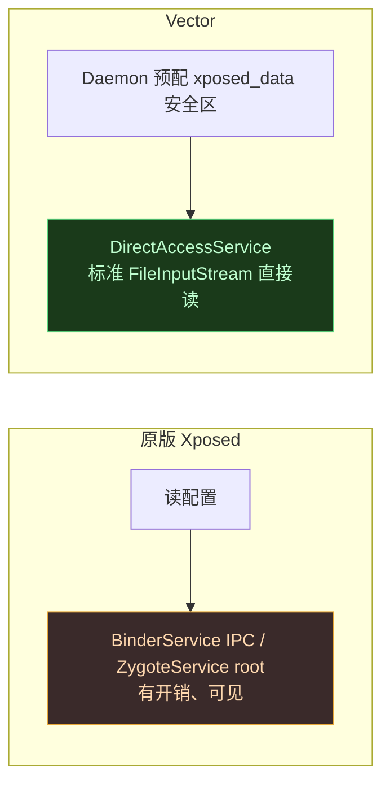
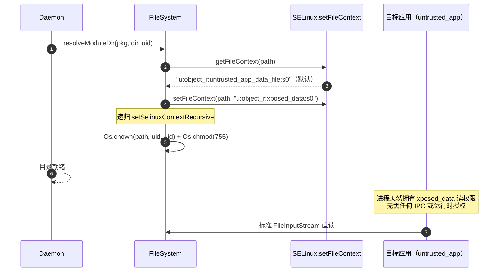
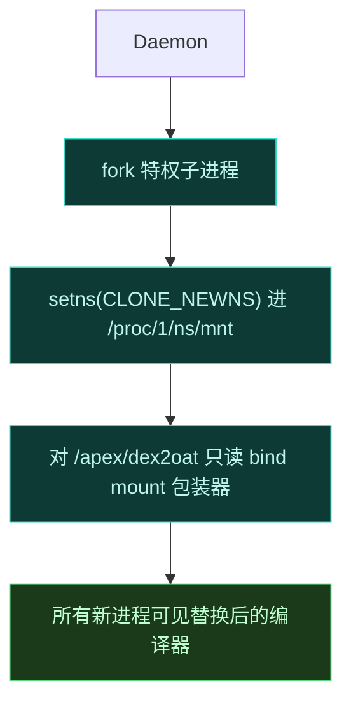
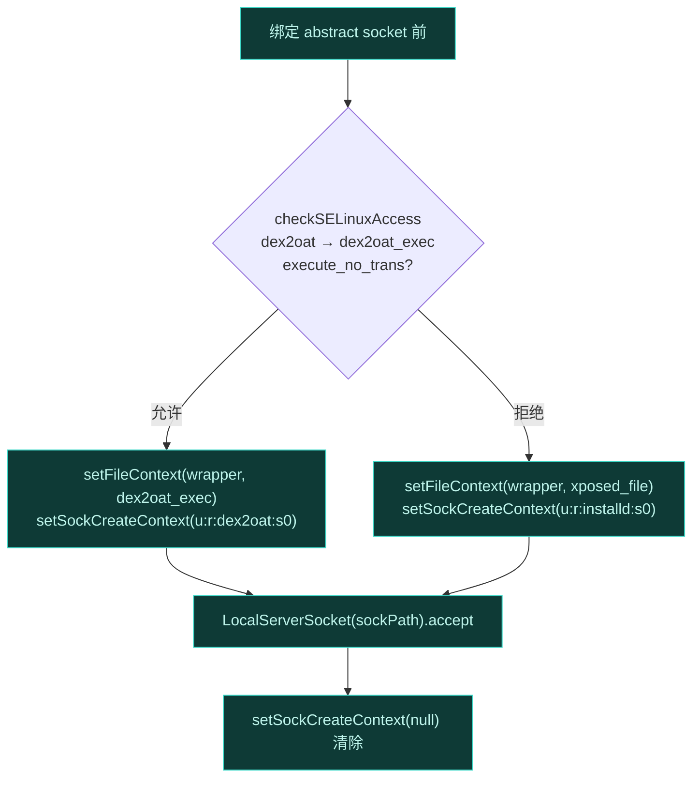
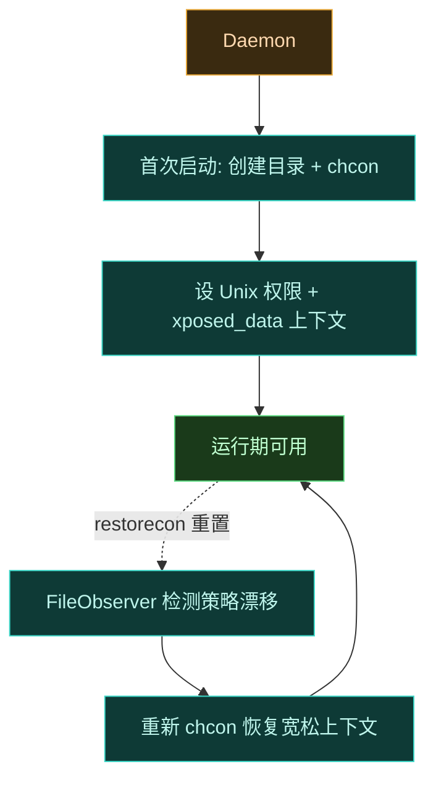

# SELinux 边界处理

Android 的 SELinux 是**强制访问控制（MAC）**——无论 Unix 文件权限怎么设，策略不让访问就是不让。目标应用进程受 `untrusted_app` 域约束，连读另一个应用的数据目录都被拒。这一页聚焦 Vector 如何在不破坏系统策略稳定性的前提下，跨过 SELinux 边界读写配置与执行提权操作。

## 问题：SELinux 比文件权限更狠

经典 Xposed 依赖 `Context.MODE_WORLD_READABLE` 让目标应用直接读模块的 `/data/data/<package>/shared_prefs/`。Android 7.0 起用此标志直接抛 `SecurityException`。更根本的是，即便文件权限是 world-readable，SELinux 策略仍强制应用数据隔离，跨进程目录遍历被拒。



原版 Xposed 的绕过需经 `BinderService` 同步 IPC 或 `ZygoteService` 的 native root 访问——有 IPC 开销、且对反作弊可见。Vector 走另一条路。

## 策略注入位置：Magisk sepolicy.rule

Vector 的 SELinux 策略不是运行时动态 patch，而是在**模块安装时**由 Magisk/KernelSU 的 `sepolicy.rule` 机制注入系统策略。这份规则文件在 [zygisk/module/sepolicy.rule](https://github.com/android-security-engineer/Vector-skills/blob/master/zygisk/module/sepolicy.rule) 中定义，由 root 管理器在 `sepolicy` 编译阶段追加进内核策略：

```
allow dex2oat dex2oat_exec file execute_no_trans
allow dex2oat system_linker_exec file execute_no_trans

allow shell shell dir write

type xposed_file file_type
typeattribute xposed_file mlstrustedobject
allow {dex2oat installd isolated_app shell} xposed_file {file dir} *

allow dex2oat {unlabeled tmpfs} file *
allow zygote dex2oat unix_stream_socket *

type xposed_data file_type
typeattribute xposed_data mlstrustedobject
allow * xposed_data {file dir} *
```

策略分三组，对应三条防线：

| 策略组 | 主体 → 客体 | 权限 | 服务的防线 |
| :--- | :--- | :--- | :--- |
| dex2oat 执行 | `dex2oat` → `dex2oat_exec` / `system_linker_exec` | `execute_no_trans` | 包装器可执行，且不触发域转换 |
| `xposed_file` | `{dex2oat, installd, isolated_app, shell}` → `xposed_file` | 全权限 | 包装器二进制、`liboat_hook.so`、模块 bin 可被多方访问 |
| `xposed_data` | `*` → `xposed_data` | 全权限 | **应用偏好安全区**：任何域可读写 |

`typeattribute ... mlstrustedobject` 是关键——它把 `xposed_file` / `xposed_data` 标记为 MLS 受信客体，跨 MLS 级别访问不再被拒，否则即便 `allow` 规则放行，MLS 隔离仍会阻挠多用户场景下的访问。

### asciiflow：SELinux 策略注入与三条防线

```
                    Magisk/KernelSU 模块安装
                              │
                              ▼
              ┌─────────────────────────────────┐
              │  zygisk/module/sepolicy.rule    │
              │  (静态策略, 安装时注入 sepolicy) │
              └───────────────┬─────────────────┘
                              │ 追加进内核策略
              ┌───────────────┼───────────────┐
              ▼               ▼               ▼
       ┌─────────────┐ ┌─────────────┐ ┌─────────────┐
       │  防线① 挂载  │ │ 防线② 通信  │ │ 防线③ 数据  │
       │ dex2oat 域  │ │ zygote→dex2 │ │ xposed_data │
       │ execute_    │ │ oat socket  │ │ mlstrusted  │
       │ no_trans    │ │ allow *     │ │ allow * *   │
       └──────┬──────┘ └──────┬──────┘ └──────┬──────┘
              │               │               │
              ▼               ▼               ▼
       /apex/dex2oat    abstract socket   /data/adb/lspd
       只读 bind mount  (名随机化)         模块偏好目录
       包装器可见        包装器↔Daemon      untrusted_app
                         通信不被拒         直接 FileInputStream
```

## 解法一：Daemon 预配 `xposed_data` 安全区

Daemon 运行在沙箱外，有 root 权限。它预先创建一个目录，并用 `chcon` / `restorecon` 把该目录的 SELinux 上下文设为**宽松的 `xposed_data` 上下文**——这个上下文允许 `untrusted_app` 域直接读。



关键点：安全区的上下文是 Daemon 预先赋予的，**目标应用进程天然拥有读权限**，不需要运行时再经任何 IPC 获取。这把"绕过 SELinux"从每次读都付的 IPC 成本，变成了开机时一次性的部署成本。

## 解法二：legacy 侧透明重定向

安全区建好了，但模块代码不该感知"安全区"的存在——它写的还是标准 `SharedPreferences` API。`legacy` 模块在模块自身 UI 进程内拦截配置保存机制：

1. **标志剥离**：`hookNewXSP` hook `ContextImpl.checkMode`。若 mode 含 `MODE_WORLD_READABLE` 位，把 hook throwable 设为 null 抑制 `SecurityException`。
2. **路径重定向**：hook `getPreferencesDir`，不返回标准隔离数据目录，而返回经 `VectorServiceClient.getPrefsPath` 取得的安全区路径。

模块尝试保存 `SharedPreferences` 时，Android 框架透明地把 XML 写进 SELinux 宽松桥。

## 解法三：移除原版 IPC 垫片

目标应用被 hook 并实例化 `XSharedPreferences` 时，框架按 API level 决定路径。对现代模块，完全绕过 legacy `/data/data` 路径，直接映射到安全区。

因安全区已有宽松上下文，目标应用进程有直接读权限。`SELinuxHelper` 无条件返回 `DirectAccessService`（`BaseService` 实现），纯粹作为结构性 API 垫片维持 `XSharedPreferences` 内部缓存逻辑兼容性，用标准 `FileInputStream`/`BufferedInputStream` 做原始读取，**无 IPC 开销**。



### `xposed_data` 上下文的设置点

安全区上下文不是在 shell 脚本里 `chcon`，而是 Kotlin Daemon 经 `android.os.SELinux.setFileContext` 精确设置。两个核心落点：

- [FileSystem.resolveModuleDir](https://github.com/android-security-engineer/Vector-skills/blob/master/daemon/src/main/kotlin/org/matrix/vector/daemon/data/FileSystem.kt)：解析模块偏好目录时，若 `SELinux.getFileContext(path) != "u:object_r:xposed_data:s0"`，递归调用 `setSelinuxContextRecursive` 把整个目录树刷成 `xposed_data` 上下文，同时 `Os.chown` 改属主为模块 UID、`Os.chmod 755`。
- [ConfigCache.setupMiscPath](https://github.com/android-security-engineer/Vector-skills/blob/master/daemon/src/main/kotlin/org/matrix/vector/daemon/data/ConfigCache.kt)：管理器偏好根目录 `/data/misc/<uuid>` 首次创建时权限 `rwx--x--x`，同样递归刷 `xposed_data` 上下文。

这样 Daemon 进程（受 `u:r:daemon:s0` 或 root 域约束）作为唯一的上下文设置者，目标应用进程**不参与**任何 SELinux 操作——它只是天然拥有对 `mlstrustedobject` 客体的读权限。



## 实时更新：inotify 监视

标准 Android IPC（广播、ContentProvider）对跨进程偏好跟踪过于可见。`XSharedPreferences` 实现进程内文件系统监视器：注册 `OnSharedPreferenceChangeListener` 时，框架起内部守护线程 `sWatcherDaemon`，用 `java.nio.file.WatchService`（Linux `inotify` 抽象）监视安全区目录。线程阻塞在 `sWatcher.take()`，收到 XML 文件的 `ENTRY_MODIFY`/`ENTRY_DELETE` 事件时校验文件哈希并 native 派发 legacy 偏好变更回调。

完全基于文件系统事件，不引入任何 Binder 通信。

## 进程外提权：setns 与 CLONE_NEWNS

Daemon 不仅处理偏好，还负责 dex2oat 编译劫持的全局挂载——这需要进入 init (PID 1) 的挂载命名空间。具体实现在 [doMountNative](https://github.com/android-security-engineer/Vector-skills/blob/master/daemon/src/main/jni/dex2oat.cpp)：Daemon fork 一个特权子进程，用 `setns` 配 `CLONE_NEWNS` 经 `/proc/1/ns/mnt` 进入 init 挂载命名空间，对 `/apex` 下的 `dex2oat`/`dex2oat64` 执行只读 bind mount，让替换后的编译器二进制对所有新进程可见。

挂载分两步：先 `mount(MS_BIND)` 把包装器覆盖到 apex 原路径，再 `mount(MS_BIND | MS_REMOUNT | MS_RDONLY)` 重新挂为只读，防止运行期被篡改。子进程最后 `execlp("resetprop", ...)` 删除 `dalvik.vm.dex2oat-flags` 属性（因为现在由包装器接管编译，不再需要属性级回退）。Daemon 探测包装器是否真正生效用 `Os.stat` 比较 `/proc/1/root$bin` 与本地 wrapper 的 `st_dev`/`st_ino`——init 命名空间视角下两者相同即挂载成功。



## socket 创建上下文：sockcreate

dex2oat 包装器经 abstract UNIX domain socket 与 Daemon 通信。abstract socket 默认继承创建进程的 SELinux 上下文，可能被策略拒绝。Daemon 在绑定 socket 前**动态写 `/proc/self/task/[tid]/attr/sockcreate`**，指示内核用特定上下文标记该 abstract socket。

具体实现在 [daemon/src/main/jni/dex2oat.cpp](https://github.com/android-security-engineer/Vector-skills/blob/master/daemon/src/main/jni/dex2oat.cpp) 的 `setsockcreatecon_raw`：它按 `gettid()` 拼出 `/proc/self/task/[tid]/attr/sockcreate` 路径，写入目标上下文串（含 `\0` 终止），绑定 socket 后再写空值清除。Daemon 侧 [Dex2OatServer.runSocketLoop](https://github.com/android-security-engineer/Vector-skills/blob/master/daemon/src/main/kotlin/org/matrix/vector/daemon/env/Dex2OatServer.kt) 按 SELinux 当前策略**二选一**选上下文：



两条路径分别对应"系统策略已放行 dex2oat 域"和"未放行、回退到 installd 域"，保证无论策略如何组合，包装器都能连上 socket。

### socket 名的安装时随机化

socket 名本身是一个固定占位哈希 `5291374ceda0aef7c5d86cd2a4f6a3ac`（见 `getSockPath` 返回值），但 [customize.sh](https://github.com/android-security-engineer/Vector-skills/blob/master/zygisk/module/customize.sh) 在模块安装时用 `sed` 把这个哈希替换成 `/dev/urandom` 生成的 32 位随机串——**同一个 zip 在不同设备、不同安装实例上 socket 名都不同**，且 daemon.apk 与 dex2oat32/64 中的占位串被同步替换，保证三处引用一致。反作弊无法预知 socket 名枚举。

## permissive 监控与动态重挂载

Daemon 不能假设系统永远在 enforcing 模式。[Dex2OatServer](https://github.com/android-security-engineer/Vector-skills/blob/master/daemon/src/main/kotlin/org/matrix/vector/daemon/env/Dex2OatServer.kt) 经 `FileObserver` 监控 `/sys/fs/selinux/enforce` 及 `/sys/fs/selinux/policy`（`CLOSE_WRITE` 事件）。系统切到 permissive 或改动策略时，Daemon 动态重新挂载 dex2oat 包装器——因为 permissive 意味着策略可能被人为放宽，此时重新确认挂载状态可保证劫持链路不丢。

监控分四种兼容性状态：

| 状态常量 | 触发条件 | Daemon 动作 |
| :--- | :--- | :--- |
| `DEX2OAT_OK` (0) | enforcing + 策略正确 | 正常运行 |
| `DEX2OAT_SELINUX_PERMISSIVE` (3) | `/sys/fs/selinux/enforce` 非 `1` | 卸载包装器（`doMount(false)`） |
| `DEX2OAT_SEPOLICY_INCORRECT` (2) | `untrusted_app` 可 `execute`/`execute_no_trans` dex2oat_exec | 卸载包装器 |
| `DEX2OAT_MOUNT_FAILED` (1) / `DEX2OAT_CRASHED` (4) | bind mount 失败 / socket 循环崩溃 | 停止观察，回退到属性注入 |

`hasSePolicyErrors` 用 `SELinux.checkSELinuxAccess("u:r:untrusted_app:s0", "u:object_r:dex2oat_exec:s0", "file", "execute")` 探测——若策略竟允许 `untrusted_app` 直接执行 dex2oat，说明系统策略被破坏，此时 Vector 反而卸载自己的包装器以免在不稳定环境里雪上加霜。

若包装器被禁用或不兼容，Daemon 卸载二进制并以 `resetprop` 把 `--inline-max-code-units=0` 直接注入 `dalvik.vm.dex2oat-flags` 系统属性作为回退（见 [daemon/src/main/jni/dex2oat.cpp](https://github.com/android-security-engineer/Vector-skills/blob/master/daemon/src/main/jni/dex2oat.cpp) 的 `doMountNative`：enabled 时 `resetprop --delete dalvik.vm.dex2oat-flags`，disabled 时写入 `--inline-max-code-units=0`）。

## 安全区目录的生命周期

`xposed_data` 安全区不是一次性建好就完事。它的上下文需要随系统状态动态维护：

- **创建时**：Daemon 在首次启动时创建目录，`chcon` 设上下文，并设置 Unix 权限让 `untrusted_app` 可读。
- **策略漂移时**：若系统重载 SELinux 策略（如 OTA 后 `restorecon` 重置上下文），Daemon 的 `FileObserver` 检测到策略文件变化，重新 `chcon` 恢复宽松上下文。
- **卸载时**：Magisk 模块卸载脚本清理安全区，避免残留。



这种动态恢复至关重要——`restorecon` 是 Android 启动和 OTA 后的常规操作，会把目录上下文重置回默认 `untrusted_app_data_file`，此时目标应用又读不了了。Daemon 必须主动维持上下文，否则偏好读取会在某次重启后静默失效。

## 隐私属性采集的上下文隔离

Daemon 在采集 `getprop` / `dmesg` 用于排错日志时也要过 SELinux 边界。[LogcatMonitor.dumpPropsAndDmesg](https://github.com/android-security-engineer/Vector-skills/blob/master/daemon/src/main/kotlin/org/matrix/vector/daemon/env/LogcatMonitor.kt) 采集 `getprop` 输出前，先 `SELinux.setFSCreateContext("u:object_r:app_data_file:s0")` 临时假设一个不可信上下文，再在子 shell 里 `echo -n u:r:untrusted_app:s0 > /proc/thread-self/attr/current` 把当前线程域切到 `untrusted_app`，**以应用视角执行 getprop**，这样属性文件写入的上下文与普通应用一致，不会泄漏 daemon 域可见但应用不可见的敏感属性。采集完 `finally` 块里 `setFSCreateContext(null)` 恢复。

这是 SELinux 边界的另一面：不只是"让应用读 daemon 的数据"，还要"让 daemon 模拟应用视角采集数据"，保证排错日志不成为信息泄露通道。

## 为什么不直接关 SELinux

一个诱人的简化方案是 `setenforce 0` 把整个系统切 permissive。Vector **不这么做**：

- 全局 permissive 是反作弊的高危信号，许多检测会直接判定环境异常。
- 全局放宽破坏所有应用隔离，引入系统性安全风险。
- Daemon 只在自己需要的边界上做最小化绕过（安全区目录上下文、socket 上下文），系统其余部分仍 enforcing。

这是 Vector 一以贯之的原则：**隐蔽性与系统稳定性优先于实现简单**。每个 SELinux 绕过都精确到具体资源，不碰全局策略。

## socket 上下文与全局挂载的协同

注意 `sockcreate` 与 `setns` bind mount 是两个不同维度的 SELinux 处理：前者管的是**通信端点**的上下文（dex2oat 包装器连 abstract socket 不被拒），后者管的是**文件系统可见性**（所有新进程能看到替换后的编译器）。二者加上安全区目录的 `chcon`，共同构成 Daemon 的三条 SELinux 防线——通信、挂载、数据访问，各管一摊，互不耦合。

## 小结

| SELinux 难题 | Vector 解法 |
| :--- | :--- |
| 应用读不了模块数据目录 | Daemon 预配 `xposed_data` 宽松上下文安全区 |
| `MODE_WORLD_READABLE` 抛异常 | hook `checkMode` 剥离标志位 |
| 标准数据目录写不到安全区 | hook `getPreferencesDir` 重定向路径 |
| 原版需 IPC 绕过 SELinux | `DirectAccessService` 直接 `FileInputStream` 读，无 IPC |
| 跨进程偏好实时同步 | `inotify` 文件监视，不走 Binder |
| bind mount 需进 init 命名空间 | `setns` + `CLONE_NEWNS` 经 `/proc/1/ns/mnt` |
| abstract socket 被策略拒 | 写 `sockcreate` 指定上下文，socket 名随机化 |
| 系统切 permissive 致策略漂移 | `FileObserver` 监控 enforce 文件，动态重挂载 |

## 相关链接

- [Daemon 守护进程](./daemon) — Daemon 整体职责
- [Legacy 兼容层](./legacy#sharedpreferences-与-selinux-边界) — 偏好重定向细节
- [dex2oat 编译劫持](./dex2oat) — socket 通信与编译器挂载
- [安全与隐蔽性设计](./security) — 跨子系统隐蔽设计汇总
