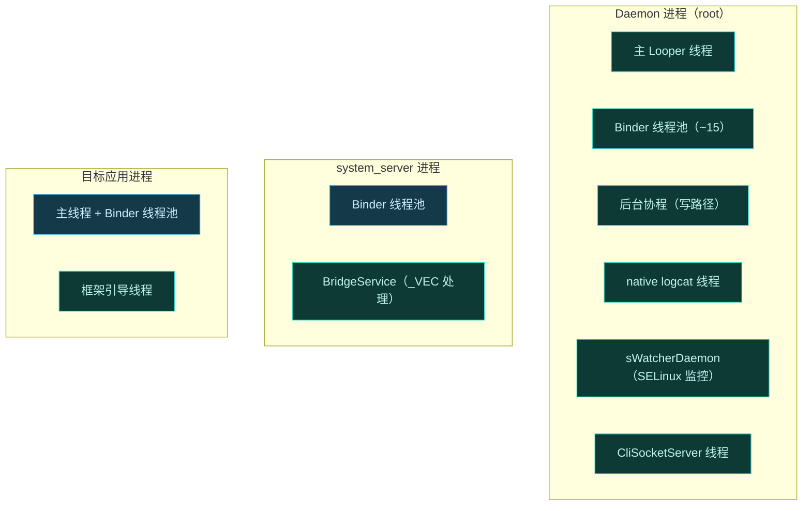
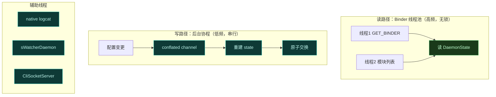
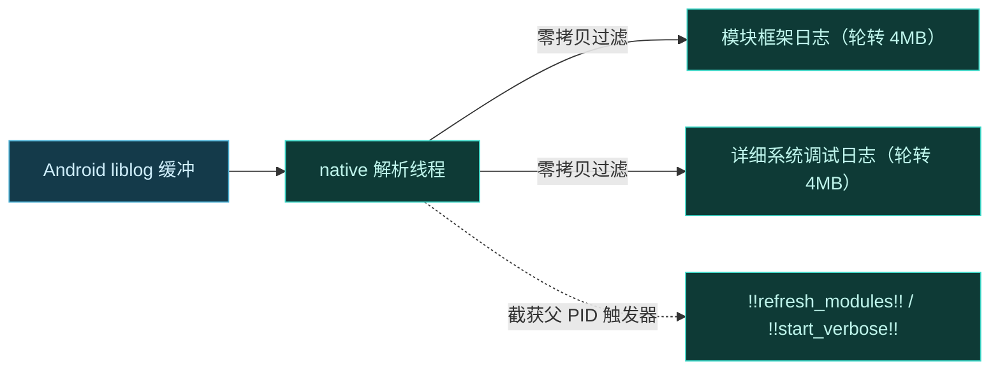

# 🧵 线程模型

Vector 跨多个进程，每个进程内部又有自己的线程结构。这一页把各进程的线程角色拆开，讲清楚谁在哪个线程上跑、为什么这样分。理解线程边界，是理解并发安全与性能特征的前提。

## 进程与线程全景

## Daemon 线程结构

Daemon 是线程最复杂的进程，因为它是中央协调者。

| 线程 | 角色 | 说明 |
| :--- | :--- | :--- |
| 主 Looper | 入口与生命周期 | `VectorDaemon` 初始化 looper，管理进程生命周期 |
| Binder 线程池 | 高频读路径 | 服务 `GET_BINDER`、模块列表、偏好读等 IPC，无锁读 `DaemonState` |
| 后台协程 | 低频写路径 | conflated channel 触发，重建 `DaemonState` 并原子交换 |
| native logcat | 日志解析 | 独立 native C++ 线程，对接 `liblog` 缓冲，零拷贝过滤 |
| sWatcherDaemon | SELinux 监控 | 监控 `/sys/fs/selinux/enforce` 与策略文件，动态重挂 dex2oat 包装器 |
| CliSocketServer | CLI 服务 | 在 `.cli_sock` 暴露命令行接口，UUID 令牌认证 |

### 为什么这样分

- **读写在各自线程域**：Binder 线程池绝不能阻塞等数据库，否则池耗尽。读直接拿不可变引用，写走后台协程串行化。详见 [Daemon 并发模型](./concurrency)。
- **native logcat 独立线程**：日志解析是 I/O 密集且需持续监听 `liblog` 缓冲，与 Binder 逻辑无关，独立线程避免互相阻塞。
- **sWatcherDaemon 独立**：用 `FileObserver` 监控 SELinux 状态变化，需及时响应（系统切 permissive 时重挂包装器），不能和慢操作抢线程。

## native logcat 线程

Daemon 不依赖标准 `logcat` shell 命令，而是运行一个 native C++ 线程直接对接 Android `liblog` 缓冲（`LOG_ID_MAIN` 与 `LOG_ID_CRASH`）。

关键：解析器对来自自身父 PID 的触发器字符串做反应，动态轮转 FD 或改变详尽度，无需额外 IPC。详见 [日志体系](./logging)。

## sWatcherDaemon

监控 SELinux 状态，保障 dex2oat 包装器在策略变化后仍能工作。

| 监控对象 | 触发动作 |
| :--- | :--- |
| `/sys/fs/selinux/enforce` | 系统切 permissive 时重新挂载包装器 |
| SELinux 策略文件 | 策略改动时动态适配 |

详见 [SELinux 边界处理](./selinux) 与 [dex2oat 编译劫持](./dex2oat)。

## system_server 线程

system_server 的标准 Binder 线程池负责处理事务。Vector 在此之上加了 `BridgeService`——当 `_VEC` 事务码到达时，在 Binder 线程上执行中转逻辑（转发给 Daemon、写回 ApplicationService Binder）。

- 不额外开线程，复用 system_server 已有线程池。
- 中转逻辑轻量（转发 + parcel 读写），不阻塞。
- 其余事务码原样放行，对系统无影响。

## 目标应用线程

应用进程内，框架在主线程或 Binder 线程上引导，模块 Hook 回调通常在被 Hook 方法调用的线程上执行。

| 角色 | 线程 |
| :--- | :--- |
| 框架引导（`Main.forkCommon`） | 进程初始化线程 |
| 模块 `onCreate` / Hook 注册 | 通常主线程 |
| Hook 回调 | 被Hook方法调用方的线程 |

::: warning 模块线程安全
模块的 Hook 回调可能在任意线程执行（取决于被 Hook 方法在哪个线程被调用）。模块若维护共享状态，必须自行处理同步——框架不替你保证。
:::

## 线程安全保证汇总

| 机制 | 保证 |
| :--- | :--- |
| 不可变 `DaemonState` | 多线程读无锁安全 |
| 原子引用交换 | 写读不竞争，无撕裂 |
| conflated channel | 写串行化、去抖 |
| HookBridge 原子操作 | 备份方法 trampoline 设置线程安全 |
| `ElfSymbolCache` 惰性初始化 | 线程安全缓存 |
| 模块状态保存映射 | `ParasiticManagerHooker` 用并发静态映射 |

## 相关链接

- [Daemon 并发模型](./concurrency) — 读写分离细节
- [Daemon 守护进程](./daemon) — 整体职责
- [日志体系](./logging) — native logcat 线程
- [进程生命周期与心跳](./lifecycle) — 死亡回调线程
