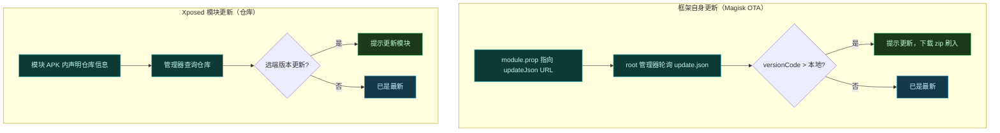
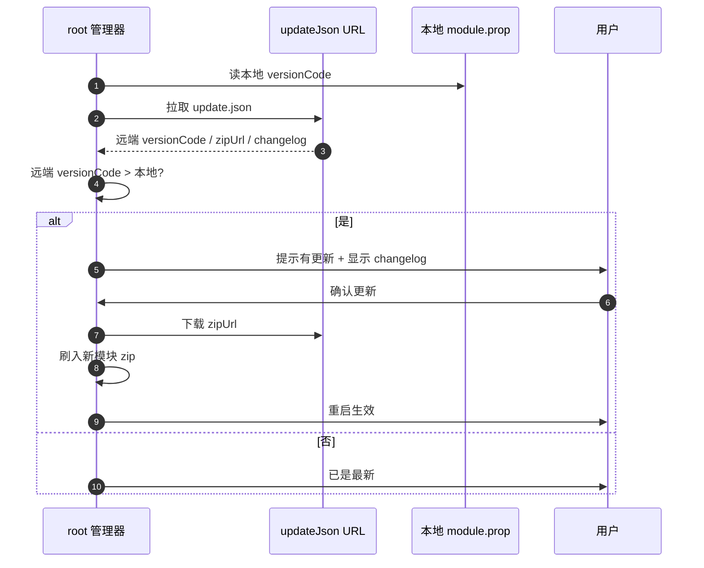
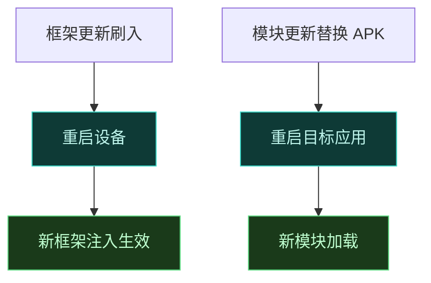

# 🔄 模块更新与 OTA

Vector 自身作为 Magisk/KernelSU 模块分发，有内置的更新通道；同时它管理的 Xposed 模块也走仓库式更新。这一页讲清楚两套更新机制：框架自身的 `update.json` OTA，与模块仓库的版本判定。

## 两条更新链路



## 框架自身的 OTA：update.json

Magisk/KernelSU 模块可通过 `module.prop` 里的 `updateJson` 字段声明更新元数据。Vector 的 `module.prop` 声明了：

| 字段 | 值 | 含义 |
| :--- | :--- | :--- |
| `id` | `zygisk_vector` | 模块标识 |
| `name` | `Vector` | 显示名 |
| `version` | `${versionName} (${versionCode})` | 构建时填充 |
| `versionCode` | `${versionCode}` | 构建时由 git 提交计数推导 |
| `updateJson` | 指向仓库内 `zygisk/update.json` | OTA 元数据 URL |

root 管理器（Magisk/KernelSU）定期拉取该 URL，读取 `update.json`：

```json
{
  "version": "v2.0",
  "versionCode": 3021,
  "zipUrl": "https://.../Vector-v2.0-Release.zip",
  "changelog": "https://.../zygisk/changelog.md"
}
```



## 版本号如何生成

`versionCode` 由根 `build.gradle.kts` 用 git 提交计数推导（`git rev-list --count refs/remotes/origin/master`），`versionName` 取最新 git tag。构建时填入 `module.prop` 与 `update.json`。因此每次合入提交并打 tag 后，CI 产物的 `versionCode` 递增，触发 root 管理器的更新提示。详见 [构建系统](./build#版本号)。

## 版本判定逻辑

root 管理器按 `versionCode` 数值比较：远端 > 本地即视为有更新。这意味着：

- 降级不会自动提示（versionCode 更小）。
- 同 versionCode 不提示更新。
- 正式版与 canary 版若 versionCode 相同，不会互相提示——切渠道需手动刷入。

::: tip 跨渠道切换
从稳定版切到 canary（或反向），需手动下载对应 zip 刷入，不能靠 OTA 自动切。渠道差异见 [兼容性矩阵](../guide/compatibility#下载渠道与构建类型)。
:::

## 模块仓库更新

Vector 管理的 Xposed 模块走标准 [Xposed-Modules-Repo](https://github.com/Xposed-Modules-Repo) 仓库机制。模块 APK 在清单里声明仓库信息，管理器据此查询远端版本。

| 维度 | 说明 |
| :--- | :--- |
| 仓库来源 | 优先官方 Xposed-Modules-Repo 或可信作者自建仓库 |
| 版本判定 | 远端 versionCode > 本地即提示更新 |
| 更新动作 | 下载新 APK，替换本地模块 |
| 安全提醒 | 更新前复核来源可信度，详见 [安全与责任](../guide/safety#模块来源审核) |

## 框架更新后的生效

框架 zip 刷入后，需**重启设备**才生效——Zygisk 模块在 Zygote fork 时注入，只有重启才会重新走注入链路。模块更新（替换 APK）则只需重启目标应用进程，无需重启整机。



## 相关链接

- [构建系统](./build) — 版本号推导与产物
- [安装](../guide/install) — 刷入模块流程
- [兼容性矩阵](../guide/compatibility) — 下载渠道与构建类型
- [安全与责任](../guide/safety) — 模块来源审核
