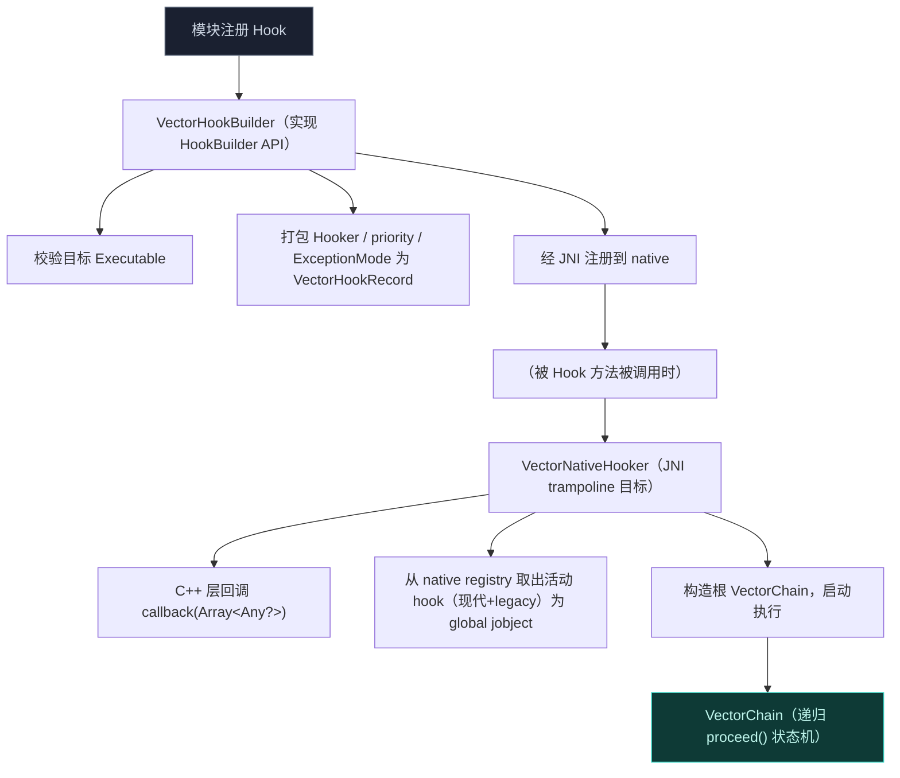
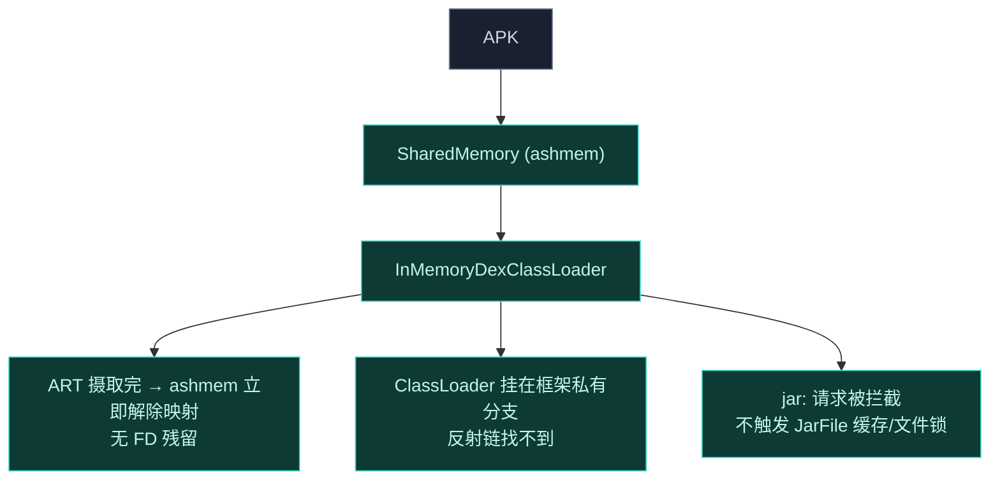

# Xposed API 实现

`xposed` 模块为 Vector 框架实现 [libxposed](https://github.com/libxposed/api) API。它是 native ART hook 引擎（`lsplant`）与模块开发者之间的主桥梁，提供类型安全、OkHttp 风格的拦截器链架构。

## 架构边界

`xposed` 模块设计了严格边界，确保 Android 启动过程与应用生命周期的稳定性。它**完全用 Kotlin 编写**，独立于 legacy Xposed API (`de.robv.android.xposed`) 运作。

它定义一个依赖注入 (DI) 契约 `LegacyFrameworkDelegate`，由 `legacy` 模块在启动时实现并注入。

## 核心组件

### 1. Hook 引擎

- **`VectorHookBuilder`**：实现 `HookBuilder` API。校验目标 `Executable`，把模块的 `Hooker`、`priority`、`ExceptionMode` 打包成 `VectorHookRecord`，经 JNI 注册到 native。
- **`VectorNativeHooker`**：JNI trampoline 目标。被 Hook 方法执行时，C++ 层调用此类的 `callback(Array<Any?>)`。它从 native registry 取出活动 hook（现代与 legacy 都有）作为 global `jobject` 引用，构造根 `VectorChain` 并启动执行。
- **`VectorChain`**：实现递归 `proceed()` 状态机。
  - **异常处理**：实现 `ExceptionMode` 逻辑。`PROTECTIVE` 模式下，若拦截器在调用 `proceed()` **之前**抛异常，链跳过该拦截器；若在 `proceed()` **之后**抛异常，链捕获异常并恢复缓存的下游结果/throwable，保护宿主进程。

### 2. 调用系统

`Invoker` 系统让模块执行方法时绕过标准 JVM 访问检查，并对 hook 执行有细粒度控制。

- **`Type.Origin`**：直接派发到 JNI（`HookBridge.invokeOriginalMethod`），绕过所有活动 hook。
- **`Type.Chain`**：构造一个只含优先级小于等于所请求 `maxPriority` 的 hook 的局部 `VectorChain`，允许模块执行部分 hook 链。
- **`VectorCtorInvoker`**：处理构造函数调用。它把内存分配（`HookBridge.allocateObject`）与初始化（`invokeOriginalMethod` / `invokeSpecialMethod`）分离，以支持安全的 `newInstanceSpecial` 逻辑。

### 3. 依赖注入契约

为维持关注点分离，`xposed` 模块经 `VectorBootstrap` 与 `LegacyFrameworkDelegate` 和 legacy Xposed 生态通信。

`xposed` 拦截 Android 生命周期事件（如 `LoadedApk.createClassLoader`）时，经 `VectorLifecycleManager` 内部派发事件，再把原始参数委托给 `LegacyFrameworkDelegate`，由 `legacy` 模块构造并派发 legacy `XC_LoadPackage` 回调。

### 4. 内存 ClassLoading 与隔离

模块严格从内存执行，使用隔离的 ClassLoader，确保零磁盘足迹、对反作弊机制最大隐蔽。

- 模块 APK 被加载进 `SharedMemory` (ashmem) 以绕过 Java 堆限制。ART 摄取 DEX 缓冲区后，ashmem 立即解除映射，防内存泄漏、不留残余文件描述符。
- `VectorModuleClassLoader` **独占**挂到 Xposed 框架的 classloader 分支，防止目标应用经反射或 `ClassLoader.getParent()` 链式遍历发现模块。
- `VectorURLStreamHandler` 拦截标准 `jar:` 请求，从模块路径 native 读取资产与资源，不触发 Android 全局 `JarFile` 缓存，防止 OS 级文件锁。

## 与 legacy 的协作

`xposed` 是现代 API 的实现，但它不重复 legacy 的资源 Hook、偏好共享等能力。通过 `LegacyFrameworkDelegate` 契约，两套 API 共享同一个 native Hook 引擎与生命周期分发，互不干扰又能共存。详见 [Legacy 兼容层](./legacy)。
