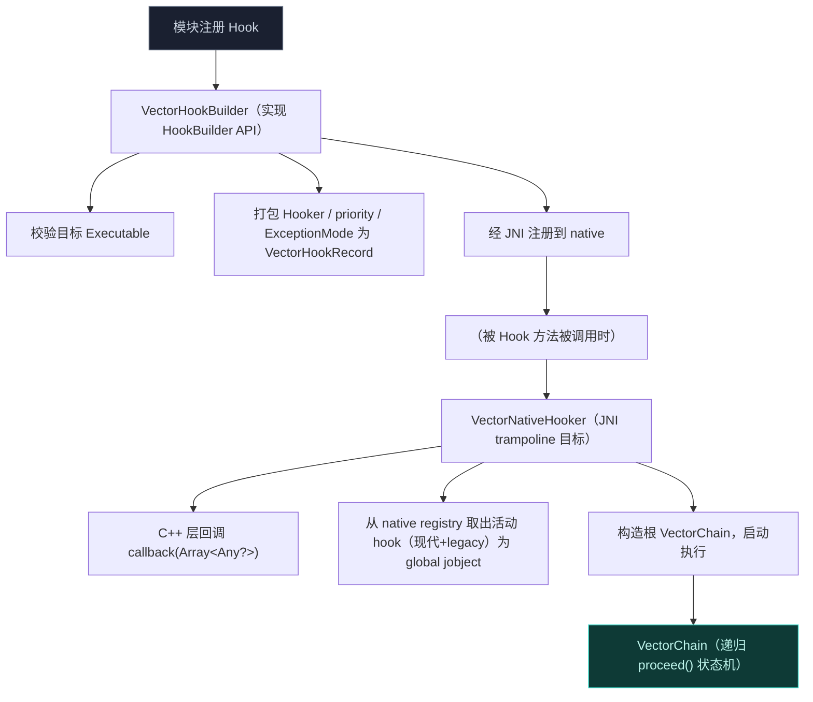
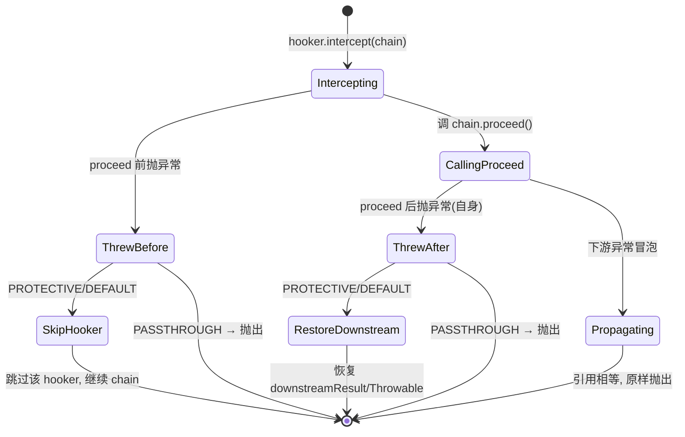
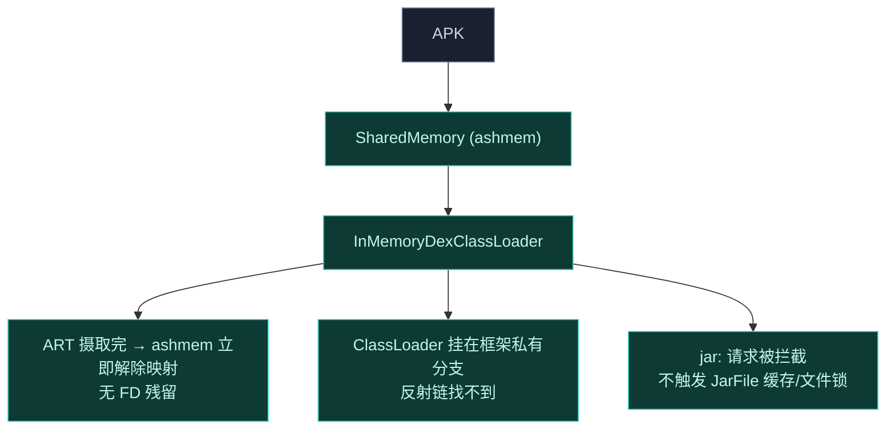

# Xposed API 实现

`xposed` 模块为 Vector 框架实现 [libxposed](https://github.com/libxposed/api) API。它是 native ART hook 引擎（`lsplant`）与模块开发者之间的主桥梁，提供类型安全、OkHttp 风格的拦截器链架构。

## 架构边界

`xposed` 模块设计了严格边界，确保 Android 启动过程与应用生命周期的稳定性。它**完全用 Kotlin 编写**，独立于 legacy Xposed API (`de.robv.android.xposed`) 运作。

它定义一个依赖注入 (DI) 契约 `LegacyFrameworkDelegate`，由 `legacy` 模块在启动时实现并注入。

## 核心组件

### 1. Hook 引擎

`ExceptionMode` 决定拦截器崩溃时的处置策略：

- **`VectorHookBuilder`**（[VectorNativeHooker.kt](https://github.com/android-security-engineer/Vector-skills/blob/master/xposed/src/main/kotlin/org/matrix/vector/impl/hooks/VectorNativeHooker.kt)）：实现 `HookBuilder` API。在 `intercept(hooker)` 里做三项校验后，把 `Hooker` / `priority` / `ExceptionMode` 打包成 `VectorHookRecord`，调 `HookBridge.hookMethod(true, origin, VectorNativeHooker::class.java, priority, record)` 注册到 native。校验规则：
  - 目标 `Executable` 不能是 `abstract`（无实现可替换）；
  - 目标不能是框架自身 ClassLoader 里的内部方法（防自指）；
  - 不能 hook `Method.invoke` 本身（会引发无限递归）。
- **`VectorNativeHooker`**：JNI trampoline 目标。被 Hook 方法执行时，C++ 层（[hook_bridge.cpp](https://github.com/android-security-engineer/Vector-skills/blob/master/native/src/jni/hook_bridge.cpp) 的 `lsplant::Hook` 把 `entry_point` 指过来）调用此类的 `callback(Array<Any?>)`。流程：
  1. 区分静态/实例：静态时 `args[0]` 是首个参数，实例时 `args[0]` 是 `this`。
  2. 调 `HookBridge.callbackSnapshot(VectorHookRecord::class, method)` **一次性取快照**——返回 `Object[2][]`，下标 0 是 modern hook 数组、下标 1 是 legacy hook 数组。快照在 `JNIMonitor(backup)` 锁保护下拷出，避免执行期间注册表变动。
  3. 两条链都空时走快速路径直接 `invokeOriginalSafely`。
  4. 否则构造 `terminal` 闭包：若存在 legacy hook 且 `VectorBootstrap.delegate` 非空，则委托给 `LegacyFrameworkDelegate.processLegacyHook`（它会在原方法外再套 legacy 回调链）；否则直接调原方法。
  5. 以 terminal 为底，构造根 `VectorChain` 并 `proceed()`。
  6. 返回前做类型校验：返回值与 `method.returnType` 不匹配（含基本类型装箱兼容性检查）会记录日志，基本类型返回 null 直接抛 NPE。
- **`VectorChain`**（[VectorChain.kt](https://github.com/android-security-engineer/Vector-skills/blob/master/xposed/src/main/kotlin/org/matrix/vector/impl/hooks/VectorChain.kt)）：递归 `proceed()` 状态机。每个 chain 节点持有一个 `hookIndex`，`proceed` 时若未到链尾就构造 `hookIndex+1` 的下一级 chain 并调 `record.hooker.intercept(nextChain)`；到链尾则触发 `terminal`（原方法 + legacy 链）。
  - **状态缓存**：`executeDownstream` 把下游结果/异常存进 `downstreamResult` / `downstreamThrowable`，供父节点在 post-proceed 阶段崩溃时恢复。
  - **ExceptionMode**：`PASSTHROUGH` 直接抛出；`PROTECTIVE`/`DEFAULT` 下——拦截器在 `proceed()` **之前**抛异常，跳过该拦截器继续链；在 `proceed()` **之后**抛异常，捕获并恢复下游缓存的结果/throwable，保护宿主进程不被破坏。判断依据是 `t === nextChain.downstreamThrowable`（引用相等，确认异常源自下游而非拦截器自身）。

### 2. 调用系统

`Invoker` 系统让模块执行方法时绕过标准 JVM 访问检查，并对 hook 执行有细粒度控制。

- **`Type.Origin`**：直接派发到 JNI（`HookBridge.invokeOriginalMethod`），绕过所有活动 hook。
- **`Type.Chain`**：构造一个只含优先级小于等于所请求 `maxPriority` 的 hook 的局部 `VectorChain`，允许模块执行部分 hook 链。
- **`VectorCtorInvoker`**：处理构造函数调用。它把内存分配（`HookBridge.allocateObject`）与初始化（`invokeOriginalMethod` / `invokeSpecialMethod`）分离，以支持安全的 `newInstanceSpecial` 逻辑。

### 3. 依赖注入契约

为维持关注点分离，`xposed` 模块经 `VectorBootstrap` 与 `LegacyFrameworkDelegate` 和 legacy Xposed 生态通信。

`xposed` 拦截 Android 生命周期事件（如 `LoadedApk.createClassLoader`）时，经 `VectorLifecycleManager` 内部派发事件，再把原始参数委托给 `LegacyFrameworkDelegate`，由 `legacy` 模块构造并派发 legacy `XC_LoadPackage` 回调。

### 4. 内存 ClassLoading 与隔离

模块严格从内存执行，使用隔离的 ClassLoader，确保零磁盘足迹、对反作弊机制最大隐蔽。

- 模块 APK 被加载进 `SharedMemory` (ashmem) 以绕过 Java 堆限制。[VectorModuleClassLoader.loadApk](https://github.com/android-security-engineer/Vector-skills/blob/master/xposed/src/main/kotlin/org/matrix/vector/impl/utils/VectorModuleClassLoader.kt) 用 `parallelStream` 把每个 `SharedMemory` `mapReadOnly()` 成 `ByteBuffer`，喂给 `ByteBufferDexClassLoader`（hidden API）。ART 摄取 DEX 缓冲区后，**立即** `SharedMemory.unmap` + `close`——防内存泄漏、不留残余 FD。
- `VectorModuleClassLoader` 按系统版本分两个构造器（Android Q+ 走带 `librarySearchPath` 的重载，以下走另一个），并重写 `loadClass`：先 `findLoadedClass`，再委托 `Any::class.java.classLoader`（boot loader）加载，最后才 `findClass`/`parent.loadClass`——这让它**独占**挂在 Xposed 框架的 classloader 分支，目标应用经反射或 `ClassLoader.getParent()` 链式遍历找不到模块。
- `findLibrary` 自行扫描 `nativeLibraryDirs`（含 `java.library.path` 系统目录），支持 `path!/sub` 形式的 APK 内 `.so`（要求 `ZipEntry.STORED` 不压缩），从而不依赖系统 `nativeLibraryDirectories` 暴露模块路径。
- `VectorURLStreamHandler` 拦截标准 `jar:` 请求，从模块路径 native 读取资产与资源，不触发 Android 全局 `JarFile` 缓存，防止 OS 级文件锁。

## 与 legacy 的协作

`xposed` 是现代 API 的实现，但它不重复 legacy 的资源 Hook、偏好共享等能力。通过 `LegacyFrameworkDelegate` 契约，两套 API 共享同一个 native Hook 引擎与生命周期分发，互不干扰又能共存。详见 [Legacy 兼容层](./legacy)。
