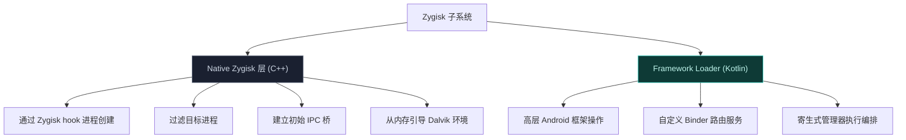
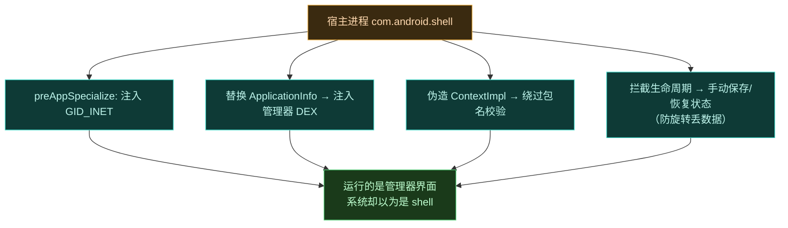

# Zygisk 模块

Zygisk 模块是 Vector 的**注入引擎**——它衔接 Android Zygote 进程与高层 Java/Kotlin Xposed API。它避免标准 Android 服务注册和磁盘类加载，全程通过内存执行、JNI 级 Binder 拦截、进程身份移植运作。

## 两层结构

## IPC 与 Binder 中继

Vector 用两阶段 IPC 路由建立注入应用与 root Daemon 间的通信。完整时序见 [IPC 与 Binder 中继](./ipc)，这里聚焦 Zygisk 侧的实现。

### JNI Binder Trap

在 `ipc_bridge.cpp`，模块用 ART 内部函数 `SetTableOverride` 替换 JNI 函数 `CallBooleanMethodV`，拦截系统范围所有对 `android.os.Binder.execTransact` 的调用。

事务码匹配常量 `kBridgeTransactionCode`（`_VEC`）时，事务被转给 Kotlin 静态方法 `BridgeService.execTransact`；其余事务原样放行。

## 两阶段初始化

### 阶段 1：system_server

`system_server` 是框架的主代理路由器。在 `postServerSpecialize` 回调中：

1. 查询 `ServiceManager` 的 `serial` 服务（或 `serial_vector` 用于延迟注入场景）作为临时会合点。
2. 发 `_VEC` 事务拉取临时 Binder，用它取框架 DEX FD 和混淆映射。
3. 安装 JNI Binder Trap（`HookBridge`），经 `Main.forkCommon` 引导 Kotlin 层。
4. 同时 Daemon 直接向 `system_server` 发起 Binder 事务，Trap 截获，`BridgeService` 处理 `SEND_BINDER`，保存 Daemon 主 `IDaemonService` Binder，回传 `system_server` 上下文并链接 `DeathRecipient`。

### 阶段 2：用户应用会合

应用经 `system_server` 中转建立 IPC：

1. `postAppSpecialize` 中，应用查询 `activity` 服务。
2. 发 `_VEC` 事务，动作 `GET_BINDER`，附带进程名和新分配的心跳 `BBinder`。
3. `system_server` 内的 Trap 在 Activity Manager 处理前截获。
4. `system_server` 的 `BridgeService` 把应用 UID/PID/心跳转发给 Daemon。
5. Daemon 评估作用域，批准则生成 `ILSPApplicationService` Binder，写回应用回复 parcel。
6. 应用用该 Binder 拉取框架 DEX 和混淆映射。

### 心跳机制

为免轮询管理进程生命周期，native 模块在两阶段初始化时都生成一个 dummy Binder（`heartbeat_binder`），交给 Daemon 并在应用进程里用 JNI GlobalRef (`env->NewGlobalRef`) 保活。进程终止或被内核杀死时 GlobalRef 销毁、Binder 节点释放，Daemon 的 `DeathRecipient` 触发即时清理。

## 内存执行与混淆同步

Vector 不向 /data 分区写框架代码。

1. **资产交付**：Daemon 通过 `SharedMemory` FD 提供框架 DEX，用 `kDexTransactionCode`。C++ 层把 FD 包成 `DirectByteBuffer`，初始化 `InMemoryDexClassLoader`。
2. **动态重链接**：Daemon 每次开机随机化框架类名。native 模块经 `kObfuscationMapTransactionCode` 拉取序列化字典，`SetupEntryClass` 用它定位随机化的入口点（`org.matrix.vector.core.Main`）和 `BridgeService`，使框架运行时能正确链接。

## 寄生式管理器与身份移植

Vector 管理器**不**作为标准包安装。它通过掏空一个宿主进程（如 `com.android.shell`）以寄生模型运行。

### system_server 意图重定向

在 `system_server` 内，`ParasiticManagerSystemHooker` 拦截 `ActivityTaskSupervisor.resolveActivity`。检测到带 `LAUNCH_MANAGER` category 的 Intent 时，动态修改返回的 ActivityInfo：强制系统启动宿主包，同时把 processName 设为管理器包名，并调整主题和 recents 标志以模仿独立应用。

### 应用宿主劫持

native 模块在 `preAppSpecialize` 检测到宿主包 UID 和管理器进程名时，向进程 GID 数组注入 `GID_INET` (3003) 保证网络访问，然后交给 `ParasiticManagerHooker.kt` 执行身份移植：

1. **代码注入**：拦截 `LoadedApk.getClassLoader` 和 `ActivityThread.handleBindApplication`，用管理器 APK（经 FD 提供）构造的混合对象替换宿主的 ApplicationInfo，把管理器 DEX 注入宿主的 `PathClassLoader`。
2. **状态伪造**：系统 ActivityManager 不知道伪造的管理器 Activity。为防止屏幕旋转等生命周期切换丢数据，hooker 拦截 `performStopActivityInner` 手动把 Bundle/PersistableBundle 状态捕获进静态并发映射，在 `scheduleLaunchActivity` 时重注入。
3. **上下文伪造**：拦截 `ActivityThread.installProvider` 和 `WebViewFactory.getProvider`，构造伪造的 `ContextImpl`，绕过 Android 与 Chromium 内部的包名校验。

这就是为什么用户在桌面找不到管理器图标，而要经系统通知进入——它从未以独立应用存在过。
