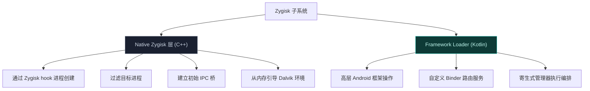
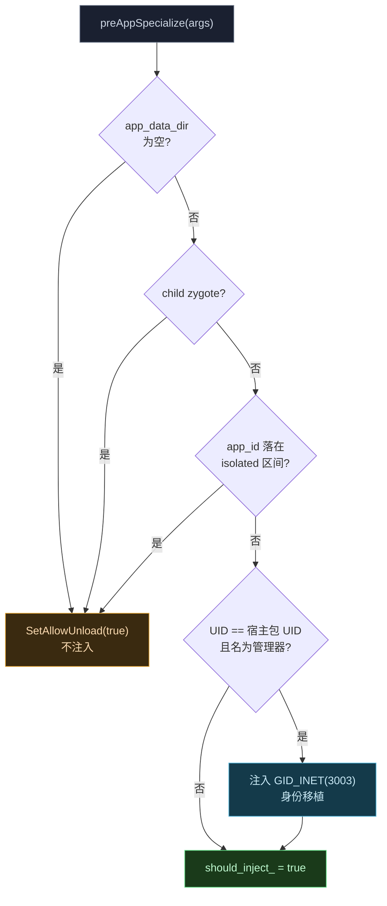
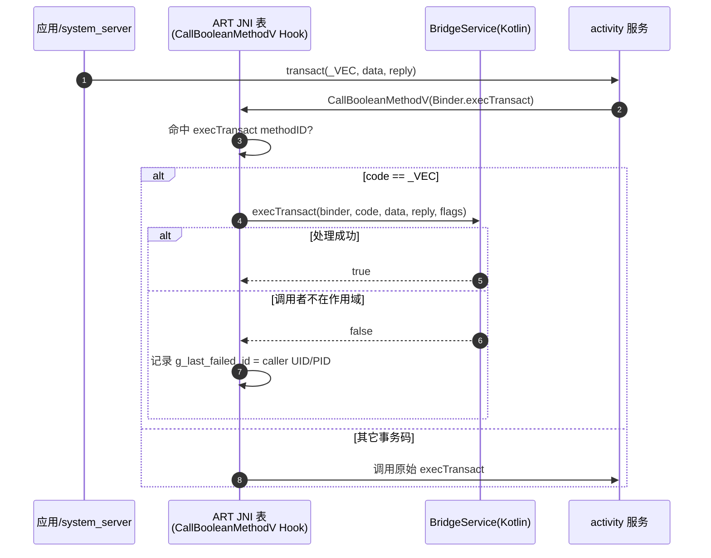
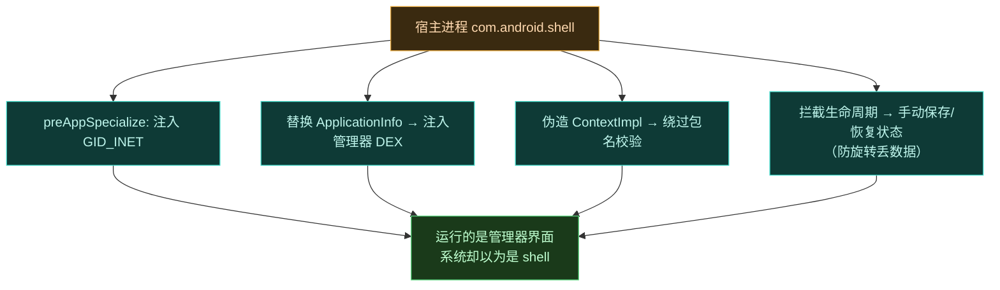

# Zygisk 模块

Zygisk 模块是 Vector 的**注入引擎**——它衔接 Android Zygote 进程与高层 Java/Kotlin Xposed API。它避免标准 Android 服务注册和磁盘类加载，全程通过内存执行、JNI 级 Binder 拦截、进程身份移植运作。

## 两层结构

Native 层由 [module.cpp](https://github.com/android-security-engineer/Vector-skills/blob/master/zygisk/src/main/cpp/module.cpp) 中的 `VectorModule` 实现，它同时继承 `zygisk::ModuleBase`（接收生命周期回调）与 `vector::native::Context`（获得 DEX 加载、ART hook 能力）。Kotlin 层入口是 [Main.kt](https://github.com/android-security-engineer/Vector-skills/blob/master/zygisk/src/main/kotlin/org/matrix/vector/core/Main.kt) 的 `Main.forkCommon`，由 C++ 经 `FindAndCall` 反射唤起。

## 进程过滤：注入决策逻辑

并非每个 fork 出的进程都该注入。`preAppSpecialize` 在进程 specialize 前用一组 UID 规则做过滤（见 [module.cpp](https://github.com/android-security-engineer/Vector-skills/blob/master/zygisk/src/main/cpp/module.cpp) 常量段）：

| 条件 | 跳过原因 |
| :--- | :--- |
| `app_data_dir == null` | 无数据目录的进程不是合法应用 |
| `is_child_zygote == true` | 子 Zygote（如 WebView 渲染器）非目标 |
| `app_id ∈ [99000, 99999]` | isolated 进程（重度沙箱） |
| `app_id ∈ [90000, 98999]` | app zygote isolated 进程 |
| `app_id == 1037` | 共享 RELRO 进程 |

通过过滤后置 `should_inject_ = true`，否则在 `postAppSpecialize` 调 `SetAllowUnload(true)` 让 Zygisk `dlclose` 掉模块库——避免在无用进程里常驻。

## IPC 与 Binder 中继

Vector 用两阶段 IPC 路由建立注入应用与 root Daemon 间的通信。完整时序见 [IPC 与 Binder 中继](./ipc)，这里聚焦 Zygisk 侧的实现。

### JNI Binder Trap

在 [ipc_bridge.cpp](https://github.com/android-security-engineer/Vector-skills/blob/master/zygisk/src/main/cpp/ipc_bridge.cpp) 的 `IPCBridge::HookBridge` 中，模块不替换某个 Binder 对象，而是替换整个进程的 **JNI 函数表**：

1. 通过 `ElfSymbolCache::GetArt()->getSymbAddress` 在 `libart.so` 里找到 ART 私有符号 `art::JNIEnvExt::SetTableOverride`（mangled 名 `_ZN3art9JNIEnvExt16SetTableOverrideEPK18JNINativeInterface`）。
2. `memcpy` 整份 `JNINativeInterface` 表，把 `CallBooleanMethodV` 槽位换成自己的 `CallBooleanMethodV_Hook`，再用 `SetTableOverride` 原子替换本进程的 JNI 表。
3. Hook 只关心 `Binder.execTransact` 这一个 methodID（`exec_transact_backup_method_id_`）。命中时从 `va_list` 解出 `(code, data, reply, flags)`；`code == kBridgeTransactionCode`（即 `_VEC`，常量 `('_'<<24)|('V'<<16)|('E'<<8)|'C'`）就交给 Kotlin 静态方法 `BridgeService.execTransact`，其余原样放行。

> [!TIP]
> 事务码 `_VEC`、`_DEX`、`_OBF` 都用 4 字符移位编码（`kDexTransactionCode`、`kObfuscationMapTransactionCode` 见 [ipc_bridge.cpp](https://github.com/android-security-engineer/Vector-skills/blob/master/zygisk/src/main/cpp/ipc_bridge.cpp)），避开标准 Binder 接口 descriptor 校验，看起来像随机事务码。

### 防重试：caller ID 跟踪

若 `BridgeService.execTransact` 返回 `false`（拒绝该调用者），`ExecTransact_Replace` 会用 `BinderCaller` 解析当前 `IPCThreadState` 的 calling UID/PID，组合成 64-bit ID 存入原子量 `g_last_failed_id`。下一次同一调用者再发事务时直接跳过拦截走原方法，避免每次事务都白跑一遍 Java 回调。`BinderCaller` 依赖在 `libbinder.so` 中解析 `IPCThreadState::selfOrNull` / `getCallingPid` / `getCallingUid` 三个 mangled 符号。

## 两阶段初始化

### 阶段 1：system_server

`system_server` 是框架的主代理路由器。在 `postServerSpecialize` 回调中（见 [module.cpp](https://github.com/android-security-engineer/Vector-skills/blob/master/zygisk/src/main/cpp/module.cpp) `VectorModule::postServerSpecialize`）：

1. 检测 ZTE 设备特性 `ro.vendor.product.ztename`，命中则把 `argv[0]` 设回 `system_server`（设备专项 workaround）。
2. 根据 `args->runtime_flags` 的 `LATE_INJECT` 位（NeoZygisk 定义）选择会合服务名：正常用 `serial`，延迟注入用 `serial_vector`。
3. 用 `RequestSystemServerBinder` **轮询最多 10 秒**取该服务 Binder（Daemon 与 system_server 并行启动，慢机上 daemon 可能晚几秒 `addService`）。
4. 经该 Binder 发 `_VEC` 拉取 Daemon 主 `IDaemonService` Binder（`RequestManagerBinderFromSystemServer`，写入 UID/PID/进程名/心跳）。
5. 用拿到的 Binder 取框架 DEX FD 与混淆映射，`LoadDex` → `InitArtHooker` → `InitHooks` → `SetupEntryClass`。
6. `HookBridge` 安装 JNI Binder Trap（见上文）。
7. 最后 `FindAndCall("forkCommon", ...)` 把控制权交给 [Main.kt](https://github.com/android-security-engineer/Vector-skills/blob/master/zygisk/src/main/kotlin/org/matrix/vector/core/Main.kt)。

同时 Daemon 侧 `VectorDaemon.sendToBridge` 主动向 `system_server` 的 `activity` 服务发 `_VEC` 事务（动作 `ACTION_SEND_BINDER`），Trap 截获后由 `BridgeService` 把 Daemon 主 Binder 存进 `system_server` 进程并 `linkToDeath`。

> [!TIP]
> `system_server` 崩溃重启是注入链路最脆弱的点。Daemon 在 [VectorDaemon.kt](https://github.com/android-security-engineer/Vector-skills/blob/master/daemon/src/main/kotlin/org/matrix/vector/daemon/VectorDaemon.kt) 注册了 `DeathRecipient`：`system_server` 一死，Daemon 立即清空 `ServiceManager.sServiceManager`/`sCache` 与 `ActivityManager` 单例缓存，重新 `addService(proxyServiceName, ...)` 抢占会合点名，再重新投递 Binder（最多重试 `--system-server-max-retry` 次，超限则 `ctl.restart zygote` 强重启）。

### 阶段 2：用户应用会合

应用经 `system_server` 中转建立 IPC（对应 [module.cpp](https://github.com/android-security-engineer/Vector-skills/blob/master/zygisk/src/main/cpp/module.cpp) `postAppSpecialize` 与 [ipc_bridge.cpp](https://github.com/android-security-engineer/Vector-skills/blob/master/zygisk/src/main/cpp/ipc_bridge.cpp) `RequestAppBinder`）：

1. `postAppSpecialize` 中，应用查询 `activity` 服务（常量 `kBridgeServiceName = "activity"`）。
2. 发 `_VEC` 事务，动作 `kActionGetBinder(2)`，附带进程名 `nice_name` 和新分配的心跳 `BBinder`。
3. `system_server` 内的 Trap 在 Activity Manager 处理前截获（`CallBooleanMethodV_Hook` 命中 `execTransact`）。
4. `system_server` 的 `BridgeService` 把应用 UID/PID/心跳转发给 Daemon 的 `SystemServerService.requestApplicationService`。
5. Daemon 评估作用域（`SystemServerService` 仅接受 `uid==1000 && processName=="system"` 的请求；应用请求经 `ApplicationService.registerHeartBeat` 注册），批准则生成 `ILSPApplicationService` Binder 写回应用 reply parcel。
6. 应用用该 Binder 拉取框架 DEX（`kDexTransactionCode`）和混淆映射（`kObfuscationMapTransactionCode`）。

### 心跳机制

为免轮询管理进程生命周期，native 模块在两阶段初始化时都生成一个 dummy Binder（`heartbeat_binder`），交给 Daemon 并在应用进程里用 JNI GlobalRef (`env->NewGlobalRef`) 保活。进程终止或被内核杀死时 GlobalRef 销毁、Binder 节点释放，Daemon 的 `DeathRecipient` 触发即时清理。

## 内存执行与混淆同步

Vector 不向 /data 分区写框架代码。

1. **资产交付**：Daemon 通过 `SharedMemory` FD 提供框架 DEX，事务码 `kDexTransactionCode`。C++ 层 `FetchFrameworkDex` 从 reply parcel 读出 `ParcelFileDescriptor` 并 `detachFd()`，再 `readLong()` 取大小。`PreloadedDex`（见 [context.cpp](https://github.com/android-security-engineer/Vector-skills/blob/master/native/src/core/context.cpp)）用 `mmap(PROT_READ, MAP_SHARED)` 把 FD 映射成内存，`LoadDex` 再把它包成 `DirectByteBuffer` 喂给 `InMemoryDexClassLoader`，父 ClassLoader 取 `getSystemClassLoader()`。

```mermaid
graph LR
    DAEMON["Daemon<br/>FileSystem.getPreloadDex"]:::daemon
    DAEMON -->|"reply: PFD + size(Long)"| FETCH["FetchFrameworkDex"]
    FETCH --> MMAP["PreloadedDex<br/>mmap(PROT_READ,MAP_SHARED)"]:::step
    MMAP --> BB["NewDirectByteBuffer<br/>(DirectByteBuffer)"]:::step
    BB --> IMCL["InMemoryDexClassLoader<br/>父=SystemClassLoader"]:::step
    IMCL --> GREF["NewGlobalRef(inject_class_loader_)"]:::out
    style MMAP fill:#0e3a36,stroke:#3dd8c8,color:#bff5ec
    style BB fill:#0e3a36,stroke:#3dd8c8,color:#bff5ec
    style IMCL fill:#0e3a36,stroke:#3dd8c8,color:#bff5ec
    classDef daemon fill:#3a2a10,stroke:#e8a838,color:#ffd9b0
    classDef step fill:#0e3a36,stroke:#3dd8c8,color:#bff5ec
    classDef out fill:#1a3a1a,stroke:#5cd980,color:#bfffd0
```

2. **动态重链接**：Daemon 每次开机随机化框架类名。`FetchObfuscationMap` 拉取的是序列化的 `std::map<string,string>`：reply 先 `readInt()` 拿条目数（校验必须为偶数），再成对 `readString()` 读 key/value。`SetupEntryClass` 用 `obfs_map.at("org.matrix.vector.core.") + "Main"` 拼出真实入口类，`HookBridge` 则用 `obfs_map.at("org.matrix.vector.service.") + "BridgeService"` 定位 Trap 回调类。

## 寄生式管理器与身份移植

Vector 管理器**不**作为标准包安装。它通过掏空一个宿主进程（如 `com.android.shell`）以寄生模型运行。

### system_server 意图重定向

在 `system_server` 内，`ParasiticManagerSystemHooker` 拦截 `ActivityTaskSupervisor.resolveActivity`。检测到带 `LAUNCH_MANAGER` category 的 Intent 时，动态修改返回的 ActivityInfo：强制系统启动宿主包，同时把 processName 设为管理器包名，并调整主题和 recents 标志以模仿独立应用。

### 应用宿主劫持

native 模块在 `preAppSpecialize` 检测到宿主包 UID 和管理器进程名时，向进程 GID 数组注入 `GID_INET` (3003) 保证网络访问，然后交给 `ParasiticManagerHooker.kt` 执行身份移植：

1. **代码注入**：拦截 `LoadedApk.getClassLoader` 和 `ActivityThread.handleBindApplication`，用管理器 APK（经 FD 提供）构造的混合对象替换宿主的 ApplicationInfo，把管理器 DEX 注入宿主的 `PathClassLoader`。
2. **状态伪造**：系统 ActivityManager 不知道伪造的管理器 Activity。为防止屏幕旋转等生命周期切换丢数据，hooker 拦截 `performStopActivityInner` 手动把 Bundle/PersistableBundle 状态捕获进静态并发映射，在 `scheduleLaunchActivity` 时重注入。
3. **上下文伪造**：拦截 `ActivityThread.installProvider` 和 `WebViewFactory.getProvider`，构造伪造的 `ContextImpl`，绕过 Android 与 Chromium 内部的包名校验。

这就是为什么用户在桌面找不到管理器图标，而要经系统通知进入——它从未以独立应用存在过。
