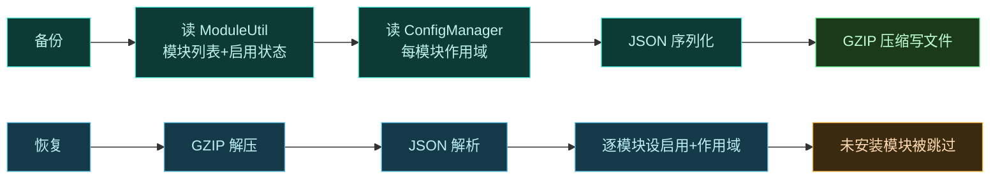

# 💾 管理器备份与恢复配置

> 难度 ⭐ · 用 Vector 管理器的备份功能导出/导入模块列表与作用域，换机或排障时用。

## 场景

- 换机 / 刷机后快速恢复所有模块及其作用域。
- 排障时给开发者导出一份"我开了哪些模块、作用域怎么配"的快照。
- 给某单个模块单独备份作用域（不影响其他模块）。

## 备份格式

Vector 管理器的 `BackupUtils` 把配置序列化为 JSON 再 GZIP 压缩，写入用户选的 URI。当前备份格式 `VERSION = 2`，结构：

```json
{
  "version": 2,
  "modules": [
    {
      "enable": true,
      "package": "org.example.mymodule",
      "scope": [
        { "package": "com.target.app", "userId": 0 },
        { "package": "android", "userId": 0 }
      ]
    }
  ]
}
```

每个模块记录三项：是否启用、模块包名、作用域（目标应用包名 + userId）。

## 备份

管理器 → 设置 → 备份，选择一个保存位置（文件或 SAF URI）：

```kotlin
// 内部实现（供理解，用户无需写代码）
BackupUtils.backup(uri)                  // 备份全部模块
BackupUtils.backup(uri, packageName)     // 只备份指定模块
```

备份内容来自 `ModuleUtil`（已安装模块列表 + 启用状态）与 `ConfigManager.getModuleScope`（每模块作用域）。`BackupUtils.backup` 遍历所有已安装模块，逐个写 `enable`/`package`/`scope`。

## 恢复

管理器 → 设置 → 恢复，选择之前备份的文件：

```kotlin
BackupUtils.restore(uri)                 // 恢复全部
BackupUtils.restore(uri, packageName)    // 只恢复指定模块
```

恢复时 GZIP 解压 → JSON 解析 → 按记录逐模块设启用状态与作用域。若备份里的模块未安装，该模块记录被跳过（作用域无法挂到一个不存在的模块上）。

## 流程



## 注意事项

| 事项 | 说明 |
| :--- | :--- |
| 备份不含 APK | 只备份"哪些模块、是否启用、作用域"，模块 APK 需另行保存 |
| 模块需先安装 | 恢复作用域前模块必须已安装，否则该记录被跳过 |
| userId | 多用户设备每个用户有独立作用域，备份按 userId 区分 |
| 格式版本 | 备份带 `version` 字段，未来格式升级可向前兼容 |
| 重启生效 | 恢复后需重启目标进程（或重载作用域）使新配置生效 |

## 单模块作用域导出

`backup(uri, packageName)` / `restore(uri, packageName)` 支持单模块操作——便于把一个模块的作用域配置分享给其他用户或同步到多设备，而不动其他模块。

## 备份内容速查

| 备份项 | 是否包含 | 说明 |
| :--- | :--- | :--- |
| 模块列表（包名） | ✅ | 来自 `ModuleUtil.getModules()` |
| 模块启用状态 | ✅ | `ModuleUtil.isModuleEnabled` |
| 每模块作用域 | ✅ | `ConfigManager.getModuleScope` |
| userId（多用户） | ✅ | 作用域按用户区分 |
| 模块 APK 文件 | ❌ | 需另行保存，恢复前须先安装 |
| 模块自身设置 | ❌ | 模块内 `XSharedPreferences` 数据不在此备份 |

## 相关

- [作用域与多进程](./scope)
- [发布模块到在线仓库](./module-repo)
- [guide · 模块机制](../guide/modules)
