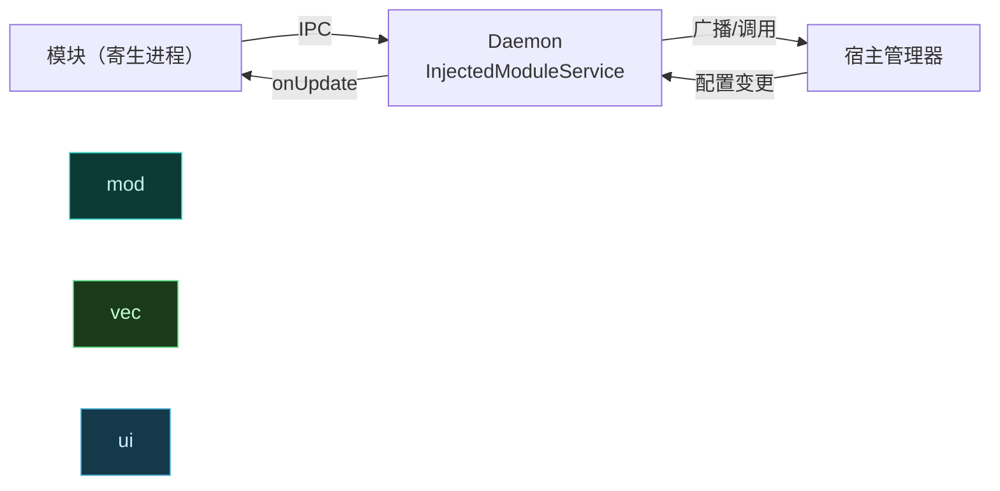
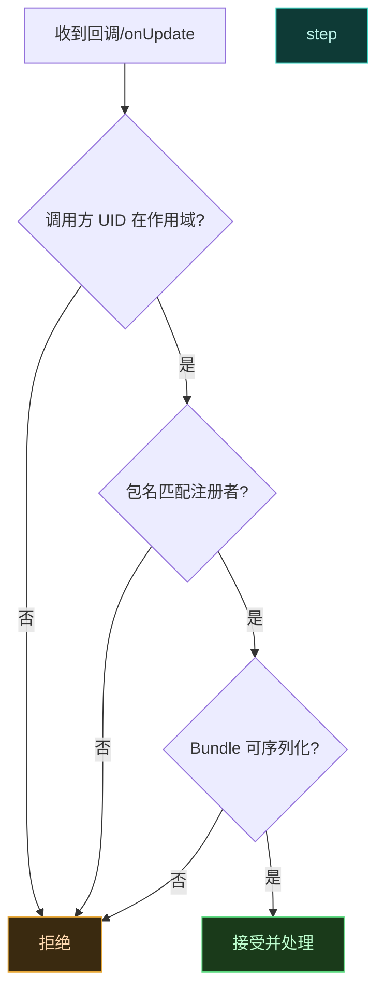

# 📡 模块与宿主广播通信

> 难度 ⭐⭐⭐ · 模块进程与宿主（管理器）跨进程通信，经 Daemon 中转更稳更安全。

## 场景

模块需要在 UI 改配置后实时收到通知、把运行时数据上报给管理器、或让管理器触发模块重载。直接发系统广播不可靠且有安全隐患。

## 为什么走 Daemon

模块寄生在宿主进程里，没有独立 `Context`，直接 `sendBroadcast` 受宿主权限和 SELinux 限制。Vector 的 Daemon 作为可信中转：



Daemon 的 `InjectedModuleService`（`ILSPInjectedModuleService.Stub`）为每个模块包名注册一个 Binder 端点，模块通过它请求远程偏好、打开远程文件、上报状态。

## 模块侧：注册回调

通过框架注入的 `ILSPInjectedModuleService` 句柄发请求，最常见的是远程偏好（见 [远程偏好监听](./remote-preference)）：

```kotlin
// 框架在模块加载时注入 service 句柄
val prefs = XposedHelpers.callMethod(serviceHandle, "requestRemotePreferences",
    "main_config", callbackStub) as SharedPreferences
// 返回的 SharedPreferences 已是 VectorRemotePreferences，只读但可监听变化
prefs.registerOnSharedPreferenceChangeListener { _, key ->
    // Daemon 推送 onUpdate 时触发，key 是变更的键
    Log.i("Module", "config changed: $key")
}
```

## 模块侧：发消息回管理器

模块无法直接持有管理器 `Context`，但可通过 Daemon 转发的文件通道或偏好写入间接通信。最规范的是写一个文件到模块文件目录，Daemon 的 `getRemoteFileList` / `openRemoteFile` 让管理器读取：

```kotlin
// 模块把状态写入自己的 files 目录
val stateFile = File(context.filesDir, "state.json")
stateFile.writeText("""{"events":$count,"last":${System.currentTimeMillis()}}""")
// 管理器侧经 openRemoteFile("state.json") 读取
```

## 安全校验



Daemon 侧 `InjectedModuleService.requestRemotePreferences` 用 `Binder.getCallingUid() / PER_USER_RANGE` 还原 userId，校验调用方属于该模块包名；`linkToDeath` 在调用方进程死亡时自动清理回调，防止泄漏。

## 模块侧自检

收到任何跨进程数据前，在你的回调里做最小校验：

```kotlin
override fun onUpdate(bundle: Bundle) {
    val puts = bundle.getSerializable("put") as? Map<*, *> ?: return
    // 只接受你认识的 key，忽略陌生 key——防止恶意注入
    for (k in puts.keys) {
        if (k !in ALLOWED_KEYS) continue
        applyConfig(k.toString(), puts[k])
    }
}
```

## 通信方式对照

| 需求 | 推荐方式 | 双向 |
| :--- | :--- | :--- |
| 配置实时同步 | 远程偏好 `IRemotePreferenceCallback` | 单向推送 |
| 模块上报状态 | 写文件 + `openRemoteFile` | 单向拉取 |
| 触发模块重载 | 管理器禁用→启用模块 | 单向 |
| 任意 RPC | `ILSPInjectedModuleService` 扩展 | 双向 |

## 相关

- [远程偏好监听](./remote-preference)
- [跨进程共享配置](./shared-prefs)
- [daemon · ipc 包（InjectedModuleService）](../reference/classes/daemon-entry)
- [架构 · 通信模型](../architecture/update)
