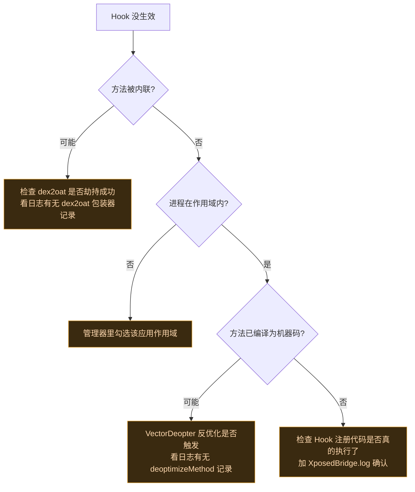
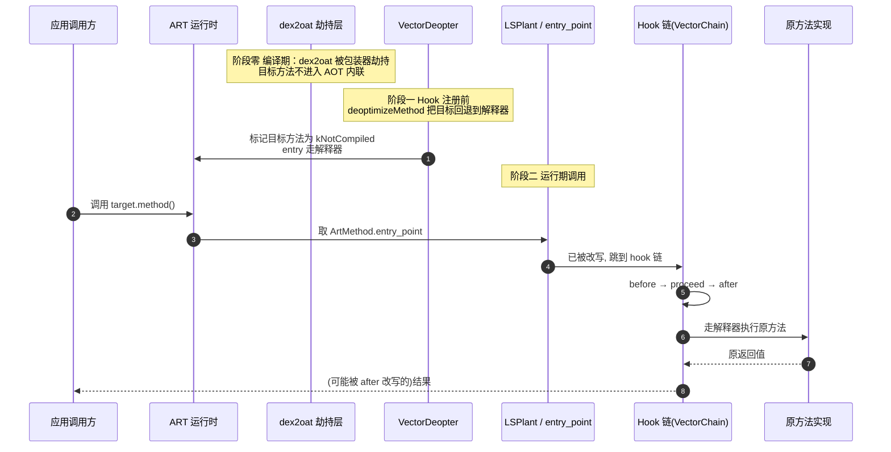

# 🐛 日志与调试

> 难度 ⭐⭐ · 定位 Hook 不生效、模块崩溃等问题。

## 基本日志

经典 API：

```kotlin
XposedBridge.log("我的模块: 进入了 handleLoadPackage")
XposedBridge.log(Throwable("捕获的异常"))   // 记录异常栈
```

现代 API：直接用 Android `Log` 或 `XposedInterface` 提供的日志方法。

日志写到 Daemon 的轮转日志文件，可在管理器 → 日志页查看。

## Verbose 日志

管理器设置里开启 **verbose log**，Daemon 会记录更详细的注入、Hook 注册、Binder 事务信息。`ConfigManager.setVerboseLogEnabled(true)` 可程序化开启。

底层 native logcat 监控对日志按精确标签（Magisk、KernelSU）和前缀标签（dex2oat、Vector、LSPosed）过滤，写入两个轮转文件（模块框架、详细系统调试），4MB 自动轮转。详见 [daemon · jni](../reference/classes/daemon-jni)。

## Hook 不生效排查



## 三层保险自检

Vector 的 Hook 稳定性靠三层（见 [ART Hook 原理](../guide/art-hook)）：

1. **dex2oat 劫持**：编译期就不内联。
2. **VectorDeopter**：运行时把已编译方法逐回解释器。
3. **LSPlant**：改写 `entry_point` 劫持调用。

任何一层出问题都可能导致 Hook 失效。日志里分别有对应记录。

三层保险在方法调用的不同时机介入：dex2oat 劫持作用于**编译期**（阻止目标方法被 JIT/AOT 内联），`VectorDeopter` 作用于 **Hook 注册前**（把已被编译的目标方法回退到解释器入口），LSPlant 作用于**运行期调用时**（改写 ArtMethod 的 `entry_point` 把调用劫持到 hook 链）。下图展示一次方法调用如何依次穿过三层：



> 三层任意一层失效都会让 Hook "看起来没装"：dex2oat 未劫持则目标可能被内联（`before` 不触发）；Deopter 未跑则已被 quickened 的方法仍走机器码入口绕过 `entry_point`；LSPlant 未改写则调用直达原方法。排查时按日志里 `dex2oat wrapper` → `deoptimizeMethod` → hook 注册 三条记录依次核对。详见 [`VectorDeopter.kt`](https://github.com/android-security-engineer/Vector-skills/blob/master/xposed/src/main/kotlin/org/matrix/vector/impl/core/VectorDeopter.kt) 与 [架构 · native · 反优化](../architecture/native)。

## 模块崩溃

PROTECTIVE 模式下，模块异常不会传播到宿主。但依赖框架兜底是坏习惯——你的 Hook 逻辑应自己 try-catch：

```kotlin
object : XC_MethodHook() {
    override fun afterHookedMethod(param: MethodHookParam) {
        try {
            // 你的逻辑
        } catch (e: Throwable) {
            XposedBridge.log(e)
            // 别让异常影响宿主
        }
    }
}
```

## Debug 构建

遇到问题优先用 **debug 构建**复现——Bug 报告只接受基于最新 debug 构建的问题。从 [GitHub Actions](https://github.com/android-security-engineer/Vector-skills/actions) 获取 master 分支 CI 制品。

## 相关

- [daemon · jni（logcat）](../reference/classes/daemon-jni)
- [Hook API · 异常保护](../developer/hook-api#hook-失败的稳定性)
- [ART Hook 原理](../guide/art-hook)
