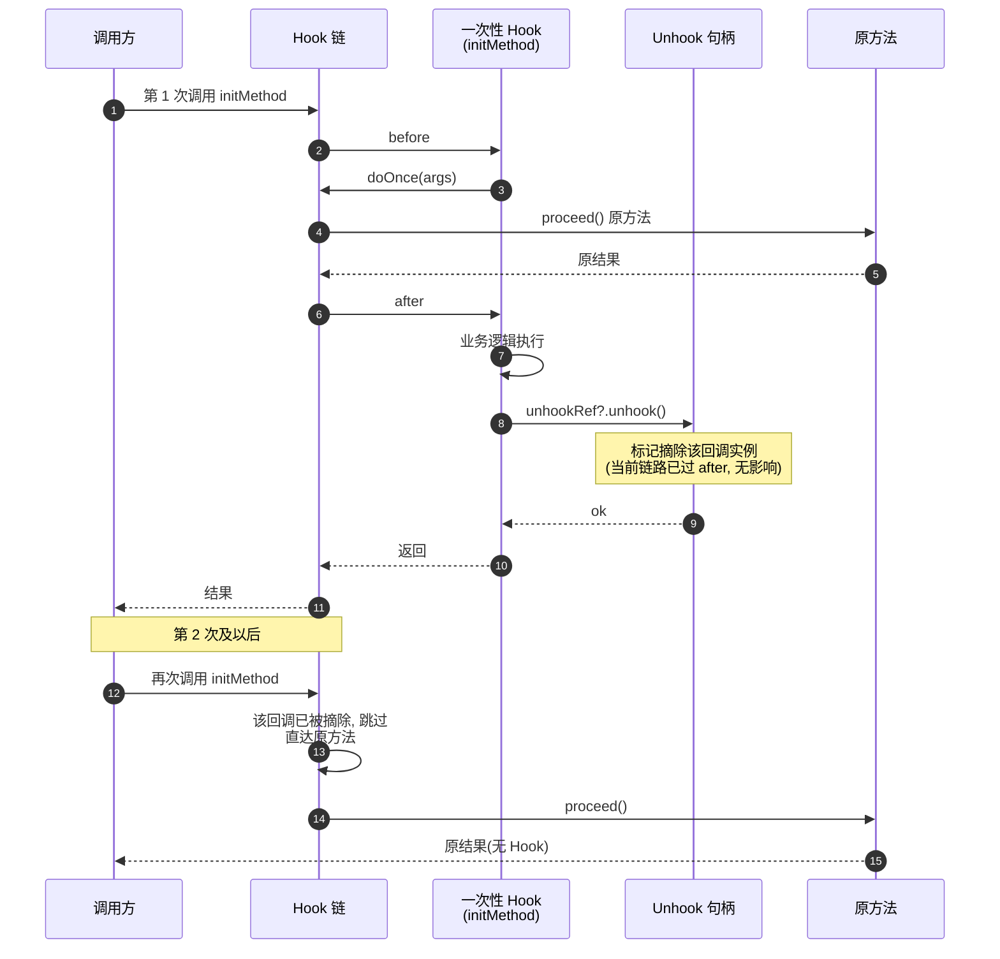
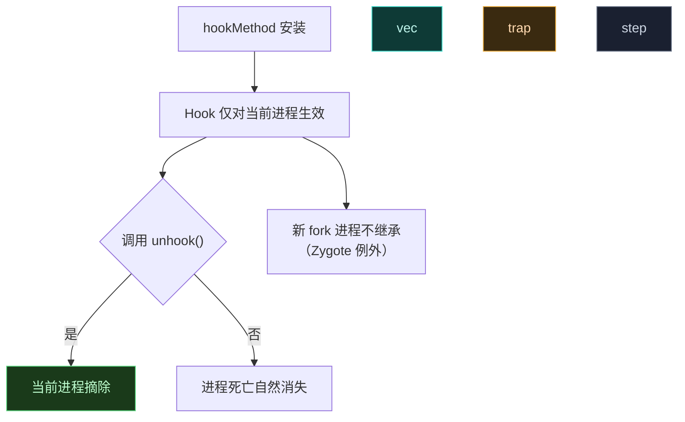

# 🔧 动态取消 Hook

> 难度 ⭐⭐ · 满足条件后摘除 Hook，或随模块卸载一起回收。

## 场景

功能开关关闭时取消 Hook、Hook 一次性初始化方法后自摘除、运行时按条件启停。

## unhook 句柄

`hookMethod` 返回 `XC_MethodHook.Unhook`（实现 `IXUnhook`），调它的 `unhook()` 即摘除：

```kotlin
val unhook: XC_MethodHook.Unhook = XposedBridge.hookMethod(method, object : XC_MethodHook() {
    override fun afterHookedMethod(param: MethodHookParam) {
        // 业务逻辑
    }
})

// 条件满足时摘除
if (shouldStop) {
    unhook.unhook()
}
```

`findAndHookMethod` / `XposedHelpers.findAndHookMethod` 同样返回 `Unhook`。多个匹配用 `hookAllMethods` / `hookAllConstructors` 返回 `Set<Unhook>`，遍历摘除。

## 一次性自摘除

Hook 初始化类方法，命中一次即摘除（避免反复触发）：

```kotlin
var unhookRef: XC_MethodHook.Unhook? = null
unhookRef = XposedBridge.hookMethod(initMethod, object : XC_MethodHook() {
    override fun afterHookedMethod(param: MethodHookParam) {
        doOnce(param.args)
        unhookRef?.unhook()   // 命中即摘
    }
})
```

> 闭包捕获 `unhookRef` 需用 `var` + 可空引用，Hook 回调里再赋值；lambda 捕获的是 final 引用会编译失败。

一次性自摘除的执行流：回调命中后先跑业务逻辑，再调 `unhookRef?.unhook()` 摘除自己。`unhook()` 调用在 `after` 阶段返回之后才真正生效——同一次调用不会再触发该回调，但**下一次**调用起摘除生效：



> 若需在命中**当次**就停止后续 before/after，应改用 `XC_MethodReplacement` 或在 `before` 里设标志位提前 `return`——`unhook()` 影响的是后续调用，不是当前链路。源码层面摘除走 native `HookBridge` 移除该 ArtMethod 上的回调节点，详见 [legacy · IXUnhook](../reference/classes/legacy-api)。

## 作用域与生命周期



关键点（来自 `IXUnhook` 契约）：

- **Hook 仅对当前进程生效**。在 A 进程 unhook 不影响 B 进程；进程重启后 Hook 重新安装。
- **Zygote 是例外**：在 Zygote 装的 Hook **不会**被后续 fork 的进程继承——这点与直觉相反，需特别注意。
- unhook 只摘除回调，不动目标方法原实现（恢复原行为）。

## 模块卸载流程

用户在管理器禁用模块后，下次进程重启时不再加载该模块——Hook 自然消失。无需也不能在卸载瞬间主动 unhook 已注入进程的 Hook（进程间隔离）。所以「禁用模块 → 重启相关进程」是规范流程。

## 多回调与优先级

同一方法挂多个 Hook 时，unhook 只摘除对应那个回调实例，其余继续生效：

```kotlin
XposedBridge.hookMethod(method, hookerA)  // priority 50
XposedBridge.hookMethod(method, hookerB)  // priority 100，先执行
// unhook hookerA 后 hookerB 仍生效
```

`XC_MethodHook.Unhook.getCallback()` 可拿回原回调实例，便于在容器里管理。

## 陷阱

| 陷阱 | 后果 | 对策 |
| :--- | :--- | :--- |
| 期望 unhook 影响其他进程 | 不生效 | 重启进程或重新装 Hook |
| Zygote Hook 期望被子进程继承 | 子进程没有 Hook | 在 `onPackageLoaded`/`handleLoadPackage` 重装 |
| 闭包捕获 final 引用 | 编译失败 | 用 `var` + 可空字段 |
| 摘除后仍触发 | 摘除发生在 after 之后 | 命中检测放 before，或用标志位 |

## 现代 API 等价

libxposed 的 `hook(method, Hooker::class.java)` 不直接返回 unhook 句柄，取消靠框架作用域管理；若需细粒度取消，仍用经典 `XposedBridge.hookMethod` 拿 `Unhook`。

## 相关

- [拦截并改写方法返回值](./replace-return)
- [多模块 Hook 同一方法](./multi-module-hook)
- [legacy · IXUnhook](../reference/classes/legacy-api)
- [Hook API](../developer/hook-api)
