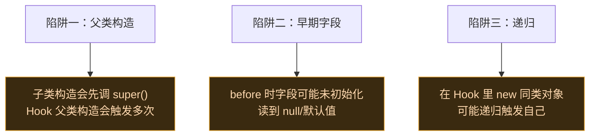

# 🏗️ Hook 构造函数

> 难度 ⭐⭐⭐ · 拦截对象的创建过程。

## 场景

监听某 View 被创建、在某对象构造时注入回调、用特殊方式实例化对象（绕过部分初始化）。

## 经典 API：监听构造

用 `findAndHookConstructor`：

```kotlin
XposedHelpers.findAndHookConstructor(
    "com.target.app.Tracker",
    lpparam.classLoader,
    String::class.java,           // 构造参数类型
    object : XC_MethodHook() {
        override fun afterHookedMethod(param: MethodHookParam) {
            // param.thisObject 是刚创建的对象实例
            val tracker = param.thisObject
            Log.d("Tracker", "实例化: ${param.args[0]}")
        }
    }
)
```

> 构造函数的 Hook 通常在 **after** 里读 `thisObject`——before 时对象还没初始化完。

### before / after 对照：读字段

> [!TIP] before 时字段还没初始化
> 同样读 `thisObject.aField`，before 拿到的是默认值（null/0），after 才能读到构造函数里赋的值：

```kotlin
// ❌ before：aField 尚未赋值，读到 null
override fun beforeHookedMethod(param: MethodHookParam) {
    val field = param.thisObject.javaClass.getDeclaredField("aField")
    field.isAccessible = true
    Log.d("TAG", "before = ${field.get(param.thisObject)}") // null
}

// ✅ after：构造函数已执行完，字段已赋值
override fun afterHookedMethod(param: MethodHookParam) {
    val field = param.thisObject.javaClass.getDeclaredField("aField")
    field.isAccessible = true
    Log.d("TAG", "after = ${field.get(param.thisObject)}") // 真实值
}
```

### 完整可运行示例

下面这段监听某应用每次创建 `Tracker` 实例，并在创建后把它的 `tag` 字段改成 `"vector"`：

```kotlin
class TrackerHook : IXposedHookLoadPackage {
    override fun handleLoadPackage(lpparam: XC_LoadPackage.LoadPackageParam) {
        if (lpparam.packageName != "com.target.app") return
        XposedHelpers.findAndHookConstructor(
            "com.target.app.Tracker", lpparam.classLoader,
            String::class.java,
            object : XC_MethodHook() {
                override fun afterHookedMethod(param: MethodHookParam) {
                    val tagField = param.thisObject.javaClass.getDeclaredField("tag")
                    tagField.isAccessible = true
                    tagField.set(param.thisObject, "vector")
                    XposedBridge.log("Tracker rebuilt with tag=vector")
                }
            }
        )
    }
}
```

## 现代 API：newInstanceSpecial

`VectorCtorInvoker` 支持把**内存分配**和**初始化**分离，实现 `newInstanceSpecial`——即先用 `allocateObject` 分配内存（不跑 `<init>`），再选择用原构造或特殊方式初始化。这让"绕过部分父类初始化构造对象"成为可能。

```kotlin
// 现代 API (libxposed)：Hook 构造函数并读取实例
@XposedHooker
class TrackCtor : Hooker {
    @AfterInvocation
    static fun after(ctx: AfterHookCallback): TrackCtor {
        // ctx.thisObject 是刚构造完的对象
        XposedBridge.log("Tracker created: ${ctx.thisObject}")
        return TrackCtor()
    }
}
```

注册（在模块入口）：

```kotlin
override fun onPackageLoaded(param: PackageLoadedParam) {
    if (param.packageName != "com.target.app") return
    val trackerClass = param.classLoader.loadClass("com.target.app.Tracker")
    val ctor = trackerClass.getDeclaredConstructor(String::class.java)
    xposedInterface.hook(trackerClass, ctor, TrackCtor::class.java)
}
```

### newInstance / newInstanceSpecial 的能力

`VectorCtorInvoker` 提供两种"从 Hook 内部造对象"的能力，对应源码 `BaseInvoker.kt`：

| 方法 | 行为 | 典型用途 |
| :--- | :--- | :--- | :--- | :--- |
| `newInstance(args)` | `allocateObject` 分配内存后**走完整 Hook 链**初始化 | 在 Hook 内安全创建实例（会触发自己的 Hook） |
| `newInstanceSpecial(subClass, args)` | 分配子类内存 + `invokeSpecialMethod` 跳过 Hook 直接调原 `<init>` | 绕过自身重入、构造子类实例但不触发 Hook |

```kotlin
// 在 Hooker 内：用 Invoker.Type.Origin 走原构造，避免递归触发自己的 Hook
val invoker = xposedInterface.createCtorInvoker(trackerCtor)
invoker.setType(Invoker.Type.Origin)
val instance = invoker.newInstance("my-tag")   // 分配内存 + 走原 init
```

详见 [Hook API · 调用原方法](../developer/hook-api#调用原方法) 与 [xposed · BaseInvoker](../reference/classes/xposed-hooks)。

## 构造 Hook 的陷阱



- **避免递归**：在 Hook 回调里构造同类实例时，先用 `XposedBridge.invokeOriginalMethod` 走原路径，或设置一个静态 `ThreadLocal` 标志位防重入。

```kotlin
// ✅ 用 ThreadLocal 防重入
private val inHook = ThreadLocal<Boolean>()

override fun beforeHookedMethod(param: MethodHookParam) {
    if (inHook.get() == true) return   // 重入，放行
    inHook.set(true)
    try {
        // 在这里 new 同类实例…
    } finally {
        inHook.set(false)
    }
}
```

- **父类构造多次触发**：若你 Hook 的是父类 `<init>`，每个子类实例化都会触发一次。如果只想拦截某个具体子类，在 Hook 里用 `param.thisObject.javaClass == SubClass::class.java` 过滤。
- **`<init>` 抛异常**：构造函数里抛异常会导致对象部分初始化。after 阶段若发现 `param.throwable != null`，说明构造中途失败了，`thisObject` 状态可能不一致，慎用。

## 相关

- [Hook API](../developer/hook-api)
- [xposed · hooks 包](../reference/classes/xposed-hooks)
