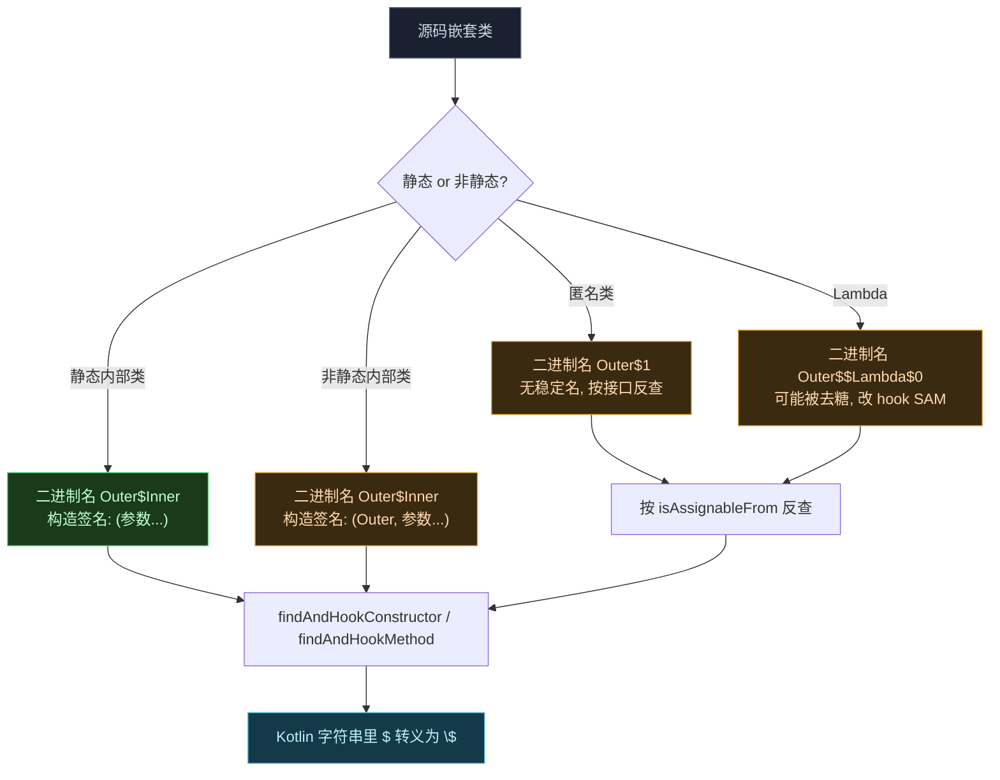
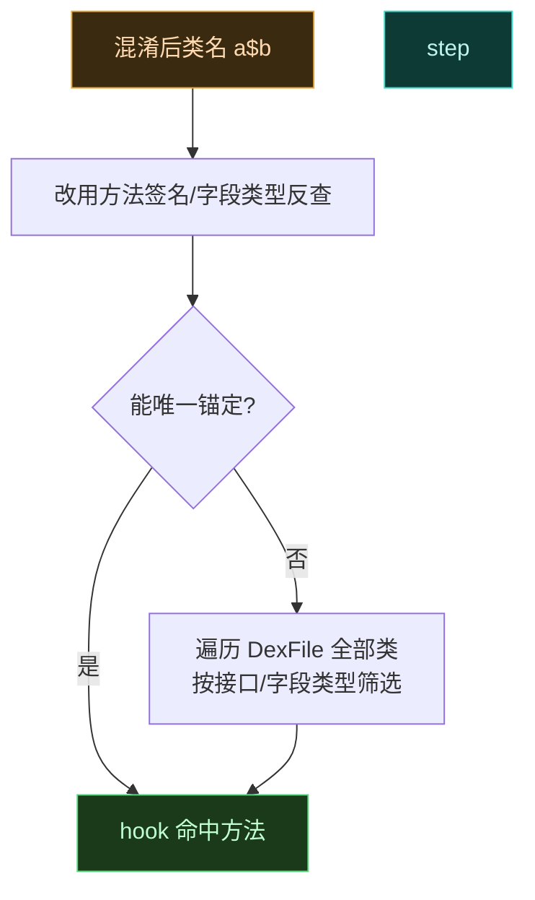

# 🪆 Hook 内部类与匿名类

> 难度 ⭐⭐⭐ · 内部类、匿名类的二进制名含 `$`，混淆后还会改名，定位是关键。

## 场景

Hook 回调接口的匿名实现、Builder 的内部类、`ActivityThread` 的内部类、混淆后名如 `a$b$c` 的类。

## `$` 记法

JVM 二进制名里，嵌套类用 `$` 分隔，不是 `.`：

```kotlin
// 外部类 com.target.app.Foo 的内部类 Bar
// Java 源码：class Foo { static class Bar {} }
// 二进制名：com.target.app.Foo$Bar

val clazz = XposedHelpers.findClass("com.target.app.Foo\$Bar", lpparam.classLoader)
// Kotlin 字符串里 $ 需转义为 \$
```

| 类型 | 源码形态 | 二进制名 |
| :--- | :--- | :--- |
| 静态内部类 | `Foo.Bar` | `com.target.app.Foo$Bar` |
| 非静态内部类 | `Foo.Bar`（持外部引用） | `com.target.app.Foo$Bar` |
| 匿名类 | `new Runnable(){...}` | `com.target.app.Foo$1` |
| Lambda | `() -> {}` | `com.target.app.Foo$$Lambda$0`（可能被去糖） |

定位内部类时，源码里的嵌套关系要先转成 JVM 二进制名（`$` 分隔），再判断是否非静态内部类（构造隐含外部引用）。下图把"源码形态 → 二进制名 → Hook 构造签名"的转换链画清楚：



> 关键卡点：非静态内部类构造**首参隐含外部类实例**（`param.args[0]` 是 `Outer`），漏写就 `NoSuchMethodError`；匿名类编号随源码漂移，硬编码 `Outer$1` 下次编译即失效，必须按实现的接口/父类反查。

## 非静态内部类的隐含字段

非静态内部类构造函数**首参数隐含外部类引用**，Hook 构造时要把外部类类型放进参数表：

```kotlin
// 源码：class Outer { class Inner(val x: Int) }
// 实际签名：Inner(Outer, int)
XposedHelpers.findAndHookConstructor(
    "com.target.app.Outer\$Inner",
    lpparam.classLoader,
    "com.target.app.Outer",   // 隐含的外部类引用
    Int::class.javaPrimitiveType,
    object : XC_MethodHook() {
        override fun afterHookedMethod(param: MethodHookParam) {
            // param.args[0] 是外部类实例
        }
    }
)
```

## ProGuard 混淆后定位

混淆后类名变成 `a`、`a$b`、`a$a`，无法按名字定位。策略是**按特征锚定**：



按签名反查示例：

```kotlin
// 目标：混淆类里返回 String、参数为 (int, String) 的方法
val outer = lpparam.classLoader.loadClass("com.target.app.a")
for (m in outer.declaredClasses) {           // 遍历内部类
    for (method in m.declaredMethods) {
        if (method.returnType == String::class.java &&
            method.parameterTypes.contentEquals(
                arrayOf(Int::class.javaPrimitiveType, String::class.java))) {
            XposedBridge.hookMethod(method, hooker)
        }
    }
}
```

## 匿名类的生命周期

匿名类没有稳定名字（`Foo$1`、`Foo$2` 随源码顺序变），且每次编译可能编号漂移。优先按**实现的接口/父类**反查，而非硬编码编号：

```kotlin
// 找实现了 OnClickListener 的匿名类
for (clazz in loadedClasses) {
    if (OnClickListener::class.java.isAssignableFrom(clazz) &&
        clazz.isAnonymousClass) {
        // 锚定成功
    }
}
```

## 陷阱清单

| 陷阱 | 后果 | 对策 |
| :--- | :--- | :--- |
| 漏写 `\` 转义 `$` | `findClass` 报 ClassNotFoundException | Kotlin 字符串里写 `\$` |
| 忘记隐含外部类参数 | 找不到构造函数 | 非静态内部类首参补外部类 |
| 硬编码混淆名 `a$b` | 下次混淆即失效 | 按签名/接口反查 |
| Lambda 被去糖 | 目标类不存在 | Hook 函数式接口的 SAM 方法 |

## 相关

- [Hook 构造函数](./hook-constructor)
- [Hook 静态方法](./hook-static-method)
- [Hook API](../developer/hook-api)
- [架构 · legacy · ProGuard](../architecture/legacy)
