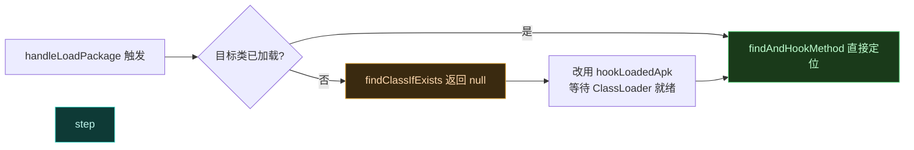
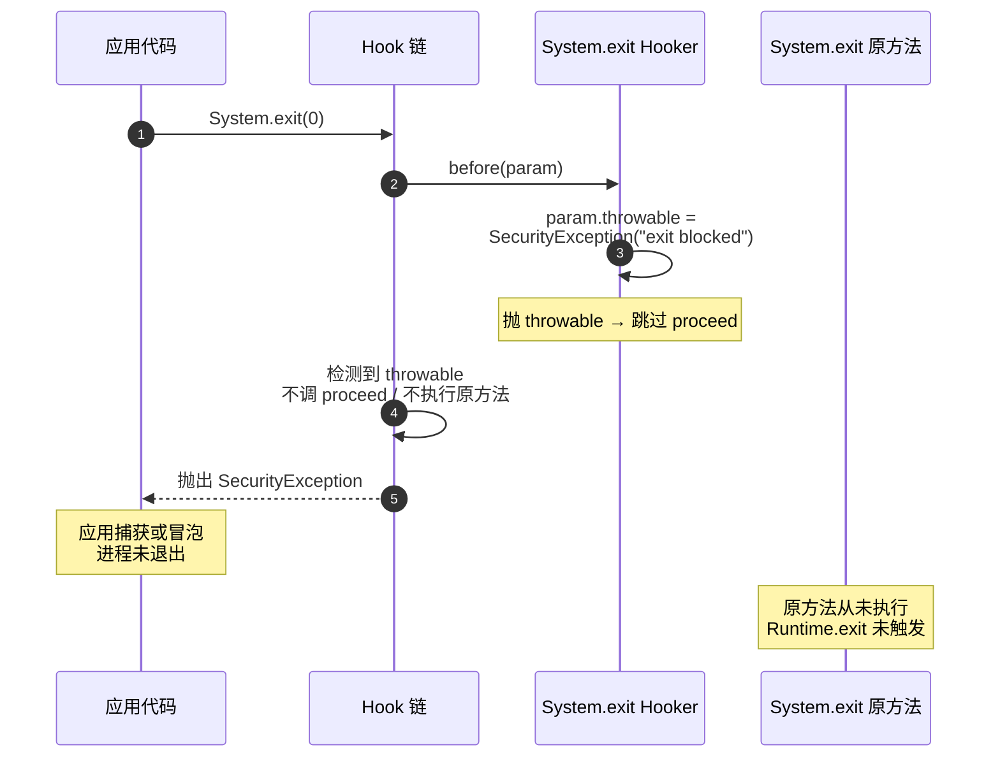

# 🧊 Hook 静态方法

> 难度 ⭐⭐ · 静态方法看似简单，但类加载时机、`final`/`static` 陷阱常让新手踩坑。

## 场景

Hook `System.exit`、`Settings.Secure.getString`、某工具类的 `static` 工厂方法、`Log` 静态包装等。静态方法不依赖实例，Hook 时参数表里没有 `this`。

## API 选择

```kotlin
// 经典 API：findAndHookMethod 直传 Class 或类名字符串
XposedHelpers.findAndHookMethod(
    "com.target.app.CryptoUtils",   // 注意：是类名，不是实例
    lpparam.classLoader,
    "md5",                           // 静态方法名
    String::class.java,             // 参数类型按原签名顺序
    object : XC_MethodHook() {
        override fun afterHookedMethod(param: MethodHookParam) {
            param.result = "deadbeef"   // 静态方法同样用 param.result
        }
    }
)
```

```kotlin
// 现代 API：拿到 Method 对象后照常 hook
val clazz = param.classLoader.loadClass("com.target.app.CryptoUtils")
val method = clazz.getDeclaredMethod("md5", String::class.java)
hook(method, Md5Hooker::class.java)
```

## 类加载时机

静态方法所属的类**未必在 `handleLoadPackage` 时已加载**。框架类（`android.*`）在 Zygote 已就绪，但应用类可能延迟到首次使用。



如果 `findClassIfExists` 返回 `null`，说明类还没被加载，可挂到 `LoadedApk` 的 `mApplicationLoaded` 或 `ClassLoader.loadClass` 上延迟 Hook。

## final / static 陷阱

| 陷阱 | 表现 | 对策 |
| :--- | :--- | :--- |
| `static final` 常量内联 | 改了字段值但调用处读到旧值 | 编译期常量会被内联进调用者，需 Hook 读取点而非字段 |
| `private static` 被内联 | JIT/ART 把短方法内联，Hook 不生效 | 依赖框架 `VectorDeopter` 反优化该方法 |
| 静态初始化早于 Hook | `static {}` 块在类加载时已跑完 | 改 Hook 静态块引用的字段读取点，或在 Zygote 早期 Hook |

## Hook System.exit（经典反退出）

```kotlin
XposedHelpers.findAndHookMethod(
    "java.lang.System", lpparam.classLoader, "exit",
    Int::class.javaPrimitiveType,   // 基本类型必须用 .Primitive
    object : XC_MethodHook() {
        override fun beforeHookedMethod(param: MethodHookParam) {
            param.throwable = SecurityException("exit blocked")  // 阻止退出
        }
    }
)
```

> 注意 `int` 参数要用 `Int::class.javaPrimitiveType`，用 `Int::class.java`（装箱 `Integer`）会找不到方法。

`System.exit` 是静态方法最经典的反退出场景：`before` 阶段往 `param.throwable` 塞异常，`proceed()` 因此抛出而**跳过原方法**，进程不退出。下图展示这次"拦截"在 hook 链里的走向：



> 静态方法 Hook 没有 `this`，`param.thisObject` 为 `null`，参数表从下标 0 起就是真实参数（`param.args[0]` 即 `exit code`）。反退出用 `throwable` 而非 `setResult`——后者会让原方法"正常返回"，但 `System.exit` 是 `void` 且本身不返回，只有抛异常才能阻止其副作用。

## 反优化要点

静态方法最容易被 ART 内联。Vector 的 `VectorDeopter` 会在 Hook 前对目标方法做 deoptimize，确保调用走解释器入口、Hook 生效。你通常无需手动干预；若发现 Hook 偶发失效，检查目标是否被标记为 quickened/fast-path。详见 [架构 · native · 反优化](../architecture/native)。

## 相关

- [拦截并改写方法返回值](./replace-return)
- [Hook 构造函数](./hook-constructor)
- [Hook API](../developer/hook-api)
- [架构 · native · 反优化](../architecture/native)
