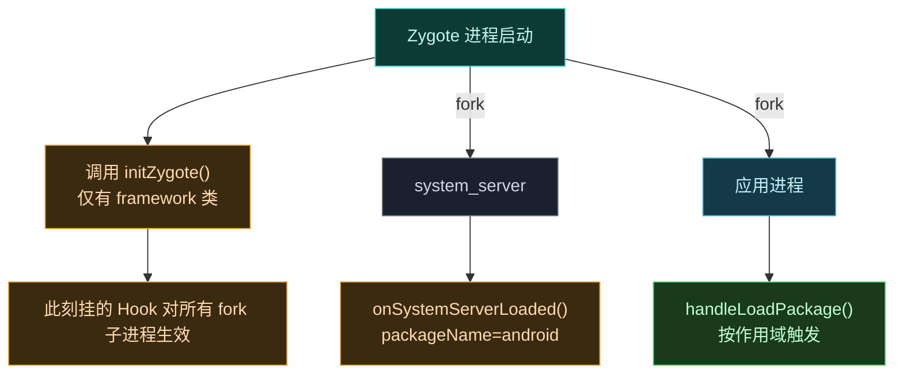

# 🥚 Hook Zygote / system_server 早期阶段

> 难度 ⭐⭐⭐ · 在所有应用进程 fork 出来之前注入，做"全局生效"的 Hook。

## 场景

- 改某个系统框架类的行为，**对所有应用**生效（如全局改资源、全局拦截某个 API）。
- 在 `system_server` 启动时 Hook 系统服务内部。
- 需要在任意应用进程出现前就准备好 Hook（应用 fork 出来时已就位）。

## IXposedHookZygoteInit

实现 `de.robv.android.xposed.IXposedHookZygoteInit`，框架在 Zygote 启动极早期调用 `initZygote`：

```kotlin
import de.robv.android.xposed.IXposedHookZygoteInit

class MyModule : IXposedHookZygoteInit {
    override fun initZygote(startupParam: IXposedHookZygoteInit.StartupParam) {
        // 此时只有 Android framework/system 类可用
        // classLoader 传 null，表示在系统类加载器里查找
        XposedHelpers.findAndHookMethod(
            "android.app.ActivityThread", null,
            "currentProcessName",
            XC_MethodReplacement.returnConstant("fake.name")
        )
        // startupParam.modulePath 是本模块 APK 路径
        // startupParam.startsSystemServer 为 true 表示当前进程会 fork system_server
        if (startupParam.startsSystemServer) {
            // 只在主 Zygote（负责拉起 system_server 的那个）执行
        }
    }
}
```

## 执行时序



Zygote 阶段挂的 Hook 在 `initZygote` 返回后、子进程 fork 前就位，因此**每个 fork 出来的应用进程都继承这些 Hook**——这是"全局生效"的本质。

## system_server 是特殊边界

`system_server` 由 Zygote fork 而非普通应用启动路径。`LegacyDelegateImpl.onSystemServerLoaded` 手动构造一个 `LoadPackageParam`：`packageName = "android"`、`processName = "android"`（兼容 rovo89 原版语义），并 `loadedPackagesInProcess.add("android")`，随后 `XC_LoadPackage.callAll`。

意味着：你的 `IXposedHookLoadPackage.handleLoadPackage` 在 `system_server` 里也会被回调一次，`packageName == "android"` 即可识别：

```kotlin
override fun handleLoadPackage(lpparam: XC_LoadPackage.LoadPackageParam) {
    if (lpparam.packageName == "android") {
        // 正在 system_server 里，Hook 系统服务内部
    }
}
```

要在 `system_server` 生效，模块作用域必须勾选 `system_server`（详见 [作用域配方](./scope#system_server-是特殊情况)）。

## 注意事项

| 事项 | 说明 |
| :--- | :--- |
| 只有 framework 类 | `initZygote` 时应用类尚未加载，`findAndHookMethod` 的 `classLoader` 传 `null` |
| `startsSystemServer` | 64 位 ROM 上仅主 Zygote 为 true；用它区分是否负责拉起 system_server |
| 早于作用域检查 | Zygote Hook 不受应用作用域限制——它对所有 fork 子进程生效 |
| 异常致命 | `initZygote` 抛异常会**阻止本模块后续初始化**，务必 try-catch |
| 慎重全局 Hook | 全局 Hook 影响所有进程，副作用大，优先考虑按包作用域 |

## 与 handleLoadPackage 的关系

`initZygote` 与 `handleLoadPackage` 是互补的两个时机，不互斥。一个模块可以同时实现两个接口：

```kotlin
class MyModule : IXposedHookZygoteInit, IXposedHookLoadPackage {
    override fun initZygote(param: IXposedHookZygoteInit.StartupParam) {
        // 全局 Hook：对所有进程生效
        hookFrameworkGlobal()
    }
    override fun handleLoadPackage(lpparam: XC_LoadPackage.LoadPackageParam) {
        // 按包生效：只对作用域内进程
        if (lpparam.packageName == "com.target.app") hookAppSpecific(lpparam)
    }
}
```

## 执行边界速查

| 时机 | 触发位置 | 可用类 | 影响范围 |
| :--- | :--- | :--- | :--- |
| `initZygote` | Zygote 早期 | 仅 framework | 所有 fork 子进程 |
| `onSystemServerLoaded` | system_server 启动 | framework + system_server 类 | system_server 进程 |
| `handleLoadPackage` | 应用进程首次加载 | 应用 + framework | 当前应用进程 |

## 相关

- [作用域与多进程](./scope)
- [完全替换方法实现](./replace-implementation)
- [legacy · IXposedHookZygoteInit](../reference/classes/legacy-impl)
- [Hook API](../developer/hook-api)
