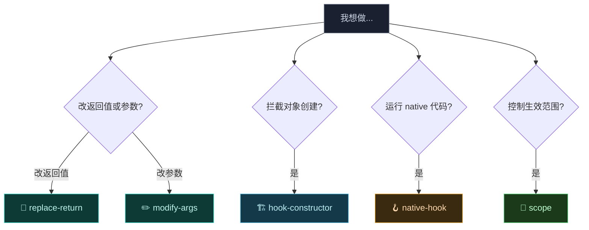
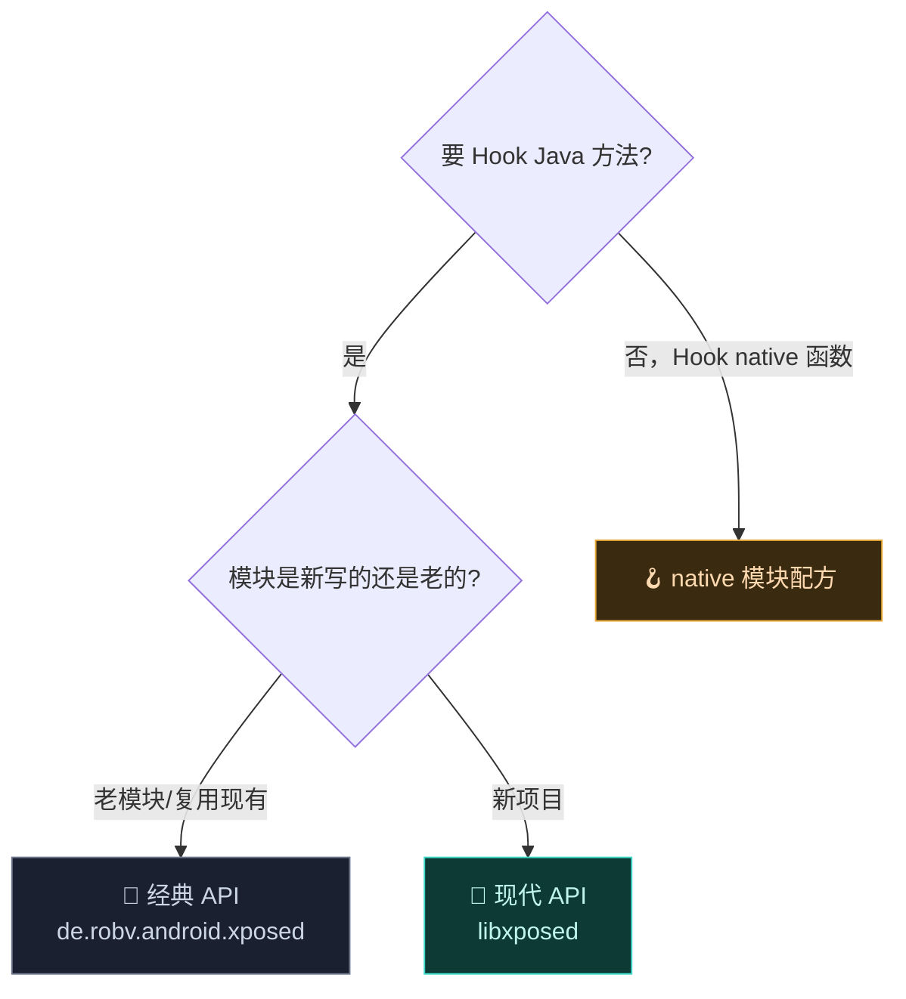

# 🍳 实战配方

这一区是面向任务的"配方"——每个配方解决一个具体问题，可直接复制代码。配合 [开发者文档](../developer/modules) 与 [Hook API](../developer/hook-api) 阅读。

## 配方索引

| 配方 | 难度 | 涉及 API |
| :--- | :--- | :--- |
| 🔄 [拦截并改写方法返回值](./replace-return) | ⭐ | `afterHookedMethod` / `@BeforeInvocation` |
| ✏️ [修改方法参数](./modify-args) | ⭐⭐ | `beforeHookedMethod` 改 `args` |
| 🏗️ [Hook 构造函数](./hook-constructor) | ⭐⭐⭐ | `findAndHookConstructor` / `newInstanceSpecial` |
| 🖼️ [替换布局资源](./replace-layout) | ⭐⭐⭐ | `setReplacement` + 二进制 XML |
| 🔗 [跨进程共享配置](./shared-prefs) | ⭐⭐ | `XSharedPreferences` + `xposedsharedprefs` |
| 🪝 [native 函数 Hook](./native-hook) | ⭐⭐⭐⭐ | `assets/native_init` + Dobby |
| 🎯 [作用域与多进程](./scope) | ⭐⭐ | 作用域配置、`system_server` |
| 🐛 [日志与调试](./debugging) | ⭐⭐ | `XposedBridge.log` / verbose log |
| 🚀 [Hook Zygote 早期阶段](./hook-zygote) | ⭐⭐⭐ | `IXposedHookZygoteInit` |
| 🔁 [完全替换方法实现](./replace-implementation) | ⭐⭐ | `XC_MethodReplacement` |
| 🧩 [多模块 Hook 同一方法](./multi-module-hook) | ⭐⭐⭐ | 优先级、链式执行 |
| 💾 [备份恢复配置](./backup-restore) | ⭐ | `BackupUtils` |
| 📤 [发布模块到仓库](./module-repo) | ⭐⭐ | 仓库结构、update.json |
| ⚡ [Hook 性能优化](./performance) | ⭐⭐⭐ | 缓存、bitmask、主线程规避 |

::: tip 难度说明
- ⭐ 入门：API 直观、单文件可完成，适合第一个 Hook。
- ⭐⭐ 进阶：涉及多回调协作或进程间数据。
- ⭐⭐⭐ 高阶：需理解 ART/构造/资源等底层细节。
- ⭐⭐⭐⭐ 专家：涉及 native、内联、性能极限。
:::

## 从哪开始



## 选择 API



## 通用骨架

无论哪种 API，一个模块的最小骨架都是：APK + `assets/xposed_init` + 入口类。见 [编写一个模块](../developer/modules)。

一个能跑的最小 Java 模块入口：

```kotlin
package com.example.myhook

import de.robv.android.xposed.IXposedHookLoadPackage
import de.robv.android.xposed.XposedBridge
import de.robv.android.xposed.XposedHelpers
import de.robv.android.xposed.callbacks.XC_LoadPackage

class EntryHook : IXposedHookLoadPackage {
    override fun handleLoadPackage(lpparam: XC_LoadPackage.LoadPackageParam) {
        if (lpparam.packageName != "com.target.app") return
        XposedBridge.log("Vector loaded into ${lpparam.packageName}")
        // 在这里挂你的 Hook，例如：
        XposedHelpers.findAndHookMethod(
            "com.target.app.Util", lpparam.classLoader, "greet",
            object : XC_MethodHook() {
                override fun afterHookedMethod(param: MethodHookParam) {
                    XposedBridge.log("greet() returned: ${param.result}")
                }
            }
        )
    }
}
```

配套 `assets/xposed_init` 文件内容（一行入口类的全限定名）：

```
com.example.myhook.EntryHook
```

::: warning 作用域别忘了
代码写好、APK 装好还不够——还必须在 Vector 管理器里**为模块勾选目标应用的作用域**，否则 `handleLoadPackage` 永远不会被调用。详见 [🎯 作用域](./scope)。
:::

## 读代码的姿势

每篇配方都会给"经典 API"与"现代 API (libxposed)"两套写法。两者底层都走 LSPlant，选择哪个取决于：

- **已有老模块**：用经典 API，迁移成本最低。
- **新写模块**：优先现代 API（`@XposedHooker` + 注解），类型安全、更易维护。

> [!TIP] 经典与现代 API 的对应
> 经典 `beforeHookedMethod`/`afterHookedMethod` ≈ 现代 `@BeforeInvocation`/`@AfterInvocation`；经典 `XC_MethodReplacement` ≈ 现代 `@BeforeInvocation` 直接设 `ctx.result`。详见 [Hook API](../developer/hook-api)。
