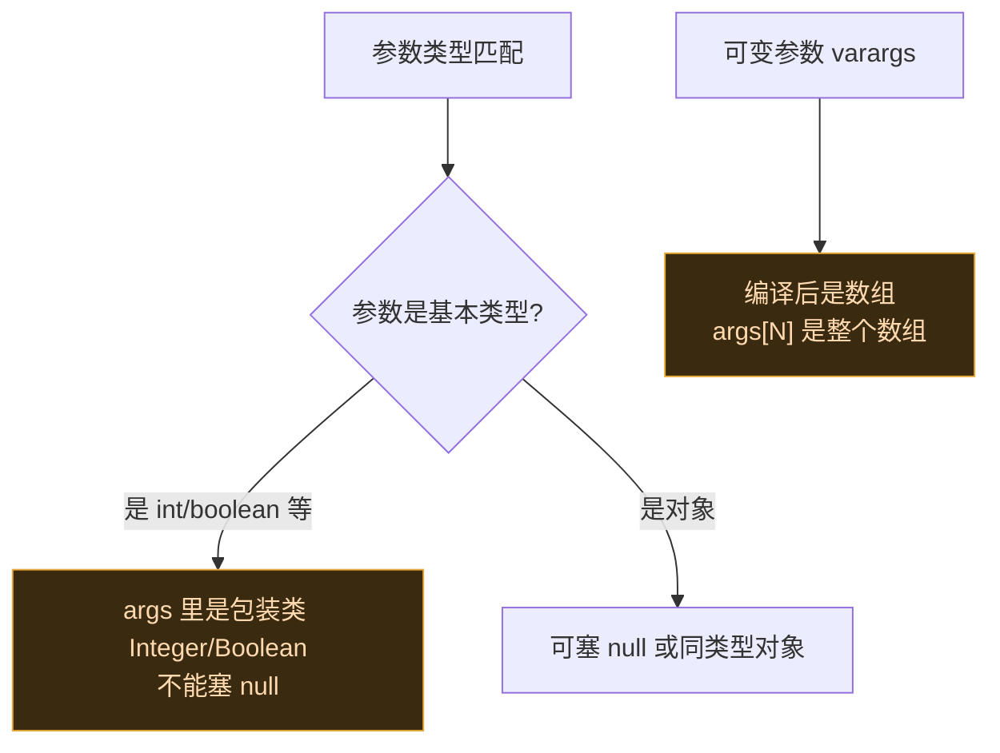

# ✏️ 修改方法参数

> 难度 ⭐⭐ · 在方法执行前替换入参。

## 场景

把 `startActivity` 的 Intent 目标改成别的 Activity、把网络请求的 URL 参数替换、让 `getStringExtra` 返回篡改值。

## 经典 API

在 `beforeHookedMethod` 里改 `param.args`：

```kotlin
XposedHelpers.findAndHookMethod(
    "com.target.app.Net",
    lpparam.classLoader,
    "request",
    String::class.java,            // 第 0 个参数：URL
    object : XC_MethodHook() {
        override fun beforeHookedMethod(param: MethodHookParam) {
            val original = param.args[0] as String
            param.args[0] = original.replace("http://", "https://")  // 改参数
        }
    }
)
```

### before / after 对照

> [!TIP] 改参数必须在 before
> 原方法读的是 `args` 数组，必须在它执行**之前**改；after 再改就来不及了。

```kotlin
// ❌ 错误：after 改参数，原方法早就拿到旧 URL 跑完了
override fun afterHookedMethod(param: MethodHookParam) {
    param.args[0] = (param.args[0] as String).replace("http://", "https://")
}

// ✅ 正确：before 改参数，原方法读到的是新值
override fun beforeHookedMethod(param: MethodHookParam) {
    param.args[0] = (param.args[0] as String).replace("http://", "https://")
}
```

### 完整可运行示例

拦截某应用 `startActivity`，把目标 Activity 重定向到另一个：

```kotlin
class RedirectIntentHook : IXposedHookLoadPackage {
    override fun handleLoadPackage(lpparam: XC_LoadPackage.LoadPackageParam) {
        if (lpparam.packageName != "com.target.app") return
        XposedHelpers.findAndHookMethod(
            "android.app.Activity", lpparam.classLoader,
            "startActivity", android.content.Intent::class.java,
            object : XC_MethodHook() {
                override fun beforeHookedMethod(param: MethodHookParam) {
                    val intent = param.args[0] as android.content.Intent
                    if (intent.component?.className == "com.target.app.AdActivity") {
                        // 把广告页重定向到主页
                        intent.setClassName("com.target.app", "com.target.app.MainActivity")
                        XposedBridge.log("Redirected AdActivity -> MainActivity")
                    }
                }
            }
        )
    }
}
```

## 现代 API (libxposed)

在 `@BeforeInvocation` 改 `args` 数组：

```kotlin
@XposedHooker
class RedirectUrl : Hooker {
    @BeforeInvocation
    static fun before(ctx: BeforeHookCallback): RedirectUrl {
        ctx.args[0] = (ctx.args[0] as String).replace("http://", "https://")
        return RedirectUrl()
    }
}
```

注册（现代 API 在 `onPackageLoaded` 里挂 Hooker 类）：

```kotlin
override fun onPackageLoaded(param: PackageLoadedParam) {
    if (param.packageName != "com.target.app") return
    val netClass = param.classLoader.loadClass("com.target.app.Net")
    val request = netClass.getDeclaredMethod("request", String::class.java)
    xposedInterface.hook(netClass, request, RedirectUrl::class.java)
}
```

> [!TIP] 现代 API 的 `args` 是数组引用
> `ctx.args` 直接就是底层参数数组，改它即生效。注意它和经典 API 一样：基本类型参数不能塞 `null`。

## 注意事项



- **基本类型**：`int` 参数在 `args` 里是 `Integer`，赋值必须是 `Int`，不能赋 `null`。

```kotlin
// ❌ 基本类型塞 null → 原方法拆箱时 NPE
param.args[0] = null

// ✅ 基本类型赋对应包装值
param.args[0] = 42
```

- **可变参数** `Object...`：在 `args` 数组里占一个位置，是一个数组对象，改它要操作数组元素。

```kotlin
// 方法签名：void log(String tag, Object... args)
// args[0] = tag(String), args[1] = Object[](可变参数数组)
val varargs = param.args[1] as Array<Any?>
varargs[0] = "replaced"   // 改可变参数里的元素，不要替换 args[1] 本身
```

- **参数类型不确定**：先用 `XposedHelpers.findClass` 确认，或用 `findAndHookMethod` 的反射重载。

```kotlin
// 不确定参数类型时，用反射重载逐个传 Class
val paramTypes = arrayOf<Class<*>>(String::class.java, Int::class.javaPrimitiveType!!)
XposedHelpers.findAndHookMethod(
    "com.target.app.Net", lpparam.classLoader, "request",
    paramTypes[0], paramTypes[1],
    object : XC_MethodHook() { /* ... */ }
)
```

- **改完参数别忘放行**：`beforeHookedMethod` 默认会让原方法继续执行。如果你改完参数想**完全替换**原方法（不执行原逻辑），改用 [完全替换方法实现](./replace-implementation) 的 `XC_MethodReplacement`，或现代 API 里在 `@BeforeInvocation` 设 `ctx.result`。

## 相关

- [拦截并改写返回值](./replace-return)
- [Hook API](../developer/hook-api)
