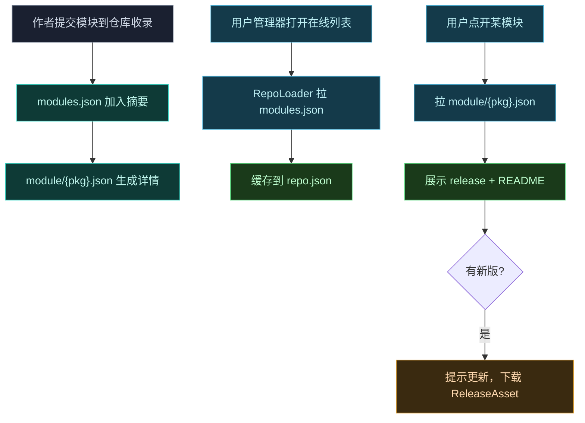

# 📚 发布模块到在线仓库

> 难度 ⭐⭐ · 让模块出现在 Vector 管理器的"在线模块"列表里，支持在线更新。

## 场景

- 模块开发完成，想分发给所有用户，并能在发新版后提示更新。
- 不想让用户手动找 APK 下载链接。

## 仓库结构

Vector 管理器的 `RepoLoader` 从在线仓库拉取两层数据：一个全局索引 + 每个模块的详情。仓库根 URL（默认 `https://modules.lsposed.org/`）下：

| 路径 | 内容 |
| :--- | :--- |
| `modules.json` | 全局索引：所有已收录模块的摘要（名称、描述、最新版本、主页、scope） |
| `module/{packageName}.json` | 单模块详情：完整 release 列表、README、协作者、截图 |

`RepoLoader` 先拉 `modules.json` 缓存到本地 `repo.json`，用户点开某模块时再按需拉 `module/{packageName}.json`。主 URL 失败自动切换到备用 URL（`modules-blogcdn.lsposed.org` 等）。

## modules.json 索引项

每个模块在索引里是一段摘要，关键字段（对应 `OnlineModule`）：

| 字段 | 含义 |
| :--- | :--- |
| `name` · `description` · `summary` | 显示名与简介 |
| `url` · `homepageUrl` · `sourceUrl` | 模块主页 / 项目地址 |
| `scope` | 推荐作用域（包名数组），供用户一键勾选 |
| `latestRelease` · `latestReleaseTime` | 最新正式版 tag 与发布时间 |
| `latestBetaRelease` · `latestSnapshotRelease` | 测试/快照通道 |
| `stargazerCount` · `collaborators` | 人气与作者 |
| `hide` | 设为 true 则不在列表显示（下架） |

## 单模块详情 module/{pkg}.json

详情里的 `releases` 是数组，每个 release（对应 `Release`）：

| 字段 | 含义 |
| :--- | :--- |
| `tagName` · `name` | 版本 tag 与显示名 |
| `publishedAt` · `createdAt` · `updatedAt` | 时间戳 |
| `isPrerelease` | 是否预发布 |
| `description` · `descriptionHTML` | 更新说明 |
| `releaseAssets` | 下载资产列表 |

每个 `releaseAssets` 项（对应 `ReleaseAsset`）：

| 字段 | 含义 |
| :--- | :--- |
| `name` · `contentType` | 文件名与 MIME |
| `downloadUrl` · `size` | 下载地址与字节数 |

## 版本与更新判定

`RepoLoader.ModuleVersion` 比较版本：

```java
boolean upgradable(long versionCode, String versionName) {
    return this.versionCode > versionCode
        || (this.versionCode == versionCode
            && !versionName.replace(' ', '_').equals(this.versionName));
}
```

- 优先比 `versionCode`（数字），新版更高即提示升级。
- `versionCode` 相同时比 `versionName`（空格替换为下划线后比较），处理"同 code 不同名"的修补版。
- 通道：正式版 / Beta / Snapshot 三条独立，用户可在管理器选择通道。

## 流程



## 自建仓库

仓库本质是两个静态 JSON 文件 + 一堆 APK 下载链接，可自建：

1. 托管 `modules.json` 与 `module/{pkg}.json` 在任意静态服务器 / 对象存储。
2. APK 上传到 release assets（GitHub Releases 或自托管），把 `downloadUrl` 指过去。
3. 在管理器里改仓库根 URL 指向你的服务器（`RepoLoader` 支持配置自定义 URL，主 URL 失败回退备用）。

## 注意事项

| 事项 | 说明 |
| :--- | :--- |
| `scope` 推荐作用域 | 在 `modules.json` 提供，用户导入模块时一键勾选，降低配置门槛 |
| 多通道 | 正式/Beta/Snapshot 三通道，预发布用 `isPrerelease` 标记 |
| 备用 URL | 主仓库不可达时自动切备用，保证可拉取性 |
| 本地缓存 | `repo.json` 落盘，离线也能看列表，详情按需联网 |

## 相关

- [备份与恢复配置](./backup-restore)
- [作用域与多进程](./scope)
- [guide · 模块机制](../guide/modules)
