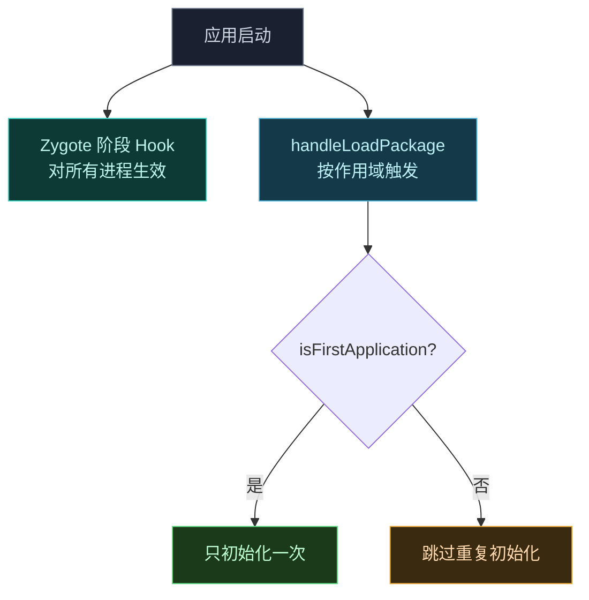

# ⚡ Hook 性能优化

> 难度 ⭐⭐⭐ · 让模块对宿主应用的运行性能影响最小。

## 场景

- 模块 Hook 了高频调用方法（如 `draw`、`onBind`、`getString`），导致应用卡顿。
- Hook 初始化拖慢应用启动。
- 想在不牺牲功能前提下降低 Hook 开销。

## 避免在主线程做重活

Hook 常被回调在宿主主线程。**before/after 里不要做耗时操作**：

```kotlin
// ❌ 每次 getString 都查表，主线程卡顿
override fun beforeHookedMethod(param: MethodHookParam) {
    val mapped = db.query("SELECT ... WHERE id=${param.args[0]}")
    param.args[0] = mapped
}

// ✅ 提前算好，Hook 里只查内存
private val cache: Map<Int, String> = loadMappingAsync()
override fun beforeHookedMethod(param: MethodHookParam) {
    cache[param.args[0] as Int]?.let { param.args[0] = it }
}
```

| 做法 | 说明 |
| :--- | :--- |
| 预计算 | 启动时异步准备好查找表，Hook 里只做 O(1) 查询 |
| 异步加载 | 重资源用后台线程加载，主线程只读已就绪结果 |
| 跳过无关分支 | before 开头按条件 `return`，快速路径零开销 |

## 反射缓存

`findAndHookMethod` 内部的反射查找已走结构化缓存（`MemberCacheKey`，key 基于对象身份与结构属性而非字符串，重复查找**零分配**）。所以反复 hook 同一方法本身廉价——但你自己的反射要自己缓存：

```kotlin
// ❌ 每次 Hook 回调里都 findClass
override fun beforeHookedMethod(param: MethodHookParam) {
    val cls = XposedHelpers.findClass("com.target.X", param.thisObject.javaClass.classLoader)
    ...
}

// ✅ 类加载器级缓存，只查一次
private val cls by lazy { findClass("com.target.X", lpparam.classLoader) }
```

`XposedHelpers.findClass` 有进程级缓存，但显式 `lazy` 更可控、避免回调路径里进锁查表。

## 用 bitmask 做快速判定

Vector 自身的资源替换就用了 bitmask 做 O(1) 判定——`XResources` 用 `sSystemReplacementsCache`（256 字节 = 2048 bit）和 `mReplacementsCache`（128 字节 = 1024 bit）记录"哪些资源 id 已被替换"：

```java
// 命中判定：一次数组读 + 一次位与
if ((sSystemReplacementsCache[cacheKey] & (1 << (id & 7))) == 0) return;  // 未替换，原路返回
```

你的模块若要维护"哪些目标命中"的集合，优先用 `BitSet` / `boolean[]` / 手写 bitmask，避免 `HashSet<Integer>` 的装箱与哈希开销：

```kotlin
// ✅ 高频路径用 BitSet
private val handled = BitSet()
fun shouldHandle(id: Int) = handled.get(id)
```

## 批量操作

- **批量注册 Hook**：循环 `findAndHookMethod` 注册一批方法，别为每个方法写独立回调类——用一个回调 + 方法名分发。
- **批量改资源**：一次性 `setReplacement` 多个 id，而非逐个触发资源重载。
- **合并查询**：要 hook 一个类的多个方法，先 `getDeclaredMethods` 一次拿到数组再筛选，而非多次 `getDeclaredMethod`。

## 选择 Hook 时机



- 用 `LoadPackageParam.isFirstApplication` 判断是否首次加载，避免在多进程里重复初始化。
- 需要全局生效的 Hook 放 Zygote 阶段（[Hook Zygote](./hook-zygote)），只对特定应用生效的放 `handleLoadPackage`，减少无关进程的开销。

## 其他要点

| 要点 | 说明 |
| :--- | :--- |
| 精确参数签名 | `findAndHookMethod` 给全参数类型，避免框架做重载歧义解析 |
| 避免在 after 里做大对象分配 | after 在原方法返回路径上，分配会放大 GC 压力 |
| 减少 Hook 数量 | 能 hook 一个上层方法解决的，别 hook 底层每个调用点 |
| 日志别进热路径 | debug 日志用静态开关关闭，别每帧都拼字符串 |
| 用 `unhook` 释放不再需要的 Hook | `XC_MethodHook.unhook()` 可移除已注册回调，动态策略切换后及时清理 |
| 条件性 Hook | 启动时按配置只注册需要的 Hook，而非全注册再在回调里判断 |

## 度量

判断是否需要优化，先量化：开 verbose log 看回调频率，或临时在 Hook 里计数 `invokeCount++`，按帧/秒统计被调次数。高频（每帧多次）才值得花力气优化；冷启动只调一两次的方法无需微优化。

## 相关

- [Hook API](../developer/hook-api)
- [Hook Zygote / system_server](./hook-zygote)
- [作用域与多进程](./scope)
- [日志与调试](./debugging)
