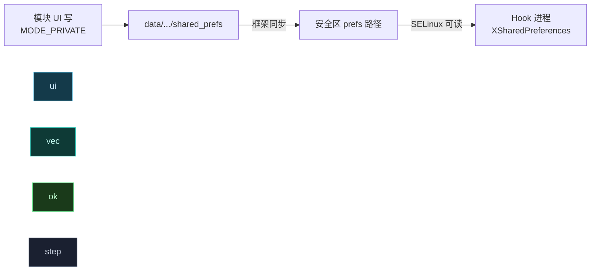

# 💾 模块持久化配置

> 难度 ⭐⭐ · 模块 UI 写配置、Hook 代码读配置。Android 7+ 砍了 `MODE_WORLD_READABLE`，Vector 给了解法。

## 场景

模块管理器界面让用户开关功能、填参数，Hook 代码运行在宿主进程里要读到这些值。

## 传统方式与困境

```kotlin
// 模块 UI 侧（管理器进程）
val sp = getSharedPreferences("module_config", MODE_WORLD_READABLE)  // ← Android 7+ 抛异常
```

Android 7.0 起 `MODE_WORLD_READABLE` 抛 `SecurityException`，文件权限不再对其他进程可读，宿主进程里的 Hook 代码读不到。

## Vector 解法：xposedsharedprefs

在 `AndroidManifest.xml` 的 `<application>` 声明 meta-data，Vector 会把该模块的偏好文件重定向到框架管理的安全区：

```xml
<meta-data android:name="xposedminversion" android:value="93"/>
<meta-data android:name="xposedsharedprefs" android:value="true"/>
```

之后 UI 侧正常用 `MODE_PRIVATE` 写，框架负责把文件同步到安全路径，Hook 侧用 `XSharedPreferences` 读取：



## Hook 侧读取

```kotlin
class MainHook : IXposedHookLoadPackage {
    override fun handleLoadPackage(lpparam: XC_LoadPackage.LoadPackageParam) {
        if (lpparam.packageName != "com.target.app") return

        val prefs = XSharedPreferences("com.example.mymodule", "module_config")
        // 首次构造时异步从磁盘加载；getXxx 会 awaitLoadedLocked 等待
        val enabled = prefs.getBoolean("feature_enabled", false)
        if (enabled) {
            // 安装 Hook
        }
    }
}
```

## XSharedPreferences 行为要点

| 行为 | 说明 |
| :--- | :--- |
| 只读 | `edit()` 抛 `UnsupportedOperationException`，写入在 UI 侧 |
| 异步加载 | 构造时起后台线程读盘，`getXxx` 阻塞至就绪 |
| 变更监听 | `registerOnSharedPreferenceChangeListener` 经 `WatchService`（inotify）回调 |
| 文件哈希校验 | `PrefsData` 用大小+MD5 判断真变化，避免空文件误触发 |
| minVersion 门槛 | `xposedminversion > 92` 或声明 `xposedsharedprefs` 才走安全区路径 |

## 实时刷新

用户改了配置后，Hook 进程要重新读。两种方式：

```kotlin
// 1. 主动 reload（轮询场景）
if (prefs.hasFileChanged()) prefs.reload()

// 2. 监听器自动触发（推荐）
prefs.registerOnSharedPreferenceChangeListener { _, _ ->
    // 文件变化时回调，key 恒为 null（实现限制）
    refreshConfig()
}
```

> 监听器回调里 `key` 参数恒为 `null`——`XSharedPreferences` 无法判断具体哪个键变了，需自己 diff 或全量重读。

## makeWorldReadable 的局限

`XSharedPreferences.makeWorldReadable()` 仅在 **root + SELinux 关闭** 时有效，且只是兜底修复某些 recovery 篡改的权限，不能替代 `xposedsharedprefs` 声明。生产环境不要依赖它。

## 现代 API 替代

对实时性要求高，改用远程偏好（Daemon 推送，毫秒级）：

```kotlin
// 框架注入的 service 提供 IRemotePreferenceCallback 实时同步
val prefs = remotePreferences("module_config")  // VectorRemotePreferences
prefs.registerOnSharedPreferenceChangeListener { _, key ->
    // key 精确，秒级推送
}
```

详见 [远程偏好监听](./remote-preference)。

## 陷阱

| 陷阱 | 后果 | 对策 |
| :--- | :--- | :--- |
| 未声明 `xposedsharedprefs` | Hook 侧读不到（权限拒绝） | manifest 加 meta-data |
| UI 用了 `MODE_WORLD_READABLE` | Android 7+ 崩溃 | 改 `MODE_PRIVATE` |
| 把 `XSharedPreferences` 当可写 | `edit()` 抛异常 | 写入只在 UI 侧 |
| 监听器 key 为 null 仍按 key 分发 | NPE | 判空或全量重读 |

## 相关

- [远程偏好监听](./remote-preference)
- [跨进程共享配置](./shared-prefs)
- [legacy · XSharedPreferences](../reference/classes/legacy-api)
- [架构 · legacy · SharedPreferences](../architecture/legacy)
