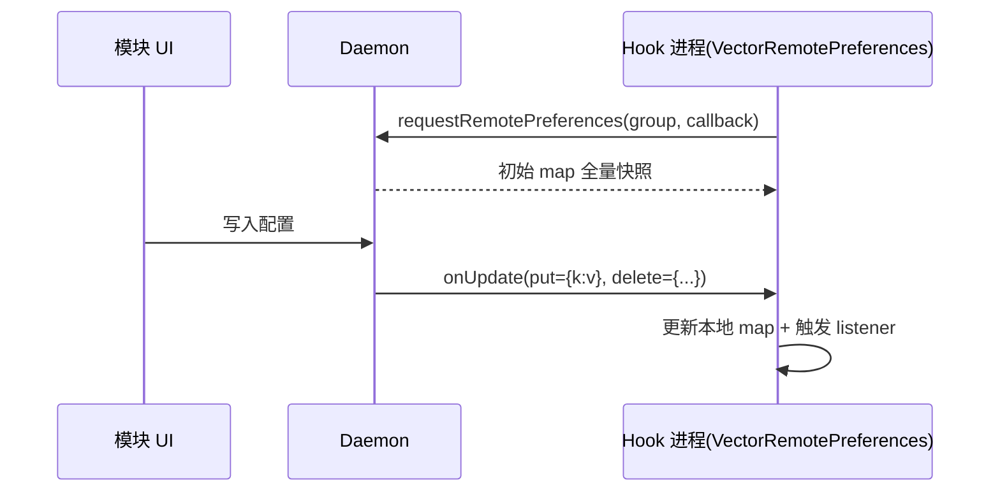

# 🔁 远程偏好监听

> 难度 ⭐⭐⭐ · 配置变更毫秒级推送到 Hook 进程，`key` 精确，优于文件轮询。

## 场景

用户在模块 UI 改了一项开关，宿主进程里的 Hook 代码要**立即**生效——不能等下次重启宿主，也不能轮询文件。

## 机制

Vector 的 `VectorRemotePreferences` 实现 `SharedPreferences`，底层经 `ILSPInjectedModuleService.requestRemotePreferences` 注册一个 `IRemotePreferenceCallback` Stub。Daemon 持有回调集合，配置变更时调 `onUpdate(Bundle)` 推送 diff。



## 取得实例

框架在加载模块时注入 service 句柄。经典 API 下需自行拿到 service；现代 libxposed API 下框架直接提供：

```kotlin
// 经典：通过注入的 service 句柄请求
val service = /* 框架注入的 ILSPInjectedModuleService 句柄 */
val prefs = VectorRemotePreferences(service, "main_config")
// VectorRemotePreferences 构造时即注册 callback 并拉取初始快照
```

```kotlin
// 现代 API：XposedModule 基类提供 remotePreferences
class MainModule(base: XposedInterface, param: ModuleLoadedParam)
    : XposedModule(base, param) {
    override fun onPackageLoaded(param: PackageLoadedParam) {
        val prefs = remotePreferences("main_config")  // 返回 SharedPreferences
        prefs.registerOnSharedPreferenceChangeListener { _, key ->
            // key 精确，不再是 null
            when (key) {
                "feature_enabled" -> toggleFeature(prefs.getBoolean(key, false))
            }
        }
    }
}
```

## onUpdate 的 Bundle 协议

Daemon 推送的 `Bundle` 用两个键描述 diff：

| Bundle key | 值 | 含义 |
| :--- | :--- | :--- |
| `put` | `Map<String, Any>` | 新增/修改的键值对 |
| `delete` | `Set<String>` | 被删除的键 |
| `map`（首次） | `Map<String, Any>` | 初始全量快照 |

`VectorRemotePreferences.onUpdate` 据此更新本地 `ConcurrentHashMap`，并对每个变更 key 调一遍注册的 `OnSharedPreferenceChangeListener`。

## 只读但可监听

`VectorRemotePreferences` 是**只读**实现——`edit()` 抛 `UnsupportedOperationException`。写入只能经 Daemon（即模块 UI 侧通过管理器写入）。这与 `XSharedPreferences` 一致：配置流向是 UI → Daemon → Hook 进程。

## 回调线程与清理

- `onUpdate` 在 Binder 线程触发，listener 里不要做重活，转主线程或异步。
- Daemon 用 `linkToDeath` 关联回调 Binder，模块进程崩溃时自动摘除回调，防泄漏。
- 多个 listener 共享同一 callback Stub，监听器增减只动本地 `listeners` 集合。

## 与 XSharedPreferences 对比

| 维度 | XSharedPreferences | VectorRemotePreferences |
| :--- | :--- | :--- |
| 传输 | 文件 + inotify | Binder IPC 推送 |
| 延迟 | 秒级（依赖文件系统事件） | 毫秒级 |
| 变更 key | 恒 `null` | 精确 key |
| 写入 | UI 侧 MODE_PRIVATE | UI 侧经 Daemon |
| 声明门槛 | 需 `xposedsharedprefs` | 需 service 句柄注入 |
| 适合 | 一次性读、对延迟不敏感 | 实时联动 |

## 陷阱

| 陷阱 | 后果 | 对策 |
| :--- | :--- | :--- |
| 在 listener 里同步写文件 | Binder 线程阻塞 | 转异步 |
| 误以为可 `edit()` | 抛异常 | 写入只在 UI 侧 |
| 跨进程持有 listener 不注销 | 回调集膨胀 | `unregisterOnSharedPreferenceChangeListener` |
| 依赖 key 一定存在 | 首次快照前为空 | 用默认值 `getXxx(key, def)` |

## 相关

- [模块持久化配置](./persistent-prefs)
- [模块与宿主广播通信](./broadcast-module)
- [xposed · impl（VectorRemotePreferences）](../reference/classes/xposed-core)
- [daemon · ipc（InjectedModuleService）](../reference/classes/daemon-entry)
