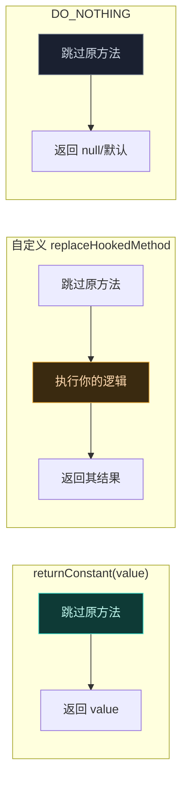

# 🔁 完全替换方法实现

> 难度 ⭐⭐ · 让原方法完全不执行，由你的代码接管返回值/异常。

## 场景

- 让 `isVip()` 恒返回 `true`、让校验方法恒通过。
- 用自定义逻辑取代原方法（如换一种加密实现）。
- 让原方法变成"空操作"（`DO_NOTHING`）。

## 经典 API：XC_MethodReplacement

`XC_MethodReplacement` 是 `XC_MethodHook` 的特化——它的 `beforeHookedMethod` 直接把 `replaceHookedMethod` 的返回值设为结果，原方法不再执行：

```kotlin
XposedHelpers.findAndHookMethod(
    "com.target.app.Util", lpparam.classLoader, "computeHash",
    ByteArray::class.java,
    object : XC_MethodReplacement() {
        override fun replaceHookedMethod(param: MethodHookParam): Any? {
            val input = param.args[0] as ByteArray
            return myHash(input)   // 原方法完全不执行
        }
    }
)
```

### 三种内置模式

| 模式 | 用法 | 行为 |
| :--- | :--- | :--- |
| 自定义替换 | `object : XC_MethodReplacement() { ... }` | 完全用你的 `replaceHookedMethod` 接管 |
| 恒定返回 | `XC_MethodReplacement.returnConstant(value)` | 原方法不执行，恒返回 `value` |
| 空操作 | `XC_MethodReplacement.DO_NOTHING` | 原方法不执行，返回 `null`/默认值 |

```kotlin
// 恒返回 true（最高优先级常量）
findAndHookMethod(target, "isVip", XC_MethodReplacement.returnConstant(true))

// 跳过方法（如禁用某埋点）
findAndHookMethod(target, "trackEvent", XC_MethodReplacement.DO_NOTHING)
```

`returnConstant` 与自定义替换都接受 `priority` 参数控制多 Hook 时的执行顺序。

## 现代 API 等价做法

libxposed 没有 `XC_MethodReplacement`——它统一用 `Hooker` 的 `@BeforeInvocation` 设 `ctx.result`，等价于完全替换：

```kotlin
@XposedHooker
class ReplaceHash : Hooker {
    @BeforeInvocation
    static fun before(ctx: BeforeHookCallback): ReplaceHash {
        val input = ctx.args[0] as ByteArray
        ctx.result = myHash(input)   // 设了 result → 跳过原方法与下游 before
        return ReplaceHash()
    }
}
```

## 三种模式对照



## 何时用替换而非 before/after

| 需求 | 推荐 |
| :--- | :--- |
| 想保留原方法副作用，只改返回值 | `afterHookedMethod` 改 `result` |
| 原方法有副作用但你想绕过 | `XC_MethodReplacement` |
| 逻辑完全自给，不需原方法 | `XC_MethodReplacement` 或 before 设 result |
| 条件性跳过 | before 里按条件设 `result` |

## 注意事项

- **返回类型**：`replaceHookedMethod` 返回值必须能赋给原方法返回类型；`void` 方法返回 `null`。基本类型返回值不能是 `null`。
- **抛异常**：`replaceHookedMethod` 抛 `Throwable` 会被传给原调用方——可用来"让方法抛异常"。
- **不要再调原方法**：替换语义下原方法已被跳过；若需调用原方法，改用 `before/after` + `XposedBridge.invokeOriginalMethod`。
- **优先级**：多个 Hook 同时替换同一方法时，只有最高优先级的 `replaceHookedMethod` 实际生效（它跳过了原方法及下游）。
- **静态/实例方法**：替换对静态方法同样适用；`param.thisObject` 对静态方法为 `null`。
- **构造函数**：构造函数不能"替换返回值"，要用 [Hook 构造函数](./hook-constructor) 的特殊路径（`newInstanceSpecial` 分配与初始化分离），而非 `XC_MethodReplacement`。

## 与 after 改返回值的区别

`afterHookedMethod` 改 `result` 时原方法**已经执行**——副作用已发生（写日志、发请求、改状态）。`XC_MethodReplacement` 是原方法**根本不执行**。当原方法有不可逆副作用、或你想彻底阻止某行为时，用替换；只想看到结果后微调、不介意副作用时，用 after。

## 相关

- [拦截并改写返回值](./replace-return)
- [修改方法参数](./modify-args)
- [多模块 Hook 同一方法](./multi-module-hook)
- [Hook API](../developer/hook-api)
