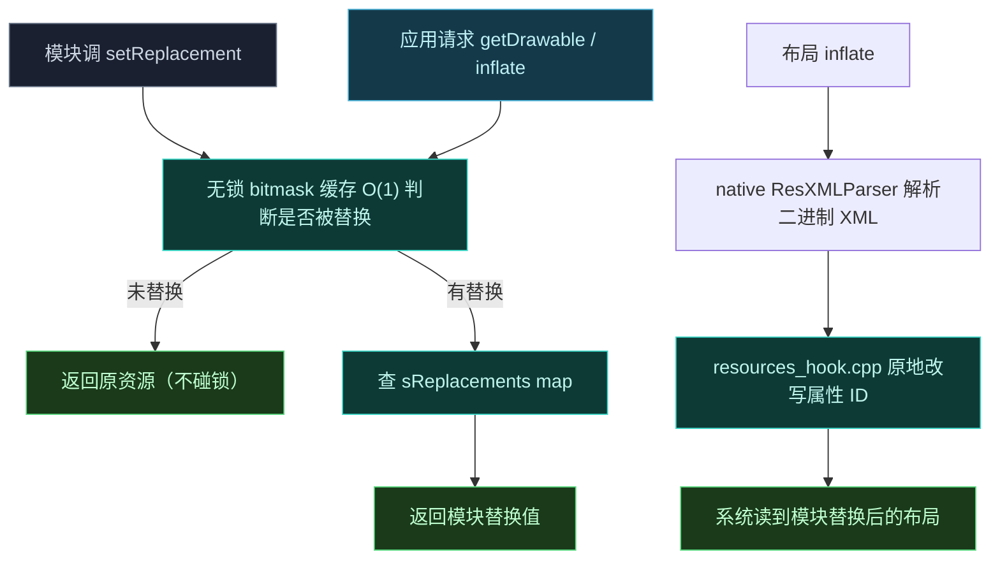

# 🖼️ 替换布局资源

> 难度 ⭐⭐⭐ · 让目标应用显示你提供的布局、图标、字符串。

## 场景

替换应用图标、改应用名、用自定义布局替换某个 Activity 的界面。

## 经典 API

实现 `IXposedHookInitPackageResources`：

```kotlin
class ResHook : IXposedHookInitPackageResources {
    override fun handleInitPackageResources(resparam: XC_InitPackageResources.InitPackageResourcesParam) {
        if (resparam.packageName != "com.target.app") return

        // 替换字符串
        resparam.res.setReplacement("com.target.app", "string", "app_name", "Hacked")

        // 替换图片（用模块自己的资源）
        resparam.res.setReplacement(
            "com.target.app", "drawable", "icon",
            XResources.DIMENSION_REPLACEMENTS /* 或 R.drawable.my_icon */
        )

        // 替换整个布局
        resparam.res.setReplacement(
            "com.target.app", "layout", "main_activity",
            R.layout.my_layout   // 模块内的布局资源 ID
        )
    }
}
```

## 底层发生了什么



详见 [架构 · 资源 Hook 子系统](../architecture/resources)。

## 替换 ID 的限制

替换的资源必须**类型兼容**：字符串只能换字符串，drawable 只能换 drawable。模块资源 ID 经 `XResources.translateResId` 翻译，框架会处理 ID 命名空间转换。

## 性能

- 字符串/图片替换：bitmask 缓存，高频请求不拖慢 UI。
- 布局替换：首次 inflate 触发二进制 XML 突变，之后缓存，开销在首次。

## 相关

- [资源与偏好](../developer/resources)
- [架构 · 资源 Hook](../architecture/resources)
- [legacy · resources 包](../reference/classes/legacy-resources)
