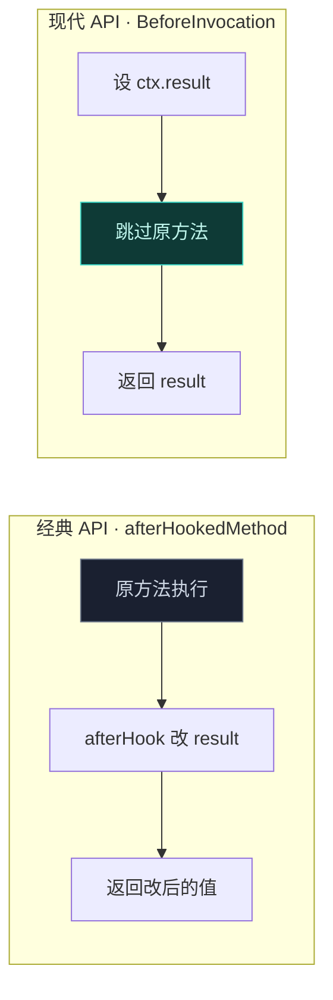

# 🔄 拦截并改写方法返回值

> 难度 ⭐ · 最常见的 Hook 任务：让某个方法返回你想要的值。

## 场景

让 `TelephonyManager.getDeviceId()` 返回假值、让 `PackageManager.getPackageInfo()` 隐藏某应用、让某个校验方法恒返回 `true`。

## 经典 API

用 `XC_MethodHook` 的 `afterHookedMethod` 改返回值：

```kotlin
XposedHelpers.findAndHookMethod(
    "com.target.app.Util",
    lpparam.classLoader,
    "getDeviceId",
    object : XC_MethodHook() {
        override fun afterHookedMethod(param: MethodHookParam) {
            // param.result 就是原方法返回值，直接覆盖
            param.result = "fake-device-id"
        }
    }
)
```

## 现代 API (libxposed)

用 `@BeforeInvocation` 直接决定返回值，**跳过原方法**：

```kotlin
@XposedHooker
class ReplaceDeviceId : Hooker {
    @BeforeInvocation
    static fun before(ctx: BeforeHookCallback): ReplaceDeviceId {
        ctx.result = "fake-device-id"   // 设了 result 就不执行原方法
        return ReplaceDeviceId()
    }
}
```

## 关键区别



- **想保留原方法副作用**（如原方法会写日志），再用经典 API 的 after。
- **想完全替换**，用现代 API 的 before 设 result，或经典 API 的 `XC_MethodReplacement`。

## 完全替换（经典）

```kotlin
XposedHelpers.findAndHookMethod(
    "com.target.app.Util", lpparam.classLoader, "isVip",
    XC_MethodReplacement.returnConstant(true)  // 恒返回 true
)
```

## 相关

- [修改方法参数](./modify-args)
- [Hook API](../developer/hook-api)
