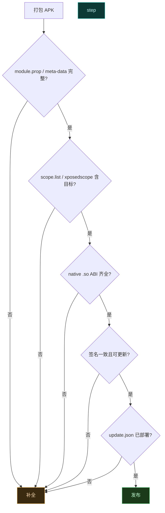

# ✅ 发布前自检清单

> 难度 ⭐ · 发版前过一遍，避免作用域缺失、元数据不全、签名错位等低级问题。

## 清单总览



## 1. 模块元数据

现代模块用 `META-INF/xposed/module.prop`（Properties 格式），legacy 模块用 manifest meta-data。

`module.prop` 必填字段：

```properties
id=com.example.mymodule
name=My Module
version=1.0.0
versionCode=1
author=yourname
description=What it does
minApiVersion=100
targetApiVersion=100
staticScope=true
```

| 字段 | 说明 |
| :--- | :--- |
| `id` | 包名，与 APK package 一致 |
| `minApiVersion` | 最低 libxposed API level（当前 100） |
| `targetApiVersion` | 目标 API level |
| `staticScope` | `true` 表示作用域由 `scope.list` 静态声明 |

legacy 模块 manifest meta-data 对照：

```xml
<meta-data android:name="xposedmodule" android:value="true"/>
<meta-data android:name="xposedminversion" android:value="93"/>
<meta-data android:name="xposeddescription" android:value="描述"/>
<meta-data android:name="xposedscope" android:value="system;com.target.app"/>
<meta-data android:name="xposedsharedprefs" android:value="true"/>
```

## 2. 作用域

`META-INF/xposed/scope.list`（每行一个包名）：

```text
system
com.target.app
```

或 legacy 的 `xposedscope` meta-data（分号分隔）。作用域必须覆盖你 Hook 的所有目标进程，否则模块不加载。

## 3. 资源与 native 库

| 项 | 检查 |
| :--- | :--- |
| `assets/xposed_init` | 入口类全限定名，每行一个 |
| `assets/native_init` | native 库名（无 `lib`/`.so`），与 `.so` 对应 |
| `.so` ABI | arm64-v8a + armeabi-v7a 齐全 |
| 资源替换 | 二进制 XML 引用资源 ID 正确 |
| `xposedsharedprefs` | 用到 XSharedPreferences 时声明 |

## 4. 签名

- 用固定签名（debug 和 release 不同签名会导致更新失败）。
- update.json 的校验和/版本号与 APK 一致。
- 管理器按 `versionCode` 判断更新，确保单调递增。

## 5. update.json

仓库根或模块目录下放 `update.json`，管理器据此检查更新：

```json
{
  "version": "1.0.0",
  "versionCode": 1,
  "zipUrl": "https://repo.example.com/mymodule/1.0.0/mymodule-v1.0.0.apk",
  "changelog": "首次发布"
}
```

| 字段 | 说明 |
| :--- | :--- |
| `version` | 显示版本号 |
| `versionCode` | 整数，大于已装版本才提示更新 |
| `zipUrl` | APK 下载地址 |
| `changelog` | 更新说明 |

## 6. 兼容性与安全

| 项 | 检查 |
| :--- | :--- |
| API 分支 | 按 `XposedBridge.getXposedVersion()` 做能力检测 |
| 异常隔离 | 所有 Hook 回调 try-catch，不波及宿主 |
| 不破坏宿主 | 改返回值时保留语义，不返回非法类型 |
| minSdk/targetSdk | 与声明一致 |
| 不要把 API 类编进 APK | `de.robv.android.xposed.*` 用 provided/compileOnly |

> 把 Xposed API 类编进模块 APK 是经典错误——会触发 `ClassLoader` 不一致检查导致模块加载失败。

## 7. 自测流程

1. 安装到测试机，管理器勾选作用域。
2. 重启目标进程（或整机重启）。
3. 触发目标方法，查 `logcat | grep VectorLegacyBridge`。
4. 关闭模块开关，重启，确认 Hook 消失。
5. 跨版本（Android 12/13/14）回归。

## 相关

- [发布模块到仓库](./module-repo)
- [模块持久化配置](./persistent-prefs)
- [模块开发最佳实践](../developer/best-practices)
- [app · ModuleUtil](../reference/classes/app-util)
